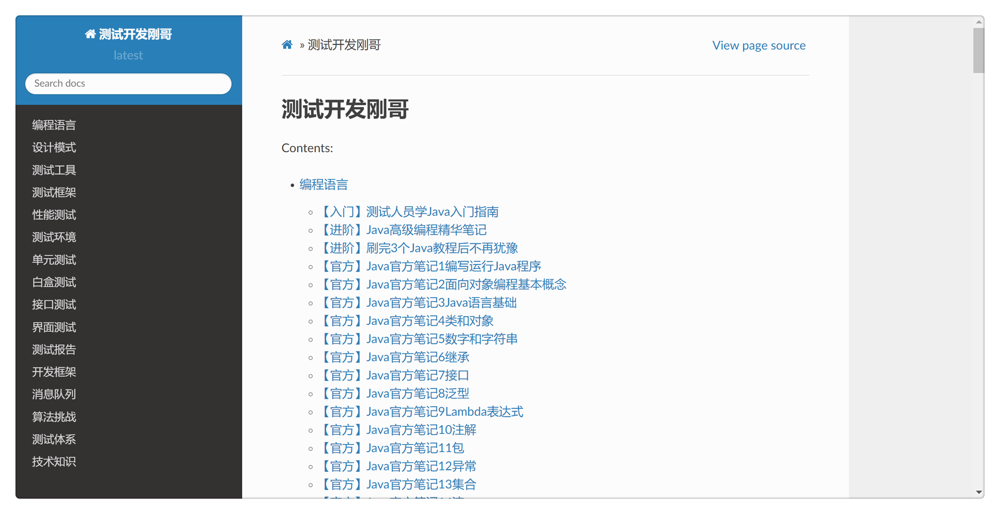
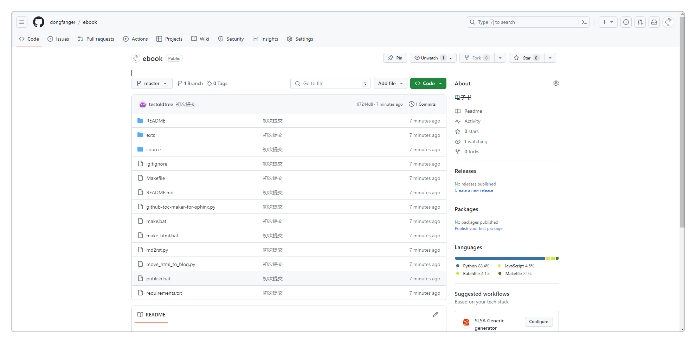
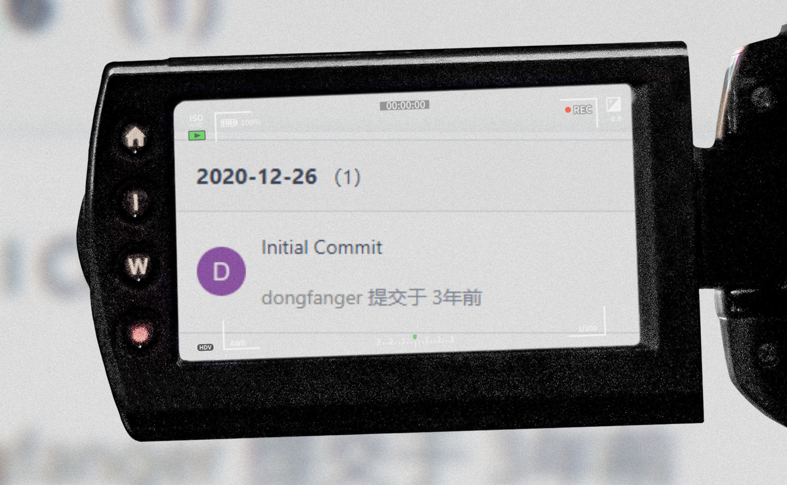

# 电子书开源

开源内容包括**Markdown文章、ReadtheDocs网站、Python工具等**。

在过去，想阅读电子书内容，必须关注公众号，发送电子书三个字，获取验证码后，方可解锁全文。

而现在，**在开源项目中即可阅读所有内容**。

这份开源项目的源码，是我在别人项目基础上，二次开发而来的。既能作为个人知识库，又能为公众号引流，一直沿用至今。

选择开源，最重要的原因是希望能帮更多人构建软件测试知识体系。2024年工作即将满十年，从小公司到大厂都呆过，接触过很多测试人员，当我思考差异在哪时，一个声音始终在我脑海里萦绕不去，知识体系。

知识体系，是将零散知识，以一定规律联系起来，整合而成的某种结构。就像没有两片相同的树叶一样，每个人的知识体系也不同。《认知觉醒》启发，梳理知识体系，不应该把我们的小圆，嵌入到别人的大圆里面，去模仿。而是用我们的小圆边缘，去触碰别人的圆，转化沉淀。高效率去涉猎，去吸收，去发展。

我的电子书，能成为参考对象，能给人带来启发，能让人拥有属于自己的电子书，很有价值，授人以鱼，不如授之以渔，不如开源！

我曾经跨过山和大海，也穿过人山人海。

我曾经拥有着的一切，转眼都飘散如烟。

我曾经失落失望失掉所有方向，

直到看见平凡才是唯一的答案。

电子书，在2020年时为我指明了方向，希望也能帮你看见你的答案。

项目地址：https://github.com/dongfanger/ebook