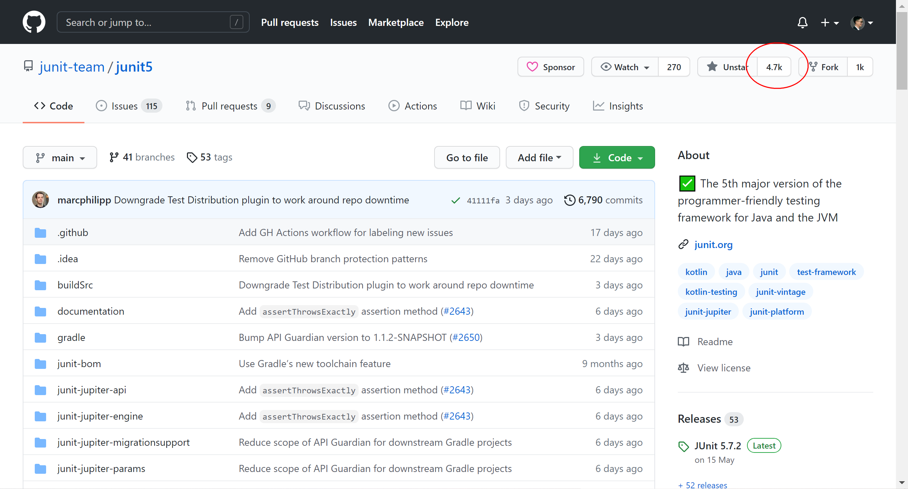
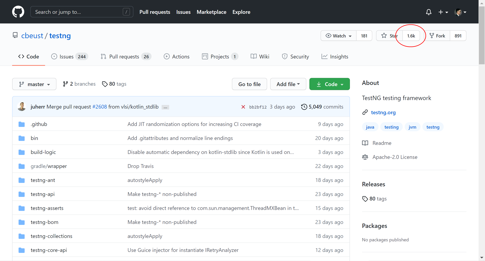

# 【JUnit】Java新一代单元测试框架JUnit5速览


## 为什么学JUnit5

Java技术栈的单元测试框架有两个：JUnit和TestNG，有种说法是TestNG比JUnit更强大，学TestNG就够了，但是当我打开GitHub看到star的时候，犹豫了：

JUnit



TestNG



相差了足足有**3K**之多。带着这个困惑，我在网上查阅了一番资料，原来**JUnit5相较于JUnit4有了重大升级，已经包含了TestNG的所有功能**。为了坚定我学JUnit的想法，我咨询了身边做Java开发的朋友，**开发写UT都是用的JUnit**。这两个理由足以让我开始对JUnit5的学习。

## JUnit5是什么

跟之前的JUnit有所不同，JUnit5由三个子项目的模块组成：

`JUnit5 = JUnit Platform + JUnit Jupiter + JUnit Vintage`

- **JUnit Platform** 在JVM上启动测试框架的基础，不仅支持Junit自制的测试引擎，其他测试引擎也都可以接入。提供了从命令行启动平台的Console Launcher，和支持JUnit4环境的JUnit4 based Runner。IDE一般都集成了JUnit Platform，比如IntelliJ IDEA。
- **JUnit Jupiter** JUnit5新特性，结合了新的programming model和extension model，以便于在JUnit5中编写测试和扩展。提供了在平台上运行基于Jupiter测试的TestEngine。
- **JUnit Vintage** 提供了在平台上运行基于JUnit3和JUnit4测试的TestEngine，照顾老的项目。

## JUnit5新特性

### 使用JUnit Jupiter写测试

示例代码：

```java
import static org.junit.jupiter.api.Assertions.assertEquals;

import example.util.Calculator;

import org.junit.jupiter.api.Test;

class MyFirstJUnitJupiterTests {

    private final Calculator calculator = new Calculator();

    @Test
    void addition() {
        assertEquals(2, calculator.add(1, 1));
    }

}
```

注意这个导包的路径`org.junit.jupiter.api`，**Jupiter就是JUnit5的新特性**。

### 兼容JUnit4和JUnit3

JUnit Vintage提供了在平台上运行基于JUnit3和JUnit4测试的TestEngine， 并且新的包`org.junit.jupiter`避免了和JUnit4的`org.junit`在classpath上有任何冲突。

### 多IDE运行

JUnit能在IntelliJ IDEA、Eclipse、NetBeans、Visual Studio Code等IDE中运行。

### 从JUnit Jupiter扩展Model

示例：

```java
@ExtendWith(RandomParametersExtension.class)
@Test
void test(@Random int i) {
    // ...
}
```

给test方法注册了一个新的RandomParametersExtension。

### 更多高级用法

JUnit5提供了更多高级用法，比如JUnit Platform Launcher API和JUnit Platform Test Kit等，这些会在之后的文章逐一进行介绍。

## 小结

本文首先解释了为什么要学JUnit5，一是因为全新一代JUnit功能更加强大，二是Java开发写单元测试都是用的JUnit，然后介绍了JUnit5是什么以及它的新特性。学习JUnit，在单元测试这条路上，又往前迈了一步。

> 参考资料：
>
> https://junit.org/junit5/docs/current/user-guide/
>
> https://blog.csdn.net/weixin_45876795/article/details/111059031