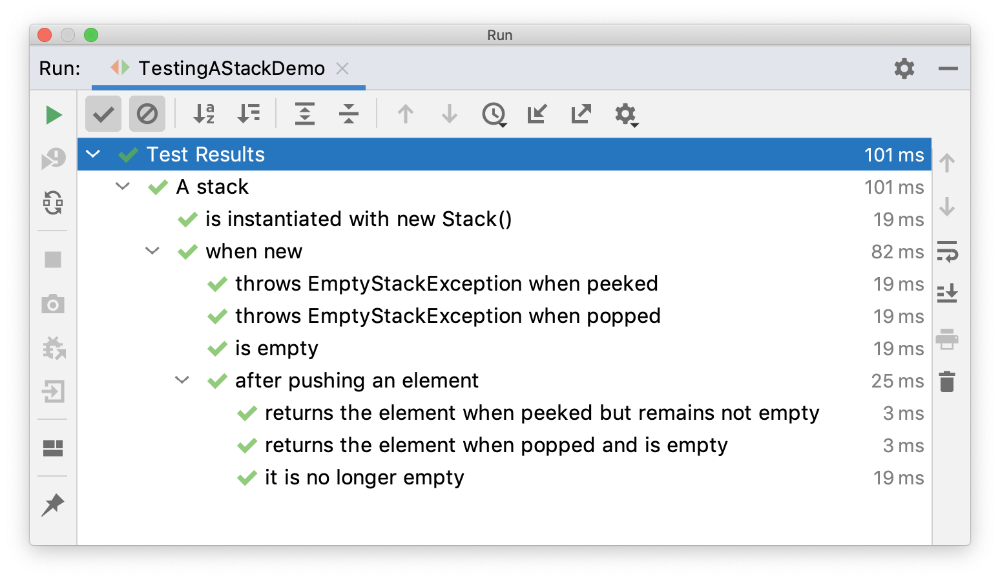

# 【JUnit】JUnit5的条件测试、嵌套测试、重复测试


## 条件测试

JUnit5支持条件注解，根据布尔值判断是否执行测试。

### 自定义条件

`@EnabledIf`和`@DisabledIf`注解用来设置自定义条件，示例：

```java
@Test
@EnabledIf("customCondition")
void enabled() {
    // ...
}

@Test
@DisabledIf("customCondition")
void disabled() {
    // ...
}

boolean customCondition() {
    return true;
}
```

其中customCondition()方法用来返回布尔值，它可以接受一个ExtensionContext类型的参数。如果定义在测试类外部，那么需要是static方法。

### 内置条件

JUnit5的`org.junit.jupiter.api.condition`包中内置了一些条件注解。

**操作系统条件**

`@EnabledOnOs`和`DisabledOnOs`，示例：

```java
@Test
@EnabledOnOs(MAC)
void onlyOnMacOs() {
    // ...
}

@TestOnMac
void testOnMac() {
    // ...
}

@Test
@EnabledOnOs({ LINUX, MAC })
void onLinuxOrMac() {
    // ...
}

@Test
@DisabledOnOs(WINDOWS)
void notOnWindows() {
    // ...
}

@Target(ElementType.METHOD)
@Retention(RetentionPolicy.RUNTIME)
@Test
@EnabledOnOs(MAC)
@interface TestOnMac {
}
```

**JRE条件**

`@EnabledOnJre`和`@DisabledOnJre`用于指定版本，`@EnabledForJreRange`和`@DisabledForJreRange`用于指定版本范围，示例：

```java
@Test
@EnabledOnJre(JAVA_8)
void onlyOnJava8() {
    // ...
}

@Test
@EnabledOnJre({ JAVA_9, JAVA_10 })
void onJava9Or10() {
    // ...
}

@Test
@EnabledForJreRange(min = JAVA_9, max = JAVA_11)
void fromJava9to11() {
    // ...
}

@Test
@EnabledForJreRange(min = JAVA_9)
void fromJava9toCurrentJavaFeatureNumber() {
    // ...
}

@Test
@EnabledForJreRange(max = JAVA_11)
void fromJava8To11() {
    // ...
}

@Test
@DisabledOnJre(JAVA_9)
void notOnJava9() {
    // ...
}

@Test
@DisabledForJreRange(min = JAVA_9, max = JAVA_11)
void notFromJava9to11() {
    // ...
}

@Test
@DisabledForJreRange(min = JAVA_9)
void notFromJava9toCurrentJavaFeatureNumber() {
    // ...
}

@Test
@DisabledForJreRange(max = JAVA_11)
void notFromJava8to11() {
    // ...
}
```

**JVM系统属性条件**

`@EnabledIfSystemProperty`和`@DisabledIfSystemProperty`，示例：

```java
@Test
@EnabledIfSystemProperty(named = "os.arch", matches = ".*64.*")
void onlyOn64BitArchitectures() {
    // ...
}

@Test
@DisabledIfSystemProperty(named = "ci-server", matches = "true")
void notOnCiServer() {
    // ...
}
```

**环境变量条件**

`@EnabledIfEnvironmentVariable`和`@DisabledIfEnvironmentVariable`，示例：

```java
@Test
@EnabledIfEnvironmentVariable(named = "ENV", matches = "staging-server")
void onlyOnStagingServer() {
    // ...
}

@Test
@DisabledIfEnvironmentVariable(named = "ENV", matches = ".*development.*")
void notOnDeveloperWorkstation() {
    // ...
}
```

## 嵌套测试

嵌套测试可以帮助我们对测试结构进行分层。借助于Java嵌套类的语法，JUnit5可以通过`@Nested`注解，实现嵌套测试，示例：

```java
import static org.junit.jupiter.api.Assertions.assertEquals;
import static org.junit.jupiter.api.Assertions.assertFalse;
import static org.junit.jupiter.api.Assertions.assertThrows;
import static org.junit.jupiter.api.Assertions.assertTrue;

import java.util.EmptyStackException;
import java.util.Stack;

import org.junit.jupiter.api.BeforeEach;
import org.junit.jupiter.api.DisplayName;
import org.junit.jupiter.api.Nested;
import org.junit.jupiter.api.Test;

@DisplayName("A stack")
class TestingAStackDemo {

    Stack<Object> stack;

    @Test
    @DisplayName("is instantiated with new Stack()")
    void isInstantiatedWithNew() {
        new Stack<>();
    }

    @Nested
    @DisplayName("when new")
    class WhenNew {

        @BeforeEach
        void createNewStack() {
            stack = new Stack<>();
        }

        @Test
        @DisplayName("is empty")
        void isEmpty() {
            assertTrue(stack.isEmpty());
        }

        @Test
        @DisplayName("throws EmptyStackException when popped")
        void throwsExceptionWhenPopped() {
            assertThrows(EmptyStackException.class, stack::pop);
        }

        @Test
        @DisplayName("throws EmptyStackException when peeked")
        void throwsExceptionWhenPeeked() {
            assertThrows(EmptyStackException.class, stack::peek);
        }

        @Nested
        @DisplayName("after pushing an element")
        class AfterPushing {

            String anElement = "an element";

            @BeforeEach
            void pushAnElement() {
                stack.push(anElement);
            }

            @Test
            @DisplayName("it is no longer empty")
            void isNotEmpty() {
                assertFalse(stack.isEmpty());
            }

            @Test
            @DisplayName("returns the element when popped and is empty")
            void returnElementWhenPopped() {
                assertEquals(anElement, stack.pop());
                assertTrue(stack.isEmpty());
            }

            @Test
            @DisplayName("returns the element when peeked but remains not empty")
            void returnElementWhenPeeked() {
                assertEquals(anElement, stack.peek());
                assertFalse(stack.isEmpty());
            }
        }
    }
}
```

外部测试类通过`@BeforeEach`向内部测试类传递变量。

执行后结果：



## 重复测试

`@RepeatedTest`注解能控制测试方法的重复执行次数，示例：

```java
import static org.junit.jupiter.api.Assertions.assertEquals;

import java.util.logging.Logger;

import org.junit.jupiter.api.BeforeEach;
import org.junit.jupiter.api.DisplayName;
import org.junit.jupiter.api.RepeatedTest;
import org.junit.jupiter.api.RepetitionInfo;
import org.junit.jupiter.api.TestInfo;

class RepeatedTestsDemo {

    private Logger logger = // ...

    @BeforeEach
    void beforeEach(TestInfo testInfo, RepetitionInfo repetitionInfo) {
        int currentRepetition = repetitionInfo.getCurrentRepetition();
        int totalRepetitions = repetitionInfo.getTotalRepetitions();
        String methodName = testInfo.getTestMethod().get().getName();
        logger.info(String.format("About to execute repetition %d of %d for %s", //
            currentRepetition, totalRepetitions, methodName));
    }

    @RepeatedTest(10)
    void repeatedTest() {
        // ...
    }

    @RepeatedTest(5)
    void repeatedTestWithRepetitionInfo(RepetitionInfo repetitionInfo) {
        assertEquals(5, repetitionInfo.getTotalRepetitions());
    }

    @RepeatedTest(value = 1, name = "{displayName} {currentRepetition}/{totalRepetitions}")
    @DisplayName("Repeat!")
    void customDisplayName(TestInfo testInfo) {
        assertEquals("Repeat! 1/1", testInfo.getDisplayName());
    }

    @RepeatedTest(value = 1, name = RepeatedTest.LONG_DISPLAY_NAME)
    @DisplayName("Details...")
    void customDisplayNameWithLongPattern(TestInfo testInfo) {
        assertEquals("Details... :: repetition 1 of 1", testInfo.getDisplayName());
    }

    @RepeatedTest(value = 5, name = "Wiederholung {currentRepetition} von {totalRepetitions}")
    void repeatedTestInGerman() {
        // ...
    }

}
```

其中name可以用来自定义重复测试的显示名字，`{currentRepetition}`和`{totalRepetitions}`是当前次数和总共次数的变量。

执行结果：

```
├─ RepeatedTestsDemo ✔
│  ├─ repeatedTest() ✔
│  │  ├─ repetition 1 of 10 ✔
│  │  ├─ repetition 2 of 10 ✔
│  │  ├─ repetition 3 of 10 ✔
│  │  ├─ repetition 4 of 10 ✔
│  │  ├─ repetition 5 of 10 ✔
│  │  ├─ repetition 6 of 10 ✔
│  │  ├─ repetition 7 of 10 ✔
│  │  ├─ repetition 8 of 10 ✔
│  │  ├─ repetition 9 of 10 ✔
│  │  └─ repetition 10 of 10 ✔
│  ├─ repeatedTestWithRepetitionInfo(RepetitionInfo) ✔
│  │  ├─ repetition 1 of 5 ✔
│  │  ├─ repetition 2 of 5 ✔
│  │  ├─ repetition 3 of 5 ✔
│  │  ├─ repetition 4 of 5 ✔
│  │  └─ repetition 5 of 5 ✔
│  ├─ Repeat! ✔
│  │  └─ Repeat! 1/1 ✔
│  ├─ Details... ✔
│  │  └─ Details... :: repetition 1 of 1 ✔
│  └─ repeatedTestInGerman() ✔
│     ├─ Wiederholung 1 von 5 ✔
│     ├─ Wiederholung 2 von 5 ✔
│     ├─ Wiederholung 3 von 5 ✔
│     ├─ Wiederholung 4 von 5 ✔
│     └─ Wiederholung 5 von 5 ✔
```

## 小结

本文分别对JUnit5的条件测试、嵌套测试、重复测试进行了介绍，它们可以使得测试更加灵活和富有层次。除了这些，JUnit5还支持另一个重要且常见的测试：参数化测试。

> 参考资料：
>
> https://junit.org/junit5/docs/current/user-guide/#writing-tests-conditional-execution
>
> https://junit.org/junit5/docs/current/user-guide/#writing-tests-nested
>
> https://junit.org/junit5/docs/current/user-guide/#writing-tests-repeated-tests