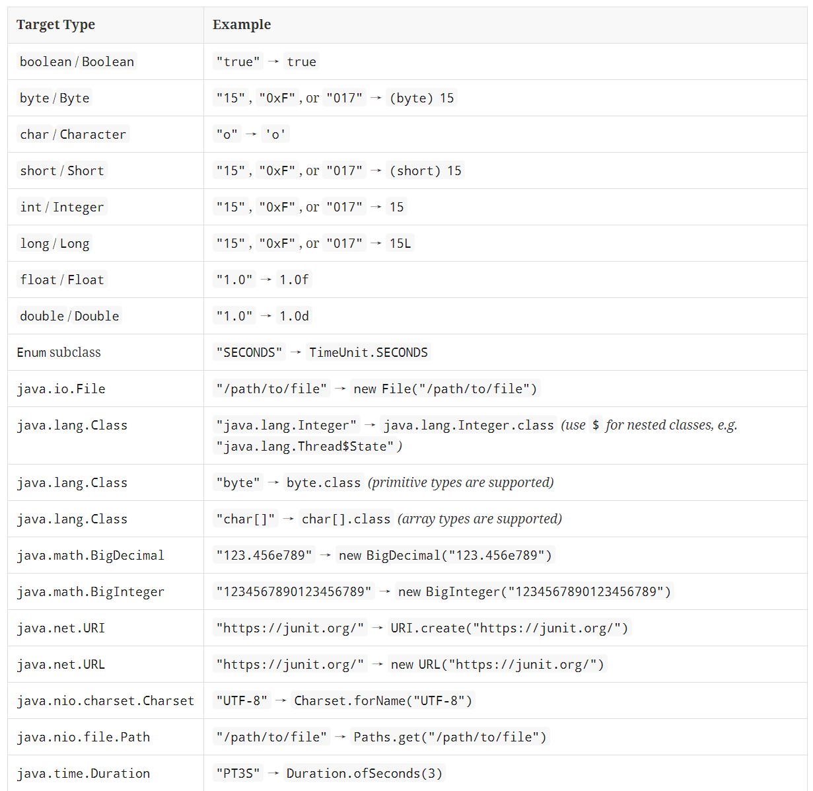
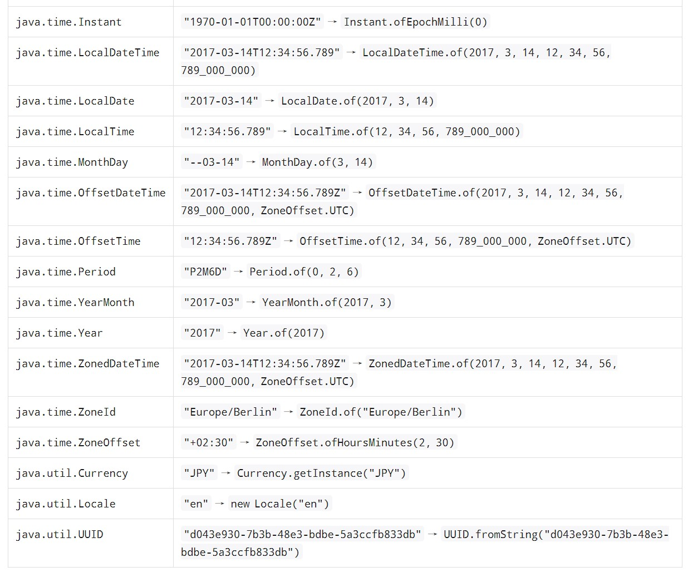

# 【JUnit】JUnit5参数化测试的几种方式


参数化测试一直是津津乐道的话题，我们都知道JMeter有四种参数化方式：用户自定义变量、用户参数、CSV文件、函数助手，那么JUnit5有哪些参数化测试的方式呢？

## 依赖

JUnit5需要添加`junit-jupiter-params`依赖才能使用参数化：

```xml
<dependency>
    <groupId>org.junit.jupiter</groupId>
    <artifactId>junit-jupiter-params</artifactId>
    <version>5.7.2</version>
    <scope>test</scope>
</dependency>
```

## 简单示例

`@ParameterizedTest`用来定义参数化测试，`@ValueSource`用来定义参数值：

```java
@ParameterizedTest
@ValueSource(strings = { "racecar", "radar", "able was I ere I saw elba" })
void palindromes(String candidate) {
    assertTrue(StringUtils.isPalindrome(candidate));
}
```

执行结果：

```
palindromes(String) ✔
├─ [1] candidate=racecar ✔
├─ [2] candidate=radar ✔
└─ [3] candidate=able was I ere I saw elba ✔
```

参数值会匹配测试方法的参数列表，然后依次赋值，这里一共产生了3个测试。

## 七种方式

### 1 `@ValueSource`

`@ValueSource`是最简单的参数化方式，它是一个数组，支持以下数据类型：

- `short`
- `byte`
- `int`
- `long`
- `float`
- `double`
- `char`
- `boolean`
- `java.lang.String`
- `java.lang.Class`

示例：

```java
@ParameterizedTest
@ValueSource(ints = { 1, 2, 3 })
void testWithValueSource(int argument) {
    assertTrue(argument > 0 && argument < 4);
}
```

### 2 Null and Empty Sources

- `@NullSource` 值为null

  > 不能用在基元类型的测试方法。

- `@EmptySource` 值为空，根据测试方法的参数类决定数据类型，支持`java.lang.String`, `java.util.List`, `java.util.Set`, `java.util.Map`, 基元类型数组 (`int[]`, `char[][]`等), 对象数组 (`String[]`, `Integer[][]`等)

- `@NullAndEmptySource` 结合了前面两个

示例：

```java
@ParameterizedTest
@NullSource
@EmptySource
@ValueSource(strings = { " ", "   ", "\t", "\n" })
void nullEmptyAndBlankStrings(String text) {
    assertTrue(text == null || text.trim().isEmpty());
}
```

等价于：

```java
@ParameterizedTest
@NullAndEmptySource
@ValueSource(strings = { " ", "   ", "\t", "\n" })
void nullEmptyAndBlankStrings(String text) {
    assertTrue(text == null || text.trim().isEmpty());
}
```

### 3 `@EnumSource`

参数化的值为枚举类型。

示例：

```java
@ParameterizedTest
@EnumSource
void testWithEnumSourceWithAutoDetection(ChronoUnit unit) {
    assertNotNull(unit);
}
```

其中的ChronoUnit是个日期枚举类。

ChronoUnit是接口TemporalUnit的实现类，如果测试方法的参数为TemporalUnit，那么需要给`@EnumSource`加上值：

```java
@ParameterizedTest
@EnumSource(ChronoUnit.class)
void testWithEnumSource(TemporalUnit unit) {
    assertNotNull(unit);
}
```

因为JUnit5规定了`@EnumSource`的默认值的类型必须是枚举类型。

names属性用来指定使用哪些特定的枚举值：

```java
@ParameterizedTest
@EnumSource(names = { "DAYS", "HOURS" })
void testWithEnumSourceInclude(ChronoUnit unit) {
    assertTrue(EnumSet.of(ChronoUnit.DAYS, ChronoUnit.HOURS).contains(unit));
}
```

mode属性用来指定使用模式，比如排除哪些枚举值：

```java
@ParameterizedTest
@EnumSource(mode = EXCLUDE, names = { "ERAS", "FOREVER" })
void testWithEnumSourceExclude(ChronoUnit unit) {
    assertFalse(EnumSet.of(ChronoUnit.ERAS, ChronoUnit.FOREVER).contains(unit));
}
```

比如采用正则匹配：

```java
@ParameterizedTest
@EnumSource(mode = MATCH_ALL, names = "^.*DAYS$")
void testWithEnumSourceRegex(ChronoUnit unit) {
    assertTrue(unit.name().endsWith("DAYS"));
}
```

### 4 `@MethodSource`

参数值为factory方法，并且factory方法不能带参数。

示例：

```java
@ParameterizedTest
@MethodSource("stringProvider")
void testWithExplicitLocalMethodSource(String argument) {
    assertNotNull(argument);
}

static Stream<String> stringProvider() {
    return Stream.of("apple", "banana");
}
```

除非是`@TestInstance(Lifecycle.PER_CLASS)`生命周期，否则factory方法必须是static。factory方法的返回值是能转换为`Stream`的类型，比如`Stream`, `DoubleStream`, `LongStream`, `IntStream`, `Collection`, `Iterator`, `Iterable`, 对象数组, 或者基元类型数组，比如：

```java
@ParameterizedTest
@MethodSource("range")
void testWithRangeMethodSource(int argument) {
    assertNotEquals(9, argument);
}

static IntStream range() {
    return IntStream.range(0, 20).skip(10);
}
```

`@MethodSource`的属性如果省略了，那么JUnit Jupiter会找跟测试方法同名的factory方法，比如：

```java
@ParameterizedTest
@MethodSource
void testWithDefaultLocalMethodSource(String argument) {
    assertNotNull(argument);
}

static Stream<String> testWithDefaultLocalMethodSource() {
    return Stream.of("apple", "banana");
}
```

如果测试方法有多个参数，那么factory方法也应该返回多个：

```java
@ParameterizedTest
@MethodSource("stringIntAndListProvider")
void testWithMultiArgMethodSource(String str, int num, List<String> list) {
    assertEquals(5, str.length());
    assertTrue(num >=1 && num <=2);
    assertEquals(2, list.size());
}

static Stream<Arguments> stringIntAndListProvider() {
    return Stream.of(
        arguments("apple", 1, Arrays.asList("a", "b")),
        arguments("lemon", 2, Arrays.asList("x", "y"))
    );
}
```

其中`arguments(Object…)`是Arguments接口的static factory method，也可以换成`Arguments.of(Object…)`。

factory方法也可以防止测试类外部：

```java
package example;

import java.util.stream.Stream;

import org.junit.jupiter.params.ParameterizedTest;
import org.junit.jupiter.params.provider.MethodSource;

class ExternalMethodSourceDemo {

    @ParameterizedTest
    @MethodSource("example.StringsProviders#tinyStrings")
    void testWithExternalMethodSource(String tinyString) {
        // test with tiny string
    }
}

class StringsProviders {

    static Stream<String> tinyStrings() {
        return Stream.of(".", "oo", "OOO");
    }
}
```

### 5 `@CsvSource`

参数化的值为csv格式的数据（默认逗号分隔），比如：

```java
@ParameterizedTest
@CsvSource({
    "apple,         1",
    "banana,        2",
    "'lemon, lime', 0xF1"
})
void testWithCsvSource(String fruit, int rank) {
    assertNotNull(fruit);
    assertNotEquals(0, rank);
}
```

delimiter属性可以设置分隔字符。delimiterString属性可以设置分隔字符串（String而非char）。

更多输入输出示例如下：


注意，如果null引用的目标类型是基元类型，那么会报异常`ArgumentConversionException`。

### 6 `@CsvFileSource`

顾名思义，选择本地csv文件作为数据来源。

示例：

```java
@ParameterizedTest
@CsvFileSource(resources = "/two-column.csv", numLinesToSkip = 1)
void testWithCsvFileSourceFromClasspath(String country, int reference) {
    assertNotNull(country);
    assertNotEquals(0, reference);
}

@ParameterizedTest
@CsvFileSource(files = "src/test/resources/two-column.csv", numLinesToSkip = 1)
void testWithCsvFileSourceFromFile(String country, int reference) {
    assertNotNull(country);
    assertNotEquals(0, reference);
}
```

delimiter属性可以设置分隔字符。delimiterString属性可以设置分隔字符串（String而非char）。**需要特别注意的是，`#`开头的行会被认为是注释而略过。**

### 7 `@ArgumentsSource`

自定义ArgumentsProvider。

示例：

```java
@ParameterizedTest
@ArgumentsSource(MyArgumentsProvider.class)
void testWithArgumentsSource(String argument) {
    assertNotNull(argument);
}
```

```java
public class MyArgumentsProvider implements ArgumentsProvider {

    @Override
    public Stream<? extends Arguments> provideArguments(ExtensionContext context) {
        return Stream.of("apple", "banana").map(Arguments::of);
    }
}
```

MyArgumentsProvider必须是外部类或者static内部类。

## 参数类型转换

### 隐式转换

JUnit Jupiter会对String类型进行隐式转换。比如：

```java
@ParameterizedTest
@ValueSource(strings = "SECONDS")
void testWithImplicitArgumentConversion(ChronoUnit argument) {
    assertNotNull(argument.name());
}
```

更多转换示例：





也可以把String转换为自定义对象：

```java
@ParameterizedTest
@ValueSource(strings = "42 Cats")
void testWithImplicitFallbackArgumentConversion(Book book) {
    assertEquals("42 Cats", book.getTitle());
}
```

```java
public class Book {

    private final String title;

    private Book(String title) {
        this.title = title;
    }

    public static Book fromTitle(String title) {
        return new Book(title);
    }

    public String getTitle() {
        return this.title;
    }
}
```

 JUnit Jupiter会找到`Book.fromTitle(String)`方法，然后把`@ValueSource`的值传入进去，进而把String类型转换为Book类型。转换的factory方法既可以是接受单个String参数的构造方法，也可以是接受单个String参数并返回目标类型的普通方法。详细规则如下（官方原文）：


### 显式转换

显式转换需要使用`@ConvertWith`注解：

```java
@ParameterizedTest
@EnumSource(ChronoUnit.class)
void testWithExplicitArgumentConversion(
        @ConvertWith(ToStringArgumentConverter.class) String argument) {

    assertNotNull(ChronoUnit.valueOf(argument));
}
```

并实现ArgumentConverter：

```java
public class ToStringArgumentConverter extends SimpleArgumentConverter {

    @Override
    protected Object convert(Object source, Class<?> targetType) {
        assertEquals(String.class, targetType, "Can only convert to String");
        if (source instanceof Enum<?>) {
            return ((Enum<?>) source).name();
        }
        return String.valueOf(source);
    }
}
```

如果只是简单类型转换，实现TypedArgumentConverter即可：

```java
public class ToLengthArgumentConverter extends TypedArgumentConverter<String, Integer> {

    protected ToLengthArgumentConverter() {
        super(String.class, Integer.class);
    }

    @Override
    protected Integer convert(String source) {
        return source.length();
    }

}
```

JUnit Jupiter只内置了一个JavaTimeArgumentConverter，通过`@JavaTimeConversionPattern`使用：

```java
@ParameterizedTest
@ValueSource(strings = { "01.01.2017", "31.12.2017" })
void testWithExplicitJavaTimeConverter(
        @JavaTimeConversionPattern("dd.MM.yyyy") LocalDate argument) {

    assertEquals(2017, argument.getYear());
}
```

## 参数聚合

测试方法的多个参数可以聚合为一个ArgumentsAccessor参数，然后通过get来取值，示例：

```java
@ParameterizedTest
@CsvSource({
    "Jane, Doe, F, 1990-05-20",
    "John, Doe, M, 1990-10-22"
})
void testWithArgumentsAccessor(ArgumentsAccessor arguments) {
    Person person = new Person(arguments.getString(0),
                               arguments.getString(1),
                               arguments.get(2, Gender.class),
                               arguments.get(3, LocalDate.class));

    if (person.getFirstName().equals("Jane")) {
        assertEquals(Gender.F, person.getGender());
    }
    else {
        assertEquals(Gender.M, person.getGender());
    }
    assertEquals("Doe", person.getLastName());
    assertEquals(1990, person.getDateOfBirth().getYear());
}
```

也可以自定义Aggregator：

```java
public class PersonAggregator implements ArgumentsAggregator {
    @Override
    public Person aggregateArguments(ArgumentsAccessor arguments, ParameterContext context) {
        return new Person(arguments.getString(0),
                          arguments.getString(1),
                          arguments.get(2, Gender.class),
                          arguments.get(3, LocalDate.class));
    }
}
```

然后通过`@AggregateWith`来使用：

```java
@ParameterizedTest
@CsvSource({
    "Jane, Doe, F, 1990-05-20",
    "John, Doe, M, 1990-10-22"
})
void testWithArgumentsAggregator(@AggregateWith(PersonAggregator.class) Person person) {
    // perform assertions against person
}
```

借助于组合注解，我们可以进一步简化代码：

```java
@Retention(RetentionPolicy.RUNTIME)
@Target(ElementType.PARAMETER)
@AggregateWith(PersonAggregator.class)
public @interface CsvToPerson {
}
```

```java
@ParameterizedTest
@CsvSource({
    "Jane, Doe, F, 1990-05-20",
    "John, Doe, M, 1990-10-22"
})
void testWithCustomAggregatorAnnotation(@CsvToPerson Person person) {
    // perform assertions against person
}
```

## 自定义显示名字

参数化测试生成的test，JUnit Jupiter给定了默认名字，我们可以通过name属性进行自定义。

示例：

```java
@DisplayName("Display name of container")
@ParameterizedTest(name = "{index} ==> the rank of ''{0}'' is {1}")
@CsvSource({ "apple, 1", "banana, 2", "'lemon, lime', 3" })
void testWithCustomDisplayNames(String fruit, int rank) {
}
```

结果：

```
Display name of container ✔
├─ 1 ==> the rank of 'apple' is 1 ✔
├─ 2 ==> the rank of 'banana' is 2 ✔
└─ 3 ==> the rank of 'lemon, lime' is 3 ✔
```

> 注意如果要显示`'apple'`，需要使用两层`''apple''`，因为name是MessageFormat。

占位符说明如下：


## 小结

本文介绍了JUnit5参数化测试的7种方式，分别是`@ValueSource`，Null and Empty Sources，`@EnumSource`，`@MethodSource`，`@CsvSource`，`@CsvFileSource`，`@ArgumentsSource`，比较偏向于Java语法，符合JUnit单元测试框架的特征。另外还介绍了JUnit Jupiter的参数类型转换和参数聚合。最后，如果想要自定义参数化测试的名字，可以使用name属性实现。

> 参考资料：
>
> https://junit.org/junit5/docs/current/user-guide/#writing-tests-parameterized-tests

