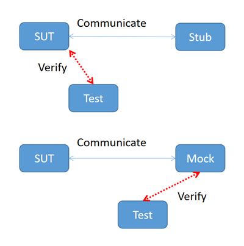

# 【Mockito】Java单元测试Mock框架Mockito入门介绍


## 鸡尾酒

Mockito是Java的单元测试Mock框架。它的logo是一杯古巴最著名的鸡尾酒Mojito，Ｍojito鸡尾酒，源自古巴的哈瓦那，带有浓厚的加勒比海风情。并不浓烈，但是喝一杯下去，脸上会泛起红晕，象少女的羞涩。味道很清新，有一点青涩、有点甜蜜。


## Stub & Mock 

Stub和Mock是Test Double类型中的2种。Test Double一共有5种类型，Dummy，Stub，Spy，Mock，Fake。 


Test Double是测试复制品，用来统称模拟真实对象的假对象。因使用场景有略微不同，而有这5种类型。

- Dummy，通常只用来填充参数列表。有可能是null对象引用，或Object类实例等。
- Fake，是简化版的实现，比如基于内存实现的数据库，不会真的去做数据库操作，用简单的HashMap来存放数据。
- Stub，Stub用来替代SUT(System Under Test)依赖的组件，但是只模拟一个外部依赖，不做断言。
- Spy，介于Stub和Mock之间。如果真实对象没有被打桩，当调用Spy对象时，真实对象也会被调用。
- Mock，可以理解为Stub+Verification，既模拟外部依赖，也会定义预期结果。

看一个实例，发送邮件，

```java
public interface MailService {
    public void send(Message msg);
}
```

先写个Stub，

```java
public class MailServiceStub implements MailService {
    private List<Message> messages = new ArrayList<Message>();

    public void send(Message msg) {
        messages.add(msg);
    }

    public int numberSent() {
        return messages.size();
    }
}     
```

实现Stub的状态验证，

*class OrderStateTester...*

```java
public void testOrderSendsMailIfUnfilled() {
    Order order = new Order(TALISKER, 51);
    MailServiceStub mailer = new MailServiceStub();
    order.setMailer(mailer);
    order.fill(warehouse);
    assertEquals(1, mailer.numberSent());
}
```

只做了简单的测试，断言发出了1封邮件。没有测试是否发送给了对的收件人，或者邮件正文是否正确。不过不影响跟Mock比较。

如果用Mock，会怎么写呢？

*class OrderInteractionTester...*

```java
public void testOrderSendsMailIfUnfilled() {
    Order order = new Order(TALISKER, 51);
    Mock warehouse = mock(Warehouse.class);
    Mock mailer = mock(MailService.class);
    order.setMailer((MailService) mailer.proxy());

    mailer.expects(once()).method("send");
    warehouse.expects(once()).method("hasInventory")
        .withAnyArguments()
        .will(returnValue(false));

    order.fill((Warehouse) warehouse.proxy());
}
```

结合一张图，就一下全明白了，



## 怎么喝Mockito？

添加Maven dependency，

```xml
<dependency>
    <groupId>org.mockito</groupId>
    <artifactId>mockito-core</artifactId>
    <version>3.3.3</version>
    <scope>test</scope>
</dependency>
```

现在可以开始Mock了，先Mock一个List Interface试试，（示例只是玩语法，实际应使用instance）

```java
//Let's import Mockito statically so that the code looks clearer
import static org.mockito.Mockito.*;

// mock creation
List mockedList = mock(List.class);

// using mock object
mockedList.add("one");
mockedList.clear();

// verification
verify(mockedList).add("one");
verify(mockedList).clear();
 
```

接着用Mockito来做Stub：

```java
// You can mock concrete classes, not just interfaces
LinkedList mockedList = mock(LinkedList.class);

// stubbing
when(mockedList.get(0)).thenReturn("first");
when(mockedList.get(1)).thenThrow(new RuntimeException());

// following prints "first"
System.out.println(mockedList.get(0));

// following throws runtime exception
System.out.println(mockedList.get(1));

// following prints "null" because get(999) was not stubbed
System.out.println(mockedList.get(999));

// Although it is possible to verify a stubbed invocation, usually it's just redundant
// If your code cares what get(0) returns, then something else breaks 
// (often even before verify() gets executed).
// If your code doesn't care what get(0) returns, then it should not be stubbed.
verify(mockedList).get(0);
 
```

mock默认会返回null，或原始值，或空集合。如int/Integer返回0，boolean/Boolean返回false。

## 小结

本文首先介绍了Mockito是Java的单元测试Mock框架，然后比较了单元测试中Stub和Mock的区别，最后演示了Mockito如何使用。

> 参考资料：
> https://javadoc.io/doc/org.mockito/mockito-core/latest/org/mockito/Mockito.html
>
> https://martinfowler.com/articles/mocksArentStubs.html
>
> http://xunitpatterns.com/Test%20Double.html
>