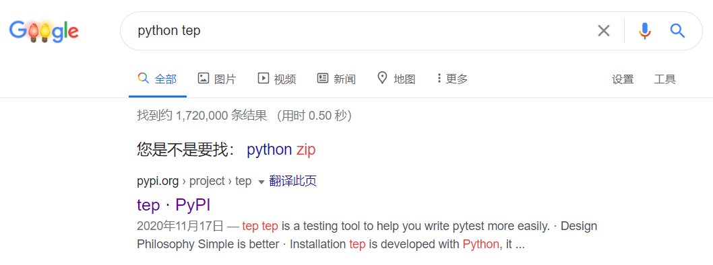
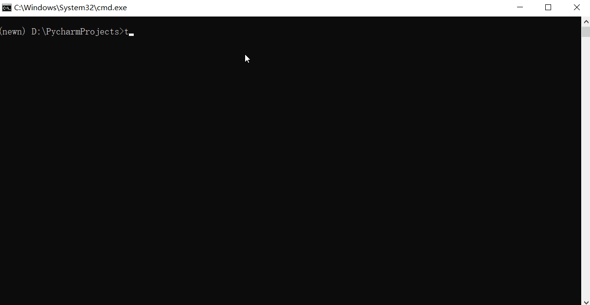
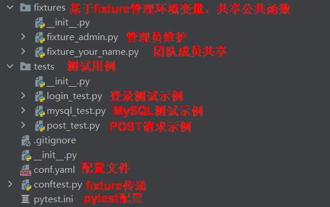

# tep用户手册帮你从unittest过渡到pytest


unittest和pytest是Python的2个强大的测试框架，经常用来做UI自动化或接口自动化。unittest是PyCharm的默认集成工具，也是我们大多数人入门自动化的首选框架。pytest提供了更丰富的功能，相对的上手难度也要高一点。如果学了pytest后，想快速用pytest写项目，用于工作实践，那么可以试试我写的这款测试工具：`tep`，try easy pytest。

## tep简介

在Google中输入`python tep`：



tep是一款测试工具，不是测试框架，它做的事情只是帮助你更轻松的使用pytest写项目代码，主要功能如下：

- 项目脚手架
- pytest用例组织
- 输出HTML测试报告
- 基于fixture管理环境变量
- 基于fixture共享公共函数
- 访问MySQL数据库
- 集成常用第三方包
- 登录接口示例代码

## 工具安装

### **安装**

tep已经上传到了PyPI（Python Package Index）：


可以使用`pip`命令安装：

```
pip install tep
```

外网速度慢，`pandas`可能安装失败，推荐用国内镜像：

```shell
pip --default-timeout=6000 install -i https://pypi.tuna.tsinghua.edu.cn/simple tep
```

由于集成了第三方包，安装可能会花几分钟，请耐心等待。

> Python版本 `3.6+`

### **检查**

安装完成后，检查是否安装成功：

```shell
tep -V
0.5.3
```

或者：

```shell
tep --version
0.5.3
```

### 升级

使用`-U`参数：

```shell
pip install -U tep
```

或者指定版本：

```shell
pip install tep==0.5.3
```

## 快速创建项目

tep提供了脚手架，预置了项目结构和代码，打开cmd，使用`startproject`命令快速创建项目：

```shell
cd some_directory
tep startproject project_name
```



创建后的项目结果如下：



> 当前版本主要用来做接口自动化，建议把不同业务系统建成多个项目。

## 1个文件2处修改完成登录请求

tep已经预置了登录相关代码，只需要打开`fixtures\fixture_admin.py`，修改2个地方的代码，就可以完成登录请求。

### 修改环境变量

编辑`fixtures/fixture_admin.py`：

```python
@pytest.fixture(scope="session")
def env_vars(config):
    class Clazz:
        def __init__(self):
            env = config["env"]
            self.mapping = {
                "qa": {
                    "domain": "https://qa.com",
                    "mysql_engine": mysql_engine("127.0.0.1",  # host
                                                 "2306",  # port
                                                 "root",  # username
                                                 "123456",  # password
                                                 "test")  # db_name
                },
                "release": {
                    "domain": "https://release.com",
                    "mysql_engine": mysql_engine("127.0.0.1",
                                                 "2306",
                                                 "root",
                                                 "123456",
                                                 "release")
                }
                # Add your env and variables
            }
            self.domain = self.mapping[env]["domain"]
            self.mysql_engine = self.mapping[env]["mysql_engine"]
            # Add properties

        def add(self, env, key, value):
            self.mapping[config["env"]][key] = value

    return Clazz()
```

`mapping`是个字典，预置了2个环境：`qa`和`release`，每个环境预置了2个变量：`domain`和`mysql_engine`。

**domain**

`url = domain +uri`，例如`https://qa.com/api/users/login/`的domain是``https://qa.com`，uri是`/api/users/login/`。

首先把`qa`环境的`domain`值改为你的测试域名。

### 修改登录代码

继续编辑`fixtures/fixture_admin.py`：

```python
def _jwt_headers(token):
    return {"Content-Type": "application/json", "authorization": f"Bearer {token}"}


@pytest.fixture(scope="session")
def login():
    # Code your login
    logger.info("Administrator login")
    response = request(
        "post",
        url=url("/api/users/login/"),
        headers={"Content-Type": "application/json"},
        json={
            "username": "admin",
            "password": "123456",
        }
    )
    assert response.status_code < 400
    response_token = jmespath.search("token", response.json())

    class Clazz:
        token = response_token
        jwt_headers = _jwt_headers(response_token)

    return Clazz
```

在`# Code your login`处开始修改代码，替换API路径`/api/users/login/`和请求参数`json`。如果你的登录接口不会返回token，那么修改`jmespath.search("token", response.json())`为实际响应取值。

> tep预置登录返回了2个值：`token`和`jwt_headers`。

### 测试登录

打开`tests/login_test.py`：

```python
from loguru import logger


def test_login(login):
    logger.info(login.token)

```

执行后就会调用登录接口发起请求。

> 遇到问题无法解决请留言或加群。

## 编写测试用例

### 用例组织

测试用例全部放在`tests`目录下：


每个`.py`模块以`test_`前缀或`_test`后缀命名，每个`test`函数以`test`前缀命名。只要遵循这个规则，目录层次不影响。示例：


> 建议每个`.py`模块只包含1个`test`函数，也就是1条测试用例。

### 接口请求设计

每条测试用例可以包含单个或多个接口请求。tep预置了1个POST请求示例代码，打开`tests/post_test.py`：

```python
import jmespath
from loguru import logger

from tep.client import request


def test_post(faker_ch, url, login):
    # description
    logger.info("test post")
    # data
    fake = faker_ch
    # request
    response = request(
        "post",
        url=url("/api/users"),
        headers=login.jwt_headers,
        json={
            "name": fake.name()
        }
    )
    # assert
    assert response.status_code < 400
    # extract
    user_id = jmespath.search("id", response.json())
```

每个请求由5部分组成，从上往下分别是描述、数据、请求、断言和提取。

> 借鉴了JMeter元件和参数化关联的设计思想。

**描述**

描述这个请求是干嘛的。

**数据**

初始化局部变量，例如使用faker库造测试数据。

**请求**

如果需要打印请求日志，可以`from tep.client import request`，`tep.client.request`对`requests.request`除了记录日志外，没有做任何修改。

> 如果请求报错了，那么很可能是代码写错了。

也可以直接使用原生`request`，`from requests import request`。

不同请求方法的代码如下：

```python
request("get", url="", headers={}, json={})
request("post", url="", headers={}, params={})
request("put", url="", headers={}, json={})
request("delete", url="", headers={})

# 上传excel
request("post",
        url="",
        headers={},
        files={
            "file": (
                file_name,
                open(file_path, "rb"),
                "application/vnd.openxmlformats-officedocument.spreadsheetml.sheet"
            )
        },
        verify=False
    )
```

> 更多用法参考`requests.request`。

**断言**

断言使用Python标准断言`assert 表达式`，表达式跟`if`语句表达式一模一样。

**提取**

推荐使用`jmespath`提取JSON数据，也可以使用Python`[]`中括号提取。

## HTML测试报告

### 批量执行用例

单个测试用例，在PyCharm中执行就可以了。多个测试用例批量执行，需要打开左下角的`Terminal`，输入命令来执行：

```shell
# 先进入tests目录
cd tests
# 批量执行
pytest
```

### 只收集不执行

如果只想统计用例条数，不执行代码，那么可以使用以下命令：

```shell
pytest --co
```

### HTML测试报告

tep提供了`--tep-reports`参数来生成allure测试报告：

```shell
pytest  --tep-reports
```

报告文件存放在根目录的`reports/`中：


右键`index.html`选择：


就会打开浏览器显示测试报告了：


> 默认allure报告右上角的`TREND`是无法显示数据的，`--tep-reports`修复了这个问题，根据history数据生成`TREND`走势图。

## 自定义环境变量

### 静态添加

编辑`fixtures/fixture_admin.py`，在`mapping`字典中`# Add your env and variables`处添加环境变量，在`# Add properties`处添加属性，参考`domain`和`mysql_engine`。示例：


### 动态添加

使用`add()`方法动态添加环境变量：

```python
env_vars.add("my_var", 789)
```

### 使用环境变量

`env_vars`返回了类对象实例，通过`.`运算符来使用环境变量：

```python
env_vars.domain
env_vars.mysql_engine
env_vars.my_var
```

> 不需要import，而是给test函数添加参数，如`def test(env_vars):`

## 切换环境

在`conf.yaml`文件中配置：

```yaml
env: qa
```

默认为`qa`环境。

## 团队共享公共函数

通过fixture技术，我们可以把重复代码提取出来，在团队间进行复用。tep重度使用了这个技术，在`fixtures`目录中，除了预置的`fixture_admin.py`，可以继续添加团队成员的fixture：


新添加的`fixture_your_name.py`需要到根目录的`conftest.py`中注册才能生效：

```python
# Import fixtures
exec("from .fixtures.fixture_admin import *")
exec("from .fixtures.fixture_your_name import *")
```

> conftest.py模块中建议全部定义成fixture，不对外提供function。

为了避免命名冲突和代码跟踪，团队成员的公共函数命名建议加上`_yourname`后缀。

## 访问MySQL数据库

首先在`fixtures\fixture_admin.py`中修改`mysql_engine`：

```python
"mysql_engine": mysql_engine("127.0.0.1",  # host
                             "2306",  # port
                             "root",  # username
                             "123456",  # password
                             "test")  # db_name
```

依次填写主机名、端口、用户名、密码、数据库名。

接着使用pandas来访问数据库，`tests\mysql_test.py`预置了示例代码：

```python
from loguru import logger


def test_mysql(pd, env_vars):
    logger.info(pd.read_sql("select 1 from dual", env_vars.mysql_engine))
```

返回的数据可以通过`data["列名"]["行号"] `的方式读取。

如果想在console中以表格方式显示表数据，可以使用`tep.dao.print_db_table()`函数，如：

```python
from loguru import logger
from tep.dao import print_db_table


def test_mysql(pd, env_vars):
    data = pd.read_sql("select 1 from dual", env_vars.mysql_engine)
    logger.info(print_db_table(data))
```

## 第三方包集成说明

tep使用了Poetry来管理包和依赖：


目前已集成：

```python
# 造测试数据
faker = "^4.1.1"
# 提取JSON数据
jmespath = "^0.10.0"
# 屏蔽HTTPS警告
urllib3 = "^1.25.9"
# HTTP/HTTPS请求
requests = "^2.24.0"
# HTML测试报告
allure-pytest = "^2.8.16"
allure-python-commons = "^2.8.16"
# 打印日志
loguru = "^0.5.1"
# 访问数据库
pandas = "^1.1.0"
# 配置文件
pyyaml = "^5.3.1"
# 为pandas访问数据库提供engine
sqlalchemy = "^1.3.22"
# 把数据库表打印成表格
texttable = "^1.6.3"
# 支持sqlalchemy使用
pymysql = "^0.10.1"
```

## 小结

最早写这个工具的想法是以项目工程方式使用pytest，并结合第三方包完成接口自动化落地。如果你也有类似的想法，那么可以参考tep的做法。tep用户手册是针对于tep工具本身的使用说明，不包含pytest框架搭建和基本使用，如果想入门pytest并深度学习，可以阅读我写的pytest系列文章，共8篇。tep的最新版本是`0.5.3`，还不够稳定，也存在bug，我会坚持维护下去，既是实用工具，也是技术沉淀。对tep有任何建议或问题，欢迎公众号后台回复“加群”讨论哦：


> 参考资料：
>
> 源码 https://github.com/dongfanger/tep

