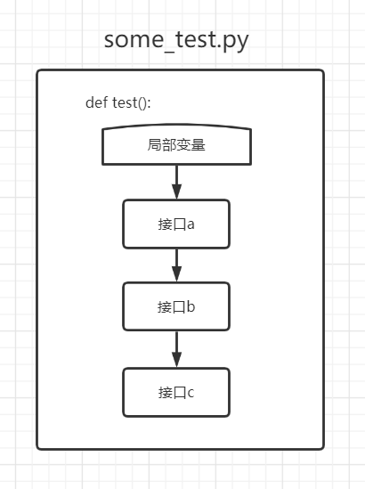
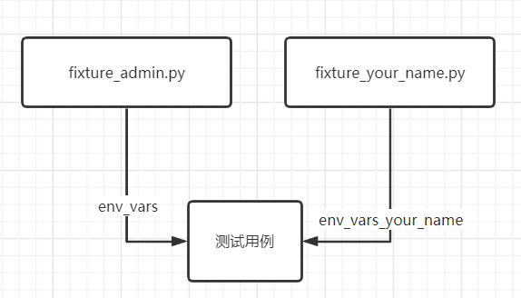
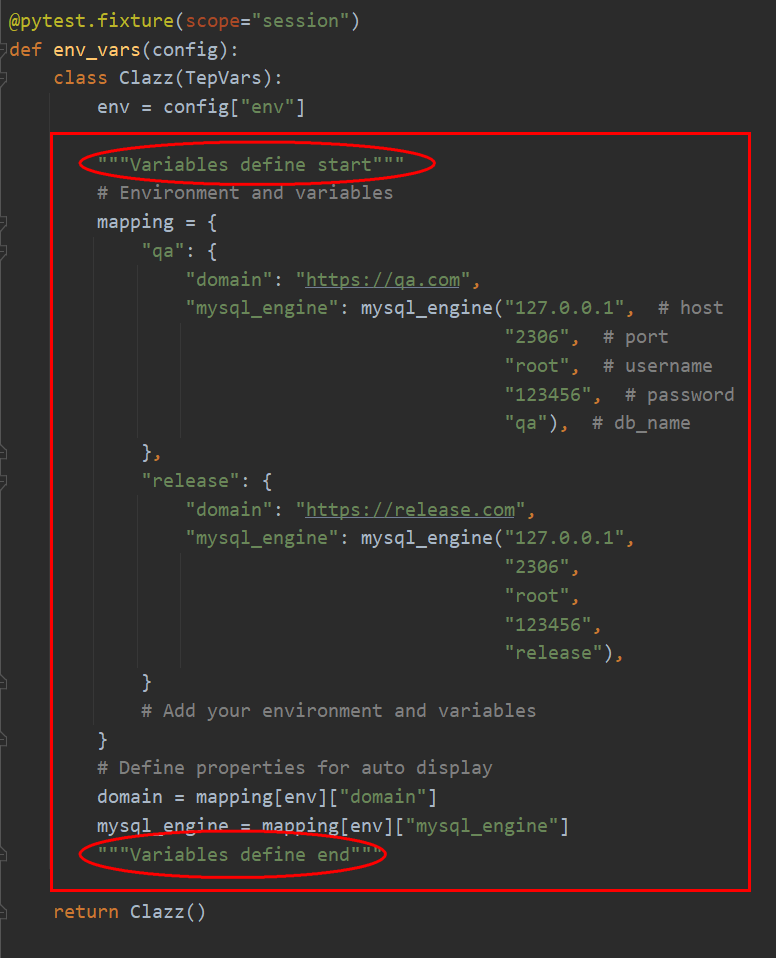
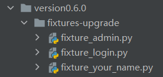
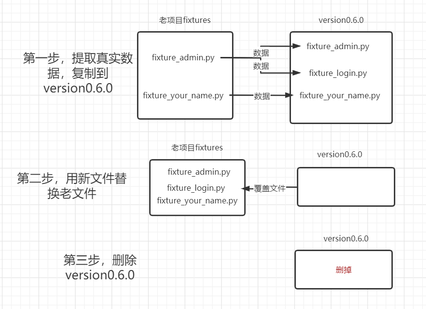

# tep0.6.0更新聊聊pytest变量接口用例3个级别复用


tep是一款测试工具，在pytest测试框架基础上集成了第三方包，提供项目脚手架，帮助以写Python代码方式，快速实现自动化项目落地。fixture是pytest核心技术，本文聊聊如何使用fixture完成变量、接口、用例3个级别复用。

## 技术原理

fixture是一种特殊函数，实现了依赖注入，pytest规定，只要在`conftest.py`模块中定义了fixture，作为参数传给测试函数`test(fixture_name)`就可以使用，无需`import`。tep在`conftest.py`上封装了一层`fixtures`，类似于Django初始化数据加载的`fixtures`，定义了`env_vars`环境变量，预置了登录接口等。整体思路如下图所示：

- 实线：表示fixture流转，从`tep.fixture`预置fixture，到`fixtures`，到`conftest.py`，到`tests`。
- 虚线：表示动态变量流转，参考JMeter `vars.put()`和`vars.get()`，实现用例级别复用。
- 蓝色线：表示静态变量流转，参考JMeter`自定义用户变量`，实现变量级别复用。


### tep.fixture

`tep.fixture`第一块内容是预置fixture的实现代码，如`url`、`faker_ch`等，对使用者隐藏。第二块内容是类`TepVar`，预置了1个Python字典`vars_`和2个存取方法`put()`、`get()`，划分了一块key-value形式存储区域。

### fixtures

`fixtures`是一个包，里面包括多个`fixture_*.py`格式的Python模块，定义的全部都是fixture，只对外提供`fixture`，不提供`function`。

### 自动注册

`conftest.py`是pytest的特殊文件，文件名固定，tep在其中实现了自动注册功能，它会自动查找`fixtures`目录下，所有以`fixture_`开头，以`.py`结尾的Python模块进行导入，无需手动添加。注册后，`tests`才能够找到`fixtures`中定义的`fixture`，否则报错`fixture not found`。

### tests

`tests`存放所有测试用例，tep建议每个Python模块中只定义1个`test()`函数，用例分离，独立运行。

> 参考了`HttpRunner`每个`yaml`文件1条用例的做法。复杂场景可以定义多个测试`test()`函数或`Test`类，pytest都支持。

## 使用示例

### 变量级别复用

**函数局部变量**

```python
import jmespath
from loguru import logger

from tep.client import request


def test_post(faker_ch, url, login):
    # description
    logger.info("test post")
    # data
    fake = faker_ch
    # request
    response = request(
        "post",
        url=url("/api/users"),
        headers=login.jwt_headers,
        json={
            "name": fake.name()
        }
    )
    # assert
    assert response.status_code < 400
    # extract
    user_id = jmespath.search("id", response.json())
```

函数内部变量，作用域是整条测试用例，可以在多个接口之间进行复用，比如参数化和关联：



### **全局环境变量**

```python
#!/usr/bin/python
# encoding=utf-8

""" Can only be modified by the administrator. Only fixtures are provided.
"""

from tep.dao import mysql_engine
from tep.fixture import *


@pytest.fixture(scope="session")
def env_vars(config):
    class Clazz(TepVars):
        env = config["env"]

        """Variables define start"""
        # Environment and variables
        mapping = {
            "qa": {
                "domain": "https://qa.com",
                "mysql_engine": mysql_engine("127.0.0.1",  # host
                                             "2306",  # port
                                             "root",  # username
                                             "123456",  # password
                                             "qa"),  # db_name
            },
            "release": {
                "domain": "https://release.com",
                "mysql_engine": mysql_engine("127.0.0.1",
                                             "2306",
                                             "root",
                                             "123456",
                                             "release"),
            }
            # Add your environment and variables
        }
        # Define properties for auto display
        domain = mapping[env]["domain"]
        mysql_engine = mapping[env]["mysql_engine"]
        """Variables define end"""

    return Clazz()


@pytest.fixture
def project_level():
    pass

```

使用：

```python
def test(env_vars, env_vars_your_name):
    print(env_vars.common_var)
    print(env_vars_your_name.my_var)
```

全局环境变量由`fixtures`提供：



核心数据是`env_vars.Clazz`类里面的`mapping`、`domain`、`mysql_engine`等属性：



这么做的目的是为了在PyCharm中敲代码，输入`.`后能自动带出来，提高编码效率。

`fixture_admin.py`建议由管理员维护项目级别的公共变量，`fixture_your_name.py`由团队成员定义自己的环境变量，避免冲突。它们还有一个区别是`fixture_admin.py`的`env_vars`继承了`tep.fixture.TepVar`，支持`env_vars.put()`和`env_vars.get()`。

> 变量都由`fixture`提供。

### 接口级别复用

tep预置登录接口`fixture_login.py`已经实现了接口级别复用，其他接口可以参照实现：

```python
from tep.client import request
from tep.fixture import *


def _jwt_headers(token):
    return {"Content-Type": "application/json", "authorization": f"Bearer {token}"}


@pytest.fixture(scope="session")
def login(url):
    # Code your login
    logger.info("Administrator login")
    response = request(
        "post",
        url=url("/api/users/login"),
        headers={"Content-Type": "application/json"},
        json={
            "username": "admin",
            "password": "123456",
        }
    )
    assert response.status_code < 400
    response_token = jmespath.search("token", response.json())

    class Clazz:
        token = response_token
        jwt_headers = _jwt_headers(response_token)

    return Clazz

```

使用：

```python
from loguru import logger


def test_login(login):
    logger.info(login.token)

```

### 用例级别复用

`a_test.py`，定义1条测试用例`test_a()`，使用`faker_ch`生成随机`name`，通过`env_vars.put()`方法写入`TepVar.vars_`中：

```python
def test_a(faker_ch, env_vars):
    name = faker_ch.name()
    env_vars.put("name", name)
```

`reuse_a_test.py`，定义另外1条测试用例`test()`，`import test_a`后手动调用执行，从`TepVar.vars_`中读取`name`：

```python
from tests.sample.case_reuse.a_test import test_a


def test(faker_ch, env_vars):
    test_a(faker_ch, env_vars)
    print(env_vars.get("name"))

```

> 注意`test_a()`函数参数引用的所有fixture，需要在`test()`函数参数中重新申明一遍，比如示例中的`(faker_ch, env_vars)`。

tep是借助`conftest.py`和`fixture`，用类变量来做的，参考了JMeter BeanShell的`vars`。

> 也可以外接`redis`。

## tep0.6.0更新

tep用户手册是根据`0.5.3`版本写的，现在更新了`0.6.0`版本，一是支持本文提到的3个级别复用，微调了`fixtures`，二是把项目脚手架代码尽量封装到`tep`中，减少后续升级成本。涉及到4个文件：`conftest.py`、`fixture_admin.py`、`fixture_login.py`、`fixture_your_name.py`。

**更新tep**

```shell
pip install tep==0.6.0
```

- 如果还没有用过tep，使用这条命令安装后，执行`tep startproject project_name`就可以创建`0.6.0`版本的项目脚手架，包含了预置代码结构和sample测试用例。
- 如果已经安装了tep，也需要执行这条命令升级`0.6.0`版本。

**老项目升级（可选）**

老项目升级也很简单，先在项目根目录执行命令：

```shell
tep -U
```

它会自动替换`conftest.py`，考虑到老项目`fixtures`已经有真实数据了，这里给出了`version0.6.0`文件包，命令执行后在项目根目录生成：



把老项目的真实数据提取出来，手动替换一下就可以了：



## 小结

本文介绍了如何使用`pytest`测试框架实现变量、接口、用例3个级别复用，给出了在`tep`中的使用示例，然后提供了安装升级`tep0.6.0`的方法。这套思路借鉴了`JMeter`和`HttpRunner`的部分设计思想，以及我使用过的接口测试平台经验，在pytest上实践了一下。tep只是测试工具，本质上还是写pytest，感兴趣可以试一下哦。

> 参考资料：
>
> 源码 https://github.com/dongfanger/tep

