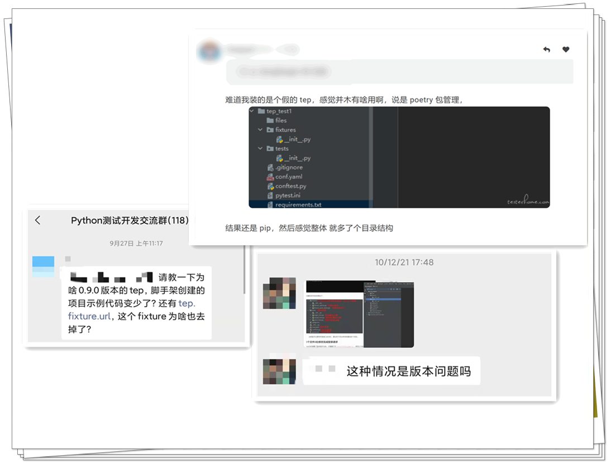
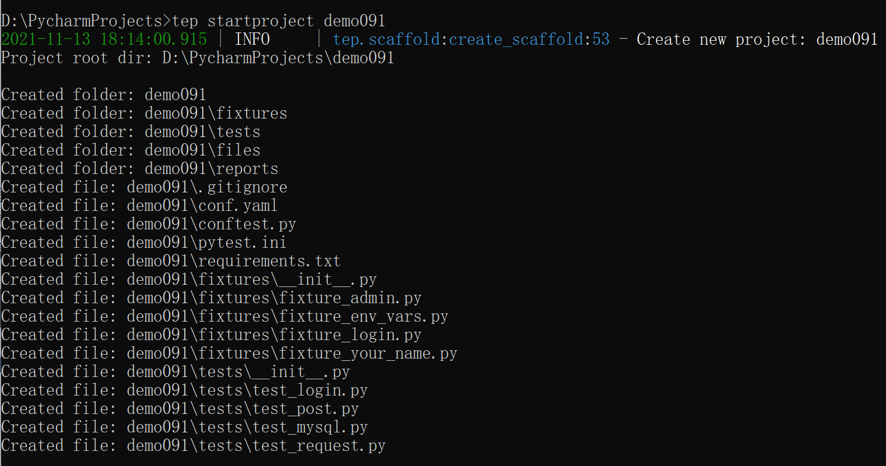
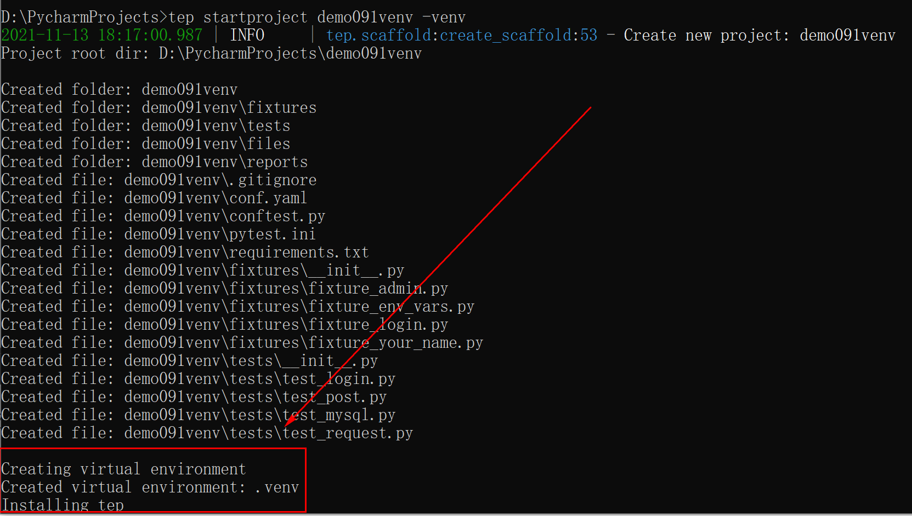
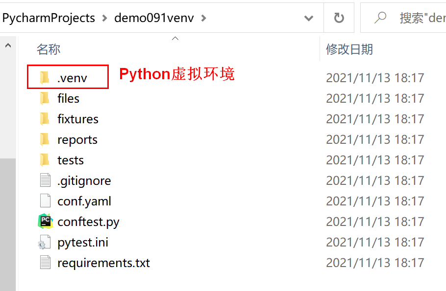

# 原创pytest辅助工具tep0.9.1版本恢复项目初始化文件


最近几个月时间有些小伙伴问到为什么tep项目初始化文件没有了？



造成这种困扰，实在是抱歉，确实在删掉项目初始化文件时欠考虑了。我当时的想法是让tep像flask那样，只保留最核心的能力，其他能力自由扩展。但是好像tep并没有flask那么强（这是一句正确的废话），大家在用tep时也是**复用了项目初始化文件，在此基础上实践自己的自动化项目**。

## 恢复项目初始化文件

于是我决定在最新的0.9.1版本中恢复这些初始化文件：



**原汁原味还原了《tep用户手册帮你从unittest过渡到pytest》这篇文章提到的内容。**相比于用户手册，最新的0.9.1版本还做了两点增强：

1. 把`fixture_env_vars.py`和`fixture_login.py`从`fixture_admin.py`中拆了出来，解耦后，文件层次更清晰。

2. 添加了`test_request.py`文件，request的常见用法可以从这里找到：

   ```python
   from tep.client import request
   
   request("get", url="", headers={}, json={})
   request("post", url="", headers={}, params={})
   request("put", url="", headers={}, json={})
   request("delete", url="", headers={})
   
   # upload excel
   file_name = ""
   file_path = ""
   request("post",
           url="",
           headers={},
           files={
               "file": (
                   file_name,
                   open(file_path, "rb"),
                   "application/vnd.openxmlformats-officedocument.spreadsheetml.sheet"
               )
           },
           verify=False
           )
   
   ```

## 初始化时创建虚拟环境

还有就是提供了`-venv`参数，在项目初始化时，可以同时创建一个虚拟环境，像这样：

```shell
tep startproject demo091venv -venv
```



**并自动安装了最新版本的tep。**



最后感谢小伙伴们对tep工具的支持，我会继续完善它的，一起加油！

