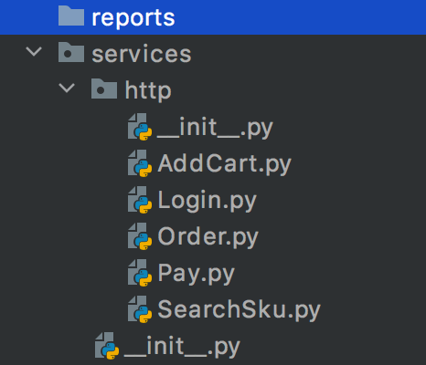

# tep支持MVC架构实现用例数据分离


大家好，我是刚哥。

tep已经支持了两种开发模式：用例数据一体和HttpRunner（第三版）。HttpRunner已经众所周知，此处不做过多介绍。**用例数据一体**指的是把用例和数据都写在一个test.py文件里面，这样的好处是简单直接明了，特别适合刚开始用pytest写自动化代码的同学，从上往下一气呵成就完成了一个自动化用例，收获成就感的同时，也能很方便的共享给其他人使用，单个文件就能跑起来。

但是当我在公司用SpringBoot开发了一个后端服务后，尝到了MVC架构所带来的高可维护性，加上在跟各位大佬聊天时，也听说很多公司对接口自动化做了分层设计，于是让tep支持用例数据分离的开发，已经变得很重要了。**用例数据分离**指的是用例只有逻辑没有数据，这样在修改数据的时候，用例基本不需要变化就能适应，用例看起来是非常简洁的，就像这样：

```python
class Test:
    case_vars = TepVars()
    case_vars.vars_ = {
        "domain": "http://127.0.0.1:5000",
        "skuNum": "3"
    }

    def test(self):
        # 登录
        Login(Test).post()
        # 搜索商品
        SearchSku(Test).get()
        # 添加购物车
        AddCart(Test).post()
        # 下单
        Order(Test).post()
        # 支付
        Pay(Test).post()
```

这就是tep支持的用例数据分离的用例的样子。

我增加了一个services文件夹，用于存放接口：



先看下登录Login.py：

```python
class Login(BaseRequest):

    def post(self):
        response = self.request(
            "post",
            url=self.case_vars.get("domain") + "/login",
            headers={"Content-Type": "application/json"},
            json={
                "username": "dongfanger",
                "password": "123456",
            }
        )
        assert response.status_code < 400
        self.case_vars.put("token", response.jmespath("token"))

```

- 必须继承BaseRequest。
- self.request和requests.request用法完全一致。
- self.case_vars用于在测试用例的测试步骤之间传递变量，有get和put两个操作。
- `response.jmespath("token")`是封装了requests.Response后添加的方法，替代`jmespath.search("token", response.json())`的写法。

BaseRequest的定义如下：

```python
import jmespath
from requests import Response
from tep.client import request


class TepResponse(Response):
    def __init__(self, response):
        super().__init__()
        for k, v in response.__dict__.items():
            self.__dict__[k] = v

    def jmespath(self, expression):
        return jmespath.search(expression, self.json())


class BaseRequest:
    def __init__(self, clazz):
        self.case_vars = clazz.case_vars

    def request(self, method, url, **kwargs):
        response = request(method, url, **kwargs)
        return TepResponse(response)
```

- TepResponse对requests.Response做了封装，添加了jmespath方法。
- BaseRequest的`__init__`在初始化时传入测试类（test.py里面测试用例的类），提取case_vars对象，这样接口类继承以后，就能用self.case_vars来get和put变量了。
- 同时调用tep.client.request，并把response以封装后的TepResponse返回。

那么问题来了，**如何在接口之间传递参数呢？**请看test_login_pay_mvc.py、Login和SearchSku这三段代码：

```python
## test_login_pay_mvc.py

class Test:
    case_vars = TepVars()
    case_vars.vars_ = {
        "domain": "http://127.0.0.1:5000",
        "skuNum": "3"
    }

    def test(self):
        # 登录
        Login(Test).post()
        # 搜索商品
        SearchSku(Test).get()
        # 添加购物车
        AddCart(Test).post()
        # 下单
        Order(Test).post()
        # 支付
        Pay(Test).post()
```

```python
## Login.py

class Login(BaseRequest):

    def post(self):
        response = self.request(
            "post",
            url=self.case_vars.get("domain") + "/login",
            headers={"Content-Type": "application/json"},
            json={
                "username": "dongfanger",
                "password": "123456",
            }
        )
        assert response.status_code < 400
        self.case_vars.put("token", response.jmespath("token"))
```

```python
## SearchSku.py

class SearchSku(BaseRequest):

    def get(self):
        response = self.request(
            "get",
            url=self.case_vars.get("domain") + "/searchSku",
            headers={"token": self.case_vars.get("token")},
            params={"skuName": "电子书"}
        )
        self.case_vars.put("skuId", response.jmespath("skuId"))
        self.case_vars.put("skuPrice", response.jmespath("price"))
        assert response.status_code < 400
```

1. test_login_pay_mvc.py文件的Test测试用例里面，定义了用例级别的变量：domain。
2. Login.py文件通过`self.case_vars.get("domain")`获取domain，然后把token通过`self.case_vars.put("token", response.jmespath("token"))`存入token。
3. SearchSku.py文件通过self.case_vars.get("token")获取token，并用`self.case_vars.put()`存入skuId和skuPrice，供下一个接口AddCart使用，以此类推。

**用例数据分离的写法遵从了MVC架构，并借鉴了HttpRunner和JMeter的部分设计**，相比于用例数据一体，可能编写体验没有那么方便，但是维护性和可复用性都很高，其中接口类的get和post可以根据数据需要定义多个如get_a和post_b等，以支持多种数据，略微有一丢丢复杂，适合有代码经验的同学。

**如何才能使用用例数据一体、用例数据分离、HttpRunner3种开发模式呢？**等tep0.9.4版本发布后进行升级，用`tep startproject demo`命令创建项目脚手架，就会包含登录到下单流程的全部3种开发模式示例代码，开箱即用，一键运行成功。

从此刻开始，tep实用性已经提升了一个档次，但是我将停下它的脚步，将注意力放到HttpRunner3的源码学习中，并产出一系列文章，站在巨人的肩膀上，才能看得更远。为什么HttpRunner如此重要？因为毕竟tep的技术就是从HttpRunner学来的。