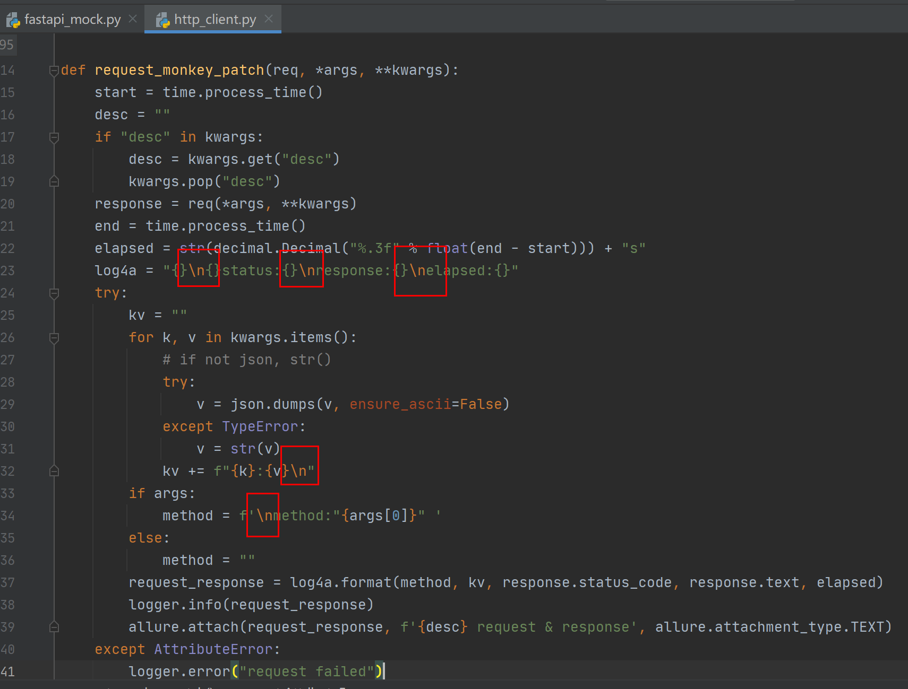
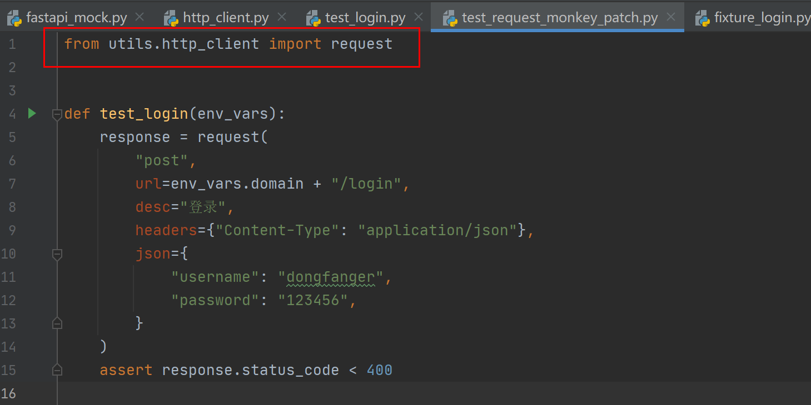
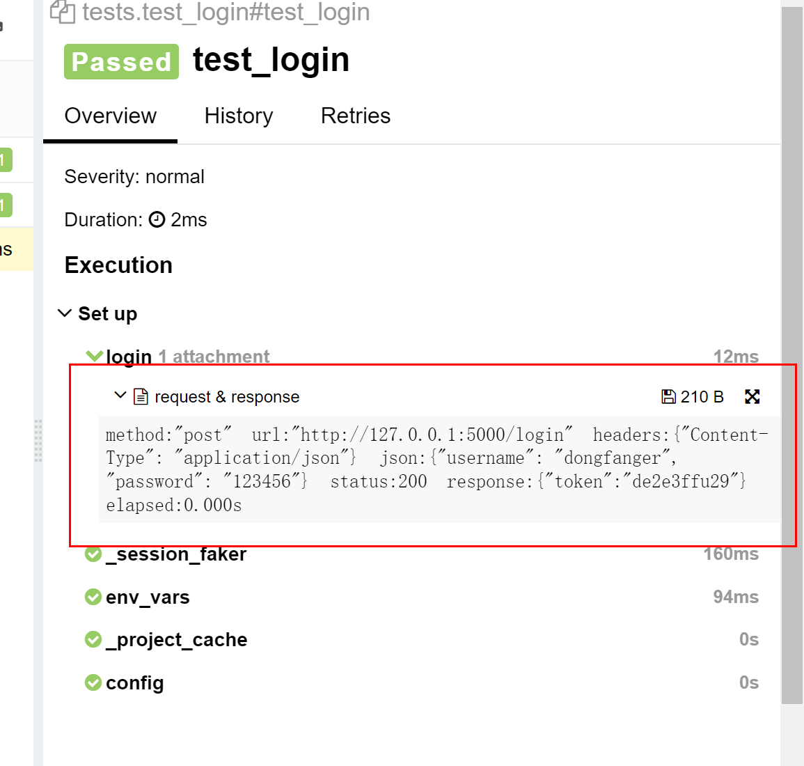
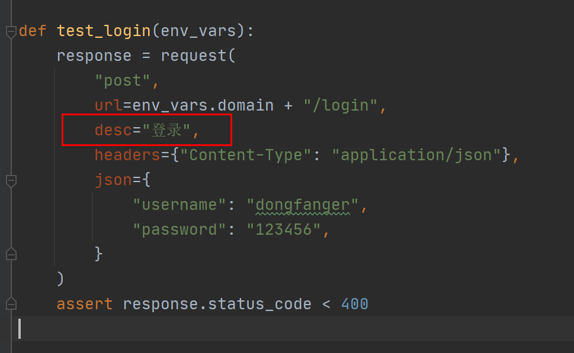
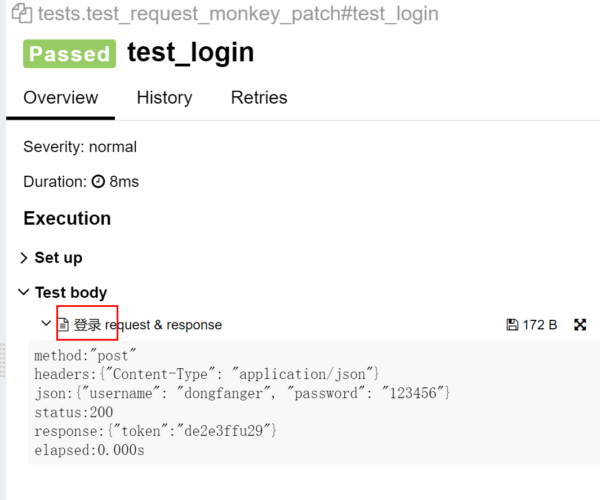
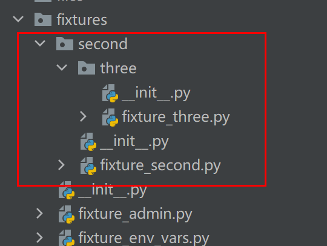

# tep0.9.5支持自定义扩展request


tep0.9.5更新了以下内容：

1. 自定义request请求日志
2. Allure报告添加request描述
3. 猴子补丁扩展request
4. fixtures支持多层级目录
5. FastAPI替代Flask

升级tep到0.9.5版本，使用`tep startproject demo`创建项目脚手架，开箱即用以上新功能。

## 1.自定义request请求日志

tep默认的request请求日志如下所示：

```
2022-01-22 20:00:26.335 | INFO     | tep.client:tep_request_monkey_patch:44 - method:"post"  url:"http://127.0.0.1:5000/login"  headers:{"Content-Type": "application/json"}  json:{"username": "dongfanger", "password": "123456"}  status:200  response:{"token":"de2e3ffu29"}  elapsed:0.000s
```

全部都在一行，假如想换行显示，那么可以在`utils/http_client.py`文件中修改request_monkey_patch代码：



在测试代码中把`from tep.client import request`改成`from utils.http_client import request`：



日志就会变成换行显示了：

```
2022-01-22 20:04:05.379 | INFO     | utils.http_client:request_monkey_patch:38 - 
method:"post" 
headers:{"Content-Type": "application/json"}
json:{"username": "dongfanger", "password": "123456"}
status:200
response:{"token":"de2e3ffu29"}
elapsed:0.000s
```

## 2.Allure报告添加request描述

tep的Allure报告默认会有个`request & response`：



可以给request添加desc参数，在Allure测试报告中添加描述：



运行以下命令，然后打开Allure测试报告：

```shell
pytest -s test_request_monkey_patch.py --tep-reports
```



## 3.猴子补丁扩展request

前面的“自定义request请求日志”和“Allure报告添加request描述”已经展示了如何通过猴子补丁扩展日志和扩展报告，您还可以为request扩展更多想要的功能，只需要实现`utils/http_client.py`里面的request_monkey_patch函数即可：

```python
#!/usr/bin/python
## encoding=utf-8

import decimal
import json
import time

import allure
from loguru import logger
from tep import client
from tep.client import TepResponse


def request_monkey_patch(req, *args, **kwargs):
    start = time.process_time()
    desc = ""
    if "desc" in kwargs:
        desc = kwargs.get("desc")
        kwargs.pop("desc")
    response = req(*args, **kwargs)
    end = time.process_time()
    elapsed = str(decimal.Decimal("%.3f" % float(end - start))) + "s"
    log4a = "{}\n{}status:{}\nresponse:{}\nelapsed:{}"
    try:
        kv = ""
        for k, v in kwargs.items():
            # if not json, str()
            try:
                v = json.dumps(v, ensure_ascii=False)
            except TypeError:
                v = str(v)
            kv += f"{k}:{v}\n"
        if args:
            method = f'\nmethod:"{args[0]}" '
        else:
            method = ""
        request_response = log4a.format(method, kv, response.status_code, response.text, elapsed)
        logger.info(request_response)
        allure.attach(request_response, f'{desc} request & response', allure.attachment_type.TEXT)
    except AttributeError:
        logger.error("request failed")
    except TypeError:
        logger.warning(log4a)
    return TepResponse(response)


def request(method, url, **kwargs):
    client.tep_request_monkey_patch = request_monkey_patch
    return client.request(method, url, **kwargs)
```

## 4.fixtures支持多层级目录

tep之前一直只能支持fixtures的根目录的`fixture_*.py`文件自动导入，现在能支持多层级目录了：



测试代码`test_multi_fixture.py`：

```python
#!/usr/bin/python
## encoding=utf-8


def test(fixture_second, fixture_three):
    pass
```

能运行成功。自动导入多层目录的代码实现如下：

```python
## 自动导入fixtures
_fixtures_dir = os.path.join(_project_dir, "fixtures")
for root, _, files in os.walk(_fixtures_dir):
    for file in files:
        if file.startswith("fixture_") and file.endswith(".py"):
            full_path = os.path.join(root, file)
            import_path = full_path.replace(_fixtures_dir, "").replace("\\", ".").replace("/", ".").replace(".py", "")
            try:
                fixture_path = "fixtures" + import_path
                exec(f"from {fixture_path} import *")
            except:
                fixture_path = ".fixtures" + import_path
                exec(f"from {fixture_path} import *")
```

## 5.FastAPI替代Flask

因为HttpRunner用的FastAPI，所以我也把Flask替换成了FastAPI，在`utils/fastapi_mock.py`文件中可以找到代码实现的简易Mock：

```python
#!/usr/bin/python
## encoding=utf-8

import uvicorn
from fastapi import FastAPI, Request

app = FastAPI()


@app.post("/login")
async def login(req: Request):
    body = await req.json()
    if body["username"] == "dongfanger" and body["password"] == "123456":
        return {"token": "de2e3ffu29"}
    return ""


@app.get("/searchSku")
def search_sku(req: Request):
    if req.headers.get("token") == "de2e3ffu29" and req.query_params.get("skuName") == "电子书":
        return {"skuId": "222", "price": "2.3"}
    return ""


@app.post("/addCart")
async def add_cart(req: Request):
    body = await req.json()
    if req.headers.get("token") == "de2e3ffu29" and body["skuId"] == "222":
        return {"skuId": "222", "price": "2.3", "skuNum": "3", "totalPrice": "6.9"}
    return ""


@app.post("/order")
async def order(req: Request):
    body = await req.json()
    if req.headers.get("token") == "de2e3ffu29" and body["skuId"] == "222":
        return {"orderId": "333"}
    return ""


@app.post("/pay")
async def pay(req: Request):
    body = await req.json()
    if req.headers.get("token") == "de2e3ffu29" and body["orderId"] == "333":
        return {"success": "true"}
    return ""


if __name__ == '__main__':
    uvicorn.run("fastapi_mock:app", host="127.0.0.1", port=5000)
```

最后，感谢@zhangwk02提交的Pull requests，虽然写的代码被我全部优化了，但是提供了很棒的想法和动力。

