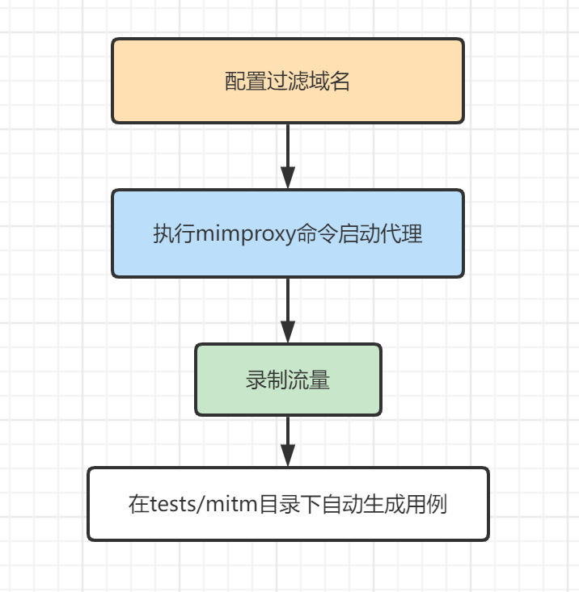
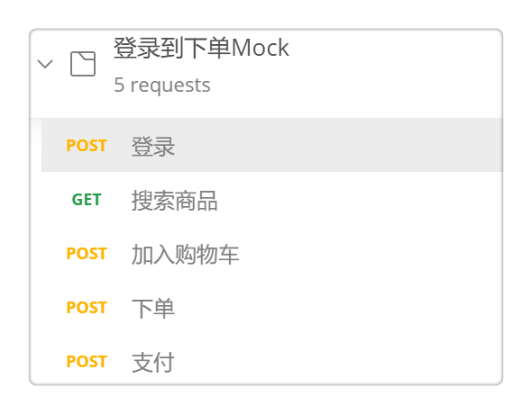
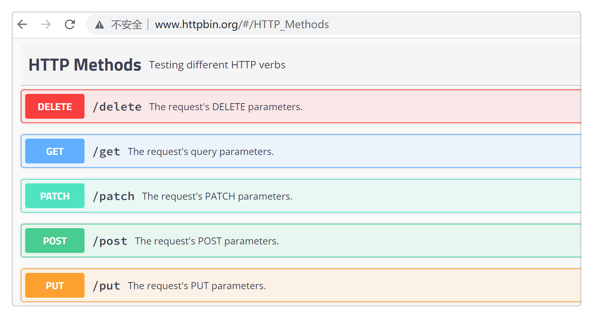

# tep集成mitmproxy录制流量自动生成用例


## 使用

操作过程非常简单，流程如下：



①**配置过滤域名**

必须配置，不然会有很多无效流量造成数据冗余。


②**启动代理**

「示例」使用了反向代理，tep自带FastApi启动Mock服务：


> 「**实际**」使用正向代理，并手动配置代理。命令说明在`utils/mitm.py`文件中有：

③**录制流量**

「示例」通过Postman发起请求：



> 「**实际**」在网页上点点点。
>
> 

**自动生成用例**

用例就在`tests/mitm`**实时生成**好了，用例文件名为当前时间：


每录制一个请求，就能在测试用例中看到实时添加了一条测试步骤：

```
    # 接口描述
    # 数据
    # 请求
    response = request(
        "{method}",
        url="{url}",
        headers={headers},
        {body_grammar}
    )
    # 数据提取
    # var = response.jmespath("expression")
    # 断言
    assert response.status_code < 400
```

录制完成以后，就可以再次编辑测试用例完善它。

## 原理

`utils/mitm.py`源码如下：

```python
#!/usr/bin/python
## encoding=utf-8

## mitmproxy录制流量自动生成用例

import os
import time

from mitmproxy import ctx

project_dir = os.path.dirname(os.path.dirname(os.path.abspath(__file__)))
tests_dir = os.path.join(project_dir, "tests")
## tests/mitm
mitm_dir = os.path.join(tests_dir, "mitm")
if not os.path.exists(mitm_dir):
    os.mkdir(mitm_dir)
## 当前时间作为文件名
filename = time.strftime("%Y%m%d_%H_%M_%S", time.localtime()) + ".py"
case_file = os.path.join(mitm_dir, filename)
## 生成用例文件
template = """from tep.client import request


def test():
"""
if not os.path.exists(case_file):
    with open(case_file, "w", encoding="utf8") as fw:
        fw.write(template)


class Record:
    def __init__(self, domains):
        self.domains = domains

    def response(self, flow):
        if self.match(flow.request.url):
            # method
            method = flow.request.method.lower()
            ctx.log.error(method)
            # url
            url = flow.request.url
            ctx.log.error(url)
            # headers
            headers = dict(flow.request.headers)
            ctx.log.error(headers)
            # body
            body = flow.request.text or {}
            ctx.log.error(body)
            with open(case_file, "a", encoding="utf8") as fa:
                fa.write(self.step(method, url, headers, body))

    def match(self, url):
        if not self.domains:
            ctx.log.error("必须配置过滤域名")
            exit(-1)
        for domain in self.domains:
            if domain in url:
                return True
        return False

    def step(self, method, url, headers, body):
        if method == "get":
            body_grammar = f"params={body}"
        else:
            body_grammar = f"json={body}"
        return f"""
    # 接口描述
    # 数据
    # 请求
    response = request(
        "{method}",
        url="{url}",
        headers={headers},
        {body_grammar}
    )
    # 数据提取
    # var = response.jmespath("expression")
    # 断言
    assert response.status_code < 400
"""


## ==================================配置开始==================================
addons = [
    Record(
        # 过滤域名
        [
            "http://www.httpbin.org",
            "http://127.0.0.1:5000"
        ],
    )
]
## ==================================配置结束==================================

"""
==================================命令说明开始==================================
## 正向代理
mitmdump -s mitm.py
## 反向代理
mitmdump -s mitm.py --mode reverse:http://127.0.0.1:5000 --listen-host 127.0.0.1 --listen-port 8000
==================================命令说明结束==================================
"""
```

通过mitmproxy命令启动代理后，获取当前时间作为文件名在`tests/mitm`下生成用例文件，给addons添加插件Record类，通过response钩子捕获请求信息，对请求进行域名过滤，域名匹配成功的请求就使用测试步骤代码模板，填充method、url、headers、body数据，追加到测试用例文件中。

**自动生成的用例只支持tep风格。**我也考虑过同时兼容tep、mvc、httprunner，但是实际编写过代码后，我仍然坚持认为tep风格是我最喜欢的编写方式，尽量贴近原生，可以减少出错风险，同时获得更多代码自由。

想体验的大佬可以升级或安装tep的0.9.7版本，使用`tep startproject demo`创建项目即可。

> 参考资料：
>
> 基于mitmproxy实现接口录制 https://testerhome.com/topics/29457
>
> mitmproxy生成httprunner脚本 https://testerhome.com/topics/30204