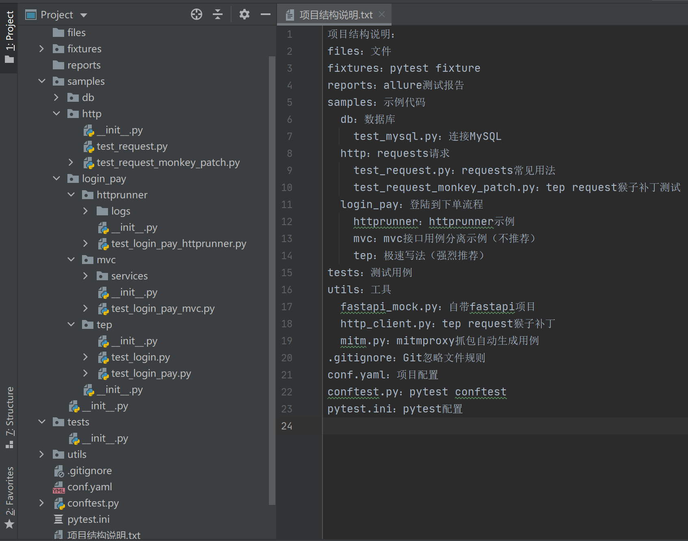
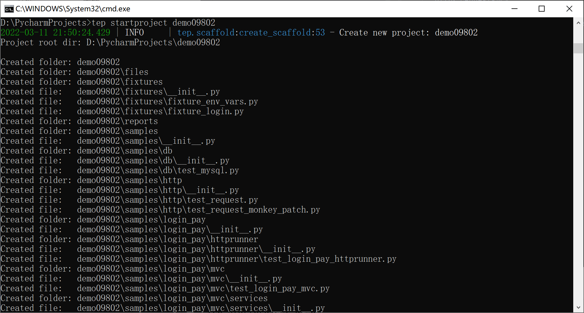

# 民间流转的pytest项目结构设计




创建上图的pytest项目结构，**只需要一条命令即可**：

```shell
tep startproject demo
```



**前提是安装tep0.9.8版本：**

```shell
pip install tep==0.9.8
```

示例代码单独放在了samples文件夹下，可以放心将整个目录删除。其中的db演示了连接MySQL数据库，http演示了requests常见用法和tep request的猴子补丁，login_pay演示了**从登陆到下单该如何编写脚本**，包括httprunner、mvc（不推荐）、tep（强烈推荐）三种写法。

fixtures从conftest.py文件中单独拎了出来。这个设计与Django不谋而合，Django也有个叫做fixtures的文件夹，用来存放测试数据。其实pytest的fixture的本意是可以用来做setup和teardown的，从这个意义来说，fixtures就是存放测试数据的，比如封装登录接口为用例提供token。

utils存放了一些工具。比如自带的fastapi项目，request猴子补丁，mitmproxy抓包自动生成用例。request猴子补丁可以自定义日志输出格式，在发送请求前后完成任何你想做的操作。

tep0.9.8版本正式发布，对项目脚手架进行了精简，是为接下来的**《tep完整教程帮你突破pytest》**做好准备。

