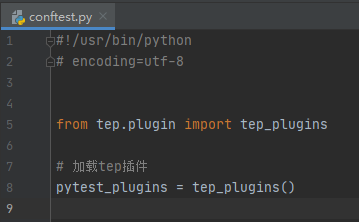
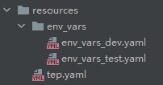
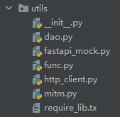
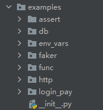
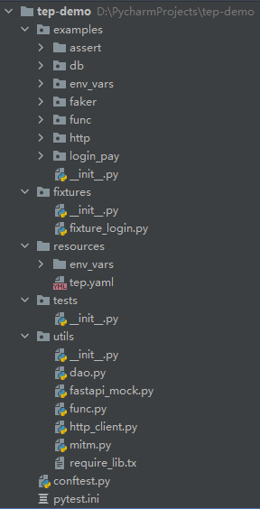
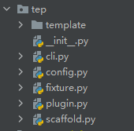
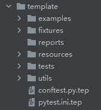

# tep时隔8个月迎来重大全新升级


**tep此次更新，旨在从“工具”升级为“框架”，为此做了大量的代码整洁工作，重新设计了部分功能，项目脚手架也焕然一新。**

## 功能展示

### conftest.py

脚手架生成的conftest.py只有一行代码：



fixture自动加载等操作都隐藏到了tep的科技与狠活里面。

### 环境变量模板

使用yaml维护环境变量：



你可以env_vars目录下维护`env_vars_`开头的任意命名的yaml模板，内容自定义：

```yaml
domain: "http://127.0.0.1:5000"
env: "dev"
db:
  mysql:
    host: "localhost"
    port: "3306"
    user: "root"
    password: "123456"
    db: "sys"
```

取值时只需要引入env_vars fixture，像字典一样取值：

```python
from loguru import logger


def test(env_vars):
    logger.info(env_vars["domain"])
    logger.info(env_vars["env"])
    logger.info(env_vars["db"]["mysql"]["host"])
```

激活哪个模板，就在tep.yaml中配置：

```yaml
env:
  active: "dev"
```

### 工具包与示例代码

工具包有MySql访问、FastAPI Mock、常用函数、HTTP请求、流量录制：



示例代码有断言、数据库访问、环境变量、faker造数据、常用函数、HTTP请求、从登陆到下单自动化用例：



### 项目脚手架

`tep startproject demo`生成的项目脚手架如图所示：



没有杂质，纯粹的pytest！

## tep技术内幕

### 化繁为简

tep只保留了“框架”层面的模块：



三方库都抽出来到了脚手架的utils包里，譬如HTTP请求在utils/http_client里面。

### 项目路径识别

在conftest加载插件时，使用`inspect.stack()[1]`反推项目路径：

```python
def tep_plugins():
    caller = inspect.stack()[1]
    Config.project_root_dir = os.path.dirname(caller.filename)
    plugins = fixture_paths()  # +[其他插件]
    return plugins
```

### fixture自动导入

conftest.py加载时，将fixture路径作为插件加载，一个是项目目录下的fixtures包，一个是tep里面的fixture模块：

```python
def fixture_paths():
    """
    fixture路径，1、项目下的fixtures；2、tep下的fixture；
    :return:
    """
    _fixtures_dir = os.path.join(Config.project_root_dir, "fixtures")
    paths = []
    # 项目下的fixtures
    for root, _, files in os.walk(_fixtures_dir):
        for file in files:
            if file.startswith("fixture_") and file.endswith(".py"):
                full_path = os.path.join(root, file)
                import_path = full_path.replace(_fixtures_dir, "").replace("\\", ".")
                import_path = import_path.replace("/", ".").replace(".py", "")
                paths.append("fixtures" + import_path)
    # tep下的fixture
    paths.append("tep.fixture")
    return paths
```

### 环境变量

内置env_vars fixture：

```python
#!/usr/bin/python
## encoding=utf-8

"""
@Author  :  dongfanger
@Date    :  2020/12/30 9:30
@Desc    :  预置fixture
"""
import os

import pytest
import yaml
from loguru import logger

from tep.config import tep_config, Config


class TepVars:
    """全局变量池"""

    def __init__(self):
        self.vars_ = {}

    def put(self, key, value):
        self.vars_[key] = value

    def get(self, key):
        value = ""
        try:
            value = self.vars_[key]
        except KeyError:
            logger.error(f"env_vars doesnt have this key: {key}")
        return value


@pytest.fixture(scope="session")
def env_vars():
    """环境变量，读取resources/env_vars下的变量模板"""
    class Clazz(TepVars):
        def dict_(self):
            env_active = tep_config()['env']["active"]
            env_filename = f"env_vars_{env_active}.yaml"
            with open(
                    os.path.join(Config.project_root_dir, "resources", "env_vars", env_filename)) as f:
                return yaml.load(f.read(), Loader=yaml.FullLoader)

    return Clazz().dict_()
```

TepVars是全局变量池，支持动态put和get。

env_vars根据tep.yaml配置的active，获取对应的环境变量模板，解析yaml，返回字典。

### 项目脚手架

脚手架代码完整的放在template下面：



文件后缀均加上了`.tep`，这样就不会扰乱实际项目代码，在`tep startproject`时会将这些文件拷贝到目标项目，同时去除`.tep`后缀，快速生成自动化项目。

这些模板的源码可以查阅另外一个项目：

https://github.com/dongfanger/tep-template.git

最新的tep预览功能也能在这个项目看到。

## Try Easy Pytest

tep是Try Easy Pytest的首字母缩写，是依托于pytest的一款测试工具。本次工具架构改造是一个开端，tep还会持续迭代开发，逐步引入企业级的一系列技术实践，敬请期待，也欢迎加入我们，一起开发，共创美好未来！

tep源码：https://github.com/dongfanger/tep