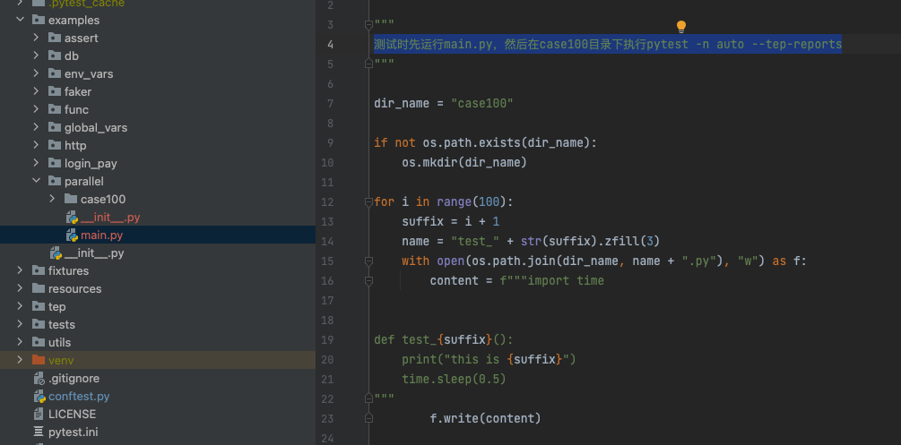
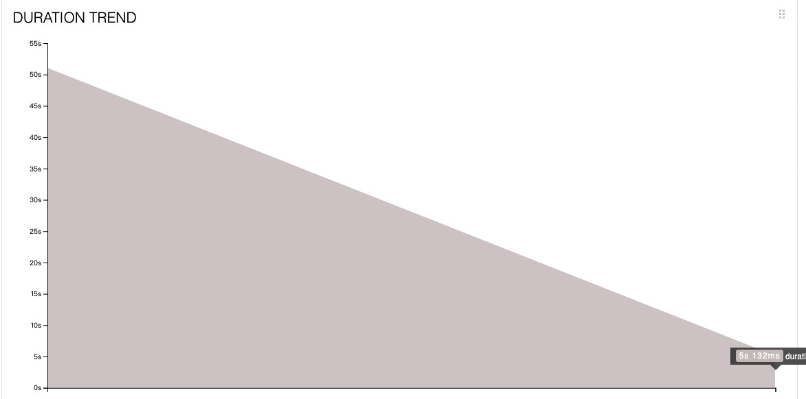
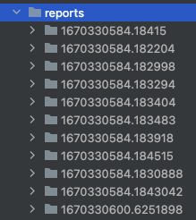
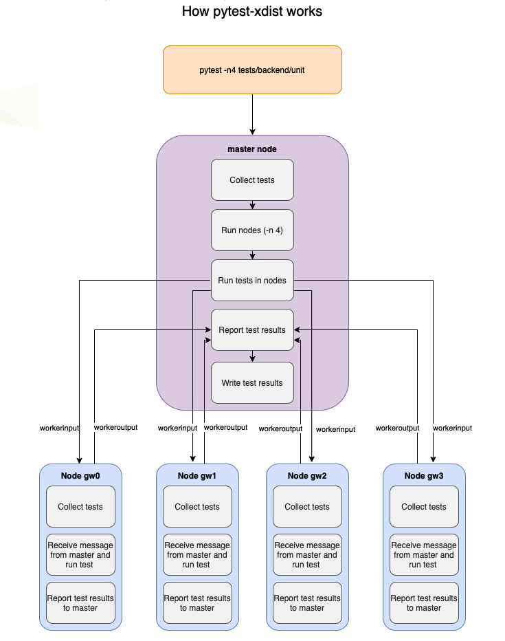
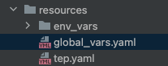

tep支持pytestxdist分布式执行用例及合并Allure报告
================================================

|image1|

   tep近期更新频率较快，一方面是作者在积极投入到tep工具开发中；另一方面是我们聚集了20位小伙伴，一起合力打造\ **EasyPytest测试平台**\ ，teprunner的FastAPI升级版本，依托于tep，\ **帮你高效管理pytest测试用例**\ 。陆续也会有平台开发日志发布，欢迎持续关注。

tep0.11.1版本升级内容：

1、pytest-xdist分布式执行用例，合并Allure报告；

2、global_vars全局变量配置；

分布式执行用例
--------------

借助于pytest-xdist，在命令行执行时添加参数\ ``-n auto``\ ：

.. code:: python

   pytest -n auto

pytest-xdist会自动根据本地机器硬件配置，设置最优并发，并分发用例，分布式执行。

测试时先运行main.py，然后在case100目录下执行\ ``pytest -n auto --tep-reports``\ ：

|image2|

第一次串行，第二次xdist并行：

|image3|

执行时间从50s一下降到5s，性能提升还是非常的明显。

合并Allure报告
--------------

pytest-xdist分布式执行，只要把allure源文件，也就是那一堆json文件，存到同一个目录下，报告的数据就是一体的，不需要单独合并。但是有个问题，tep封装了\ ``--tep-reports``
命令行参数一键生成Allure报告，背后的逻辑是在pytest_sessionfinish
hook函数里面实现的，分布式执行时，每个xdist的node都是一个单独的session，多个node就会生成多份报告：

|image4|\ c

10个node生成了11份报告，其中1份master节点生成的。pytest-xdist的原理如图所示：

|image5|

master节点不运行任何测试，只是通过一小部分消息与节点通信。子节点执行后会通过workeroutput把数据回传给master节点。所以只需要通过是否有workeroutput属性来判断master节点：

.. code:: python

   def _is_master(config):
       """
       pytest-xdist分布式执行时，判断是主节点master还是子节点
       主节点没有workerinput属性
       """
       return not hasattr(config, 'workerinput')

然后只在主节点的pytest_sessionfinish，生成1次报告，就能避免生成多份报告。这样在xdist分布式执行模式下，\ ``--tep-reports``\ 也只会生成1份合并后的包含所有测试用例的Allure
HTML报告。

完整实现代码：

.. code:: python

   import time
   import shutil

   import allure_commons
   from allure_commons.logger import AllureFileLogger
   from allure_pytest.listener import AllureListener
   from allure_pytest.plugin import cleanup_factory

   reports_path = os.path.join(Project.root_dir, "reports")
   allure_source_dir_name = ".allure.source.temp"
   allure_source_path = os.path.join(reports_path, allure_source_dir_name)

   def _tep_reports(config):
       """
       --tep-reports命令行参数不能和allure命令行参数同时使用，否则可能出错
       """
       if config.getoption("--tep-reports") and not config.getoption("allure_report_dir"):
           return True
       return False

   def _is_master(config):
       """
       pytest-xdist分布式执行时，判断是主节点master还是子节点
       主节点没有workerinput属性
       """
       return not hasattr(config, 'workerinput')

   def pytest_addoption(parser):
       """
       allure测试报告 命令行参数
       """
       parser.addoption(
           "--tep-reports",
           action="store_const",
           const=True,
           help="Create tep allure HTML reports."
       )

   def pytest_configure(config):
       """
       这段代码源自：https://github.com/allure-framework/allure-python/blob/master/allure-pytest/src/plugin.py
       目的是生成allure源文件，用于生成HTML报告
       """
       if _tep_reports(config):
           if os.path.exists(allure_source_path):
               shutil.rmtree(allure_source_path)
           test_listener = AllureListener(config)
           config.pluginmanager.register(test_listener)
           allure_commons.plugin_manager.register(test_listener)
           config.add_cleanup(cleanup_factory(test_listener))

           clean = config.option.clean_alluredir
           file_logger = AllureFileLogger(allure_source_path, clean)  # allure_source
           allure_commons.plugin_manager.register(file_logger)
           config.add_cleanup(cleanup_factory(file_logger))

   def pytest_sessionfinish(session):
       """
       测试运行结束后生成allure报告
       """
       if _tep_reports(session.config):
           if _is_master(session.config):  # 只在master节点才生成报告
               # 最近一份报告的历史数据，填充allure趋势图
               if os.path.exists(reports_path):
                   his_reports = os.listdir(reports_path)
                   if allure_source_dir_name in his_reports:
                       his_reports.remove(allure_source_dir_name)
                   if his_reports:
                       latest_report_history = os.path.join(reports_path, his_reports[-1], "history")
                       shutil.copytree(latest_report_history, os.path.join(allure_source_path, "history"))

               current_time = time.strftime("%Y-%m-%d-%H-%M-%S", time.localtime(time.time()))
               html_report_name = os.path.join(reports_path, "report-" + current_time)
               os.system(f"allure generate {allure_source_path} -o {html_report_name}  --clean")
               shutil.rmtree(allure_source_path)

global_vars全局变量
-------------------

在使用环境变量模版时，有些变量需要在多个模版重复设置，tep新增了global_vars全局变量fixture，可以将重复设置的变量，定义在\ ``resources/global_vars.yaml``\ ：

|image6|

然后引用global_vars fixture取值即可：

.. code:: python

   def test(global_vars):
       print(global_vars["desc"])

实现代码：

.. code:: python

   @pytest.fixture(scope="session")
   def global_vars():
       """全局变量，读取resources/global_vars.yaml，返回字典"""

       class Clazz(TepVars):
           def dict_(self):
               with open(os.path.join(Config.project_root_dir, "resources", "global_vars.yaml")) as f:
                   return yaml.load(f.read(), Loader=yaml.FullLoader)

       return Clazz().dict_()

..

   参考资料：

   https://github.com/pytest-dev/pytest-xdist

   官方文档 https://pytest-xdist.readthedocs.io/en/latest/

   如何从pytest-xdist节点获取数据
   https://www.cnblogs.com/se7enjean/p/15924317.html

   博客介绍 https://blog.csdn.net/wangmcn/article/details/121080902

.. |image1| image:: ../wanggang.png

