# 当Pytest遇上MVC分层设计自动化用例就该这么写


## 引子

数据写在代码里，追求快速编写用例，是我设计tep的一个特点，这在个人编写时是一种非常良好的体验。但相比于HttpRunner、JMeter等来说，总觉得还差点意思。思考良久，总结为三个字：**工程化**。工程化是我近一年在学习Java并参与了2个测试平台模块开发，和写了几个小工具后，感受到的一种编程思想。而其中最明显的就是Spring的MVC分层设计。为了让tep更工程化，后续版本将以MVC模块编写用例为准，同时会兼容之前的脚本式快速编写。

## 示例

### 目录结构

测试用例都放在一个文件夹下：

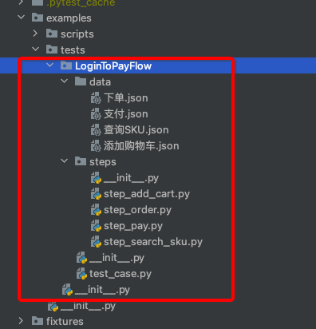

test_case：用例主程序；

steps：测试步骤；

data：纯粹的json；

### 测试用例

`test_case.py`是测试用例，包含的只有测试步骤：

```python
import allure

from examples.tests.LoginToPayFlow.steps.step_add_cart import step_add_cart
from examples.tests.LoginToPayFlow.steps.step_order import step_order
from examples.tests.LoginToPayFlow.steps.step_pay import step_pay
from examples.tests.LoginToPayFlow.steps.step_search_sku import step_search_sku
from utils.cache import TepCache
from utils.step import Step

"""
测试登录到下单流程，需要先运行utils/fastapi_mock.py
"""


@allure.title("从登录到下单支付")
def test(login, env_vars, case_vars):
    case_vars.put("token", login["token"])
    cache = TepCache(env_vars=env_vars, case_vars=case_vars)

    Step("搜索商品", step_search_sku, cache)
    Step("添加购物车", step_add_cart, cache)
    Step("下单", step_order, cache)
    Step("支付", step_pay, cache)
```

TepCache是“缓存”，包括global_vars、env_vars、case_vars三个级别的变量池。

Step是一个泛化调用类，作用是打日志，调用第二个参数对应的步骤函数。

### 测试步骤

```python
from utils.cache import TepCache
from utils.func import data
from utils.http_client import request


def step_search_sku(cache: TepCache):
    url = cache.env_vars["domain"] + "/searchSku"
    headers = {"token": cache.case_vars.get("token")}
    body = data("查询SKU.json")

    response = request("get", url=url, headers=headers, params=body)
    assert response.status_code < 400

    cache.case_vars.put("skuId", response.jsonpath("$.skuId"))
    cache.case_vars.put("skuPrice", response.jsonpath("$.price"))
```

```py
from utils.cache import TepCache
from utils.func import data
from utils.http_client import request


def step_add_cart(cache: TepCache):
    url = cache.env_vars["domain"] + "/addCart"
    headers = {"token": cache.case_vars.get("token")}
    body = data("添加购物车.json")
    body["skuId"] = cache.case_vars.get("skuId")

    response = request("post", url=url, headers=headers, json=body)
    assert response.status_code < 400

    cache.case_vars.put("skuNum", response.jsonpath("$.skuNum"))
    cache.case_vars.put("totalPrice", response.jsonpath("$.totalPrice"))
```

步骤函数以step开头，尤其注意的是cache借助Python Typing提示，可以在编写下面代码时，获得PyCharm语法提示，所以一定不要忘了加上`: TepCache`：

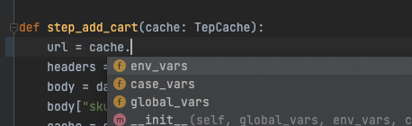

步骤函数里面由**基本信息（url、headers、body），数据初始化，请求，断言，数据提取**几个部分组织，**从上往下顺序编写**。

### 测试数据

**数据代码分离**，在MVC分层设计中这点就特别重要，在data目录下存放的不做任何参数化的纯粹json：

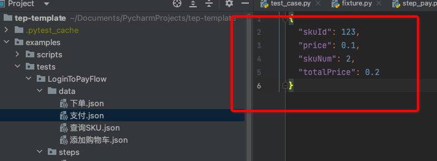

参数化都放在步骤函数里面来写。数据代码分离的好处是，比如现在写的用例是买3件商品，假如你想改成买10件，只改json的数据就可以了，不需要改动任何代码。你可能会想，把这个数字放在代码里，不也是只改个值吗？确实如此，但这不符合MVC分层设计了。

以SpringMVC作为参照：

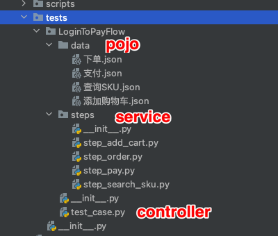

testcase.py相当于controller，steps相当于service，data相当于pojo，各层只做自己的事，多写点代码，换来的是可读性强、维护性高、层次分明的“工程化资产”。

### 日志输出

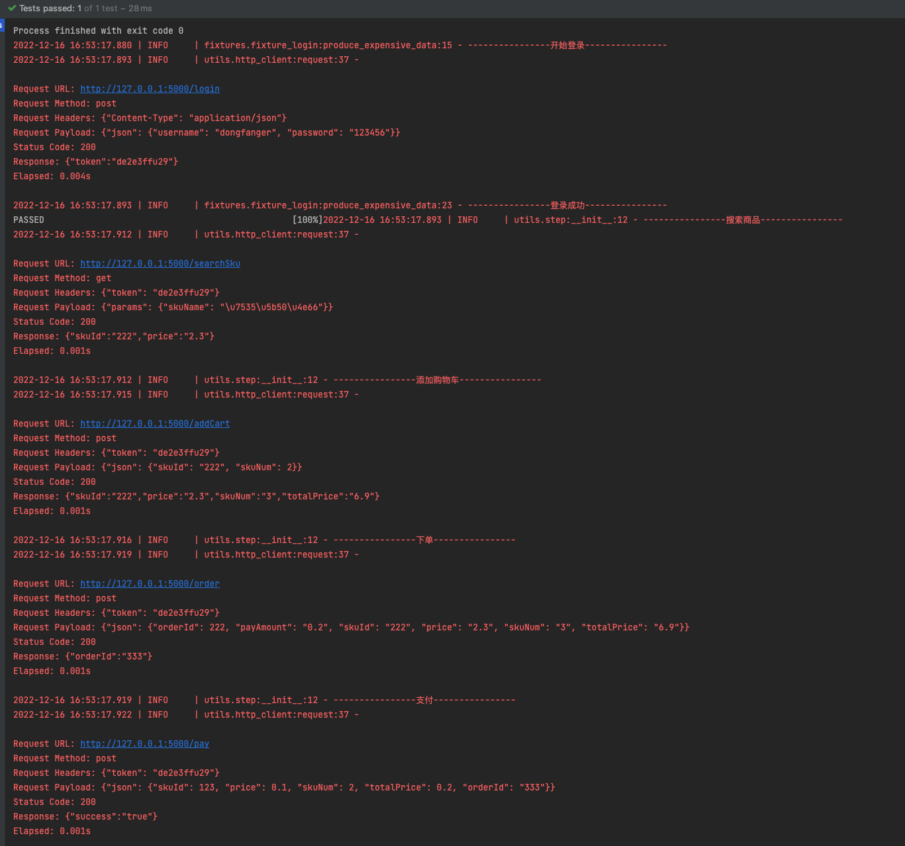

## 原理

Step泛化调用：

```python
from loguru import logger

from utils.cache import TepCache


class Step:
    """
    测试步骤，泛化调用
    """

    def __init__(self, name: str, action, cache: TepCache):
        logger.info("----------------" + name + "----------------")
        action(cache)
```

TepCache缓存：

```python
class TepCache:
    """
    提供缓存服务，包括全局变量、环境变量、用例变量
    """
    def __init__(self, global_vars=None, env_vars=None, case_vars=None):
        self.global_vars = global_vars
        self.env_vars = env_vars
        self.case_vars = case_vars

```

fixture实现的变量池：

```python
@pytest.fixture(scope="session")
def global_vars():
    """
    全局变量，读取resources/global_vars.yaml，返回字典
    """
    with open(os.path.join(Config.project_root_dir, "resources", "global_vars.yaml")) as f:
        return yaml.load(f.read(), Loader=yaml.FullLoader)


@pytest.fixture(scope="session")
def env_vars():
    """
    环境变量，读取resources/env_vars下的变量模板，返回字典
    """
    env_active = tep_config()['env']["active"]
    env_filename = f"env_vars_{env_active}.yaml"
    with open(os.path.join(Config.project_root_dir, "resources", "env_vars", env_filename)) as f:
        return yaml.load(f.read(), Loader=yaml.FullLoader)


@pytest.fixture(scope="session")
def case_vars():
    """
    测试用例的动态变量，1条测试用例1个实例，彼此隔离
    """

    class CaseVars:
        def __init__(self):
            self.dict_in_memory = {}

        def put(self, key, value):
            self.dict_in_memory[key] = value

        def get(self, key):
            value = ""
            try:
                value = self.dict_in_memory[key]
            except KeyError:
                logger.error(f"获取用例变量的key不存在，返回空串: {key}")
            return value

    return CaseVars()
```

登录fixture：

```python
import pytest
from loguru import logger

from utils.http_client import request


@pytest.fixture(scope="session")
def login(tep_context_manager, env_vars):
    """
    tep_context_manager是为了兼容pytest-xdist分布式执行的上下文管理器
    该login只会在整个运行期间执行一次
    """

    def produce_expensive_data(variable):
        logger.info("----------------开始登录----------------")
        response = request(
            "post",
            url=variable["domain"] + "/login",
            headers={"Content-Type": "application/json"},
            json={"username": "dongfanger", "password": "123456"}
        )
        assert response.status_code < 400
        logger.info("----------------登录成功----------------")
        return response.json()

    return tep_context_manager(produce_expensive_data, env_vars)
```

TepResponse支持response.jsonpath写法：

```python
def request(method, url, **kwargs):
    template = """\n
Request URL: {}
Request Method: {}
Request Headers: {}
Request Payload: {}
Status Code: {}
Response: {}
Elapsed: {}
"""
    start = time.process_time()
    response = requests.request(method, url, **kwargs)  # requests.request原生用法
    end = time.process_time()
    elapsed = str(decimal.Decimal("%.3f" % float(end - start))) + "s"
    headers = kwargs.get("headers", {})
    kwargs.pop("headers")
    payload = kwargs
    log = template.format(url, method, json.dumps(headers), json.dumps(payload), response.status_code, response.text,
                          elapsed)
    logger.info(log)
    allure.attach(log, f'request & response', allure.attachment_type.TEXT)
    return TepResponse(response)


class TepResponse(Response):
    """
    二次封装requests.Response，添加额外方法
    """

    def __init__(self, response):
        super().__init__()
        for k, v in response.__dict__.items():
            self.__dict__[k] = v

    def jsonpath(self, expr):
        """
        此处强制取第一个值，便于简单取值
        如果复杂取值，建议直接jsonpath原生用法
        """
        return jsonpath.jsonpath(self.json(), expr)[0]

```

读取数据文件：

```python
def data(relative_path: str) -> dict:
    """
    与steps同层级的data目录+传入的相对路径
    """
    caller = inspect.stack()[1]
    steps_path = os.path.dirname(caller.filename)
    data_path = os.path.join(os.path.dirname(steps_path), "data", relative_path)
    if os.path.exists(data_path):
        with open(data_path, encoding="utf8") as f:
            return json.load(f)
    logger.error("数据文件不存在")
    return {}
```

### 体验

本次设计的编写方法，跟我公司的测试平台的体验很类似，因为习惯了平台操作，用这种方式写代码竟然出奇的习惯，基本上没有卡点或特别绕的感觉，在PyCharm中也能体验到测试平台的顺畅感。大家也可以试一下。

第一步，添加用例：

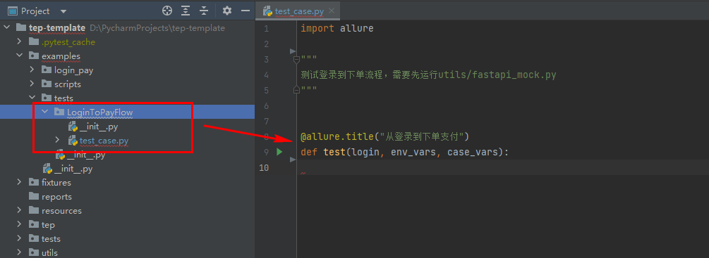

第二步，添加步骤：

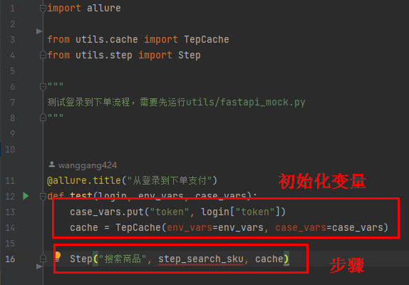

Step这一行，从左到右顺序录入，步骤名称，步骤函数，cache，特别顺手。

第三步，添加步骤函数，直接复制这里的函数名，到steps包下面新建文件：

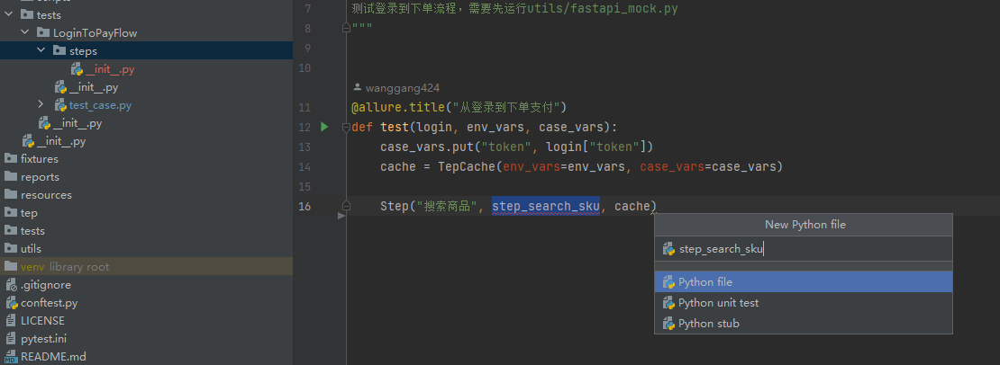

然后输入函数定义：

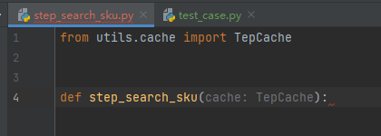

这里一定要记得输入TepCache的Typing提示，以获得PyCharm语法提示：

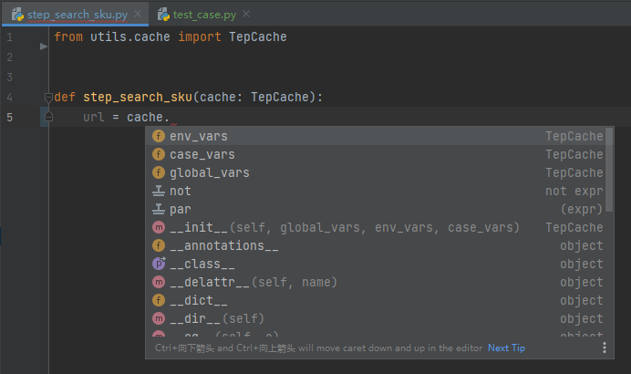

接着顺序输入url、headers、body：

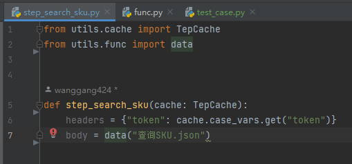

第四步，在data目录下新建数据文件：

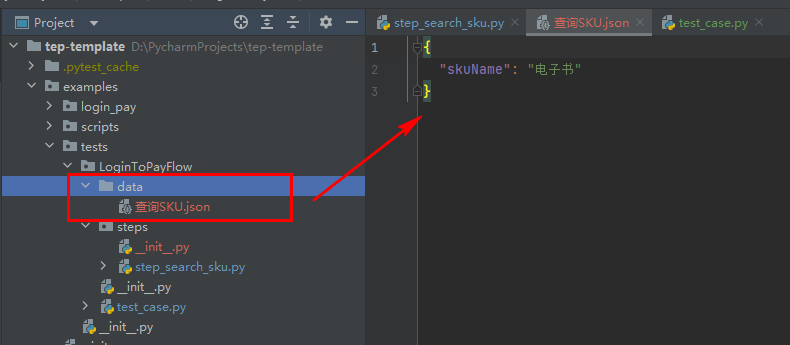

第五步，回到步骤函数，做参数化、请求、断言、数据提取等：

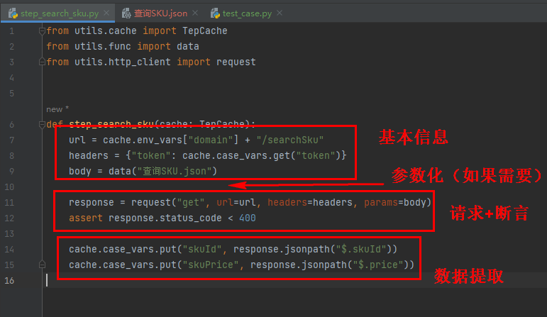

第六步，再回到测试用例，导入步骤函数：

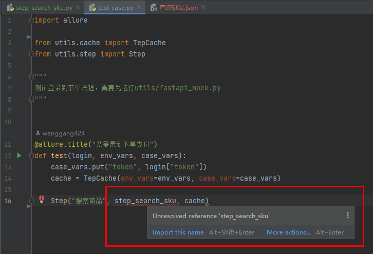

其他步骤以此类推。tep后续将以MVC分层设计编写方式为主，老用例仍然会兼容，可以不修改，新用例可以在tep正式发布后，尝试下。

tep-template加了几个新库可能需要安装下：

```
pip install jsonpath
pip install filelock
pip install pytest-xdist
```

目前代码已经上传到预览版，欢迎加我或进群交流。

> 参考资料：
> 
> tep预览版 https://gitee.com/dongfanger/tep-template
