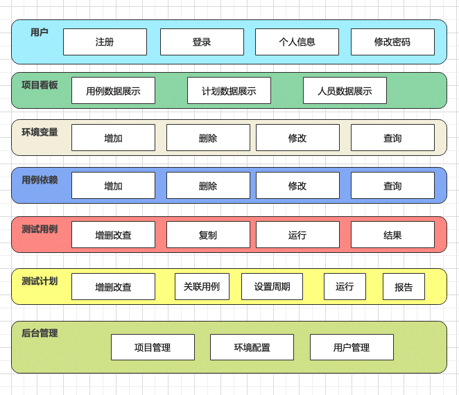

# EasyPytest测试平台开发日志之系统设计


**EasyPytest测试平台，帮你高效管理Pytest测试用例。**

EP平台的定位是Pytest测试用例管理平台，80%的自动化用例开发在PyCharm等专业的IDE中进行，20%的用例调度和结果查看就交给EP平台来管理。

EP平台是对teprunner测试平台的一次全新升级，迭代一的开发目标是将后端Django切换为FastAPI，代码以更合理更精简更规范的方式重构，并做部分功能优化。

相对于teprunner平台，重新设计的EasyPytest平台有2个较大变化：

1、用例支持串行和并行（pytest-xdist）；

2、测试计划的结果直接链接到Allure HTML报告（FastAPI mount）；

## 业务架构图



## 系统架构图


## 数据库设计

```sql
SET NAMES utf8mb4;
SET FOREIGN_KEY_CHECKS = 0;

DROP TABLE IF EXISTS `user`;
CREATE TABLE `user` (
  `id` bigint(20) NOT NULL AUTO_INCREMENT COMMENT '自增id',
  `username` varchar(32) NOT NULL COMMENT '用户名',
  `nickname` varchar(32) NOT NULL COMMENT '昵称',
  `password` varchar(128) NOT NULL COMMENT '密码',
  `is_superuser` tinyint(2) DEFAULT '0' COMMENT '是否管理员：0-否，1-是',
  `is_deleted` tinyint(2) DEFAULT '0' COMMENT '是否逻辑删除：0-否，1-是',
  `created_at` timestamp NULL DEFAULT NULL COMMENT '创建时间',
  `updated_at` timestamp NULL DEFAULT NULL COMMENT '最近修改时间',
  PRIMARY KEY (`id`)
) ENGINE=InnoDB AUTO_INCREMENT=100000 DEFAULT CHARSET=utf8 COMMENT='用户表';

DROP TABLE IF EXISTS `project`;
CREATE TABLE `project` (
  `id` bigint(20) NOT NULL AUTO_INCREMENT COMMENT '自增id',
  `name` varchar(64) NOT NULL COMMENT '项目名称',
  `is_deleted` tinyint(2) DEFAULT '0' COMMENT '是否逻辑删除：0-否，1-是',
  `created_at` timestamp NULL DEFAULT NULL COMMENT '创建时间',
  `updated_at` timestamp NULL DEFAULT NULL COMMENT '最近修改时间',
  PRIMARY KEY (`id`)
) ENGINE=InnoDB AUTO_INCREMENT=100000 DEFAULT CHARSET=utf8 COMMENT='项目表';

DROP TABLE IF EXISTS `environment`;
CREATE TABLE `environment` (
  `id` bigint(20) NOT NULL AUTO_INCREMENT COMMENT '自增id',
  `name` varchar(32) NOT NULL COMMENT '环境名称',
  `project_id` bigint(20) NOT NULL COMMENT '项目id',
  `is_deleted` tinyint(2) DEFAULT '0' COMMENT '是否逻辑删除：0-否，1-是',
  `created_at` timestamp NULL DEFAULT NULL COMMENT '创建时间',
  `updated_at` timestamp NULL DEFAULT NULL COMMENT '最近修改时间',
  PRIMARY KEY (`id`)
) ENGINE=InnoDB AUTO_INCREMENT=100000 DEFAULT CHARSET=utf8 COMMENT='环境表';

DROP TABLE IF EXISTS `variable`;
CREATE TABLE `variable` (
  `id` bigint(20) NOT NULL AUTO_INCREMENT COMMENT '自增id',
  `name` varchar(64) NOT NULL COMMENT '变量名',
  `value` varchar(512) NOT NULL COMMENT '变量值',
  `desc` varchar(256) NOT NULL COMMENT '变量描述',
  `project_id` bigint(20) NOT NULL COMMENT '项目id',
  `env_id` bigint(20) NOT NULL COMMENT '环境id',
  `is_deleted` tinyint(2) DEFAULT '0' COMMENT '是否逻辑删除：0-否，1-是',
  `created_at` timestamp NULL DEFAULT NULL COMMENT '创建时间',
  `updated_at` timestamp NULL DEFAULT NULL COMMENT '最近修改时间',
  PRIMARY KEY (`id`)
) ENGINE=InnoDB AUTO_INCREMENT=100000 DEFAULT CHARSET=utf8 COMMENT='变量表';

DROP TABLE IF EXISTS `fixture`;
CREATE TABLE `fixture` (
  `id` bigint(20) NOT NULL AUTO_INCREMENT COMMENT '自增id',
  `name` varchar(64) NOT NULL COMMENT 'fixture名称',
  `code` text NOT NULL COMMENT 'fixture代码',
  `desc` varchar(256) NOT NULL COMMENT 'fixture描述',
  `project_id` bigint(20) NOT NULL COMMENT '项目id',
  `creator_id` bigint(20) NOT NULL COMMENT '创建人id',
  `is_deleted` tinyint(2) DEFAULT '0' COMMENT '是否逻辑删除：0-否，1-是',
  `created_at` timestamp NULL DEFAULT NULL COMMENT '创建时间',
  `updated_at` timestamp NULL DEFAULT NULL COMMENT '最近修改时间',
  PRIMARY KEY (`id`)
) ENGINE=InnoDB AUTO_INCREMENT=100000 DEFAULT CHARSET=utf8 COMMENT='用例依赖表';

DROP TABLE IF EXISTS `case`;
CREATE TABLE `case` (
  `id` bigint(20) NOT NULL AUTO_INCREMENT COMMENT '自增id',
  `name` varchar(64) NOT NULL COMMENT '用例名称',
  `code` text NOT NULL COMMENT '用例代码',
  `desc` varchar(256) NOT NULL COMMENT '用例描述',
  `project_id` bigint(20) NOT NULL COMMENT '项目id',
  `creator_id` bigint(20) NOT NULL COMMENT '创建人id',
  `is_deleted` tinyint(2) DEFAULT '0' COMMENT '是否逻辑删除：0-否，1-是',
  `created_at` timestamp NULL DEFAULT NULL COMMENT '创建时间',
  `updated_at` timestamp NULL DEFAULT NULL COMMENT '最近修改时间',
  PRIMARY KEY (`id`)
) ENGINE=InnoDB AUTO_INCREMENT=100000 DEFAULT CHARSET=utf8 COMMENT='用例表';

DROP TABLE IF EXISTS `result`;
CREATE TABLE `result` (
  `id` bigint(20) NOT NULL AUTO_INCREMENT COMMENT '自增id',
  `case_id` bigint(20) NOT NULL COMMENT '用例id',
  `status` varchar(32) NOT NULL COMMENT '结果状态',
  `log` text NOT NULL COMMENT '运行日志',
  `elapsed` varchar(32) NOT NULL COMMENT '运行耗时',
  `run_env_id` bigint(20) NOT NULL COMMENT '运行环境id',
  `run_user_id` bigint(20) NOT NULL COMMENT '运行用户id',
  `run_time` timestamp NOT NULL COMMENT '运行时间',
  `is_deleted` tinyint(2) DEFAULT '0' COMMENT '是否逻辑删除：0-否，1-是',
  `created_at` timestamp NULL DEFAULT NULL COMMENT '创建时间',
  `updated_at` timestamp NULL DEFAULT NULL COMMENT '最近修改时间',
  PRIMARY KEY (`id`)
) ENGINE=InnoDB AUTO_INCREMENT=100000 DEFAULT CHARSET=utf8 COMMENT='用例结果表';

DROP TABLE IF EXISTS `plan`;
CREATE TABLE `plan` (
  `id` bigint(20) NOT NULL AUTO_INCREMENT COMMENT '自增id',
  `name` varchar(64) NOT NULL COMMENT '计划名称',
  `onoff` tinyint(2) NOT NULL COMMENT '启动开关：0-关闭，1-启动',
  `crontab` varchar(128) NOT NULL COMMENT 'crontab执行周期表达式',
  `run_env_id` bigint(20) NOT NULL COMMENT '运行环境id',
  `creator_id` bigint(20) NOT NULL COMMENT '创建人id',
  `is_deleted` tinyint(2) DEFAULT '0' COMMENT '是否逻辑删除：0-否，1-是',
  `created_at` timestamp NULL DEFAULT NULL COMMENT '创建时间',
  `updated_at` timestamp NULL DEFAULT NULL COMMENT '最近修改时间',
  PRIMARY KEY (`id`)
) ENGINE=InnoDB AUTO_INCREMENT=100000 DEFAULT CHARSET=utf8 COMMENT='测试计划表';

DROP TABLE IF EXISTS `plan_case`;
CREATE TABLE `plan_case` (
  `id` bigint(20) NOT NULL AUTO_INCREMENT COMMENT '自增id',
  `plan_id` bigint(20) NOT NULL COMMENT '计划id',
  `case_id` bigint(20) NOT NULL COMMENT '用例id',
  `is_deleted` tinyint(2) DEFAULT '0' COMMENT '是否逻辑删除：0-否，1-是',
  `created_at` timestamp NULL DEFAULT NULL COMMENT '创建时间',
  `updated_at` timestamp NULL DEFAULT NULL COMMENT '最近修改时间',
  PRIMARY KEY (`id`)
) ENGINE=InnoDB AUTO_INCREMENT=100000 DEFAULT CHARSET=utf8 COMMENT='计划用例关系表';

DROP TABLE IF EXISTS `report`;
CREATE TABLE `report` (
  `id` bigint(20) NOT NULL AUTO_INCREMENT COMMENT '自增id',
  `plan_id` bigint(20) NOT NULL COMMENT '计划id',
  `location` varchar(256) NOT NULL COMMENT '报告地址',
  `run_env_id` bigint(20) NOT NULL COMMENT '运行环境id',
  `run_user_id` bigint(20) NOT NULL COMMENT '运行用户id',
  `run_time` timestamp NOT NULL COMMENT '运行时间',
  `is_deleted` tinyint(2) DEFAULT '0' COMMENT '是否逻辑删除：0-否，1-是',
  `created_at` timestamp NULL DEFAULT NULL COMMENT '创建时间',
  `updated_at` timestamp NULL DEFAULT NULL COMMENT '最近修改时间',
  PRIMARY KEY (`id`)
) ENGINE=InnoDB AUTO_INCREMENT=100000 DEFAULT CHARSET=utf8 COMMENT='测试报告表';
```

## 接口设计

接口文档使用FastAPI生成，源码：

https://gitee.com/dongfanger/ep-api


## 项目目录结构设计

参考FastAPI官方项目生成器：

https://github.com/tiangolo/full-stack-fastapi-postgresql

生成的示例项目：


设计EP平台的项目目录结构：


各模块尽量独立，以尽量减少多人协作开发代码冲突，提高编码效率。

EP平台在开发过程中会不定期发布开发日志，开发完成后也会有完善的帮助手册，后续迭代应该还会采用报名+多人协作开发的模式，欢迎持续关注~

> 参考资料：
> 
> 开发阶段源码： https://gitee.com/dongfanger/easy-pytest
> 
> 发布阶段源码： https://github.com/dongfanger/EasyPytest
