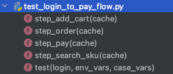

# tep1.0.0教程


正式版教程： https://dongfanger.gitee.io/blog/tep.html

正式版源码： https://github.com/dongfanger/tep

### tep简介

`tep`是**T**ry **E**asy **P**ytest的首字母缩写，是一款基于pytest测试框架的测试工具，集成了各种实用的第三方包和优秀的自动化测试设计思想，帮你快速实现自动化项目落地。

### 快速入门

#### 安装

```shell
pip install tep
```

Mac用户建议创建虚拟环境并激活：

```shell
python3 -m venv venv
source venv/bin/activate
```

验证安装成功：

```shell
tep -V
```

#### 新建项目

```shell
tep startproject demo
```

带上`-venv`参数，可创建单个项目的Python虚拟环境，并在该项目的虚拟环境中安装tep：

```shell
tep startproject demo -venv
```

#### 启动FastAPI示例应用

运行`utils/fastapi_mock.py`脚本。

#### 执行示例用例

执行`examples/tests/test_login_to_pay_flow.py`用例。

#### 查看日志

```
============================= test session starts ==============================
collecting ... collected 1 item

test_login_to_pay_flow.py::test 

============================== 1 passed in 0.14s ===============================

Process finished with exit code 0
2022-12-27 15:19:37.223 | INFO     | fixtures.fixture_login:produce_expensive_data:15 - ----------------开始登录----------------
2022-12-27 15:19:37.234 | INFO     | utils.http_client:request:37 - 

Request URL: http://127.0.0.1:5000/login
Request Method: post
Request Headers: {"Content-Type": "application/json"}
Request Payload: {"json": {"username": "dongfanger", "password": "123456"}}
Status Code: 200
Response: {"token":"de2e3ffu29"}
Elapsed: 0.003s

2022-12-27 15:19:37.234 | INFO     | fixtures.fixture_login:produce_expensive_data:23 - ----------------登录成功----------------
PASSED                                   [100%]2022-12-27 15:19:37.235 | INFO     | utils.step:__init__:12 - ----------------搜索商品----------------
2022-12-27 15:19:37.250 | INFO     | utils.http_client:request:37 - 

Request URL: http://127.0.0.1:5000/searchSku
Request Method: get
Request Headers: {"token": "de2e3ffu29"}
Request Payload: {"params": {"skuName": "\u7535\u5b50\u4e66"}}
Status Code: 200
Response: {"skuId":"222","price":"2.3"}
Elapsed: 0.001s

2022-12-27 15:19:37.250 | INFO     | utils.step:__init__:12 - ----------------添加购物车----------------
2022-12-27 15:19:37.254 | INFO     | utils.http_client:request:37 - 

Request URL: http://127.0.0.1:5000/addCart
Request Method: post
Request Headers: {"token": "de2e3ffu29"}
Request Payload: {"json": {"skuId": "222", "skuNum": 2}}
Status Code: 200
Response: {"skuId":"222","price":"2.3","skuNum":"3","totalPrice":"6.9"}
Elapsed: 0.001s

2022-12-27 15:19:37.254 | INFO     | utils.step:__init__:12 - ----------------下单----------------
2022-12-27 15:19:37.257 | INFO     | utils.http_client:request:37 - 

Request URL: http://127.0.0.1:5000/order
Request Method: post
Request Headers: {"token": "de2e3ffu29"}
Request Payload: {"json": {"orderId": 222, "payAmount": "0.2", "skuId": "222", "price": "2.3", "skuNum": "3", "totalPrice": "6.9"}}
Status Code: 200
Response: {"orderId":"333"}
Elapsed: 0.001s

2022-12-27 15:19:37.257 | INFO     | utils.step:__init__:12 - ----------------支付----------------
2022-12-27 15:19:37.259 | INFO     | utils.http_client:request:37 - 

Request URL: http://127.0.0.1:5000/pay
Request Method: post
Request Headers: {"token": "de2e3ffu29"}
Request Payload: {"json": {"skuId": 123, "price": 0.1, "skuNum": 2, "totalPrice": 0.2, "orderId": "333"}}
Status Code: 200
Response: {"success":"true"}
Elapsed: 0.001s
```

能在本地跑起来看到日志且没有报错，恭喜您，上手成功！

### 目录结构说明

examples：示例代码，可无顾虑全删；

fixtures：Pytest fixture，自动导入；

resources：环境变量、全局变量；

tests：测试用例；

utils：工具包；

conftest.py：Pytest挂载；

pytest.ini：Pytest配置；

reports：测试报告，默认不显示，生成报告后会出现；

### 用例组织形式

**推荐MVC分层设计和数据代码分离。**

小提示：tep老版本的极速写法，即接口、数据、代码都放在一个文件的一个函数的写法，仍然适合于新手或追求效率时使用。

#### 用例集

在tests目录下将测试用例按功能模块分成多个用例集：

```
tests
  user
  teacher
  student
```

#### 测试用例

必须遵循用例解耦原则，每条用例都是单独可运行的。用例由2个文件组成，一个文件存放纯粹的yaml数据，一个文件存放逻辑代码：

```
test_login_to_pay_flow.yaml
test_login_to_pay_flow.py
```

#### 测试数据

存放在yaml文件中，第一层为说明文字，第二层为请求json：

```yaml
"查询SKU": {
  "skuName": "电子书"
}

"添加购物车": {
  "skuId": 123,
  "skuNum": 2
}

"下单": {
  "orderId": 222,
  "payAmount": "0.2"
}

"支付": {
  "skuId": 123,
  "price": 0.1,
  "skuNum": 2,
  "totalPrice": 0.2
}
```

#### 测试标题

测试标题采用了`@allure.title("")`：

```python
@allure.title("从登录到下单支付")
def test(login, env_vars, case_vars):
```

#### 测试步骤

一条测试用例由多个测试步骤组成：

```python
@allure.title("从登录到下单支付")
def test(login, env_vars, case_vars):
    case_vars.put("token", login["token"])
    cache = TepCache(env_vars=env_vars, case_vars=case_vars)

    Step("搜索商品", step_search_sku, cache)
    Step("添加购物车", step_add_cart, cache)
    Step("下单", step_order, cache)
    Step("支付", step_pay, cache)
```

Step第一个参数为步骤描述，第二个参数为步骤实现函数，第三个参数为cache缓存。

步骤实现函数定义在用例文件中：

```python
def step_add_cart(cache: TepCache):
    url = cache.env_vars["domain"] + "/addCart"
    headers = {"token": cache.case_vars.get("token")}
    body = data("添加购物车")
    body["skuId"] = cache.case_vars.get("skuId")

    response = request("post", url=url, headers=headers, json=body)
    assert response.status_code < 400

    cache.case_vars.put("skuNum", response.jsonpath("$.skuNum"))
    cache.case_vars.put("totalPrice", response.jsonpath("$.totalPrice"))
```

从上往下依次为url、headers、body、参数化、请求调用、断言、数据提取。

小技巧：打开PyCharm的Show Members，就能快速定位到某个step函数，编辑测试步骤。




### 变量

**环境变量**：在`resources/env_vars`下预填变量，在`resources/tep.yaml`中激活某个环境，在代码中引入env_vars fixture读取变量值：

```python
def test(env_vars):
    logger.info(env_vars["domain"])
```

**全局变量**：在`resources/global_vars.yaml`预填变量，在代码中引入global_vars fixture读取变量值：

```python
def test(global_vars):
    print(global_vars["desc"])
```

**用例变量**：在用例中引入case_vars fixture，在步骤函数间通过cache传递：

```python
@allure.title("从登录到下单支付")
def test(login, env_vars, case_vars):
    case_vars.put("token", login["token"])
    cache = TepCache(env_vars=env_vars, case_vars=case_vars)

    Step("搜索商品", step_search_sku, cache)
    Step("添加购物车", step_add_cart, cache)
    Step("下单", step_order, cache)
    Step("支付", step_pay, cache)


def step_search_sku(cache: TepCache):
    url = cache.env_vars["domain"] + "/searchSku"
    headers = {"token": cache.case_vars.get("token")}
    body = data("查询SKU")

    response = request("get", url=url, headers=headers, params=body)
    assert response.status_code < 400

    cache.case_vars.put("skuId", response.jsonpath("$.skuId"))
    cache.case_vars.put("skuPrice", response.jsonpath("$.price"))


def step_add_cart(cache: TepCache):
    url = cache.env_vars["domain"] + "/addCart"
    headers = {"token": cache.case_vars.get("token")}
    body = data("添加购物车")
    body["skuId"] = cache.case_vars.get("skuId")

    response = request("post", url=url, headers=headers, json=body)
    assert response.status_code < 400

    cache.case_vars.put("skuNum", response.jsonpath("$.skuNum"))
    cache.case_vars.put("totalPrice", response.jsonpath("$.totalPrice"))
```

### 接口关联

如上所述，通过case_vars和cache实现了步骤函数里面的接口关联，上一个接口的响应，提取后存入cache，下一个接口的入参，从cache取值。

### 数据提取

`utils/http_client.py`封装了requests.Response，添加了jsonpath方法，支持简单取值：

```python
response.jsonpath("$.skuNum")
```

### 断言

采用Python原生的assert断言。16种常用断言如下：

```python
import allure


@allure.title("等于")
def test_assert_equal():
    assert 1 == 1


@allure.title("不等于")
def test_assert_not_equal():
    assert 1 != 2


@allure.title("大于")
def test_assert_greater_than():
    assert 2 > 1


@allure.title("小于")
def test_assert_less_than():
    assert 1 < 2


@allure.title("大于等于")
def test_assert_less_or_equals():
    assert 2 >= 1
    assert 2 >= 2


@allure.title("小于等于")
def test_assert_greater_or_equals():
    assert 1 <= 2
    assert 1 <= 1


@allure.title("长度相等")
def test_assert_length_equal():
    assert len("abc") == len("123")


@allure.title("长度大于")
def test_assert_length_greater_than():
    assert len("hello") > len("123")


@allure.title("长度小于")
def test_assert_length_less_than():
    assert len("hi") < len("123")


@allure.title("长度大于等于")
def test_assert_length_greater_or_equals():
    assert len("hello") >= len("123")
    assert len("123") >= len("123")


@allure.title("长度小于等于")
def test_assert_length_less_or_equals():
    assert len("123") <= len("hello")
    assert len("123") <= len("123")


@allure.title("字符串相等")
def test_assert_string_equals():
    assert "dongfanger" == "dongfanger"


@allure.title("以...开头")
def test_assert_startswith():
    assert "dongfanger".startswith("don")


@allure.title("以...结尾")
def test_assert_startswith():
    assert "dongfanger".endswith("er")


@allure.title("正则匹配")
def test_assert_regex_match():
    import re
    assert re.findall(r"don.*er", "dongfanger")


@allure.title("包含")
def test_assert_contains():
    assert "fang" in "dongfanger"
    assert 2 in [2, 3]
    assert "x" in {"x": "y"}.keys()


@allure.title("类型匹配")
def test_assert_type_match():
    assert isinstance(1, int)
    assert isinstance(0.2, float)
    assert isinstance(True, bool)
    assert isinstance(3e+26j, complex)
    assert isinstance("hi", str)
    assert isinstance([1, 2], list)
    assert isinstance((1, 2), tuple)
    assert isinstance({"a", "b", "c"}, set)
    assert isinstance({"x": 1}, dict)
```

### 测试报告

allure下载地址： https://github.com/allure-framework/allure2/releases

解压后将bin目录添加到系统环境变量Path。

在pytest命令行添加参数`--tep-reports`就能一键生成Allure测试报告，并且会把请求入参和响应出参，记录在测试报告中。

```shell
pytest --tep-reports
```

若想在资源管理器中打开，需要执行命令`allure open 报告所在文件夹名`才能正常打开。

### 用例执行

#### 串行

使用`pytest`命令即可。

#### 并行

使用`pytest -n auto`，由pytest-xdist提供支持。

### 特色功能

#### fixtures自动导入

不是必须在conftest.py里面定义fixture。只要在fixtures目录下，创建以`fixture_`开头的文件，fixture都会自动加载到pytest中，方便管理维护。

#### 全局执行一次登录

预置了`fixtures/fixture_login.py`登录接口，且全局仅执行一次，解决token复用问题：

```python
import pytest
from loguru import logger

from utils.http_client import request


@pytest.fixture(scope="session")
def login(tep_context_manager, env_vars):
    """
    tep_context_manager是为了兼容pytest-xdist分布式执行的上下文管理器
    该login只会在整个运行期间执行一次
    """

    def produce_expensive_data(variable):
        logger.info("----------------开始登录----------------")
        response = request(
            "post",
            url=variable["domain"] + "/login",
            headers={"Content-Type": "application/json"},
            json={"username": "dongfanger", "password": "123456"}
        )
        assert response.status_code < 400
        logger.info("----------------登录成功----------------")
        return response.json()

    return tep_context_manager(produce_expensive_data, env_vars)
```

即便在xdist分布式场景下，也只会执行一次登录。

### 工具包

cache.py，提供缓存。

```python
class TepCache:
    """
    提供缓存服务，包括全局变量、环境变量、用例变量
    """
    def __init__(self, global_vars=None, env_vars=None, case_vars=None):
        self.global_vars = global_vars
        self.env_vars = env_vars
        self.case_vars = case_vars
```

dao.py，目前支持访问MySQL，需要安装pymysql、sqlalchemy和pandas。

```python
#!/usr/bin/python
## encoding=utf-8

"""
@Author  :  dongfanger
@Date    :  9/2/2020 11:32 AM
@Desc    :  访问数据库
"""

from loguru import logger

try:
    from sqlalchemy import create_engine
    from texttable import Texttable
except ModuleNotFoundError:
    pass


def mysql_engine(host, port, user, password, db):
    try:
        engine = create_engine(f"mysql+pymysql://{user}:{password}@{host}:{port}/{db}")
    except NameError:
        return ""
    return engine


def print_db_table(data_frame):
    """以表格形式打印数据表"""
    tb = Texttable()
    tb.header(data_frame.columns.array)
    tb.set_max_width(0)
    # text * cols
    tb.set_cols_dtype(['t'] * data_frame.shape[1])
    tb.add_rows(data_frame.to_numpy(), header=False)
    logger.info(tb.draw())
```

fastapi_mock.py，示例应用。

```python
#!/usr/bin/python
## encoding=utf-8

import uvicorn
from fastapi import FastAPI, Request

app = FastAPI()


@app.post("/login")
async def login(req: Request):
    body = await req.json()
    if body["username"] == "dongfanger" and body["password"] == "123456":
        return {"token": "de2e3ffu29"}
    return ""


@app.get("/searchSku")
def search_sku(req: Request):
    if req.headers.get("token") == "de2e3ffu29" and req.query_params.get("skuName") == "电子书":
        return {"skuId": "222", "price": "2.3"}
    return ""


@app.post("/addCart")
async def add_cart(req: Request):
    body = await req.json()
    if req.headers.get("token") == "de2e3ffu29" and body["skuId"] == "222":
        return {"skuId": "222", "price": "2.3", "skuNum": "3", "totalPrice": "6.9"}
    return ""


@app.post("/order")
async def order(req: Request):
    body = await req.json()
    if req.headers.get("token") == "de2e3ffu29" and body["skuId"] == "222":
        return {"orderId": "333"}
    return ""


@app.post("/pay")
async def pay(req: Request):
    body = await req.json()
    if req.headers.get("token") == "de2e3ffu29" and body["orderId"] == "333":
        return {"success": "true"}
    return ""


if __name__ == '__main__':
    uvicorn.run("fastapi_mock:app", host="127.0.0.1", port=5000)
```

func.py，常用函数，比如pairwise自动生成用例等。

```python
#!/usr/bin/python
## encoding=utf-8

"""
@Author  :  dongfanger
@Date    :  7/24/2020 5:41 PM
@Desc    :  tep函数库
"""
import copy
import inspect
import itertools
import json
import os
import time
from sys import stdout

import yaml
from loguru import logger

from utils.project import Project


def current_time():
    """
    当前时间，年-月-日 时-分-秒
    :return:
    """
    return time.strftime("%Y-%m-%d %H:%M:%S", time.localtime(time.time()))


def current_date():
    """
    当前日期 年-月-日
    :return:
    """
    return time.strftime("%Y-%m-%d", time.localtime(time.time()))


def print_progress_bar(i):
    """
    进度条
    """
    c = int(i / 10)
    progress = '\r %2d%% [%s%s]'
    a = '■' * c
    b = '□' * (10 - c)
    msg = progress % (i, a, b)
    stdout.write(msg)
    stdout.flush()


def case_pairwise(option):
    """
    pairwise算法
    """
    cp = []  # 笛卡尔积
    s = []  # 两两拆分
    for x in eval('itertools.product' + str(tuple(option))):
        cp.append(x)
        s.append([i for i in itertools.combinations(x, 2)])
    logger.info('笛卡尔积:%s' % len(cp))
    del_row = []
    print_progress_bar(0)
    s2 = copy.deepcopy(s)
    for i in range(len(s)):  # 对每行用例进行匹配
        if (i % 100) == 0 or i == len(s) - 1:
            print_progress_bar(int(100 * i / (len(s) - 1)))
        t = 0
        for j in range(len(s[i])):  # 对每行用例的两两拆分进行判断，是否出现在其他行
            flag = False
            for i2 in [x for x in range(len(s2)) if s2[x] != s[i]]:  # 找同一列
                if s[i][j] == s2[i2][j]:
                    t = t + 1
                    flag = True
                    break
            if not flag:  # 同一列没找到，不用找剩余列了
                break
        if t == len(s[i]):
            del_row.append(i)
            s2.remove(s[i])
    res = [cp[i] for i in range(len(cp)) if i not in del_row]
    logger.info('过滤后:%s' % len(res))
    return res


def load_yaml(path: str) -> dict:
    with open(path, encoding="utf8") as f:
        return yaml.load(f.read(), Loader=yaml.FullLoader)


def jwt_headers(token):
    """
    jwt请求头
    """
    return {"Content-Type": "application/json", "authorization": f"Bearer {token}"}


def data(first_node: str) -> dict:
    """
    读用例同名的yaml文件
    取首节点的值
    """
    caller = inspect.stack()[1]
    case_path = os.path.dirname(caller.filename)
    basename = os.path.basename(caller.filename)
    data_path_yml = os.path.join(case_path, basename.rstrip(".py") + ".yml")
    data_path_yaml = os.path.join(case_path, basename.rstrip(".py") + ".yaml")
    node_value = {}
    if not os.path.exists(data_path_yml) and not os.path.exists(data_path_yaml):
        logger.error("数据文件不存在")
        return node_value
    data_path = data_path_yml if os.path.exists(data_path_yml) else data_path_yaml
    try:
        return load_yaml(data_path)[first_node]
    except KeyError:
        logger.error(f"数据文件{data_path}不存在首节点{first_node}")
```

http_client.py，requests库的猴子补丁，可自定义。

```python
#!/usr/bin/python
## encoding=utf-8

import decimal
import json
import time

import allure
import jsonpath
import requests
import urllib3
from loguru import logger
from requests import Response

urllib3.disable_warnings(urllib3.exceptions.InsecureRequestWarning)


def request(method, url, **kwargs):
    template = """\n
Request URL: {}
Request Method: {}
Request Headers: {}
Request Payload: {}
Status Code: {}
Response: {}
Elapsed: {}
"""
    start = time.process_time()
    response = requests.request(method, url, **kwargs)  # requests.request原生用法
    end = time.process_time()
    elapsed = str(decimal.Decimal("%.3f" % float(end - start))) + "s"
    headers = kwargs.get("headers", {})
    kwargs.pop("headers")
    payload = kwargs
    log = template.format(url, method, json.dumps(headers), json.dumps(payload), response.status_code, response.text,
                          elapsed)
    logger.info(log)
    allure.attach(log, f'request & response', allure.attachment_type.TEXT)
    return TepResponse(response)


class TepResponse(Response):
    """
    二次封装requests.Response，添加额外方法
    """

    def __init__(self, response):
        super().__init__()
        for k, v in response.__dict__.items():
            self.__dict__[k] = v

    def jsonpath(self, expr):
        """
        此处强制取第一个值，便于简单取值
        如果复杂取值，建议直接jsonpath原生用法
        """
        return jsonpath.jsonpath(self.json(), expr)[0]
```

mitm.py，流量录制，做的不是很好，将就看看。

```python
#!/usr/bin/python
## encoding=utf-8

## mitmproxy录制流量自动生成用例

import os
import time

from mitmproxy import ctx

project_dir = os.path.dirname(os.path.dirname(os.path.abspath(__file__)))
tests_dir = os.path.join(project_dir, "tests")
## tests/mitm
mitm_dir = os.path.join(tests_dir, "mitm")
if not os.path.exists(mitm_dir):
    os.mkdir(mitm_dir)
## 当前时间作为文件名
filename = f'test_{time.strftime("%Y%m%d_%H%M%S", time.localtime())}.py'
case_file = os.path.join(mitm_dir, filename)
## 生成用例文件
template = """import allure
from utils.http_client import request


@allure.title("")
def test(env_vars):
"""
if not os.path.exists(case_file):
    with open(case_file, "w", encoding="utf8") as fw:
        fw.write(template)


class Record:
    def __init__(self, domains):
        self.domains = domains

    def response(self, flow):
        if self.match(flow.request.url):
            # method
            method = flow.request.method.lower()
            ctx.log.error(method)
            # url
            url = flow.request.url
            ctx.log.error(url)
            # headers
            headers = dict(flow.request.headers)
            ctx.log.error(headers)
            # body
            body = flow.request.text or {}
            ctx.log.error(body)
            with open(case_file, "a", encoding="utf8") as fa:
                fa.write(self.step(method, url, headers, body))

    def match(self, url):
        if not self.domains:
            ctx.log.error("必须配置过滤域名")
            exit(-1)
        for domain in self.domains:
            if domain in url:
                return True
        return False

    def step(self, method, url, headers, body):
        if method == "get":
            body_grammar = f"params={body}"
        else:
            body_grammar = f"json={body}"
        return f"""
    # 描述
    # 数据
    # 请求
    response = request(
        "{method}",
        url="{url}",
        headers={headers},
        {body_grammar}
    )
    # 提取
    # 断言
    assert response.status_code < 400
"""


## ==================================配置开始==================================
addons = [
    Record(
        # 过滤域名
        [
            "http://www.httpbin.org",
            "http://127.0.0.1:5000"
        ],
    )
]
## ==================================配置结束==================================

"""
==================================命令说明开始==================================
## 正向代理（需要手动打开代理）
mitmdump -s mitm.py
## 反向代理
mitmdump -s mitm.py --mode reverse:http://127.0.0.1:5000 --listen-host 127.0.0.1 --listen-port 8000
==================================命令说明结束==================================
"""
```

project.py，项目基本信息，比如根目录路径。

```python
import os


class Project:
    root_dir = os.path.dirname(os.path.dirname(os.path.abspath(__file__)))
    data_dir = os.path.join(root_dir, "data")
```

step.py，测试步骤的泛化调用。

```python
from loguru import logger

from utils.cache import TepCache


class Step:
    """
    测试步骤，泛化调用
    """

    def __init__(self, name: str, action, cache: TepCache):
        logger.info("----------------" + name + "----------------")
        action(cache)
```

关于tep的更多技术细节，请在源码中一探究竟吧。也可以添加微信**cekaigang**，随时与我联系。

### 结束与开始

**tep小工具**发布了1.0.0正式版，我也将不再对其进行维护。对Pytest做接口测试自动化的探索远没有结束，我将从**teprunner2.0测试平台**开始，继续研究Pytest框架的自动化落地实践，那些对测试技术的热情，终将使我们再次相遇。

源码Gitee：

https://gitee.com/dongfanger/teprunner-backend

https://gitee.com/dongfanger/teprunner-frontend

源码GitHub：

https://github.com/dongfanger/teprunner-backend

https://github.com/dongfanger/teprunner-frontend