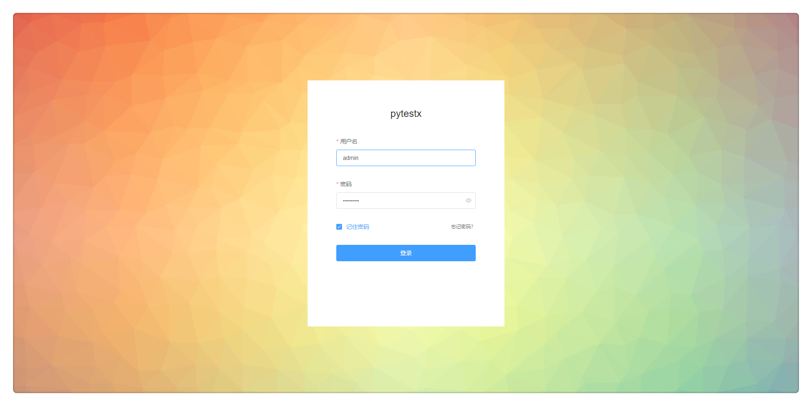
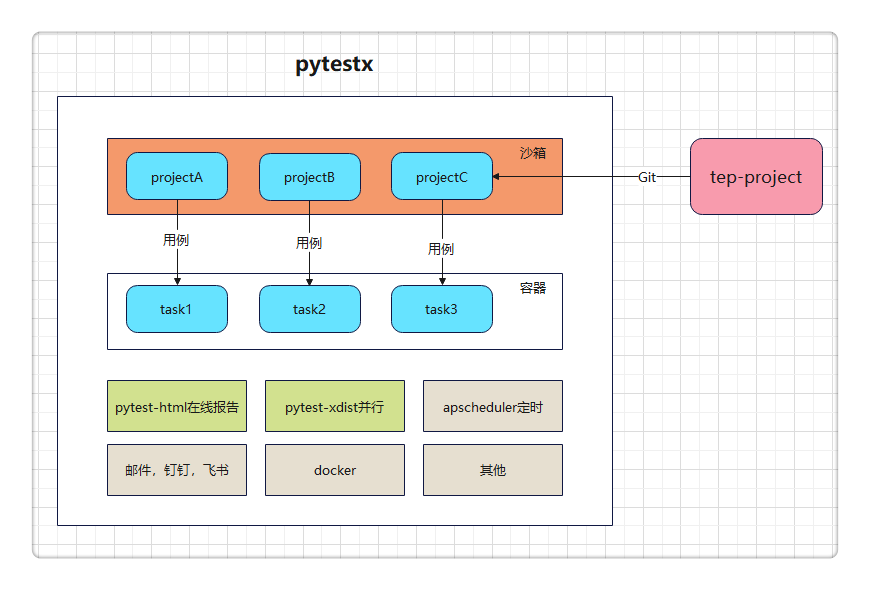
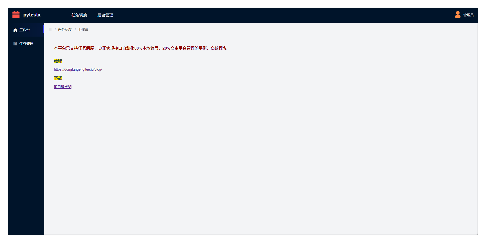
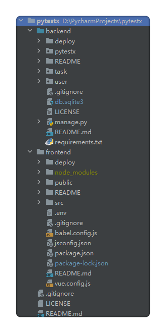
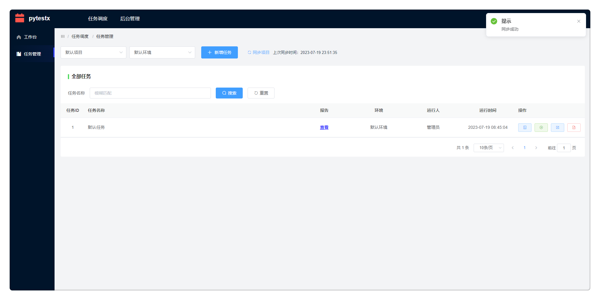
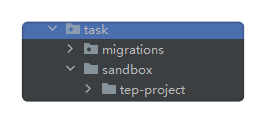
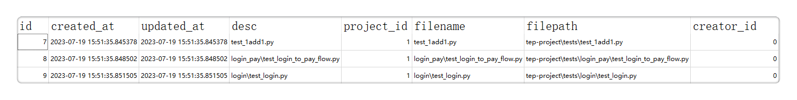
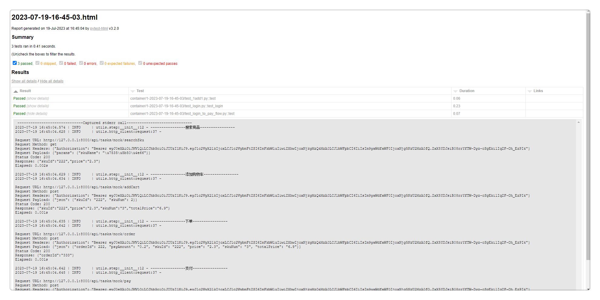

# 聚焦于任务调度的测试平台pytestx

## 设计理念

**聚焦于任务调度**，接口自动化80%本地编写，20%交由平台管理。

如果使用pytest做接口自动化，那么个人认为最好的编写工具是PyCharm，任何低代码测试平台都无法取代。当然不会代码，或者不使用pytest，那低代码测试平台，或者yaml，甚至excel写自动化用例，都是可以接受的。而在使用pytest这个特定场景里面，要做平台化，平台的功能就需要仔细斟酌。既然编写用例最好使用PyCharm，平台也就只能专注于用例编排和任务调度，即创建任务，关联用例，批量运行，以及定时，并行，通知等。

**pytestx**正是基于此理念设计的一款纯粹的任务调度平台。

## 平台架构

## tep1.0.0的延续

tep1.0.0版本已经封版，在pytestx中对它进行了延续。

**从pypi到git**

tep是上传到pypi的，通过pip命令安装，使用tep startproject命令创建项目脚手架，代码结构分为项目代码和tep代码。改造后的tep只有项目代码，存放在：

https://gitee.com/dongfanger/tep-project.git

也就是说，在这个项目中，能看到整个tep全貌。之前的tep内核代码，比如fixtures自动寻找、内置fixture、环境变量等，全部迁移到了项目代码里面，尤其是conftest.py的文件内容。pip install tep顺带安装的依赖包，也整理到了requirements.txt，按照说明安装即可。

**pytest-html替换allure**

由重到轻，化繁为简，pytest-html能够满足数据+日志的报告需要，最新的V3.2.0版本的界面尚可。诚然allure漂亮，但安装Java、下载Allure、配置环境变量、安装pytest-allure、添加pytest hook还是相对麻烦。更重要的是，要支持平台在线查看报告，减少存储占用，pytest-html无疑是更好的选择。

**下载脚手架**

既可以从使用git clone下载代码，也可以从页面下载，就像spring.io那样：

**fastapi到django**

之前的示例代码是调用的fastapi启动的应用，pytestx则将示例代码的接口换成了Django自身的mock接口。

## teprunner的延续

pytestx的基础代码是从teprunner来的，对数据库设计、代码规范、项目结构做了优化。

## 任务管理

**一、同步项目**

同步项目，是把项目配置的Git仓库地址和分支，更新到本地沙箱中，项目之间完全隔离。

并把用例落库：

**二、任务关联用例**

创建任务，任务关联用例，就形成了新的用例集。

**三、容器化运行**

当前是假容器，未真正引入Docker，所谓容器，是指每次运行，都将用例拉取到新的目录，批量执行：

四、生成报告

pytest命令生成html报告，存放于reports，借助于Django挂载页面，从页面点击，在线查看报告：

## 体验平台

下载源码：https://github.com/dongfanger/pytestx

安装依赖：前端（npm install）后端（pip install -r requirements.txt）

启动服务：前端（npm run serve）后端（python manage.py runserver）

即可畅快体验。

## 学习交流

添加微信cekaigang，加入测试开发刚哥交流群（382人冲击400人），欢快讨论吧。

> 参考资料：
>
> https://github.com/dongfanger/pytestx