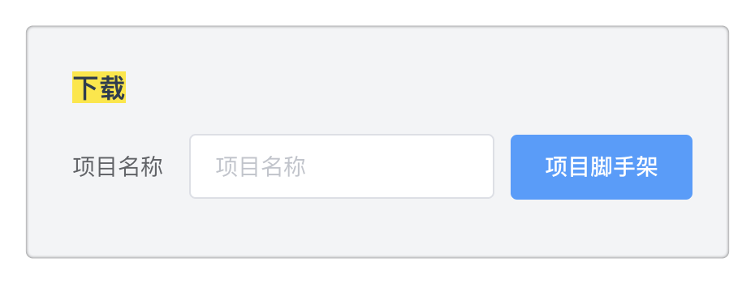
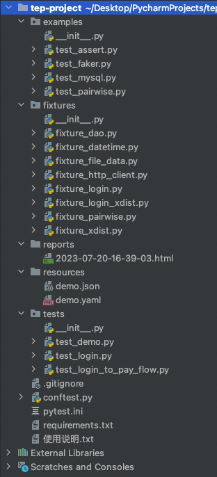
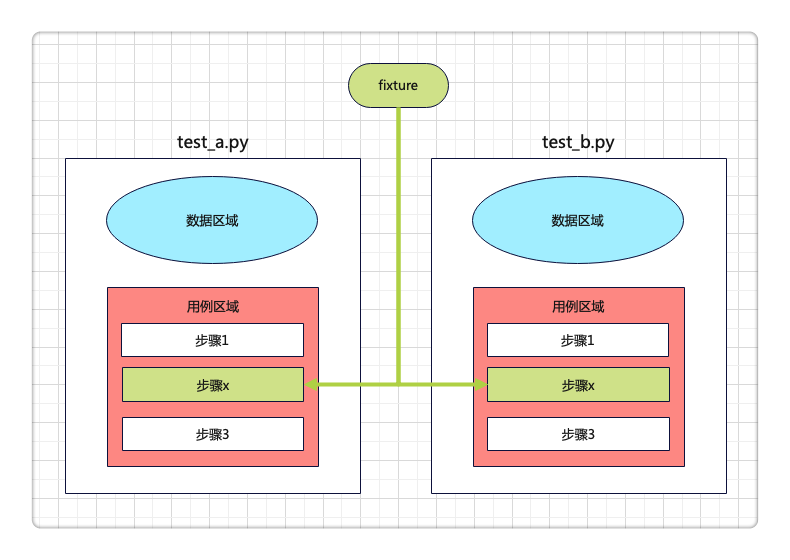

# pytestx重新定义接口框架设计


## 概览

脚手架：



目录：



用例代码：

```python
"""
测试登录到下单流程，需要先启动后端服务
"""

test_data = {
    "查询SKU": {
        "skuName": "电子书"
    },
    "添加购物车": {
        "skuId": 123,
        "skuNum": 2
    },
    "下单": {
        "orderId": 222,
        "payAmount": "0.2"
    },
    "支付": {
        "skuId": 123,
        "price": 0.1,
        "skuNum": 2,
        "totalPrice": 0.2
    },
}
case_vars = dict()


def test(http, login_headers, file_data):
    # 搜索商品
    url = file_data["domain"] + "/api/tasks/mock/searchSku"
    body = test_data["查询SKU"]

    response = http("get", url=url, headers=login_headers, params=body)
    assert response.status_code < 400

    case_vars["skuId"] = response.jsonpath("$.skuId")
    case_vars["skuPrice"] = response.jsonpath("$.price")

    # 添加购物车
    url = file_data["domain"] + "/api/tasks/mock/addCart"
    body = test_data["添加购物车"]
    body["skuId"] = case_vars["skuId"]

    response = http("post", url=url, headers=login_headers, json=body)
    assert response.status_code < 400

    case_vars["skuNum"] = response.jsonpath("$.skuNum")
    case_vars["totalPrice"] = response.jsonpath("$.totalPrice")

    # 下单
    url = file_data["domain"] + "/api/tasks/mock/order"
    body = test_data["下单"]
    body["skuId"] = case_vars["skuId"]
    body["price"] = case_vars["skuPrice"]
    body["skuNum"] = case_vars["skuNum"]
    body["totalPrice"] = case_vars["totalPrice"]

    response = http("post", url=url, headers=login_headers, json=body)
    assert response.status_code < 400

    case_vars["orderId"] = response.jsonpath("$.orderId")

    # 支付
    url = file_data["domain"] + "/api/tasks/mock/pay"
    body = test_data["支付"]
    body["orderId"] = case_vars["orderId"]

    response = http("post", url=url, headers=login_headers, json=body)
    assert response.status_code < 400
    assert response.jsonpath("$.success") == "true"
```

## 页面下载脚手架

启动平台前后端服务后，从页面下载脚手架，平台会拉取开源项目tep-project最新代码，打成压缩包，生成下载文件，弹窗下载。

备注：`tep startproject demo`使用的已封版的1.0.0版本，新框架请访问开源项目tep-project，或者开源平台pytestx

## 精简目录

目录直观上非常精简，得益于去掉了环境变量、函数等目录，聚焦三大目录：

- fixtures

- resources

- tests

## 重度使用fixture

fixture原本只能在conftest定义，借助pytest插件扩展识别fixtures目录：

```python
#!/usr/bin/python
## encoding=utf-8

"""
@Author  :  dongfanger
@Date    :  8/14/2020 9:16 AM
@Desc    :  插件
"""
import os

BASE_DIR = os.path.dirname(os.path.abspath(__file__))
RESOURCE_PATH = os.path.join(BASE_DIR, "resources")


def fixture_paths():
    """
    fixture路径，1、项目下的fixtures；2、tep下的fixture；
    :return:
    """
    _fixtures_dir = os.path.join(BASE_DIR, "fixtures")
    paths = []
    # 项目下的fixtures
    for root, _, files in os.walk(_fixtures_dir):
        for file in files:
            if file.startswith("fixture_") and file.endswith(".py"):
                full_path = os.path.join(root, file)
                import_path = full_path.replace(_fixtures_dir, "").replace("\\", ".")
                import_path = import_path.replace("/", ".").replace(".py", "")
                paths.append("fixtures" + import_path)
    return paths


pytest_plugins = fixture_paths()  # +[其他插件]
```

conftest.py的fixture全部转移至fixtures目录定义。

公共函数消失，统统通过fixture来实现，依赖注入。

包括requests.request封装

```python
#!/usr/bin/python
## encoding=utf-8

import decimal
import json
import time

import jsonpath
import pytest
import requests
import urllib3
from loguru import logger
from requests import Response

urllib3.disable_warnings(urllib3.exceptions.InsecureRequestWarning)


class TepResponse(Response):
    """
    二次封装requests.Response，添加额外方法
    """

    def __init__(self, response):
        super().__init__()
        for k, v in response.__dict__.items():
            self.__dict__[k] = v

    def jsonpath(self, expr):
        """
        此处强制取第一个值，便于简单取值
        如果复杂取值，建议直接jsonpath原生用法
        """
        return jsonpath.jsonpath(self.json(), expr)[0]


@pytest.fixture(scope="session")
def http():
    def inner(method, url, **kwargs):
        template = """\n
    Request URL: {}
    Request Method: {}
    Request Headers: {}
    Request Payload: {}
    Status Code: {}
    Response: {}
    Elapsed: {}
    """
        start = time.process_time()
        response = requests.request(method, url, **kwargs)  # requests.request原生用法
        end = time.process_time()
        elapsed = str(decimal.Decimal("%.3f" % float(end - start))) + "s"
        headers = kwargs.get("headers", {})
        kwargs.pop("headers")
        payload = kwargs
        log = template.format(url, method, json.dumps(headers), json.dumps(payload), response.status_code,
                              response.text,
                              elapsed)
        logger.info(log)
        return TepResponse(response)

    return inner
```

只是名字换成了http：

```python
http("post", url=url, headers=login_headers, json=body)
```

因为request是fixture保留关键字。

## 数据分离

数据支持从文件读取，当然这也是一个fixture：

```python
import json
import os

import pytest
import yaml

from conftest import RESOURCE_PATH


class Resource:
    def __init__(self, path):
        self.path = path

    def get_data(self):
        file_type = self._get_file_type()
        if file_type in [".yml", ".yaml", ".YML", "YAML"]:
            return self._get_yaml_file_data()
        if file_type in [".json", ".JSON"]:
            return self._get_json_file_data()

    def _get_file_type(self):
        return os.path.splitext(self.path)[-1]

    def _get_yaml_file_data(self):
        with open(self.path, encoding="utf8") as f:
            return yaml.load(f.read(), Loader=yaml.FullLoader)

    def _get_json_file_data(self):
        with open(self.path, encoding="utf8") as f:
            return json.load(f)


@pytest.fixture(scope="session")
def file_data():
    file_path = os.path.join(RESOURCE_PATH, "demo.yaml")
    return Resource(file_path).get_data()
```

也可以放在用例文件中。为什么？“只改数据不动用例代码”，如果没有这种情况，请毫不犹豫将数据放到用例文件中，不要从excel、yaml读取数据，增加无意义的中间转换。从流量回放替代自动化的趋势来看，数据和用例作为整体来维护和运行，会越来越普遍。在使用低代码平台时，测试数据也是写在用例里面，只有少量的公共信息，会抽出来作为变量。**测试技术在发展，只有符合当前实际使用需要的，才是最好的。**

## 用例设计

约定大于配置：

- 数据区域、用例区域分离

- 用例由步骤组成

- 步骤分为前置条件、用例体、断言、数据提取

数据区域，接口入参、用例中间变量等：

```python
test_data = {
    "查询SKU": {
        "skuName": "电子书"
    },
    "添加购物车": {
        "skuId": 123,
        "skuNum": 2
    },
    "下单": {
        "orderId": 222,
        "payAmount": "0.2"
    },
    "支付": {
        "skuId": 123,
        "price": 0.1,
        "skuNum": 2,
        "totalPrice": 0.2
    },
}
case_vars = dict()
```

用例定义，test函数，fixture引用：

```python
def test(http, login_headers, file_data):
```

步骤：

```python
## 搜索商品
url = file_data["domain"] + "/api/tasks/mock/searchSku"
body = test_data["查询SKU"]

response = http("get", url=url, headers=login_headers, params=body)
assert response.status_code < 400

case_vars["skuId"] = response.jsonpath("$.skuId")
case_vars["skuPrice"] = response.jsonpath("$.price")
```

**每个用例文件单独可运行**。不存在用例依赖，复用步骤封装为fixture，以依赖注入方式在各用例中复用。用例一定要解耦，这在任务调度时非常重要。



总结，重新定义目录，重新定义用例组织，重新定义fixture，减少过程代码，专注于用例编写，轻松上手pytest。

跟着pytestx学习接口自动化框架设计，更简单，更稳定，更高效。

https://github.com/dongfanger/pytestx

https://gitee.com/dongfanger/tep-project
