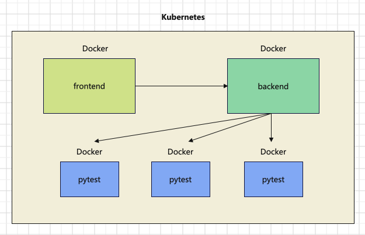
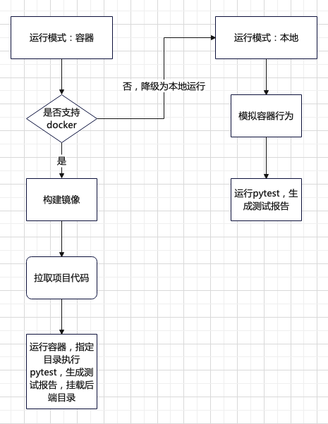
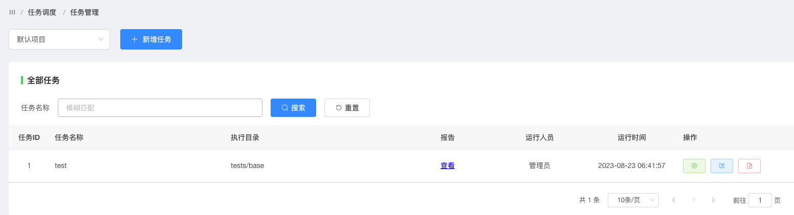
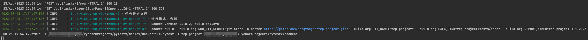
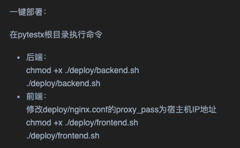
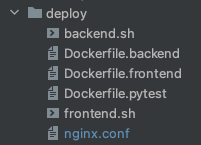
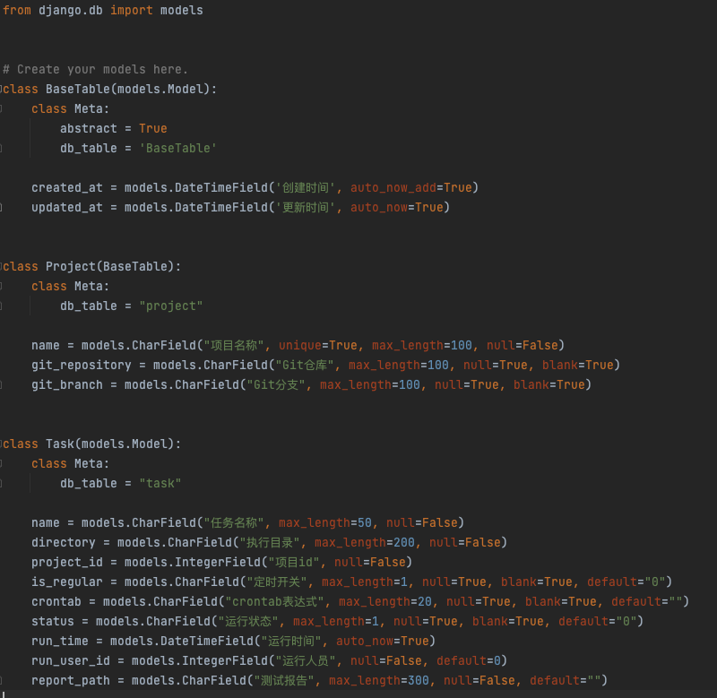
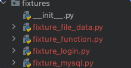
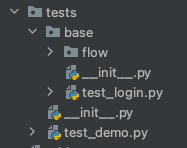

pytestx容器化执行引擎
=====================

|image1|

系统架构
--------

|image2|

前端、后端、pytest均以\ **Docker**\ 容器运行服务，单独的容器化执行引擎，项目环境隔离，即用即取，用完即弃，简单，高效。

-  前端容器：页面交互，请求后端，展示HTML报告

-  后端容器：接收前端请求，启动任务，构建镜像，触发运行pytest，挂载HTML报告

-  pytest容器：拉取项目代码，指定目录执行，生成HTML报告

..

   说明：构建镜像目前是在宿主机启动后端服务来执行docker命令的，暂未支持Kubernetes编排。宿主机安装了Docker，启动服务后，可以执行docker命令。如果采用容器部署后端，容器里面不包含Docker，无法构建，个人想法是可以借助K8S来编排，当前版本还未实现

系统流程
--------

|image3|

支持2种运行模式配置：容器和本地。

容器模式：判断是否支持docker，如果支持，构建pytest镜像，在构建时，通过git拉取项目代码，再运行容器，按照指定目录执行pytest，生成测试报告，并将报告文件挂载到后端。如果不支持，降级为本地运行。

本地模式：模拟容器行为，在本地目录拉取代码，执行pytest，生成测试报告。

效果展示
--------

任务管理：

|image4|

容器模式：

|image5|

本地模式：

|image6|

平台大改造
----------

pytestx平台更轻、更薄，移除了用例管理、任务关联用例相关功能代码，只保留真正的任务调度功能，backend的requirements.txt解耦，只保留后端依赖，pytest相关依赖转移到tep-project。

那如何管理用例呢？约定大于配置，\ **我们约定pytest项目已经通过目录维护好了一个稳定的自动化用例集**\ ，也就是说需要通过平台任务调度的用例，都统一存放在目录X下，这些用例基本不需要维护，可以每日稳定执行，然后将目录X配置到平台任务信息中，按指定目录执行用例集。对于那些不够稳定的用例，就不能放到目录X下，需要调试好以后再纳入。

为什么不用marker？pytest的marker确实可以给测试用例打标记，也有人是手动建立任务和用例进行映射，这些方式都不如维护一个稳定的自动化用例集方便，在我们公司平台上，也是维护用例集，作为基础用例集。使用pytest项目同理。

核心代码
--------

**一键部署**

|image7|

|image8|

.. code:: shell

   #!/bin/bash
   PkgName='backend'

   Dockerfile='./deploy/Dockerfile.backend'
   DockerContext=./

   echo "Start build image..."
   docker build -f $Dockerfile -t $PkgName $DockerContext
   if [ $? -eq 0 ]
   then
       echo "Build docker image success"
       echo "Start run image..."
       docker run -p 8000:80 $PkgName
   else
       echo "Build docker image failed"
   fi

.. code:: dockerfile

   FROM python:3.8

   ENV LANG C.UTF-8
   ENV TZ=Asia/Shanghai

   RUN /bin/cp /usr/share/zoneinfo/Asia/Shanghai /etc/localtime && echo 'Asia/Shanghai' >/etc/timezone

   WORKDIR /app
   COPY ./backend .
   RUN pip install -r ./requirements.txt -i \
       https://pypi.tuna.tsinghua.edu.cn/simple \
       --default-timeout=3000

   CMD ["python", "./manage.py", "runserver", "0.0.0.0:80"]

**数据库表**

更精简，只有project和task两张表，简化平台功能，聚焦任务调度：

|image9|

   需要说明的是，如果多人运行任务，只会存储最后一次执行结果，这个问题不是核心，个人精力有限，不打算在开源项目中开发，更侧重于实现任务调度，供大家参考

**执行任务**

settings配置任务模式，判断执行不同分支：

.. code:: python

   def run(self):
       logger.info("任务开始执行")
       if settings.TASK_RUN_MODE == TaskRunMode.DOCKER:  # 容器模式
           try:
               self.execute_by_docker()
           except Exception as e:
               logger.info(e)
               if e == TaskException.DockerNotSupportedException:
                   logger.info("降级为本地执行")
                   self.execute_by_local()
       if settings.TASK_RUN_MODE == TaskRunMode.LOCAL:  # 本地模式
           self.execute_by_local()
       self.save_task()

**容器模式**

先根据\ ``docker -v``\ 命令判断是否支持docker，然后docker
build，再docker run

.. code:: python

   def execute_by_docker(self):
       logger.info("运行模式：容器")
       output = subprocess.getoutput("docker -v")
       logger.info(output)
       if "not found" in output:
           raise TaskException.DockerNotSupportedException
       build_args = [
           f'--build-arg CMD_GIT_CLONE="{self.cmd_git_clone}"',
           f'--build-arg GIT_NAME="{self.git_name}"',
           f'--build-arg EXEC_DIR="{self.exec_dir}"',
           f'--build-arg REPORT_NAME="{self.report_name}"',
       ]
       cmd = f"docker build {' '.join(build_args)} -f {self.dockerfile_pytest} -t {self.git_name} {BASE_DIR}"
       logger.info(cmd)
       output = subprocess.getoutput(cmd)
       logger.info(output)
       cmd = f"docker run -v {REPORT_PATH}:/app/{os.path.join(self.exec_dir, 'reports')} {self.git_name}"
       logger.info(cmd)
       output = subprocess.getoutput(cmd)
       logger.info(output)

将项目仓库、执行目录、报告名称信息，通过参数传入Dockerfile.pytest

.. code:: dockerfile

   FROM python:3.8

   ENV LANG C.UTF-8
   ENV TZ=Asia/Shanghai
   ARG CMD_GIT_CLONE
   ARG GIT_NAME
   ARG EXEC_DIR
   ARG REPORT_NAME

   RUN /bin/cp /usr/share/zoneinfo/Asia/Shanghai /etc/localtime && echo 'Asia/Shanghai' >/etc/timezone

   WORKDIR /app
   RUN $CMD_GIT_CLONE
   RUN pip install -r ./$GIT_NAME/requirements.txt -i \
       https://pypi.tuna.tsinghua.edu.cn/simple \
       --default-timeout=3000

   WORKDIR $EXEC_DIR
   ENV HTML_NAME=$REPORT_NAME
   CMD ["pytest", "--html=./reports/$HTML_NAME", "--self-contained-html"]

docker
run的\ ``-v``\ 参数将容器报告挂载在后端服务，当报告生成后，后端服务也会生成一份报告文件。再将文件内容返给前端展示：

.. code:: python

   def report(request, *args, **kwargs):
       task_id = kwargs["task_id"]
       task = Task.objects.get(id=task_id)
       report_path = task.report_path

       with open(os.path.join(REPORT_PATH, report_path), 'r', encoding="utf8") as f:
           html_content = f.read()

       return HttpResponse(html_content, content_type='text/html')

测试报告使用的pytest-html，重数据内容，轻外观样式。

**本地模式**

模拟容器行为，把本地\ ``.local``\ 目录当做容器，拉代码，执行pytest，生成报告，复制报告到报告文件夹，删除本地目录：

.. code:: python

   def execute_by_local(self):
       logger.info("运行模式：本地")
       os.makedirs(self.local_path, exist_ok=True)
       os.chdir(self.local_path)
       cmd_list = [self.cmd_git_clone, self.cmd_pytest]
       for cmd in cmd_list:
           logger.info(cmd)
           output = subprocess.getoutput(cmd)
           if output:
               logger.info(output)
       os.makedirs(REPORT_PATH, exist_ok=True)
       shutil.copy2(self.project_report_path, REPORT_PATH)
       shutil.rmtree(LOCAL_PATH)

本地模式，主要用于本地调试，在缺失Docker环境时，也能调试其他功能。

**配置**

.. code:: python

   TASK_RUN_MODE = TaskRunMode.DOCKER
   LOCAL_PATH = os.path.join(BASE_DIR, ".local")
   REPORT_PATH = os.path.join(BASE_DIR, "task", "report")

.. code:: python

   class TaskRunner:
       def __init__(self, task_id, run_user_id):
           self.task_id = task_id
           self.directory = Task.objects.get(id=task_id).directory
           self.project_id = Task.objects.get(id=task_id).project_id
           self.git_repository = Project.objects.get(id=self.project_id).git_repository
           self.git_branch = Project.objects.get(id=self.project_id).git_branch
           self.git_name = re.findall(r"^.*/(.*).git", self.git_repository)[0]
           self.local_path = os.path.join(LOCAL_PATH, str(uuid.uuid1()).replace("-", ""))
           self.run_user_id = run_user_id
           self.current_time = time.strftime("%Y-%m-%d-%H-%M-%S", time.localtime(time.time()))
           self.report_name = f"{str(self.git_name)}-{self.task_id}-{self.run_user_id}-{self.current_time}.html"
           self.project_report_path = os.path.join(self.local_path, self.git_name, "reports", self.report_name)
           self.dockerfile_pytest = os.path.join(DEPLOY_PATH, "Dockerfile.pytest")
           self.exec_dir = os.path.join(self.git_name, self.directory)
           self.cmd_git_clone = f"git clone -b {self.git_branch} {self.git_repository}"
           self.cmd_pytest = f"pytest {self.exec_dir} --html={self.project_report_path} --self-contained-html"

tep-project更新
---------------

1、整合fixture，功能类放在fixture_function模块，数据类放在其他模块，突出\ **fixture存放数据**\ 概念，比如登录接口fixture_login存储用户名密码、数据库fixture_mysql存储连接信息、文件fixture_file_data存储文件路径

|image10|

2、改造fixture_login，数据类fixture代码更简洁

.. code:: python

   import pytest
   from loguru import logger

   @pytest.fixture(scope="session")
   def login(http, file_data):
       logger.info("----------------开始登录----------------")
       response = http(
           "post",
           url=file_data["domain"] + "/api/users/login",
           headers={"Content-Type": "application/json"},
           json={"username": "admin", "password": "qa123456"}
       )
       assert response.status_code < 400
       logger.info("----------------登录成功----------------")
       response = response.json()
       return {"Content-Type": "application/json", "Authorization": f"Bearer {response['token']}"}

   @pytest.fixture(scope="session")
   def login_xdist(http, tep_context_manager, file_data):
       """
       该login只会在整个运行期间执行一次
       """

       def produce_expensive_data(variable):
           logger.info("----------------开始登录----------------")
           response = http(
               "post",
               url=variable["domain"] + "/api/users/login",
               headers={"Content-Type": "application/json"},
               json={"username": "admin", "password": "qa123456"}
           )
           assert response.status_code < 400
           logger.info("----------------登录成功----------------")
           return response.json()

       response = tep_context_manager(produce_expensive_data, file_data)
       return {"Authorization": "Bearer " + response["token"]}

3、改造fixture_mysql，支持维护多个连接，并且保持简洁

fixture_function.py

.. code:: python

   @pytest.fixture(scope="class")
   def executor():
       class Executor:
           def __init__(self, db):
               self.db = db
               self.cursor = db.cursor()

           def execute_sql(self, sql):
               try:
                   self.cursor.execute(sql)
                   self.db.commit()
               except Exception as e:
                   print(e)
                   self.db.rollback()
               return self.cursor

       return Executor

fixture_mysql.py

.. code:: python

   @pytest.fixture(scope="class")
   def mysql_execute(executor):
       db = pymysql.connect(host="host",
                            port=3306,
                            user="root",
                            password="password",
                            database="database")
       yield executor(db).execute_sql
       db.close()

   @pytest.fixture(scope="class")
   def mysql_execute_x(executor):
       db = pymysql.connect(host="x",
                            port=3306,
                            user="x",
                            password="x",
                            database="x")
       yield executor(db).execute_sql
       db.close()

4、改造fixture_file_data，并添加示例test_file_data.py

.. code:: python

   import os

   import pytest

   from conftest import RESOURCE_PATH

   @pytest.fixture(scope="session")
   def file_data(resource):
       file_path = os.path.join(RESOURCE_PATH, "demo.yaml")
       return resource(file_path).get_data()

   @pytest.fixture(scope="session")
   def file_data_json(resource):
       file_path = os.path.join(RESOURCE_PATH, "demo.json")
       return resource(file_path).get_data()

5、添加接口复用的示例代码

|image11|

``tests/base``\ 就是平台调度使用的稳定自动化用例集。

接口代码复用设计
----------------

5条用例：

1. test_search_sku.py：搜索商品，前置条件：登录

2. test_add_cart.py：添加购物车，前置条件：登录，搜索商品

3. test_order.py：下单，前置条件：登录，搜索商品，添加购物车

4. test_pay.py：支付，前置条件：登录，搜索商品，添加购物车，下单

5. test_flow.py：完整流程

怎么设计？

-  登录，每条用例前置条件都依赖，定义为fixture_login，放在fixtures目录下

-  搜索商品，test_search_sku.py用例本身不需要复用，被前置条件依赖3次，可以复用

①定义为fixture_search_sku放在fixtures❌ 弊端：导致fixtures臃肿

②复制用例文件，允许多份代码，平行展开✅ 好处：高度解耦，不用担心依赖问题

总结，定义为fixture需要具备\ **底层性**\ ，足够精炼。对于业务接口用例的前置条件，尽量在用例文件内部处理，保持文件解耦，遵循独立可运行的原则。

复制多份文件？需要修改的话要改多份文件？

是的，但这种情况极少。我能想到的情况：一、框架设计不成熟，动了底层设计，二、接口不稳定，改了公共接口，三、用例设计不合理，不能算是自动化。接口自动化要做好的前提，其实就是框架成熟，接口稳定，用例设计合理，满足这些前提以后，沉淀下来的自动化用例，几乎不需要大批量修改，更多的是要针对每条用例，去修改内部的数据，以满足不同场景的测试需要。也就是说，针对某个用例修改这个用例的数据，是更常见的行为。

如果项目变动实在太大，整个自动化都不能用了，不管是做封装还是平行展开，维护量都非常大，耦合度太高的话，反而还不好改。

**跟着pytestx学习接口自动化框架设计，更简单，更快速，更高效**

https://github.com/dongfanger/pytestx

https://gitee.com/dongfanger/tep-project

.. |image1| image:: ../wanggang.png

.. |image6| image:: 000023-pytestx容器化执行引擎/2023-08-23-17-57-25-image.png

