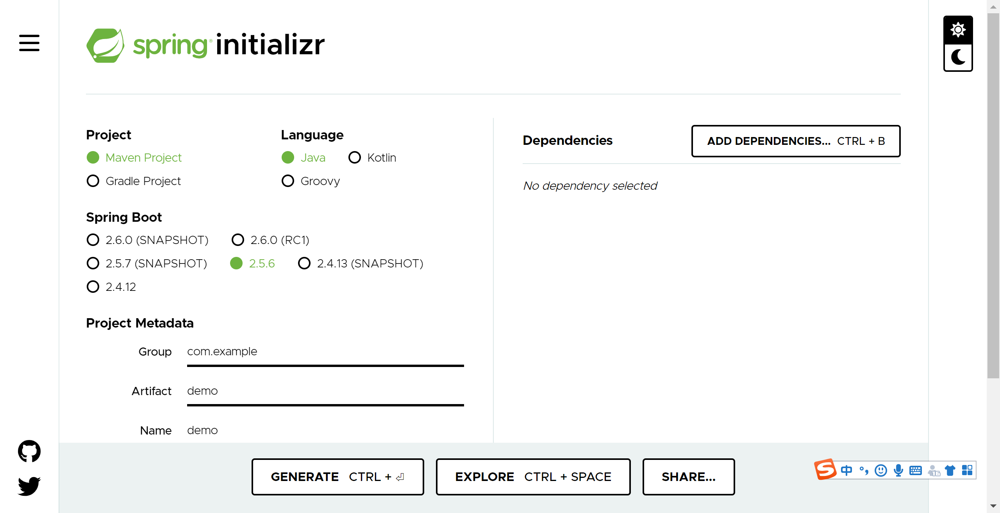
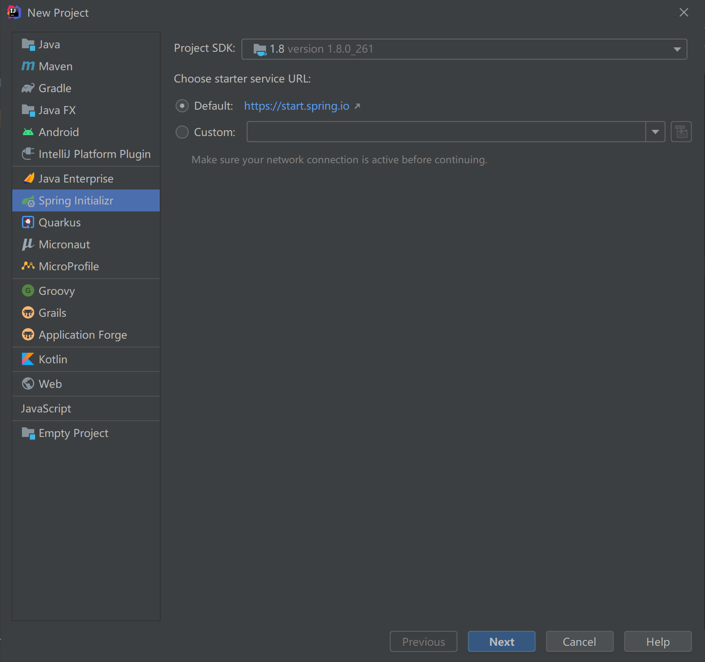
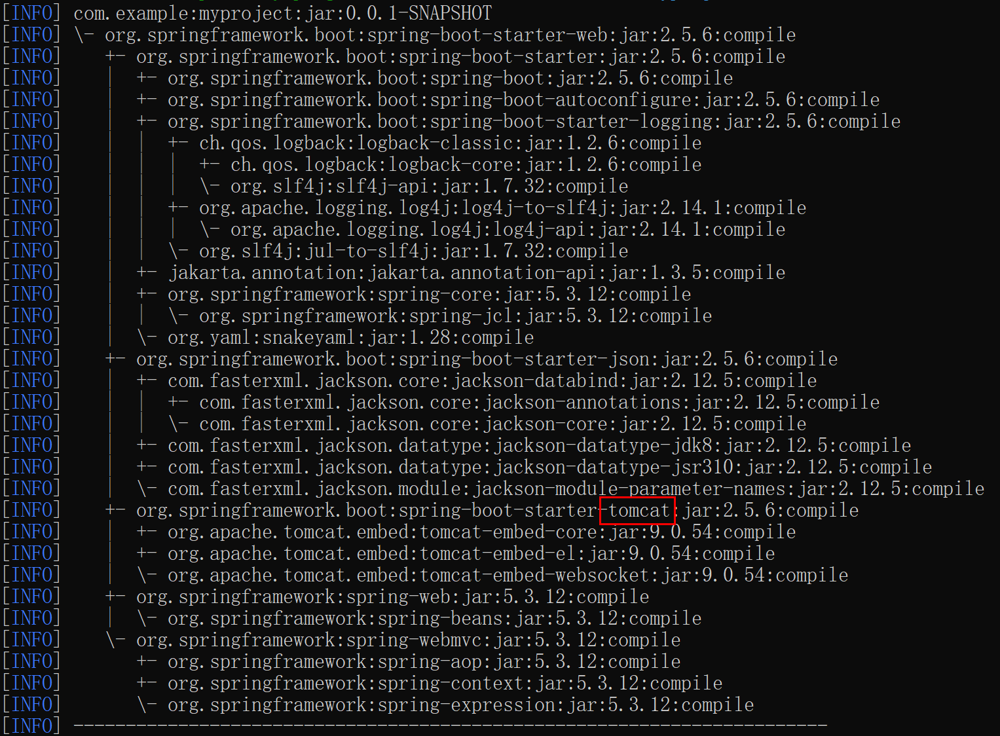

# 【Spring】开发你的第一个SpringBoot应用


创建SpringBoot项目最便捷的**方式一**是在https://start.spring.io/根据步骤选择后，下载项目工程压缩包：



**方式二**是在IDEA旗舰版中根据步骤选择后，直接创建项目：



本文则会根据官方文档，介绍一种**最原始的方式**，一个一个文件来开发一个SpringBoot应用。

在开始介绍之前，先执行以下命令检查Java和Maven版本正确：

```shell
$ java -version
java version "1.8.0_102"
Java(TM) SE Runtime Environment (build 1.8.0_102-b14)
Java HotSpot(TM) 64-Bit Server VM (build 25.102-b14, mixed mode)
```

```shell
$ mvn -v
Apache Maven 3.5.4 (1edded0938998edf8bf061f1ceb3cfdeccf443fe; 2018-06-17T14:33:14-04:00)
Maven home: /usr/local/Cellar/maven/3.3.9/libexec
Java version: 1.8.0_102, vendor: Oracle Corporation
```

## 创建POM

新建一个Maven的`pom.xml`文件：

```xml
<?xml version="1.0" encoding="UTF-8"?>
<project xmlns="http://maven.apache.org/POM/4.0.0" xmlns:xsi="http://www.w3.org/2001/XMLSchema-instance"
    xsi:schemaLocation="http://maven.apache.org/POM/4.0.0 https://maven.apache.org/xsd/maven-4.0.0.xsd">
    <modelVersion>4.0.0</modelVersion>

    <groupId>com.example</groupId>
    <artifactId>myproject</artifactId>
    <version>0.0.1-SNAPSHOT</version>

    <parent>
        <groupId>org.springframework.boot</groupId>
        <artifactId>spring-boot-starter-parent</artifactId>
        <version>2.5.6</version>
    </parent>

    <!-- Additional lines to be added here... -->

</project>
```

然后执行命令`mvn package`，测试一下，出现BUILD SUCCESS就说明环境已经OK了，SpringBoot也已经下载到了本地仓库中。

## 添加Classpath依赖

SpringBoot提供了很多starter，用来把jar包添加到classpath中。前面使用的`spring-boot-starter-parent`是一个特殊的starter，必须先添加这个starter才能通过Maven把其他starter的依赖管理起来。

可以使用以下命令查看依赖树：

```shell
$ mvn dependency:tree

[INFO] com.example:myproject:jar:0.0.1-SNAPSHOT
```

可以看出来`spring-boot-starter-parent`没有提供任何依赖，所以继续添加另外一个starter：

```xml
<dependencies>
    <dependency>
        <groupId>org.springframework.boot</groupId>
        <artifactId>spring-boot-starter-web</artifactId>
    </dependency>
</dependencies>
```

再查看依赖树，就会发现多了很多：



既包括了SpringBoot依赖，也包括了Tomcat等附加依赖。

## 编写代码

新建目录和文件`src/main/java/MyApplication.java`，添加代码：

```java
import org.springframework.boot.SpringApplication;
import org.springframework.boot.autoconfigure.EnableAutoConfiguration;
import org.springframework.web.bind.annotation.RequestMapping;
import org.springframework.web.bind.annotation.RestController;

@RestController
@EnableAutoConfiguration
public class MyApplication {

    @RequestMapping("/")
    String home() {
        return "Hello World!";
    }

    public static void main(String[] args) {
        SpringApplication.run(MyApplication.class, args);
    }

}
```

注解是SpringBoot相比于其他框架来说，我个人认为最牛逼的设计之一。

- `@RestController`注解表示RESTful风格，直接返回结果。
- `@RequestMapping`注解路由HTTP请求，这里将`/`路径映射到home方法。
- `@EnableAutoConfiguration`根据添加的依赖自动配置SpringBoot。

## 启动服务

**确保已经配置好了Java环境变量**，然后执行命令`mvn spring-boot:run`，就能看到服务启起来了：

```
$ mvn spring-boot:run

  .   ____          _            __ _ _
 /\\ / ___'_ __ _ _(_)_ __  __ _ \ \ \ \
( ( )\___ | '_ | '_| | '_ \/ _` | \ \ \ \
 \\/  ___)| |_)| | | | | || (_| |  ) ) ) )
  '  |____| .__|_| |_|_| |_\__, | / / / /
 =========|_|==============|___/=/_/_/_/
 :: Spring Boot ::  (v2.5.6)
....... . . .
....... . . . (log output here)
....... . . .
........ Started MyApplication in 2.222 seconds (JVM running for 6.514)
```

访问[localhost:8080](http://localhost:8080/)，页面返回：

```
Hello World!
```

## 打个可执行Jar包

要上生产环境，需要把代码打成一个可执行的jar包，里面包含了编译好的类，以及所有的依赖。

先在pom.xml中添加maven插件：

```xml
<build>
    <plugins>
        <plugin>
            <groupId>org.springframework.boot</groupId>
            <artifactId>spring-boot-maven-plugin</artifactId>
        </plugin>
    </plugins>
</build>
```

然后执行命令`mvn package`：

```
$ mvn package

[INFO] Scanning for projects...
[INFO]
[INFO] ------------------------------------------------------------------------
[INFO] Building myproject 0.0.1-SNAPSHOT
[INFO] ------------------------------------------------------------------------
[INFO] .... ..
[INFO] --- maven-jar-plugin:2.4:jar (default-jar) @ myproject ---
[INFO] Building jar: /Users/developer/example/spring-boot-example/target/myproject-0.0.1-SNAPSHOT.jar
[INFO]
[INFO] --- spring-boot-maven-plugin:2.5.6:repackage (default) @ myproject ---
[INFO] ------------------------------------------------------------------------
[INFO] BUILD SUCCESS
[INFO] ------------------------------------------------------------------------
```

在target目录下jar包就打好了：


执行命令`java -jar myproject-0.0.1-SNAPSHOT.jar`，也能启动服务了。

> 参考资料：
>
> https://docs.spring.io/spring-boot/docs/current/reference/htmlsingle/#getting-started.first-application