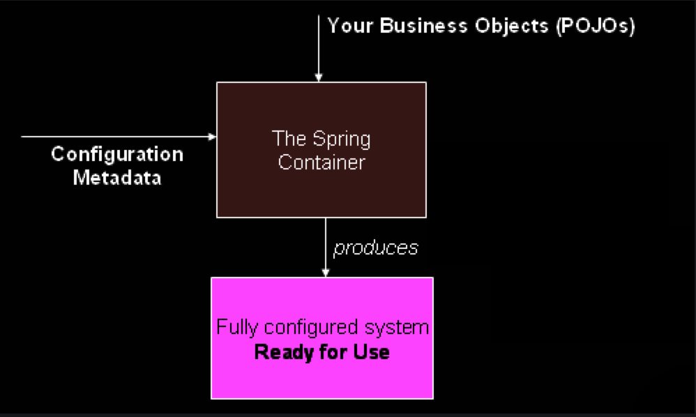

# 【Spring】对IoC容器和Bean的学习笔记


## What We Mean by "Spring"

The term "Spring" means different things in different contexts. It can be used to refer to the Spring Framework project itself, which is where it all started. Over time, other Spring projects have been built on top of the Spring Framework. Most often, when people say "Spring", they mean the entire family of projects. This reference documentation focuses on the foundation: the Spring Framework itself.

## Introduction

IoC，the Inversion of Control. IoC is also known as dependency injection (DI). （依赖注入实现了控制反转，为此Spring设计了The IoC Container这项技术）

It is a process whereby objects define their dependencies (that is, the other objects they work with) only through constructor arguments, arguments to a factory method, or properties that are set on the object instance after it is constructed or returned from a factory method. **The container then injects those dependencies when it creates the bean.** This process is fundamentally the inverse (hence the name, Inversion of Control) of the bean itself controlling the instantiation or location of its dependencies by using direct construction of classes or a mechanism such as the Service Locator pattern.

> 这段描述是关于"依赖注入"（Dependency Injection，DI）的解释。依赖注入是软件工程中的一种设计模式，它通过构造函数参数、工厂方法的参数或者在对象实例构造或从工厂方法返回后设置的属性来定义对象的依赖关系。容器在创建对象时注入这些依赖。这个过程本质上是对象本身通过直接构造类或使用服务定位器模式等机制来控制其依赖项的实例化或定位的反转（因此得名“控制反转”）。
>
> 传统上，对象可能会直接实例化或定位其所依赖的对象，导致紧耦合，并且难以修改或测试单个组件。**依赖注入通过将依赖管理的责任从对象本身移交给外部容器或框架来解决这个问题。**
>
> 应用依赖注入，对象可以更具可重用性和可维护性，因为它们只关注履行自己的职责，而依赖关系从外部进行注入。这样可以更好地分离关注点，并且可以更容易地修改依赖关系，而无需修改依赖对象。
>
> 通过依赖注入实现的控制反转还有助于测试，因为在单元测试期间，可以轻松地使用模拟对象替代依赖项，实现对各个组件的隔离测试。
>
> 总体而言，依赖注入是一种强大的技术，通过将依赖的创建和管理从依赖对象本身解耦，促进模块化、松耦合和可测试的软件设计。

The `org.springframework.beans` and `org.springframework.context` packages are the basis for Spring Framework’s IoC container.

In Spring, the objects that form the backbone of your application and that are managed by the Spring IoC container are called beans. **A bean is an object that is instantiated, assembled, and managed by a Spring IoC container.** Otherwise, a bean is simply one of many objects in your application. Beans, and the dependencies among them, are reflected in the configuration **metadata** used by a container.

## Container Overview

**The `org.springframework.context.ApplicationContext` interface represents the Spring IoC container** and is responsible for instantiating, configuring, and assembling the beans.

In stand-alone applications, it is common to create an instance of [`ClassPathXmlApplicationContext`](https://docs.spring.io/spring-framework/docs/6.0.11/javadoc-api/org/springframework/context/support/ClassPathXmlApplicationContext.html) or [`FileSystemXmlApplicationContext`](https://docs.spring.io/spring-framework/docs/6.0.11/javadoc-api/org/springframework/context/support/FileSystemXmlApplicationContext.html).



**Configuration Metadata**

The configuration metadata is represented in **XML, Java annotations, or Java code**. This configuration metadata represents how you, as an application developer, tell the Spring container to instantiate, configure, and assemble the objects in your application.

XML-based metadata is not the only allowed form of configuration metadata. Other forms of metadata with the Spring container, see:

- [Annotation-based configuration](https://docs.spring.io/spring-framework/reference/core/beans/annotation-config.html): define beans using annotation-based configuration metadata.

- [Java-based configuration](https://docs.spring.io/spring-framework/reference/core/beans/java.html): define beans external to your application classes by using Java rather than XML files. To use these features, see the[`@Configuration`](https://docs.spring.io/spring-framework/docs/6.0.11/javadoc-api/org/springframework/context/annotation/Configuration.html), [`@Bean`](https://docs.spring.io/spring-framework/docs/6.0.11/javadoc-api/org/springframework/context/annotation/Bean.html), [`@Import`](https://docs.spring.io/spring-framework/docs/6.0.11/javadoc-api/org/springframework/context/annotation/Import.html), and [`@DependsOn`](https://docs.spring.io/spring-framework/docs/6.0.11/javadoc-api/org/springframework/context/annotation/DependsOn.html) annotations.

XML-based configuration metadata configures these beans as `<bean/>` elements inside a top-level `<beans/>` element. Java configuration typically uses `@Bean`-annotated methods within a `@Configuration` class.

```xml
<?xml version="1.0" encoding="UTF-8"?>
<beans xmlns="http://www.springframework.org/schema/beans"
	xmlns:xsi="http://www.w3.org/2001/XMLSchema-instance"
	xsi:schemaLocation="http://www.springframework.org/schema/beans
		https://www.springframework.org/schema/beans/spring-beans.xsd">

	<bean id="..." class="...">
		<!-- collaborators and configuration for this bean go here -->
	</bean>

	<bean id="..." class="...">
		<!-- collaborators and configuration for this bean go here -->
	</bean>

	<!-- more bean definitions go here -->

</beans>
```

**Instantiating a Container**

```java
ApplicationContext context = new ClassPathXmlApplicationContext("services.xml", "daos.xml");
```

`services.xml`

```xml
<?xml version="1.0" encoding="UTF-8"?>
<beans xmlns="http://www.springframework.org/schema/beans"
	xmlns:xsi="http://www.w3.org/2001/XMLSchema-instance"
	xsi:schemaLocation="http://www.springframework.org/schema/beans
		https://www.springframework.org/schema/beans/spring-beans.xsd">

	<!-- services -->

	<bean id="petStore" class="org.springframework.samples.jpetstore.services.PetStoreServiceImpl">
		<property name="accountDao" ref="accountDao"/>
		<property name="itemDao" ref="itemDao"/>
		<!-- additional collaborators and configuration for this bean go here -->
	</bean>

	<!-- more bean definitions for services go here -->

</beans>
```

The `property name` element refers to the name of the JavaBean property, and the `ref` element refers to the name of another bean definition.

This linkage between `id` and `ref` elements expresses the dependency between collaborating objects.

`daos.xml`

```xml
<?xml version="1.0" encoding="UTF-8"?>
<beans xmlns="http://www.springframework.org/schema/beans"
	xmlns:xsi="http://www.w3.org/2001/XMLSchema-instance"
	xsi:schemaLocation="http://www.springframework.org/schema/beans
		https://www.springframework.org/schema/beans/spring-beans.xsd">

	<bean id="accountDao"
		class="org.springframework.samples.jpetstore.dao.jpa.JpaAccountDao">
		<!-- additional collaborators and configuration for this bean go here -->
	</bean>

	<bean id="itemDao" class="org.springframework.samples.jpetstore.dao.jpa.JpaItemDao">
		<!-- additional collaborators and configuration for this bean go here -->
	</bean>

	<!-- more bean definitions for data access objects go here -->

</beans>
```

**Composing XML-based Configuration Metadata**

Often, each individual XML configuration file represents a logical layer or module in your architecture.

Use one or more occurrences of the `<import/>` element to load bean definitions from another file or files. The following example shows how to do so:

```xml
<beans>
	<import resource="services.xml"/>
	<import resource="resources/messageSource.xml"/>
	<import resource="/resources/themeSource.xml"/>

	<bean id="bean1" class="..."/>
	<bean id="bean2" class="..."/>
</beans>
```

**The Groovy Bean Definition DSL**

```groovy
beans {
	dataSource(BasicDataSource) {
		driverClassName = "org.hsqldb.jdbcDriver"
		url = "jdbc:hsqldb:mem:grailsDB"
		username = "sa"
		password = ""
		settings = [mynew:"setting"]
	}
	sessionFactory(SessionFactory) {
		dataSource = dataSource
	}
	myService(MyService) {
		nestedBean = { AnotherBean bean ->
			dataSource = dataSource
		}
	}
}
```

**Using the Container**

By using the method `T getBean(String name, Class<T> requiredType)`, you can retrieve instances of your beans.

```java
// create and configure beans
ApplicationContext context = new ClassPathXmlApplicationContext("services.xml", "daos.xml");

// retrieve configured instance
PetStoreService service = context.getBean("petStore", PetStoreService.class);

// use configured instance
List<String> userList = service.getUsernameList();
```

Indeed, your application code should have no calls to the `getBean()` method at all and thus have no dependency on Spring APIs at all. For example, Spring’s integration with web frameworks provides dependency injection for various web framework components such as **controllers and JSF-managed beans**, letting you declare a dependency on a specific bean through metadata (such as an autowiring annotation).

## Bean Overview

Beans are created with the configuration metadata that you supply to the container (for example, in the form of XML `<bean/>` definitions).

> Class只是Class，但是如果配置到了XML的`<bean/>`，那么它就成为了the Spring Bean。

BeanDefinition：

- A package-qualified class name: typically, the actual implementation class of the bean being defined.

- Bean behavioral configuration elements, which state how the bean should behave in the container (scope, lifecycle callbacks, and so forth).

- References to other beans that are needed for the bean to do its work. These references are also called collaborators or dependencies.

- Other configuration settings to set in the newly created object — for example, the size limit of the pool or the number of connections to use in a bean that manages a connection pool.

**Naming Beans**

In XML-based configuration metadata, you use the `id` attribute, the `name` attribute, or both to specify bean identifiers.

**Aliasing a Bean outside the Bean Definition**

```xml
<alias name="fromName" alias="toName"/>
```

**Instantiating Beans**

If you use XML-based configuration metadata, you specify the type (or class) of object that is to be instantiated in the `class` attribute of the `<bean/>` element.

**Instantiation with a Constructor**

```xml
<bean id="exampleBean" class="examples.ExampleBean"/>

<bean name="anotherExample" class="examples.ExampleBeanTwo"/>
```

**Instantiation with a Static Factory Method**

```xml
<bean id="clientService"
	class="examples.ClientService"
	factory-method="createInstance"/>
```

```java
public class ClientService {
	private static ClientService clientService = new ClientService();
	private ClientService() {}

	public static ClientService createInstance() {
		return clientService;
	}
}
```

**Instantiation by Using an Instance Factory Method**

```xml
<!-- the factory bean, which contains a method called createInstance() -->
<bean id="serviceLocator" class="examples.DefaultServiceLocator">
	<!-- inject any dependencies required by this locator bean -->
</bean>

<!-- the bean to be created via the factory bean -->
<bean id="clientService"
	factory-bean="serviceLocator"
	factory-method="createClientServiceInstance"/>
```

```java
public class DefaultServiceLocator {

	private static ClientService clientService = new ClientServiceImpl();

	public ClientService createClientServiceInstance() {
		return clientService;
	}
}
```

In Spring documentation, "factory bean" refers to a bean that is configured in the Spring container and that creates objects through an [instance](https://docs.spring.io/spring-framework/reference/core/beans/definition.html#beans-factory-class-instance-factory-method) or [static](https://docs.spring.io/spring-framework/reference/core/beans/definition.html#beans-factory-class-static-factory-method) factory method.

**Determining a Bean’s Runtime Type**

The recommended way to find out about the actual runtime type of a particular bean is a `BeanFactory.getType` call for the specified bean name.

> 参考资料：
>
> The IoC Container https://docs.spring.io/spring-framework/reference/core/beans.html