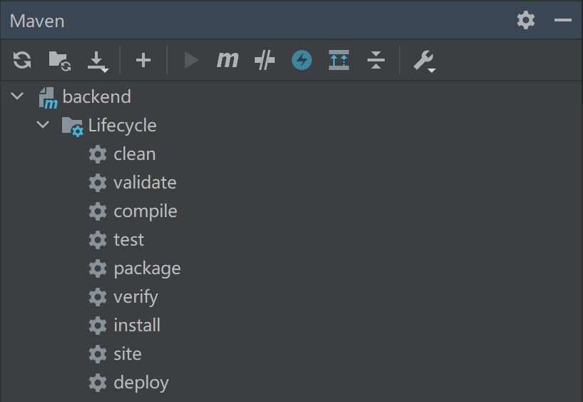
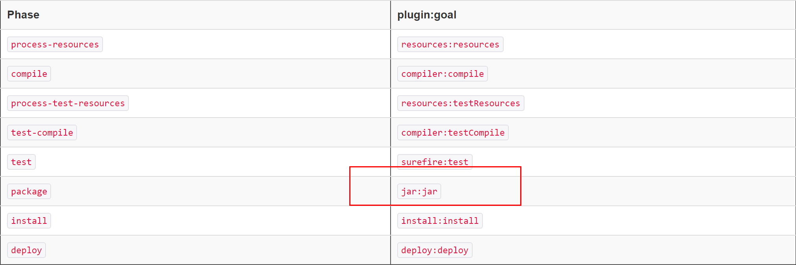

# 【Maven】跟着官方文档学Maven构建生命周期


在IntelliJ IDEA中，显示了Maven的Lifecycle：



只需要学习这些命令，就能构建一个Maven项目。

## 三个内置生命周期

Maven内置了三个生命周期：clean、default和site。生命周期是由多个**顺序执行的阶段**组成，它们的关系和说明如下：

### clean

清理文件。

- pre-clean clean前置阶段
- **clean** 移除上次构建生成的所有文件
- post-clean clean后置阶段

### default

主要生命周期，用来构建应用。

- **validate** 验证项目正确，必要信息有效
- initialize 初始化构建状态，比如设置属性或创建目录
- generate-sources 生成编译的源代码
- process-sources 处理源代码，比如过滤任意值
- generate-resources 生成包中的资源文件
- process-resources 复制和处理资源文件到目标目录，为打开做准备
- **compile** 编译项目的源码
- process-classes 后处理（post-process）编译源代码生成的文件，比如给Java class文件做bytecode enhancement
- generate-test-sources 生成编译的测试代码
- process-test-sources 处理测试代码，比如过滤任意值
- generate-test-resources 创建测试需要的资源
- process-test-resources 复制和处理资源文件到测试目录
- test-compile 编译测试代码到测试目录
- process-test-classes 后处理（post-process）编译测试代码生成的文件，比如给Java class文件做bytecode enhancement
- **test** 使用单元测试框架（如JUnit）执行测试，这些测试不能依赖已经打包（packaged）或部署（deployed）的代码
- prepare-package 打包前准备，一般会生成处理过的未打包的前置版本包
- **package** 将编译后的代码进行打包，比如jar包、war包
- pre-integration-test 集成测试前置阶段，比如创建环境
- integration-test 集成测试，在环境中进行测试
- post-integration-test 集成测试后置阶段，比如清理环境
- **verify** 验证包有效且质量达标
- **install** 安装包到本地仓库，以便于本地项目依赖
- **deploy** 复制包到远程仓库，共享给其他人使用

### site

一般用来创建文档。

- pre-site 前置阶段
- **site** 生成项目的网站文档
- post-site 后置阶段
- site-deploy 把生成的网站文档部署到web服务器

## 命令行执行

Maven提供了一个`mvn`命令，把它的路径（如`D:\Program Files\JetBrains\IntelliJ IDEA 2020.3.3\plugins\maven\lib\maven3\bin`）添加到环境变量就能直接使用。

- `mvn verify` 如果不知道执行什么命令，可以执行这条命令，它会把前置命令都执行了：validate，compile，test，package。同时也会执行代码检查比如checkstyle，以及集成测试。
- `mvn clean deploy` 常用来清理构建部署到仓库，如果项目有多个子模块，Maven会遍历所有模块执行。

对于`pre-*`, `post-*`, `process-*`等短横线命名的阶段则不能使用命令行直接执行，它们主要用来生成中间结果。比如单元测试覆盖率工具Jacoco和执行容器插件Docker可能会绑定到`pre-integration-test`来准备集成测试环境，然后在`post-integration-test`来收集覆盖率统计或者销毁容器。Failsafe和Code coverage插件绑定到了`integration-test`和`verify`两个阶段，在`verify`执行后生成测试报告。如果执行`verify`是没有问题的，但是如果直接执行`integration-test`，就可能导致无法生成测试报告，甚至集成测试环境也没有被彻底清理。

**IntelliJ IDEA集成了所有没有短横线命名的这些可以直接执行的命令。**

## Plugin Goals

Maven除了生命周期的阶段，还提供了一个更精细的任务，叫做插件目标（Plugin Goals）。示例：

```
mvn clean dependency:copy-dependencies package
```

`dependency:copy-dependencies`就是一个插件目标，表达式为`plugin:goal`。

其实**阶段都是由插件目标组成的**，Maven默认进行了绑定，比如`clean:clean`、`compiler:compile`、`deploy:deploy`等。package阶段打包类型不同插件目标也有区别：`jar:jar`、`war:war`。

一个典型的打jar包的阶段和插件目标如下图所示：



## Plugin

Plugin是用来给Maven提供goals的，比如Compiler plugin包括2个goals：`compile`用来编译main源代码，`testCompile`用来编译测试代码。Plugin在pom.xml中进行配置，比如：

```xml
<project xmlns="http://maven.apache.org/POM/4.0.0"
  xmlns:xsi="http://www.w3.org/2001/XMLSchema-instance"
  xsi:schemaLocation="http://maven.apache.org/POM/4.0.0
  http://maven.apache.org/xsd/maven-4.0.0.xsd">
<modelVersion>4.0.0</modelVersion>
<groupId>com.companyname.projectgroup</groupId>
<artifactId>project</artifactId>
<version>1.0</version>
<build>
<plugins>
<plugin>
<groupId>org.apache.maven.plugins</groupId>
<artifactId>maven-antrun-plugin</artifactId>
<version>1.1</version>
<executions>
   <execution>
      <id>id.validate</id>
      <phase>validate</phase>
      <goals>
         <goal>run</goal>
      </goals>
      <configuration>
         <tasks>
            <echo>validate phase</echo>
         </tasks>
      </configuration>
   </execution>
   <execution>
      <id>id.compile</id>
      <phase>compile</phase>
      <goals>
         <goal>run</goal>
      </goals>
      <configuration>
         <tasks>
            <echo>compile phase</echo>
         </tasks>
      </configuration>
   </execution>
   <execution>
      <id>id.test</id>
      <phase>test</phase>
      <goals>
         <goal>run</goal>
      </goals>
      <configuration>
         <tasks>
            <echo>test phase</echo>
         </tasks>
      </configuration>
   </execution>
   <execution>
         <id>id.package</id>
         <phase>package</phase>
         <goals>
            <goal>run</goal>
         </goals>
         <configuration>
         <tasks>
            <echo>package phase</echo>
         </tasks>
      </configuration>
   </execution>
   <execution>
      <id>id.deploy</id>
      <phase>deploy</phase>
      <goals>
         <goal>run</goal>
      </goals>
      <configuration>
      <tasks>
         <echo>deploy phase</echo>
      </tasks>
      </configuration>
   </execution>
</executions>
</plugin>
</plugins>
</build>
</project>
```

多个goals按配置的先后顺序运行。executions用来对goals进行配置，也可以添加id进行标识。

> 实际的配置会复杂许多，可以参考开源项目：
>
> https://github.com/metersphere/metersphere
>
> https://github.com/macrozheng/mall

## 小结

本文介绍了Maven内置的三个生命周期，生命周期是由多个阶段组成，IntelliJ IDEA集成了所有没有短横线命名的这些可以直接执行的阶段。阶段是由阶段目标（Plugin Goals）构成的，在pom.xml中进行配置。pom.xml是Maven一个很重要很常用的文件。

> 参考资料：
>
> https://maven.apache.org/guides/introduction/introduction-to-the-lifecycle.html
>
> https://www.runoob.com/maven/maven-build-life-cycle.html