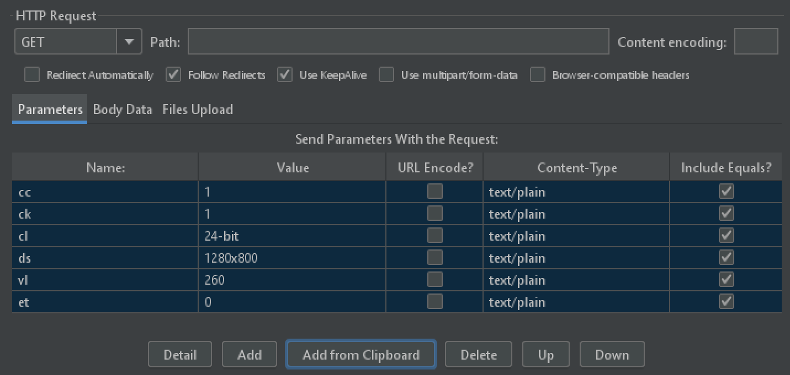
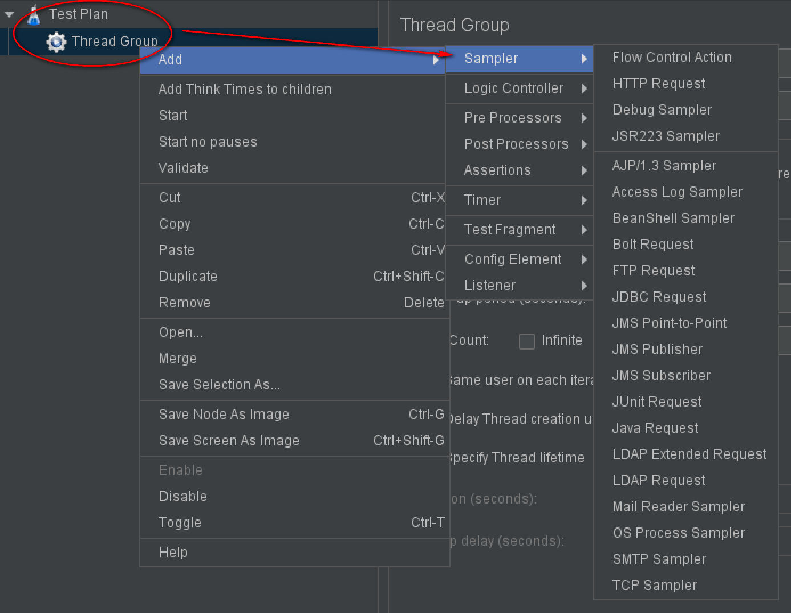
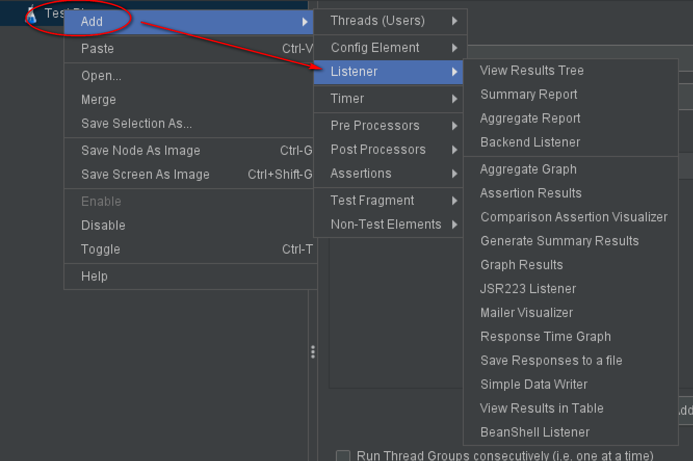
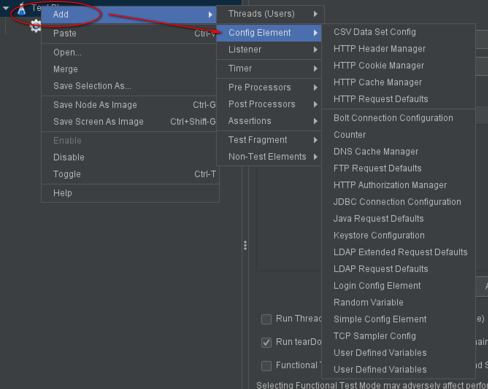
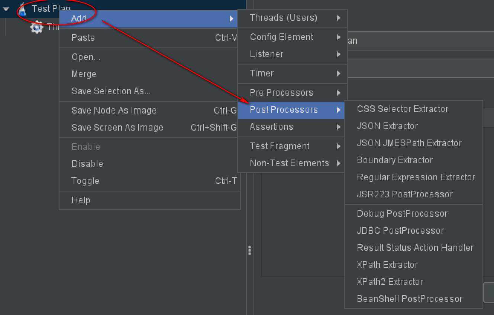
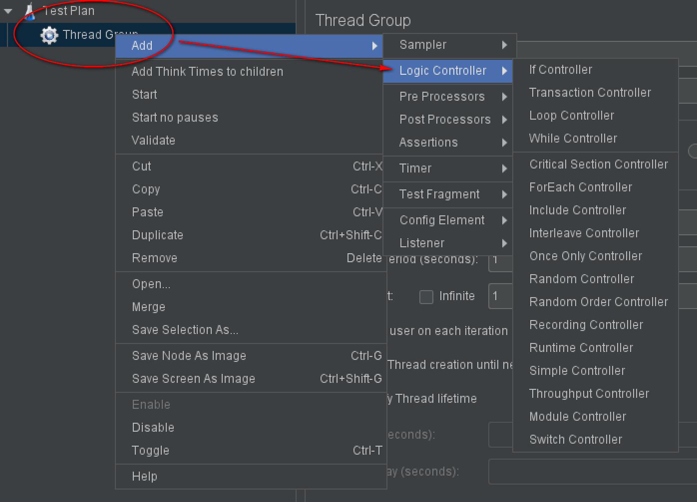
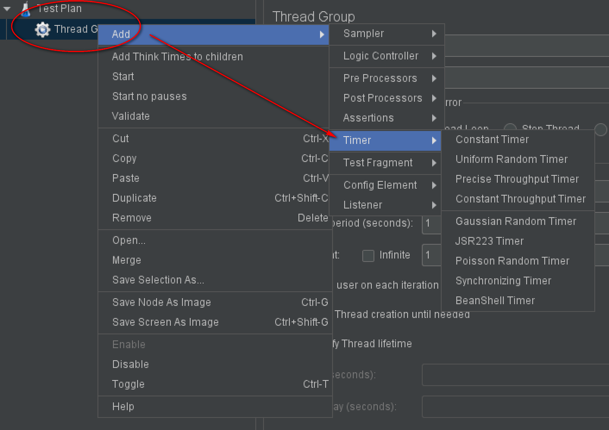
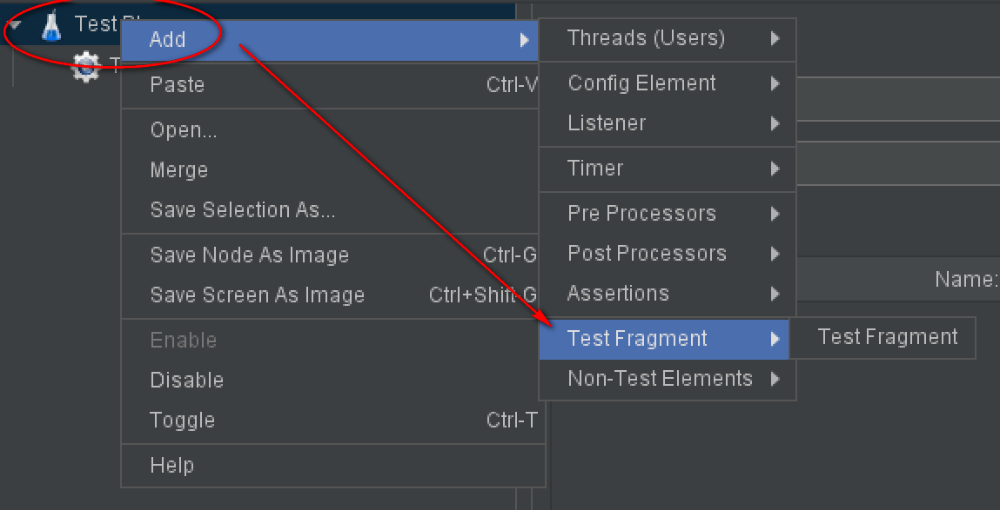

# 【JMeter】JMeter全部组件概览

JMeter是性能测试工具，在使用JMeter变多以后，越来越觉得之所以它能成为当今时代最主流测试工具，是因为它太成熟了，举个小例子，编写GET请求的时候，需要把查询参数，也就是?号后面的请求参数添加进去，JMeter竟然有个Add from Clipboard功能，在浏览器复制以后，点这个按钮就填充好了:

有优点也有缺点，它的UI界面确实丑了点，英文版稍微弥补了一下，相较于中文，只由24个字母组成的英文感官上更简洁一点点。JMeter系列文章都将基于英文版进行截图，重要信息会翻译为中文进行解释。

JMeter最核心的元素是组件，它们构成了JMeter结构图：

这是一个三维空间，先看Z轴，只有监听器，用于对测试结果数据进行收集和统计。X轴分为5个阶段，从上往下是运行流程。Y轴中的Y1元件很多，用来模拟用户请求，Y2是断言，对请求响应结果进行验证。接下来一个一个元件来看。

## Threads

第一步就得添加这个，没有线程组，JMeter也没法使用。一个线程模拟一个用户，线程组用来模拟多个用户。

## Sampler

Sampler是一个无界面浏览器，用于发送请求，接收响应。支持现有各种协议，比如HTTP、WebSocket、MQTT等。默认没有的话，添加个第三方jar包就可以了，还支持自定义jar包，扩展性极强。

## Assertions

响应对不对，用断言来验证，从图中可以看到，断言类型有很多种。

## Listener

用的最多的是第一个：View Results True，实时查看请求响应数据。压测时还会添加Aggregate Report，实时查看线程组统计数据，包括平均响应时间、吞吐量、TPS等性能测试指标。此外，还有其他类型的图表报告，可以导出成本地文件进行分析。

## Pre Processors

请求前的预处理，比如连接数据库等。

## Config Element

JMeter四种参数化方式这里面就有两个：CSV Data Set Config和User Defined Variables，顾名思义它们就是为请求提供配置数据的，还有HTTP Header Manager给请求添加Header，HTTP Cookie Manager自动记录服务器返回的Cookie。

## Post Processors

对响应进行数据提取使用后置处理器，常见的是使用Regular Expression Extractor正则表达式提取，我现在用的比较多的是JSON JMESPath Extractor，语法更直观，匹配更精确。

## Logic Controller

JMeter也具备逻辑控制能力，预置了多种控制器，比如Once Only Controller，可以用来只读取一次csv文件，或者只登陆一次。

## Timer

它提供了各种功能的定时器，比如Constant Timer就像脚本里面的sleep，等待一段时间。比如Synchronizing Timer设置集合点，让多个线程同一时刻发起请求。

## Test Fragment

可以通过 测试计划|Test Fragment 添加。线程组也可以添加。

可用于临时备份元件，Test Fragment下的元件不会被运行。封装后可被模块控制器调用，就像编程一样。

## 小结

本文是JMeter系列开篇，介绍了全部组件的概览情况，从结构图可以知道，取样器、断言、监听器组合在一起可以完成发送请求、验证结果和记录结果。前置处理器、配置元件、后置处理器为取样器提供了数据支持。逻辑控制器具备流程控制能力，实现业务需求。定时器设置等待时间和集合点等。Test Fragment用来备份元件，底下的元件不会被运行。这些组件的底层是由线程组驱动的。

> 参考资料：
>
> 《全栈性能测试修炼宝典JMeter实战》
>