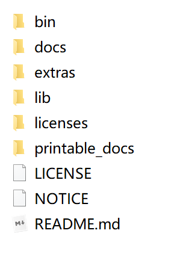
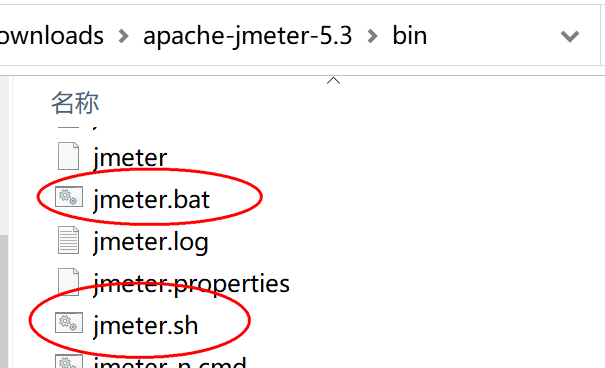
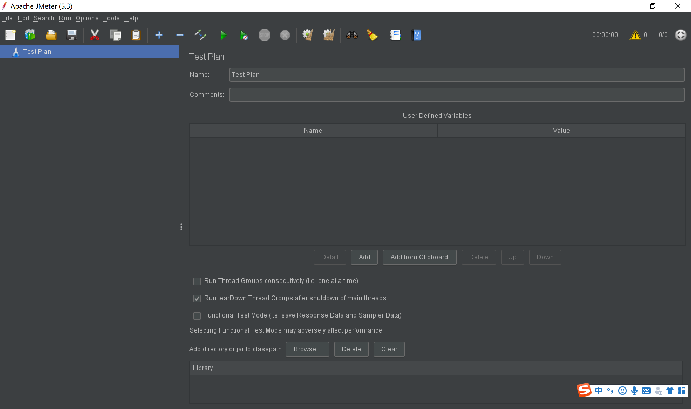
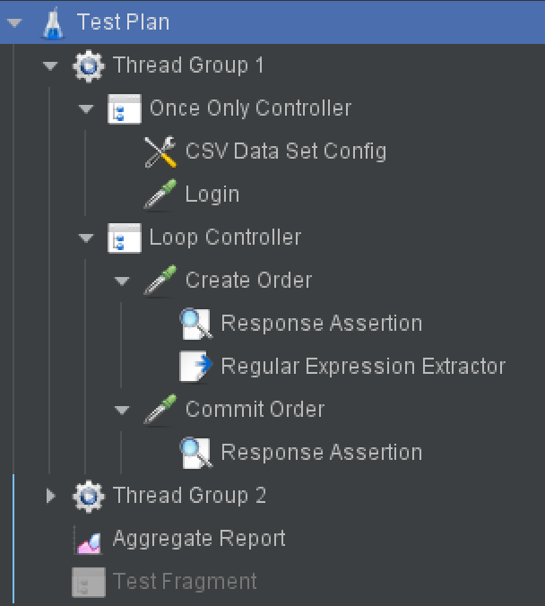
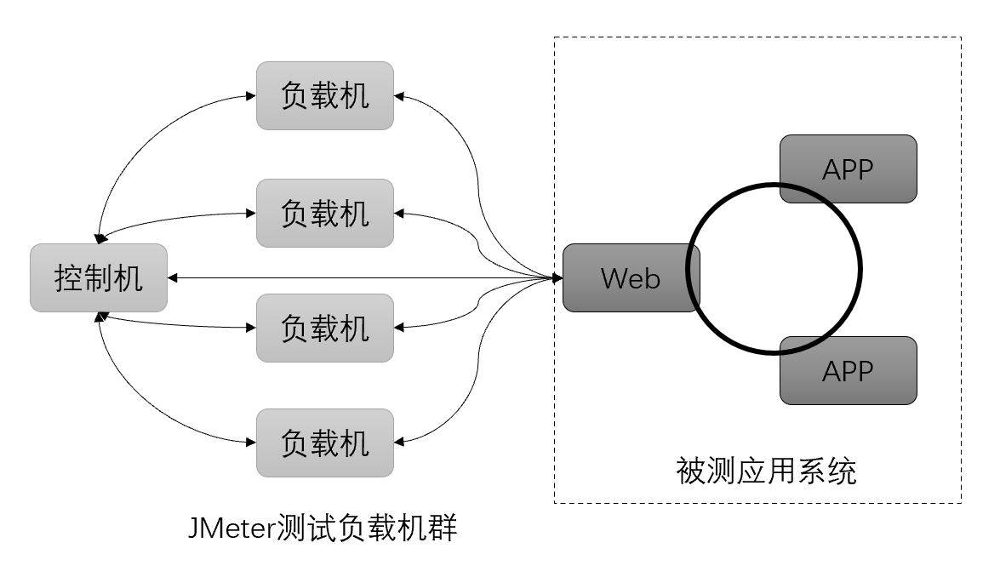
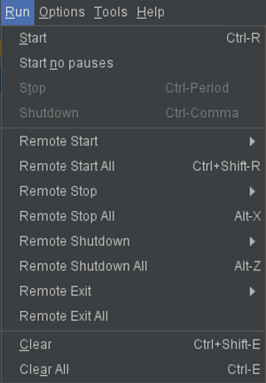

# 【JMeter】JMeter是如何运行施压的

## 运行文件

JMeter下载地址为：

https://jmeter.apache.org/download_jmeter.cgi

最新版本为5.4.1，依赖于Java8+，下载后无需安装，解压即用。解压后的目录和文件如下：

- bin 二进制文件目录，包括配置文件、启动文件、启动jar包、示例脚本。比如Windows和Linux系统的两个启动脚本：

- docs API离线帮助文档。
- extras 辅助功能，可用于Ant、Jenkins集成。
- lib lib根目录下存放JMeter基础jar包，lib/ext目录下存放第三方或自定义扩展jar包。
- licenses 证书文本文件。
- printable_docs 离线帮助文档。
- LICENSE 证书说明。
- NOTICE 版权声明。
- README 简介。

## 测试计划

JMeter以图形界面方式启动后，首先映入眼帘的是左侧的TestPlan，测试计划：

JMeter的UI界面只能同时编辑一个测试计划，如果想再编辑另外一个测试计划，必须再打开一个JMeter界面。这是因为测试计划对应的是.jmx文件！不同的.jmx文件只能在不同的界面中编辑。

JMeter界面是通过组件拖拽的方式来编写脚本的，脚本的根目录是测试计划。根节点只能有一个，作为根节点，测试计划很适合来做全局配置，比如在User Defined Variables处添加键值对格式的全局变量。

测试计划是默认节点，JMeter还有另外一个不可缺少的次节点：Thread Group，线程组。

## 多线程

性能测试工具的目的是用少量电脑产生成百上千个并发请求。多进程和多线程正好能用来实现这个需求，书上有句关于进程和线程的至理名言：“进程是操作系统分配资源的最小单位，线程是程序执行的最小单位”。该如何理解呢？前一句的意思是说，每个应用程序都有对应的进程，按照进程来分配资源，可以使得资源利用最大化，避免浪费。后一句的理解得从一个故事讲起，很久以前，进程拿着资源找CPU执行。CPU一看进程太大，说我处理不了。进程只能拆成多个线程给CPU，不但能执行了，还能在线程之间灵活切换。

多进程和多线程都可以用来模拟并发请求。JMeter是用Java语言写的程序，运行在JVM虚拟机之上，进程的开销比线程大很多，JVM为了保证足够性能，控制了进程的数量。如果用多线程，单台电脑能提供了负载有限，那么就只能用多线程。JMeter只支持多线程！

> 另外一个性能测试工具LoadRunner支持多进程和多线程。

## 用户即线程

JMeter除了Thread Group，其他地方都是用的另外一个词：User。实际上它们是一个意思，用户就是线程。JMeter的运行原理就是用多个线程来模拟多个用户！以下是简单示例：

从图中可以看出，有两个线程组，Thread Group 1和Thread Group 2，它们分别定义了自己组内的用户要做的事情。不同线程组做的事情是不一样的，但是同一线程组内部做的事情是一模一样的。我们在写JMeter脚本的时候，实际上是在定义每个用户要做哪些事。当运行脚本的时候，JMeter会启动多个线程，都来执行这个脚本，按照我们写的进行执行。

> 由于每个线程启动时间不一样，线程执行时资源环境也有区别，导致线程的执行进度并不完全一致，比如一些线程已经登录完了，另一些线程可能才刚开始登录。后面的文章会给出一些解决办法。

## 远程运行

一台机器提供了线程数量有限，如果想要施压更大的并发，那么就需要多台机器。JMeter天然支持多台机器并发：

控制机和负载机本质上没有区别，同一台机器既可以做控制机，也可以做负载机，取决于你的负载设计。控制机的作用是管理多台远程负载机，控制远程负载机脚本运行，收集远程负载机测试结果。负载机是实际产生并发的机器，它们向被测应用系统发起负载。

运行逻辑如下：

- 远程负载机启动Agent客户端，等待控制机连接。
- 控制机连接上远程负载机。
- 控制机发送指令到远程负载机启动线程。
- 远程负载机运行脚本，回传结果数据。
- 控制机收集结果并显示。

操作步骤如下：

1. 远程负载机启动jmeter-server.bat。

2. 在控制机bin\JMeter.properties文件中，修改remote_hosts，添加远程负载机的ip和port，多个远程负载机ip 用逗号分隔，如remote_hosts=192.168.0.1:1664,192.168.0.2:1664。1664是默认RMI端口号（Remote Method Invocation，远程方法调用）。

5. 在控制机菜单栏Run执行Remote命令：

   

> 如果远程负载机需要参数或jar包，可以手动先把环境准备好，也可以使用自动化工具在脚本运行前从控制机发送到远程负载机。

## 小结

本文先从JMeter运行文件讲起，启动后默认有测试计划，建线程组，线程即用户，用多线程来模拟多用户，这就是JMeter运行起来施压的原理。为了解决单台机器负载能力有限的问题，JMeter还提供了远程运行方式，既可以在局域网用多台机器来控制，也可以部署到云服务器上，进行云压测。

