# 【JMeter】JMeter英文版界面介绍

JMeter的界面虽然不华丽，但是使用起来还是很便利。本文将基于英文版界面对整个可视区域进行介绍，如果想看中文版，请在菜单栏点击Choose Language切换：

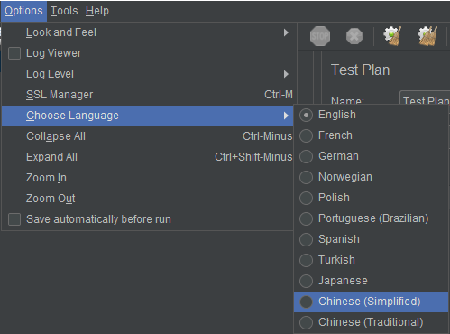

启动后的界面分为3个区域：

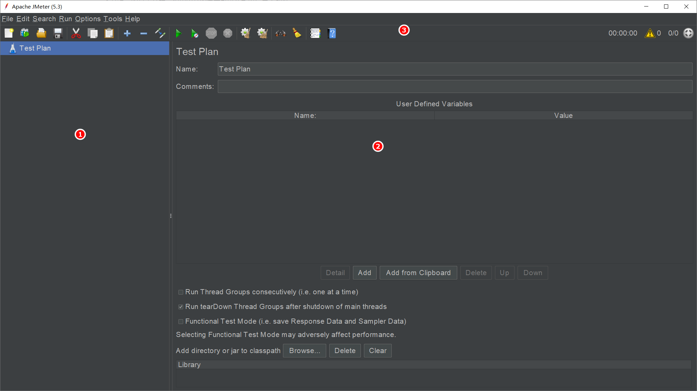

①是目录树，②是元件编辑区，③是工具栏。

### 目录树

目录树，是个目录，树状结构，包括父节点和子节点。根节点是测试计划，可以添加子节点：线程组、配置元素、监听器、定时器、前置处理器、后置处理器、断言、Test Fragment ：

其中，线程组是必须添加的！为什么JMeter不给默认加上？因为线程组不止一种。

线程组的子节点，可以是取样器、逻辑控制器、前置处理器、后置处理器、断言、定时器、Test Fragment、配置元素、监听器：

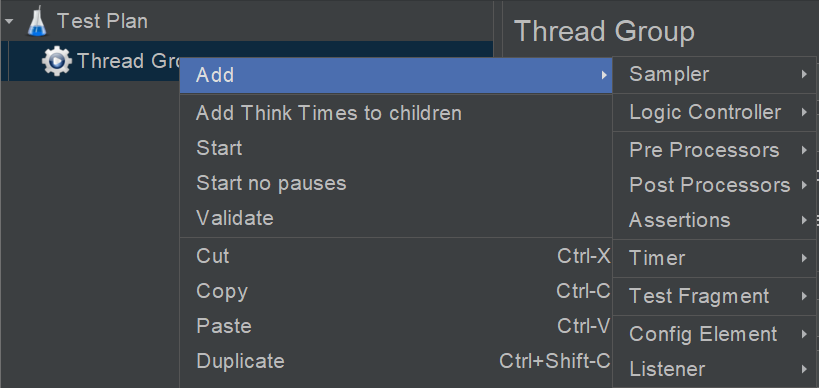

> 提示：取样器和逻辑控制器只能在线程组中添加，不能在测试计划中添加。

在运行时，目录树会从上往下顺序执行。

### 编辑区

编辑区跟目录树的节点是关联的，不同的节点，编辑区会显示相应节点的可编辑内容。

这一部分会随着系列文章的更新，在涉及到某个组件如何使用的时候，再进行说明。

### 工具栏

JMeter5.3版本的工具栏一共有24个按钮或图标：

一一来看看：

①新建测试计划。

②基于模板创建测试计划：

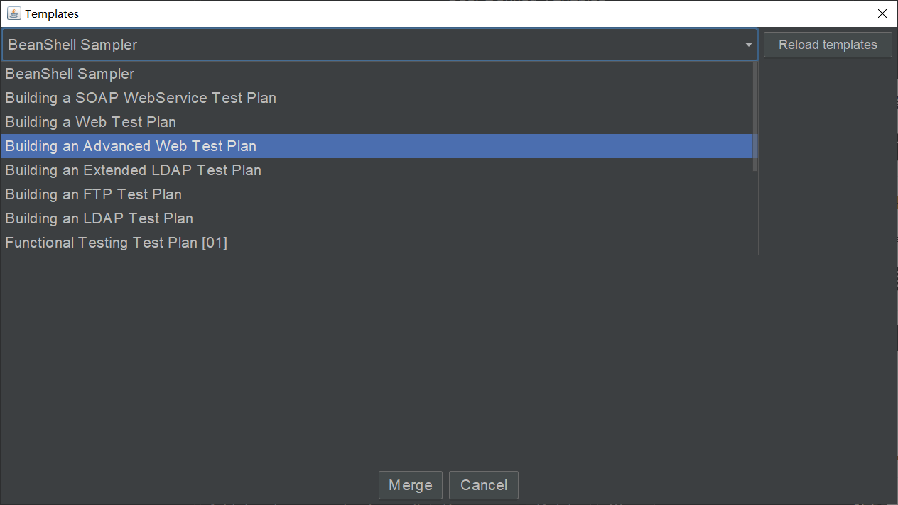

JMeter提供了常见场景的压测脚本，可以选择模板快速创建，比如Web测试。

③打开.jmx脚本文件。

④把当前测试计划保存为.jmx脚本文件。

⑤删除目录树中的节点，如果选中的是父节点，那么它子节点也会一同被删除。

⑥复制元件。

⑦粘贴元件。

⑧展开目录树。

⑨收起目录树。

⑩禁用或启用元件，如果是目录树中的父节点，那么其子节点也会一同被禁用。在调试时可以用这个功能！

⑪运行测试计划。

⑫运行测试计划，忽略定时器。

⑬停止，直接把所有线程停掉，类似于“杀进程”。

⑭关闭，等当前线程执行完成后结束线程。

停止和关闭在点击后会弹出相同的对话框，从实际效果来看，停止比关闭的结束速度更快：

⑮清除响应数据，比如察看结果树、聚合报告，但不会清除日志控制台。

⑯清除全部数据，包括日志控制台。

⑰查找对话框，支持正则：

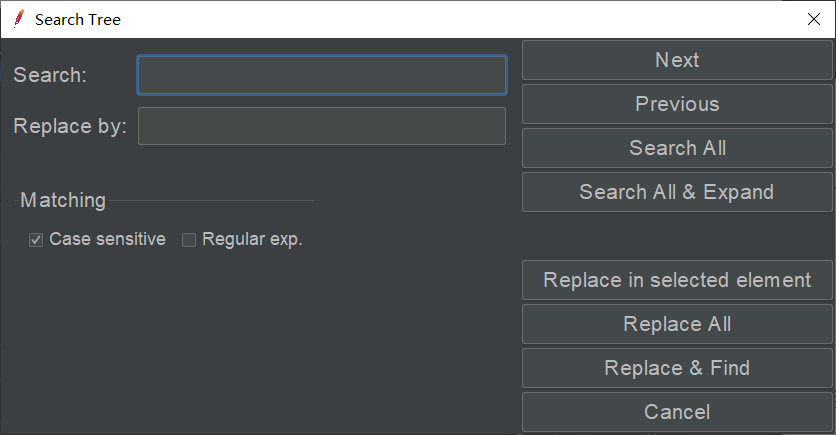

⑱清除查找对话框输入内容。

⑲函数助手对话框：

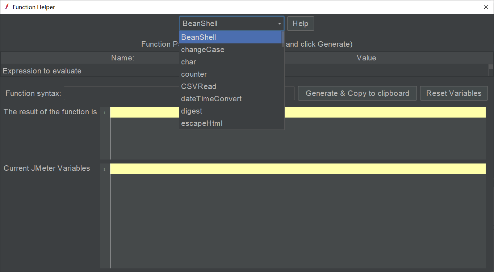

⑳帮助文档。

21执行耗时，以秒为单位。

22错误日志个数，点击后会打开日志控制台。

23正在运行线程数/总线程数。

24运行状态，运行测试计划后变绿色。

### 菜单栏

菜单栏除了工具栏那些功能，还有更丰富的其他功能。

#### 文件

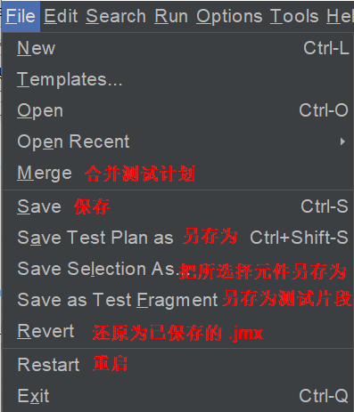

#### 编辑

不同元件，编辑菜单内容略有不同。以下是线程组的编辑菜单：

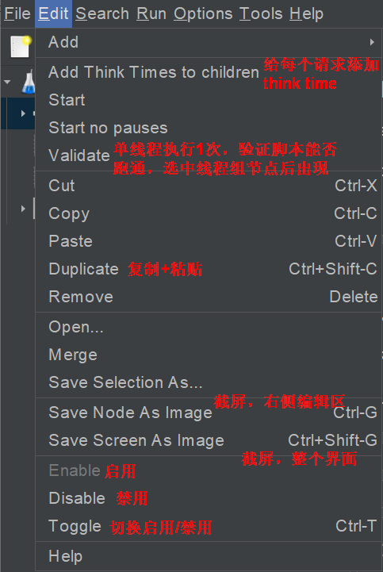

#### 查找

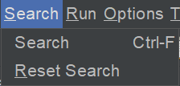

#### 运行

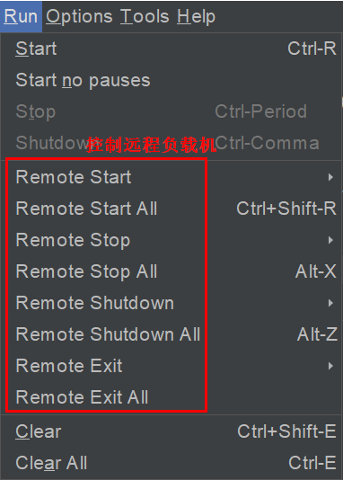

#### 选项

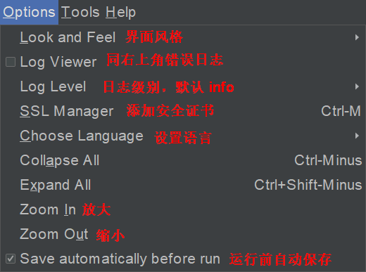

#### 工具

### 元件使用场景

打开JMeter后，一般会按照以下步骤在目录树中添加元件：

1. 添加线程组，用线程模拟用户，产生大量负载。
2. 添加取样器，发起并发请求。
4. 添加监听器，查看请求响应，测试结果。
4. 添加断言，验证结果正确性。

如果取样器需要参数化，通过配置元件（自定义变量、CSV、函数）或前置处理器（用户参数）来完成。

如果需要做关联，通过后置处理器（如正则表达式提取）来完成。

> 关联：从上一条请求中获取数据，在下一条请求中使用。

如果需要设置场景，比如模拟多少用户，运行多少时间，压测策略如何，可以修改线程组编辑区内容。

如果需要同一时刻发送请求加压，可以使用同步定时器。

如果需要控制业务的执行逻辑，可以使用逻辑控制器。

### 小结

本文基于JMeter5.3英文版对整体界面进行了介绍，元素很简洁，功能很丰富。如果不适应英文版，那么也可以在菜单栏中切换到中文版使用。最后给出了元件常见使用场景，包括添加步骤、参数化、关联、压测场景设置、同一时刻发送请求、控制业务逻辑。

> 参考资料：
>
> 《全栈性能测试修炼宝典JMeter实战》

