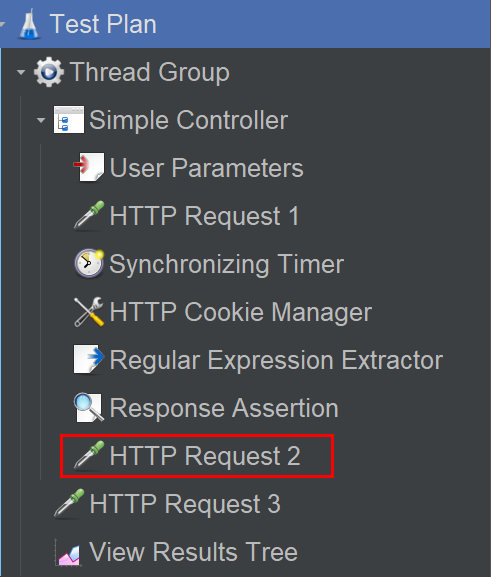
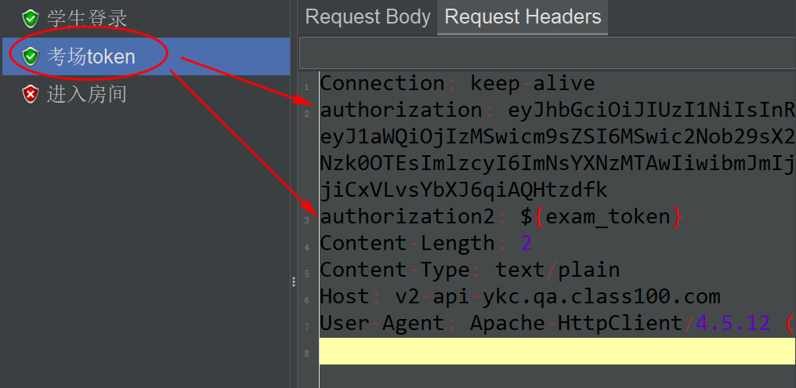

# 【JMeter】JMeter元件作用域实践指南

## 从一个问题说起

对于以下测试脚本：

为了能调用进入房间接口，需要从考场接口获取考场token。为了调用考场接口，需要从登陆接口获取登陆token。元件说明如下：

- 学生登录，提取登录`${token}`传入下个接口参数。

- 添加HTTP Header Manager：

  

- 考场token，提取考场`${exam_token}`传入下个接口参数。

- 添加HTTP Header Manager：

  

- 进入房间

貌似挺合理，HTTP Header Manager会给下方的接口添加请求头，运行结果真的如我们所料么？

## 运行顺序

在回答这个问题之前，有必要搞懂JMeter元件的运行顺序，它是由2 个维度来决定的：从上往下和元件类型。

从上往下，即目录树从上往下。元件类型，分为3类：

- 线程组、逻辑控制器。
- 取样器。
- 配置元件、前置处理器、定时器、后置处理器、断言、监听器。

它们的运行顺序如下：

1. 配置元件（如果存在）

2. 前置处理器（如果存在）

3. 定时器（如果存在）

4. 取样器（如果存在）

5. 后置处理器（如果存在且取样器的结果不为空）

6. 断言（如果存在且取样器的结果不为空）

7. 监听器（如果存在且取样器的结果不为空）

换句话说，假设我们新建了1个线程，想用这个线程去发请求。

第一步，初始化配置，比如参数化、设置Header、Cookie等，用到配置元件。

第二步，可能需要给线程加点参数，比如用户参数，用到前置处理器。

第三步，在发送请求前可能会等待一段时间，用到定时器。

第四步，发送请求，用到取样器。

第五步，可能需要提取响应数据，比如正则表达式提取器、JMESPath提取器，用到后置处理器。

第六步，验证结果符合预期，用到断言。

第七步，查看请求响应数据和测试结果，用到监听器。

## 实践指南

对于以下所列元件：

JMeter会按以下步骤运行：

1. 线程组（如果有多个线程组可以在测试计划设置是顺序执行还是同时执行）
2. 简单控制器（父节点）
3. HTTP Cookie管理器（配置元件）
4. 用户参数（前置处理器）
5. Synchronizing Timer（定时器）
6. HTTP 请求1（取样器）
7. 正则表达式提取器（后置处理器）
8. 响应断言（断言）
9. HTTP Cookie管理器（配置元件）
10. 用户参数（前置处理器）
11. Synchronizing Timer（定时器）
12. HTTP 请求2（取样器）
13. 正则表达式提取器（后置处理器）
14. 响应断言（断言）
15. HTTP 请求3（取样器）
16. 察看结果树（严格来讲是与第 6 步并行，也就是取样器之后）

## 作用域

其中有个观察作用域实际效果的关键元件：HTTP请求2，它的前后并没有元件，但是也被作用上了。在JMeter中，同一层级的元件具有相同的作用域！

> 简单控制器是一个执行单元，本身没有内容，它的作用是把元件进行分组：
>
> 
>

因为简单控制器通过分组给元件划分了层级，所以简单控制器下面的这些同层级元件，作用域相同，既会作用于 HTTP请求1，也会作用于HTTP请求2。注意了！配置元件、前置处理器、定时器、后置处理器、断言、监听器，这六个组件，会作用到范围内的所有取样器。

除了同级作用域，还有上下级，JMeter的上级作用域包含下级作用域，但是下级是不能作用到上级。比如HTTP请求3，简单控制器下级的元件，是不会作用到HTTP请求3的。

## 回答开头的问题

HTTP Header Manager是配置元件，会作用到范围内的所有取样器。这里有2个HTTP Header Manager，都位于同一层级，它们会一起执行。在JMeter同一执行单元中，如果相同类型的元件有多个，那么它们会被当做一个一起执行！

测试一下，把最后一个HTTP Header Manager的authorization重命名为authorization2，查看考场接口的Headers：

两个HTTP Header Manager都作用上了。

为了避免混乱，在实际使用时建议：

- 根据先后顺序，从上往下合理的放置元件的顺序。
- 对于配置元件、前置处理器、定时器、后置处理器、断言这六类元件，它们都是为取样器服务的，如果只想作用于单个取样器，那么最好放在这个取样器的下级。

按照建议调整后的测试脚本如下：

> User Defined Variables和CSV Data Set Config，是配置元件，且跟取样器同级，会同时作用到这 3 个取样器上面。

## 小结

本文开头引入了我在实际工作中碰到的问题，为了解决，先搞懂了JMeter元件运行顺序，然后参考了实践指南，发现了同一层级作用域相同这个原理，总结出了使用建议，配置元件、前置处理器、定时器、后置处理器、断言这六类元件，最好放在取样器的下级，调整后脚本如期运行。

