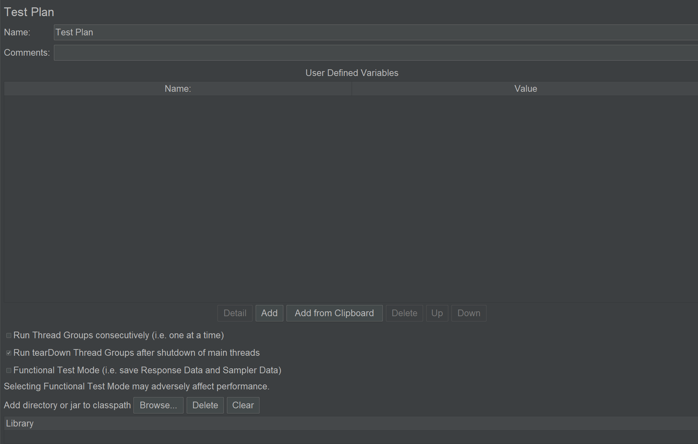
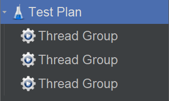

# 【JMeter】JMeter测试计划配置项解析

测试计划（Test Plan），是JMeter目录树的初始根节点，它的编辑区如下：

## Name

带有业务含义的名字。

## Comments

备注。

## User Defined Variables

用户自定义变量，实际上就是全局变量。

表格共两列，第一列是Name变量名，第二列是Value变量值。表格下方的功能按钮，用来对表格进行增删改查和上下移动，还能直接从剪贴板添加。定义好的变量通过`${}`格式来使用，比如变量a值为1，使用时写作`${a}`。

这个地方定义的实际上是字符串常量，比如刚才已经定义了一个变量名a变量值1，再定义变量名b变量值`${a} + 1`，b的实际值不是整型2而是字符串`"${a} + 1"`！

## Run Thread Groups consecutively

控制多个线程组是顺序执行或并行执行，比如：

如果勾选了这个选项，顺序执行：前一个线程组执行完以后，再执行下一个线程组。

如果不勾选这个选项，并行执行：执行没有先后顺序，结果是随机的。

## Run tearDown Thread Groups after shutdown of main threads

线程组包括初始化线程组和清理线程组：

这个选项默认已勾选，会执行清理线程组。

## Funtional Test Mode

没用，不学。

## Add directory or jar to classpath

要搞懂这个，得先学习Java中的classpath和jar包。Java源文件是`.java`文件，编译后是`.class`文件。Java的执行器JVM（Java虚拟机），只能执行`.class`文件。为了让JVM找到那个想要的`.class`文件，需要把`.class`文件路径添加到classpath中。为了方便管理，会把多个`.class`文件打成一个包，变成一个`.jar`文件，叫做jar包。

JMeter是用Java写的，可以添加jar包扩展功能，添加入口有2个：

1. 第一个入口是测试计划此选项，Add directory or jar to classpath。
2. 推荐！第二个入口是把jar包放入`lib/ext`目录。

## 小结

JMeter测试计划是根节点，适合定义全局变量和设定全局配置，编辑区的选项也体现了这一特点。

> 参考资料：
>
> https://www.liaoxuefeng.com/wiki/1252599548343744/1260466914339296