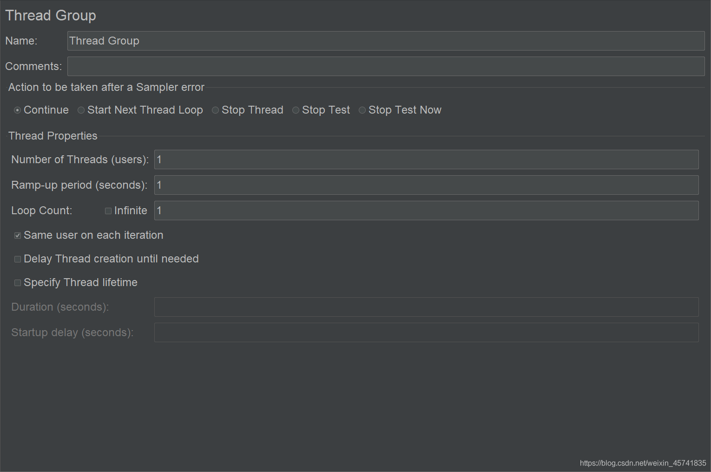
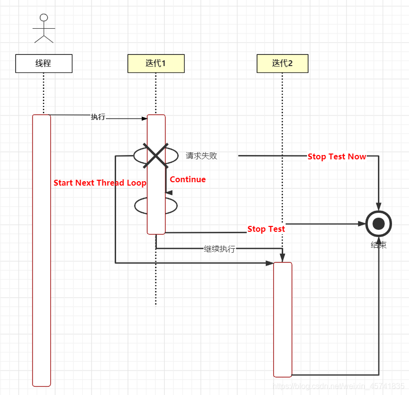

# 【JMeter】JMeter100个线程竟然只模拟出1个并发

线程组编辑区如下：

有点复杂，但是慢慢看下来，还是比较容易理解。

## Name

带有业务含义的名字。

## Comments

线程组的备注说明。

## Action to be taken after a Sampler error

取样器报错后执行动作。有5个选项：Continue，Start Next Thread Loop，Stop Thread，Stop Test，Stop Test Now。为了搞懂这几个选项，我画了张时序图进行说明：

- 图中有一个线程，在最左边。
- 右边有两个迭代：迭代1和迭代2。
- 每个迭代有两个请求，第一个请求失败。
- **Stop Thread是直接结束线程，没有画出来，一般不会设置此项，不然会导致运行线程越来越少，最后负载不够，对服务器的压力不够，测试结果不具参考性。**
- 剩余4个选项用红色字体标注了出来。

线程在第一个迭代的第一个请求失败了。Continue表示继续执行第二个请求，再执行第二个迭代；Start Next Thread Loop表示忽略第二个请求，跳到第二个迭代执行；Stop Test表示把当前迭代的第二个请求执行完后，停止测试；Stop Test Now表示从第一个请求失败这里直接结束测试。

**JMeter默认选项是Continue，保证足够的并发压力。**我们在大量用户并发时，服务器偶尔响应错误是正常现象，比如服务器由于性能问题500，此时出错我们正好要记录下来，作为有性能问题的依据。

如果想减少关联请求报错，可以选择Start Next Thread Loop。

## Thread Properties

### Number of Threads (users)

线程组的线程数量。

### Ramp-up period (seconds)

启动时间，线程组在多少秒内启动完所有线程。

比如设置线程数为50，设置启动时间为10秒，那么每秒就会启动50 / 10 = 5个线程；如果设置为0秒，则50个线程会立刻启动；如果设置为100秒，就会每隔100 / 50 = 2秒启动1个线程。

### **Ramp-up period如何设置？**

以下是5个线程依次从启动到执行到退出的示意图：

**JMeter线程组产生的并发压力，实际上是红色框起来的那部分，在这个时间段才是所有线程在并发着运行。**

先从Ramp-up period设置最小和最大来分析这个问题：

1. 假设有3000个线程，只迭代1次，如果设置为0秒，那么测试一开始就会产生3000个并发请求，说不定直接把服务器压崩了，还没开始就结束了。
2. 假设有10个线程，只迭代1次，如果设置为100秒，那么每隔10秒启动1个线程，很可能前一个线程跑完了，下一个线程还没启起来，某一时刻最多只有1个线程在跑，没有并发压力。

接着看看该设置成多少？这个答案我找了很多资料，都没有明确的说法。结合实践经验来谈的话，既不能太小，也不能太大，可以根据业务场景、硬件配置、系统资源来进行设置。

### Loop Count

迭代次数。

- 填写数字，指定迭代次数。
- 勾选Infinite，无限迭代，一直运行到测试停止或异常崩溃。

### Same user on each iteration

每个迭代都用相同的user（线程）。

**默认这个选项是勾选的。**因为销毁和创建线程本身就会占用资源，可能会影响性能测试结果。

什么时候去掉勾选呢？比如登录，加了HTTP Cookie管理器以后，单个线程多次迭代（注意不是多个线程哦）登录用的都是相同的Cookie。去掉勾选后，同时在HTTP Cookie管理器选择清除旧Cookie：

那么每次迭代就能用不同Cookie了。

### Delay Thread creation until needed

保持默认就好。跟JVM创建线程时机有关，实际运用勾不勾选都不影响测试结果。

### Specify Thread lifetime

**Duration**

持续时间，单位秒。

前面的Loop Count勾选了Infinite，Duration才会生效。

**Startup delay**

启动延迟，单位秒。

延迟到多少秒后再启动线程。

## 小结

本文对线程组编辑区进行了揭秘，看似复杂，实则简单，问题在于实际使用过程中如何结合业务来设置，这需要实践经验不断积累才能找到答案。需要注意的是，如果Ramp-up period设置不当，有可能100个线程只能产生1个并发请求。

> 参考资料：
>
> 《全栈性能测试修炼宝典JMeter实战》
>
> https://www.cnblogs.com/hjhsysu/p/9189897.html