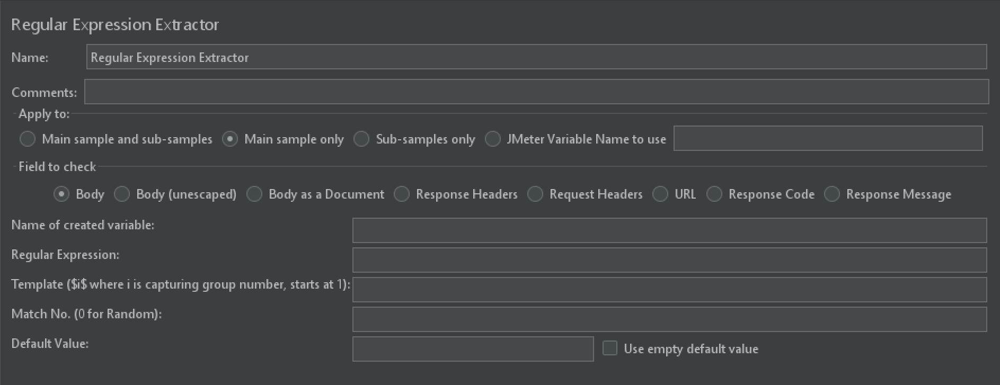

# 【JMeter】JMeter关联陌生又熟悉

## JMeter关联是什么

JMeter关联，这几个字看着可能会有点陌生，实际上却是工作中经常会做的一件事情，尤其是接口自动化，它指的是把一个接口的响应作为另一个接口的参数，从而**把接口关联起来**。

JMeter关联是通过后置处理器来实现的，本文将介绍两个主流提取器：正则表达式提取器和JSON JMESPath提取器。

## 正则表达式提取器

### Name

最好有业务含义的名称。

### Comments

可以为空的注释。

### Apply to

匹配范围。

**Main sample and sub-samples**

匹配当前父取样器及其子取样器。

**Main sample only**

仅匹配当前父取样器。

**Sub-samples only** 

仅匹配子取样器。

**JMeter Variable Name to use**

匹配JMeter变量。

### Field to check

匹配响应的字段，共七个选项。

**Body**：主体，最常用。

**Body(unescaped)** ：替换了所有的html转义符的响应主体内容，注意html转义符处理时不考虑上下文，因此可能有不正确的转换，不太建议使用。

**Body as a Document**：从不同类型的文件中提取文本，注意这个选项比较影响性能。

**Response Headers**：响应Headers。

**Request Headers**：请求Headers。

**URL**：请求URL。

**Response Code**：响应代码，比如200、404返回码。

**Response Message**：响应信息，比如“成功”、“OK”字样。

### Name of created variable

创建的变量名，比如变量名为token，通过`${token}`进行访问。

### Regular Expression

**正则表达式。**

> 正则表达式可阅读这篇文章进一步了解：[https://dongfanger.gitee.io/blog/未分类/001-5分钟轻松学正则表达式.html](https://dongfanger.gitee.io/blog/未分类/001-5分钟轻松学正则表达式.html)

### Template(`$i$` where i is capturing group number, starts at 1)

用`$$`引用起来，如果在正则表达式中有多个正则表达式（多个括号括起来的），则可以是`$1$`、`$2$`等等，`$1$`指第一个模板，`$2$`指第二个模板，依次类推，`$0$`指全文匹配，`$1$$2$`指同时取第一个和第二个模板。

### Match No.(0 for Random)

在匹配时往往会出现多个值匹配的情况，如果匹配数为0则代表随机取匹配值；可以用匹配数字来确定多个值中的哪一个；负数取所有值，可以与For Each Controller一起使用来遍历。

### Default Value  

默认值，如果没有匹配到可以指定一个默认值。

Use empty default value勾选后把空作为默认值，跟不填写效果一样。如果填写了默认值同时勾选此选项，默认值仍然为空。

## JSON JMESPath提取器

### Name

最好有业务含义的名称。

### Comments

可以为空的注释。

### Apply to

匹配范围。

**Main sample and sub-samples**

匹配当前父取样器及其子取样器。

**Main sample only**

仅匹配当前父取样器。

**Sub-samples only** 

仅匹配子取样器。

**JMeter Variable Name to use**

匹配JMeter变量。

### Name of created variable

创建的变量名，比如变量名为token，通过`${token}`进行访问。

### JMESPath expressions

**JMESPath表达式。**

> 可以访问官网进一步了解：[https://jmespath.org/](https://jmespath.org/)

### Match No.(0 for Random)

在匹配时往往会出现多个值匹配的情况，如果匹配数为0则代表随机取匹配值；可以用匹配数字来确定多个值中的哪一个；负数取所有值，可以与For Each Controller一起使用来遍历。

### Default Value  

默认值，如果没有匹配到可以指定一个默认值。

## 小结

本文首先介绍了JMeter关联的概念，实际上指的就是把一个接口的响应作为另一个接口的参数，从而把接口关联起来。然后分别以元件编辑区为内容，讲解了JMeter关联常用的两个后置处理器：正则表达式提取器和JSON JMESPath提取器。

> 参考资料：
>
> 《全栈性能测试修炼宝典JMeter实战》
>
> https://blog.csdn.net/weixin_43507959/article/details/104068508
>
> https://blog.csdn.net/doubledog1112/article/details/93480458

