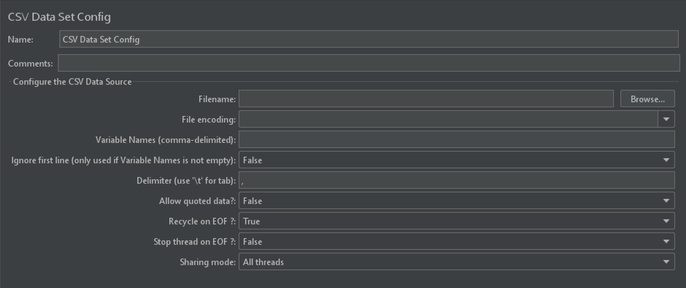
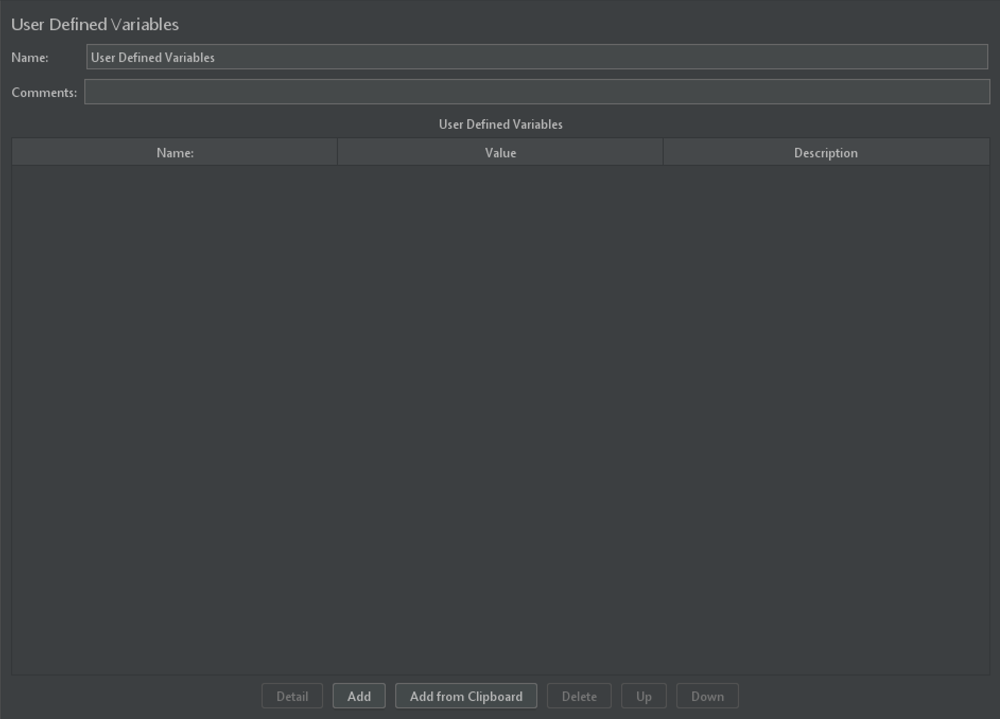
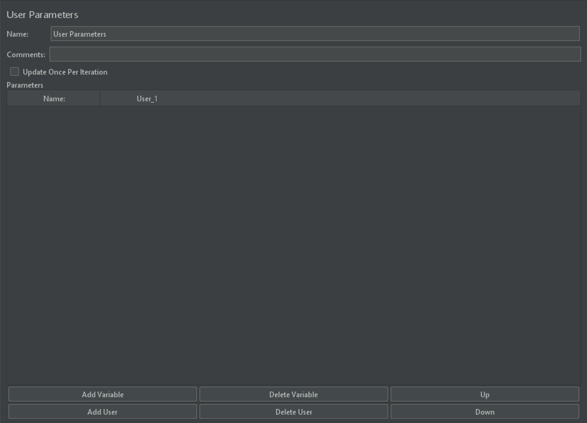
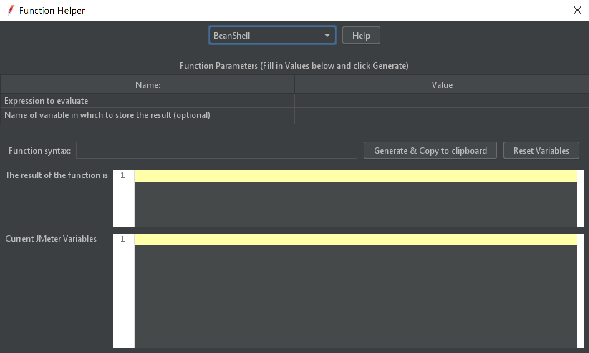

# 【JMeter】JMeter四种参数化方式

JMeter参数化是指**把固定的数据动态化**，这样更贴合实际的模拟用户请求，比如模拟多个不同账号。JMeter一共有四种参数化方式，分别是：

- CSV Data Set Config
- Function Helper
- User Defined Variables
- User Parameters

## CSV Data Set Config

所属组件：Config Element。

### Name

带业务含义的名字。

### Comments

可以为空的注释。

### Configure the CSV Data Source

【Filename】文件名，可以是相对路径也可以是绝对路径。**推荐使用相对路径**，好处是脚本迁移或者分发到多台远程负载机，不改脚本就能直接复用。相对路径的根节点是`%JMETER_HOME%\bin`，把CSV文件放到这个目录或其子目录下。

> 注意，打开方式选择bin目录下jmeter.bat或快捷方式才会把bin作为相对路径的根节点。如果把bin目录加入系统环境变量后，用cmd执行jmeter命令打开，那么相对路径的根节点是cmd的工作目录，比如`C:\Users\dongfanger\Desktop`。

【File encoding】文件编码，推荐用`UTF-8`。

【Variable Names (comma-delimited)】定义的变量名，用逗号隔开，与CSV文件的列一一对应。变量比列多，多余的变量取不到值；变量比列少，多余的列不会被取值。**此选项可以为空。**

【Ignore first line (only used if Variable Names is not empty)】**上一个选项的变量名为空时，此选项生效。**它会把CSV文件的第一行的列名作为变量名，并在取值时忽略第一行。

【Delimiter (use `'\t'` for tab)】CSV文件分隔符，默认为逗号，也可以用制表符。

【Allow quoted data】是否允许引用数据，比如双引号`"dongfanger,pass",1111`，允许后能拆分出`dongfanger,pass`和`1111`。

【Recycle on EOF】设置为True时，循环遍历CSV文件。

【Stop thread on EOF】设置为True时，遍历完CSV文件就结束线程。

> EOF是End Of File缩写，文件结束符。JMeter在测试执行过程中**每个线程每次迭代**会从参数文件中新取一行数据，从头遍历到尾。

【Sharing mode】有三种共享模式：默认为All threads，对所有线程共享；Current thread group只对当前线程组中的线程共享；Current thread仅当前线程获取。

> 比如2个线程组，每个线程组2个线程，共享同一个csv文件，那么迭代1次这4个线程会分别取前4条数据，互不重复；迭代2次这4个线程会分别取前8条数据，互不重复。

## User Defined Variables

所属组件：Config Element。

JMeter有两个User Defined Variables，它们的区别是：**Test Plan的User Defined Variables作用域是全局的，配置元件的User Defined Variables作用域可以是全局的也可以是局部的**。

表格共三列，第一列是Name变量名，第二列是Value变量值，第三列是Description描述。表格下方的功能按钮，用来对表格进行增删改查和上下移动，还能直接从剪贴板添加。

定义好的变量通过`${}`格式来使用，比如变量a值为1，使用时写作`${a}`。这个地方定义的实际上是字符串常量，比如刚才已经定义了一个变量名a变量值1，再定义变量名b变量值`${a} + 1`，**b的实际值不是整型2而是字符串**`"${a} + 1"`。

## User Parameters

所属组件：Pre Processors。**由于User Parameters属于前置处理器，所以它只会对当前Sampler生效。**

### Name名字

带业务含义的名字。

### Comments注释

可以为空的注释。

### Update Once Per Iteration

经过反复多次试验，勾选与否没看出区别。官方解释如下：

A flag to indicate whether the User Parameters element should update its variables only once per iteration. if you embed functions into the UP, then you may need greater control over how often the values of the variables are updated. Keep this box checked to ensure the values are updated each time through the UP's parent controller. Uncheck the box, and the UP will update the parameters for every sample request made within its scope.

从各文章截图总结，一般会勾选上这个选项。

### Parameters

表格列Name指变量名，表格列User_x指某个用户的变量值。下方有6个按钮，分别是“添加变量”、“删除变量”、“添加用户”、“删除用户”、“上移”、“下移”。每个线程分配一个变量值；如果线程数大于User_x，那么会循环取值。

> User Parameters在参数较少的情况下使用。

## Function Helper

函数除了参数化，还可以用来做运算，字符编码格式转换，获取运行时参数等，下篇文章专门来写。

## 小结

本文介绍了配置组件里面的CSV Data Set Config和User Defined Variables，作用域可全局可局部。接着介绍了前置处理器User Parameters，只对当前Sampler生效。但都有局限性，为了帮助我们更好地进行参数化，JMeter提供了一组函数来帮我们生成需要的数据，这些函数在有个地方能够进行编辑，它就是：Function Helper。

> 参考资料：
>
> 《全栈性能测试修炼宝典JMeter实战》
>
> http://tutorialjmeter.blogspot.com/2017/05/pre-processor-in-jmeter.html
>
> https://jmeter.apache.org/usermanual/component_reference.html#User_Parameters

