# 【JMeter】JMeter36个内置函数及11个新增函数介绍


JMeter内置了36个函数，这些函数可以通过函数助手进行编辑和测试。了解这些函数，不仅能提高JMeter的使用熟练度，也有助于知晓测试工具或测试框架通用的函数有哪些，在自主设计时，作为参考借鉴。

JMeter函数调用的写法是`${__function()}`，注意函数名前面需要添加**双下划线前缀**。

## `__BeanShell`脚本语言

执行BeanShell脚本。BeanShell是Java编写的Java源码解释器，小型、免费、可嵌入，可以像写脚本语言一样写Java，**无需编译，立即运行**。

示例，字符串拼接：


**输入表达式后，点击`Generate & Copy to clipboard`按钮，会生成函数语法并复制到粘贴板，同时输出函数运行结果。**

## `__char`

把数字转化成Unicode字符。

示例，数字65转化成字符A：

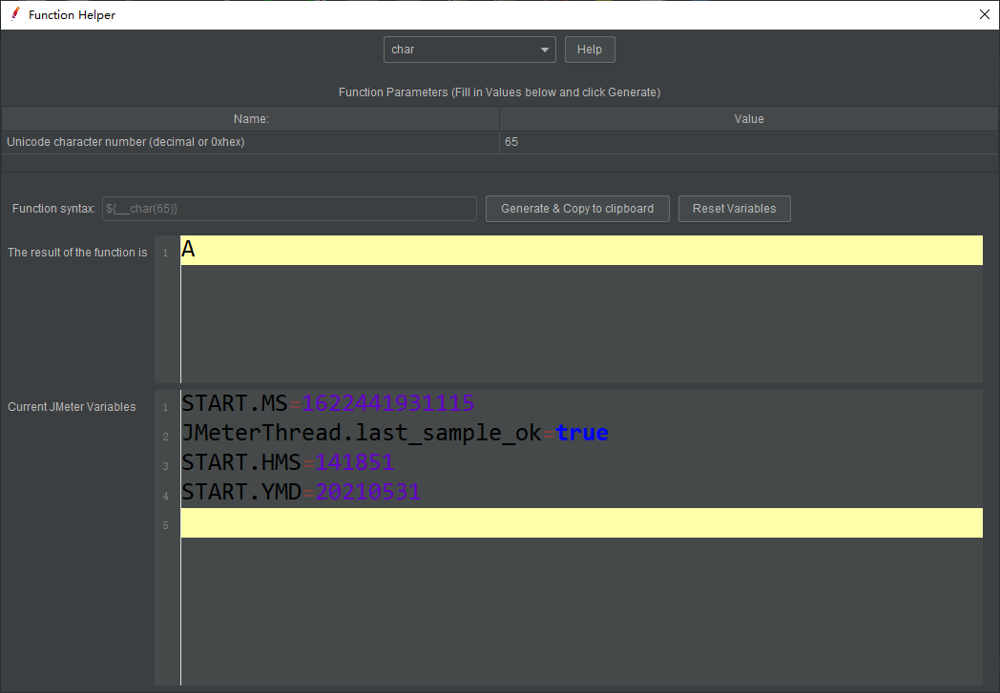

## `__counter`

统计线程的迭代次数。它有两个参数：

- 第一个参数，如果为true，那么每个线程单独统计；如果为false，那么所有线程合在一起统计。
- 第二个参数，变量名。

示例：

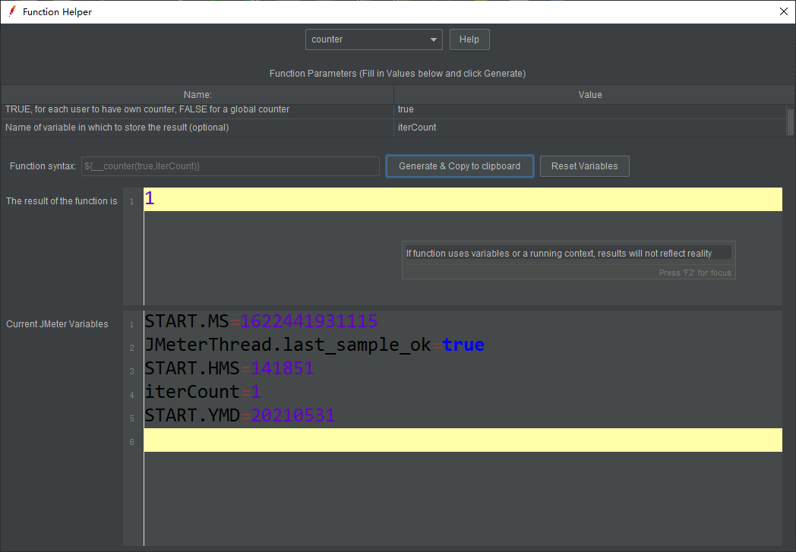

## `__CSVRead`

从CSV文件中读取数据。

### 固定取值

始终取第n列第一行的值。

示例：

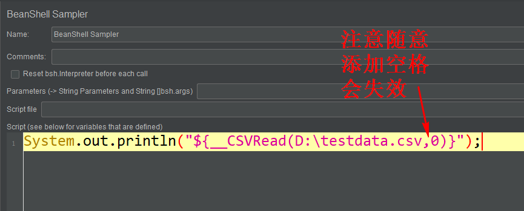

### 动态取值

使用next每次迭代取下一行数据。注意必须先取列，再取行。

示例：


### 文件别名

给文件名起个别名。

示例：

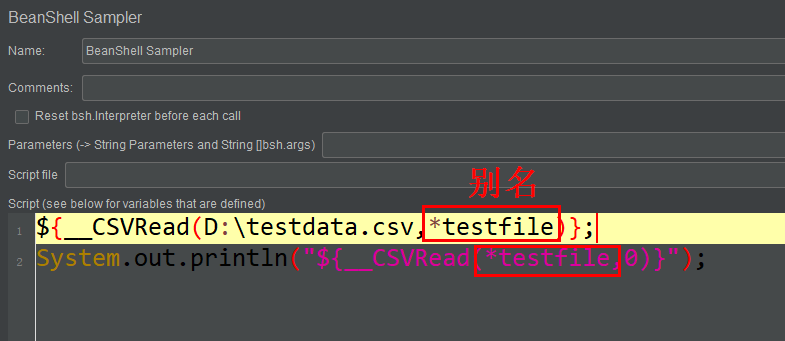

## `__escapeHtml`

HTML转义。

示例：

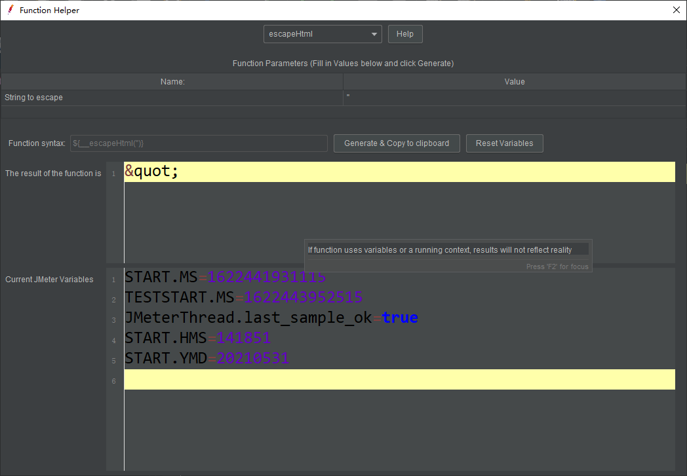

## `__escapeOroRegrexChars`

把一些Java正则表达式引擎不识别的正则表达式转换一下，这样就可以识别了。转换过程中使用了ORO正则表达式库。

示例：


## `__eval`

计算表达式。

示例：


## `__evalVar`

把表达式的结果存入变量。

示例：


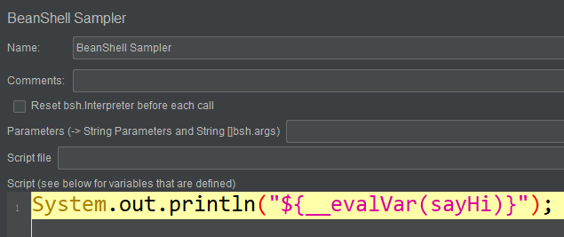

## `__FileToString`

读取文件全部内容，以字符串形式保存到变量中。

示例：

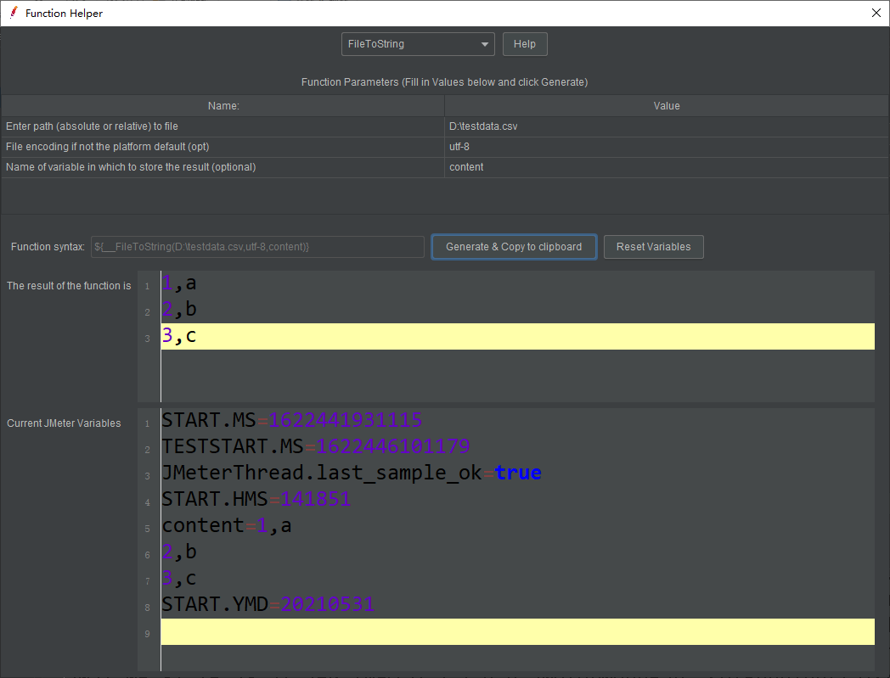

## `__intSum`

int型求和。

示例：

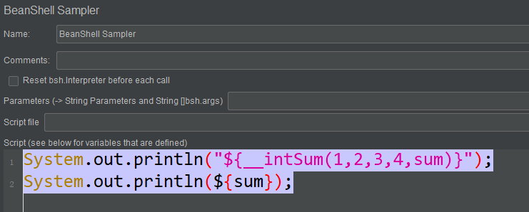

## `__longSum`

跟上个一样，只是换成了long型。

## `__javaScript`

执行JavaScript脚本。

示例：

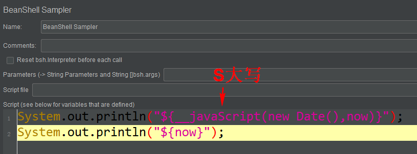

## `__jexl`

JEXL全称是Jakarta Commons Jexl，它是一种表达式语言解释器。jexl能直接访问JMeter中的部分变量：

- log：直接调用logger函数
- ctx：获取JMeterContent对象
- vars：获取JMeter定义的变量
- props：获取JMeter配置属性
- threadName：获取JMeter线程名
- sampler：获取Sampler实例
- sampleResult：获取SamplerResult实例
- OUT：OUT.println()，类似System.out.println

示例：

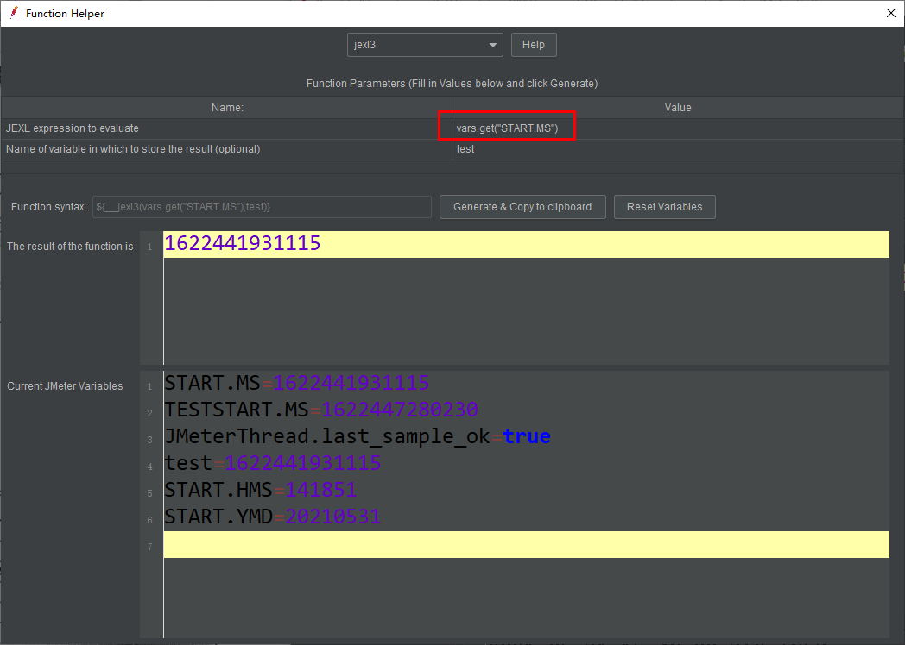

## `__log`

记录日志，并返回输入的字符串。

日志级别包括：

> 控制台指JMeter GUI的感叹号打开的控制台；标准输出窗口指打开JMeter时的CMD窗口。

- OUT：打印到控制台和标准输出窗口，相当于System.out.print()
- ERR：打印到控制台和标准输出窗口，相当于System.err
- DEBUG：打印到控制台，DEBUG级别以上
- INFO：打印到控制台，INFO及ERROR级别
- WARN：打印到控制台，WARN、INFO、ERROR级别
- ERROR：打印到控制台，仅ERROR级别

后四种级别DEBUG、INFO、WARN、ERROR是否写入JMeter的运行时日志，需要通过jmeter.property文件进行配置。

示例：

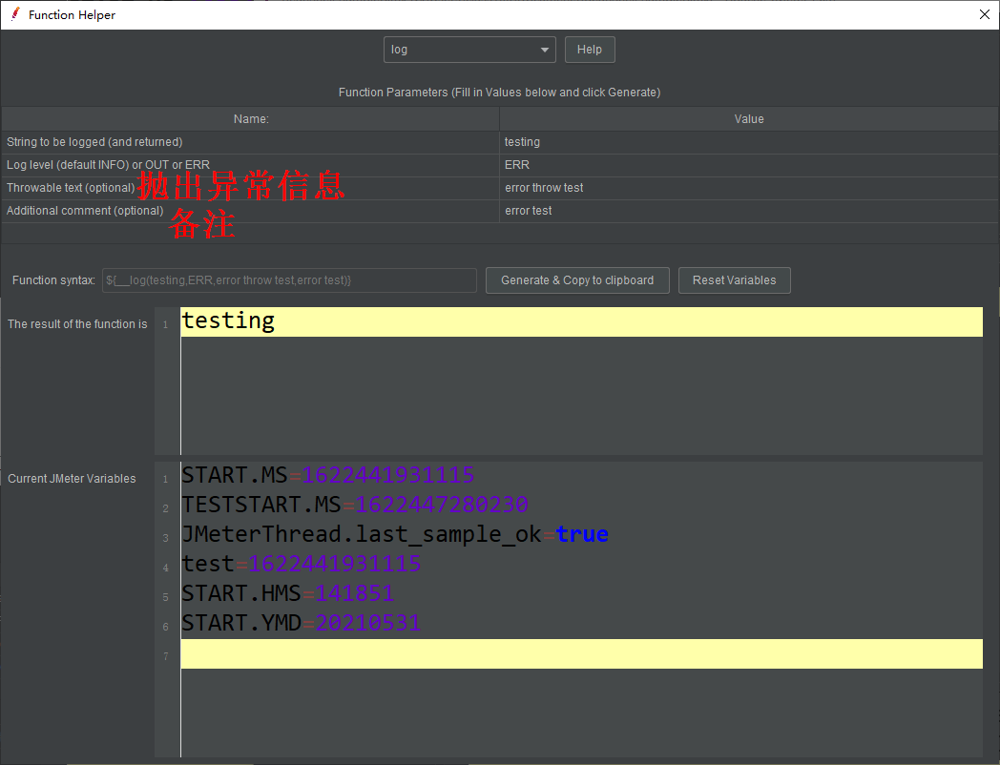

## `__logn`

与上一个类似，区别是它只记录日志，不返回值。

## `__machineIP`

本机的IP。

## `__machineName`

本机的计算机名。

## `__P`

获取命令行中定义的属性，默认值为1。

示例：

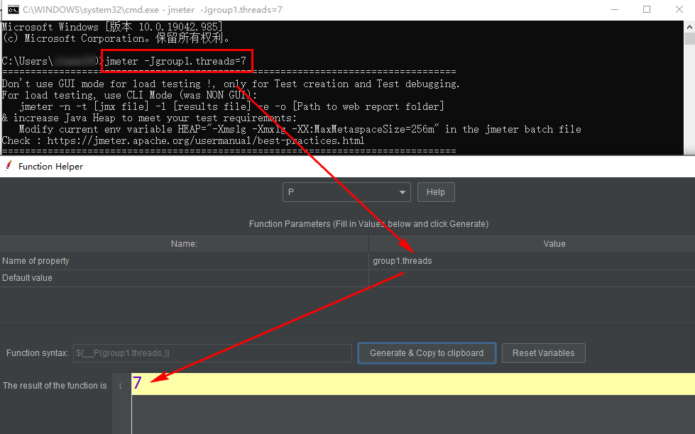

在非GUI方式运行测试计划时，可以用这个函数来做参数化，由运行命令动态指定参数值，方便跟Jenkins、Maven或者Ant集成。

## `__property`

获取jmeter.properties文件中设置的JMeter属性。

示例：

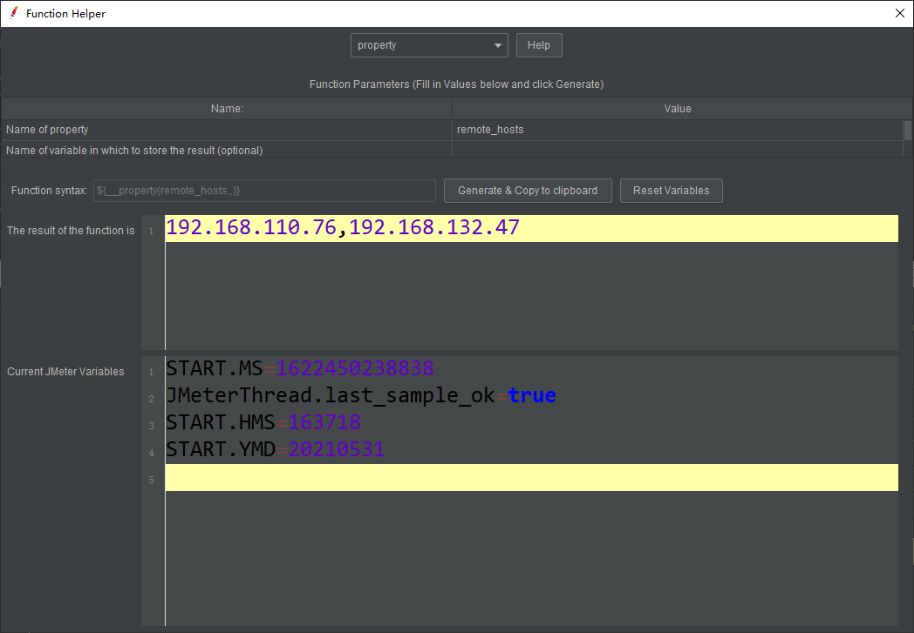

## `__Random`

随机值。

示例：


## `__RandomString`

随机字符串。

示例：

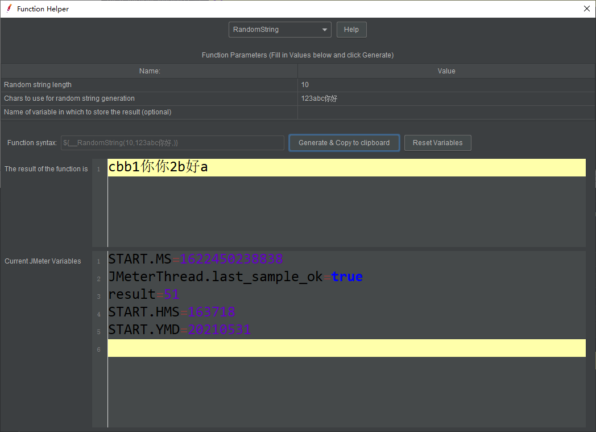

## `__regexFunction`

跟后置处理器的正则表达式提取器用法一样。

示例：


## `__samplerName`

获取当前sampler名称。

## `__setProperty`

动态设置JMeter属性。

示例：

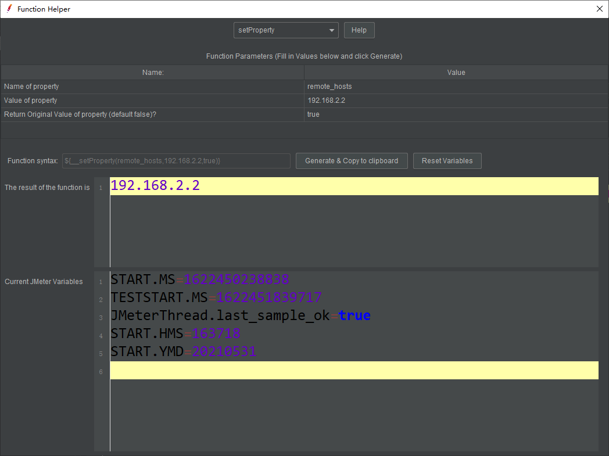

## `__split`

拆分字符串。


## `__StringFromFile`

不如使用CSV Data Set Config。

## `__TestPlanName`

获取测试计划的名字。

## `__threadNum`

返回当前线程号，从1开始递增。

示例：

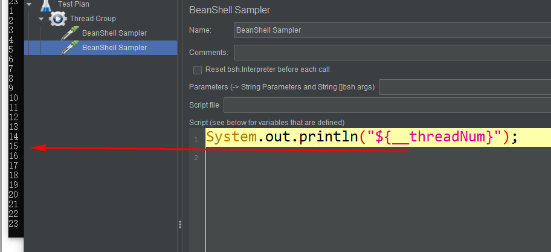

## `__time`

返回当前时间，由SimpleDateFormat类来处理函数格式。

- 年：yyyy
- 月：MM
- 日：dd
- 时：hh
- 分：mm
- 秒：ss

示例：

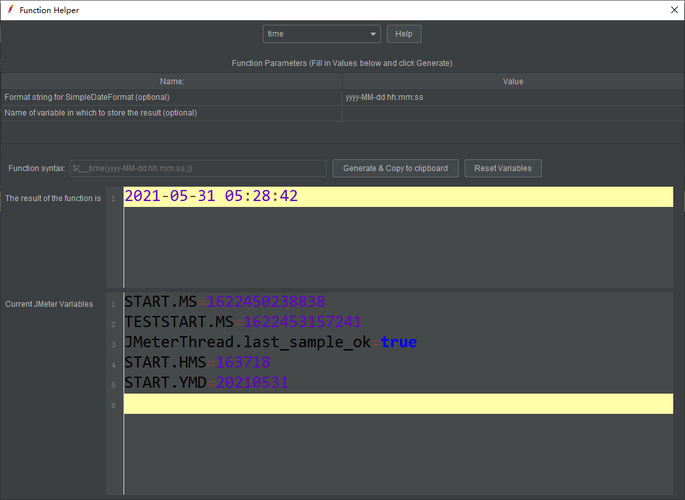

## `__unescape`

返转escape字符，如`\r\n`转成CRLF。

## `__unescapeHtml`

反转HTML，如`&nbsp;&nbsp;`转成空格。

## `__urldecode`

反转URL中的Unicode编码字符，如`word%22school%22`转成`word"school"`。

## `__urlencode`

转成Unicode编码字符，如`word"school"`转成`word%22school%22`。

## `__UUID`

生成唯一字符串。

## `__V`

执行变量表达式并返回结果，如果需要嵌套的使用变量时，就可以用到它。

比如定义变量`a1=2, b1=1`，`${a1}``${b1}`都可以调用成功。

但是如果想通过`${a${b1}}`来调用`${a1}`就不能成功。

使用`${__V(a${b1})}`等价于`${__V(a1)}`等价于`${a1}`就可以了。

## `__XPath`

匹配XML文件内容。

示例：

```xml
<?xml version="1.0" encoding="utf-8"?>
<company>
	<name>
    	<address>
            shanghai
        </address>
    </name>
</company>
```

XPath表达式`/company/name/address/text()`取值shanghai。

> XPath可以参考https://www.w3school.com.cn/xpath/index.asp
>

## 最近新增

除了上述36个内置函数，JMeter最近还新增了以下函数：

### changeCase

改变大小写

### dateTimeConvert

日期格式转换

### digest

加密算法，如SHA-1, SHA-256, MD5等

### escapeXml

转义XML

### groovy

groovy表达式

### isPropDefined

属性是否定义

### isVarDefined

变量是否定义

### RandomDate

随机日期

### RandomFromMultipleVars

从多个变量中取随机值

### StringToFile

把字符串写入文件中

### timeShift

时间偏移，比如计算某一天的前三天

## 小结

本文对36个内置函数，以及11个新增函数进行了介绍，灵活选择使用这些函数，能起到事半功倍的效果。函数助手可以很方便的对函数进行预览和测试。**最新最全的函数及其使用介绍可以到官网查阅：**https://jmeter.apache.org/usermanual/functions.html

> 参考资料：
>
> 《全栈性能测试修炼宝典JMeter实战》

