# 【JMeter】JMeter逻辑控制器完整介绍

JMeter逻辑控制器可以对元件的执行逻辑进行控制，就像编程一样，实现业务需求。

JMeter包括了以下逻辑控制器：

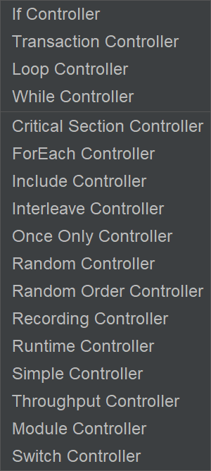

一共17种。除了仅一次控制器外，其他控制器下可以嵌套别的种类的逻辑控制器。

## If Controller

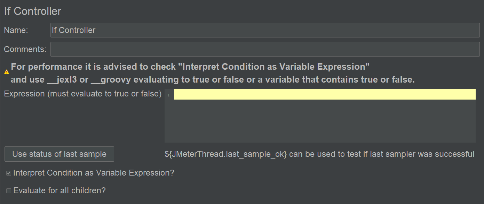

控制此节点下的元件是否运行。

Expression：可以使用变量表达式或JavaScript。

勾选Interpret Condition as Variable Expression表示使用变量表达式，建议勾选上。

Use status of last Sample表示判断上个取样器是否成功，点击后会把`${JMeterThread.last_sample_ok}`添加到Expression输入框中：

Evaluate for all children：判断条件是否针对所有的子节点，默认不勾选，只在If Controller入口处判断一次，否则每次节点都会进行判断。

## Transaction Controller

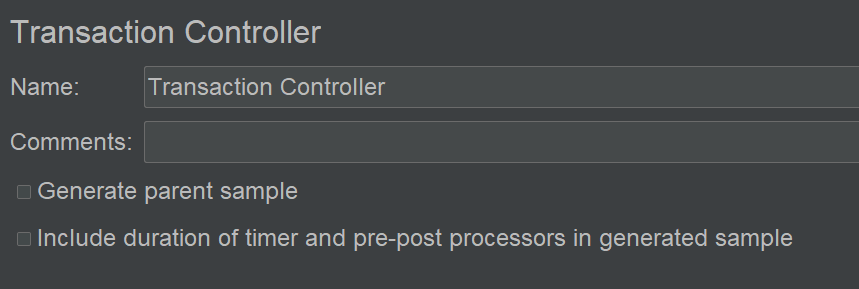

事务控制器能够帮我们把一堆请求归到一个大的事务中去，在报告分析时更方便。

Generate parent sample：是否生成父取样结果，勾选后有两个效果，一是Aggregate Report会看到Transaction Controller字样，它把节点下的取样器的运行结果（如消耗时间）累加在一起（注意事务控制器下如果有多个取样器，全部取样器都运行成功，整个事务控制器才算成功），比如：

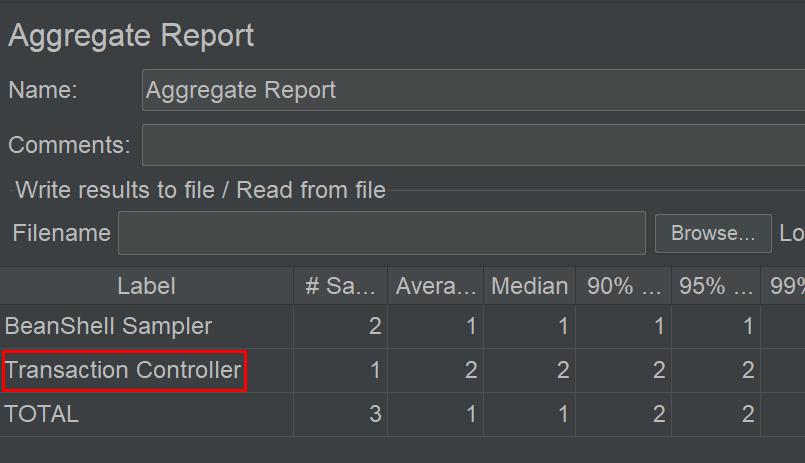

二是View Return Tree中会看到多一个结果，比如：

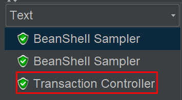

Include duration of timer and pre-post processors in generated sample：包括定时器和前置-后置处理器的耗时，建议不用勾选，不然会影响统计结果。

## Loop Controller

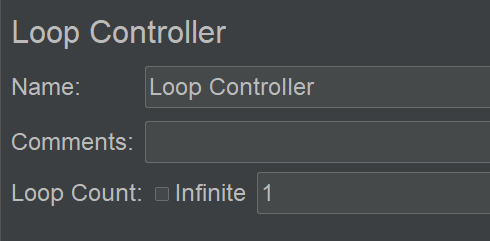

跟线程组的Loop设置一样。最终执行次数 = 线程组执行次数 x 循环控制器执行次数，比如线程组设置3次，循环控制器设置6次，那么控制器下面的元件会执行18次。

## While Controller

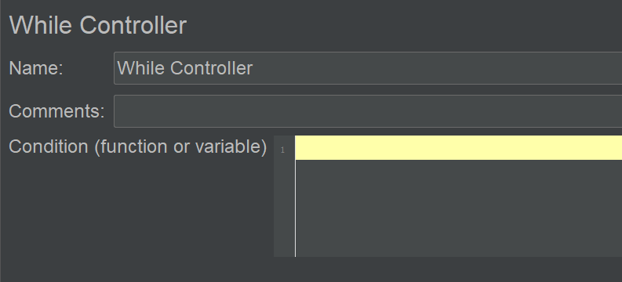

其子节点下的元件将一直运行直到While条件为false。

Condition：接受变量表达式与变量，比如`${inputVar}<10`，当inputVar=7时，它的子节点将一直运行下去。

另外提供以下三个常量：

- Blank：当循环中有取样器失败后停止。
- LAST：当循环前有取样器失败则不进入循环。
- Otherwise：当判断条件为false时停止循环。

## Critical Section Controller

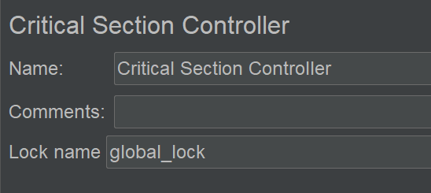

加锁让多线程顺序执行。

比如，不加锁，3个线程是并行执行的。：

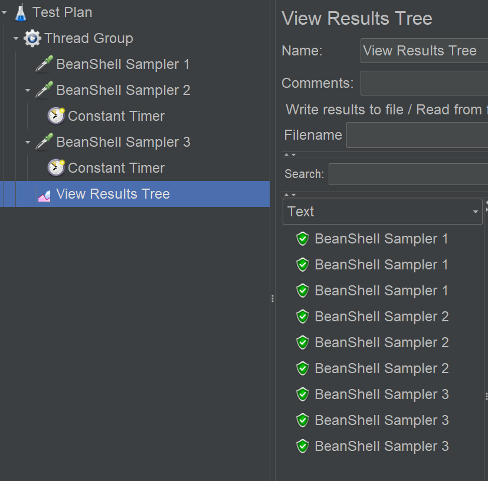

加锁以后，变成顺序执行了：

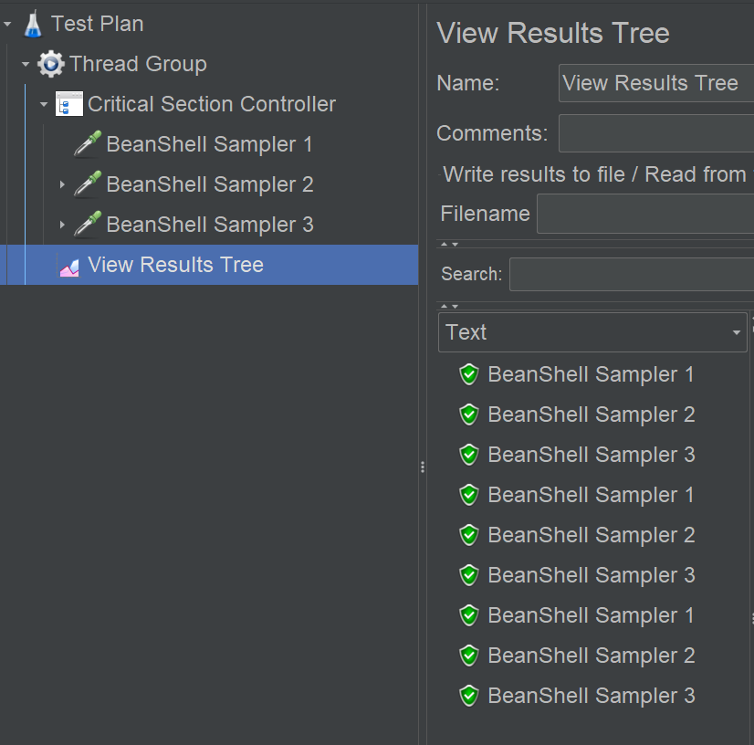

## ForEach Controller

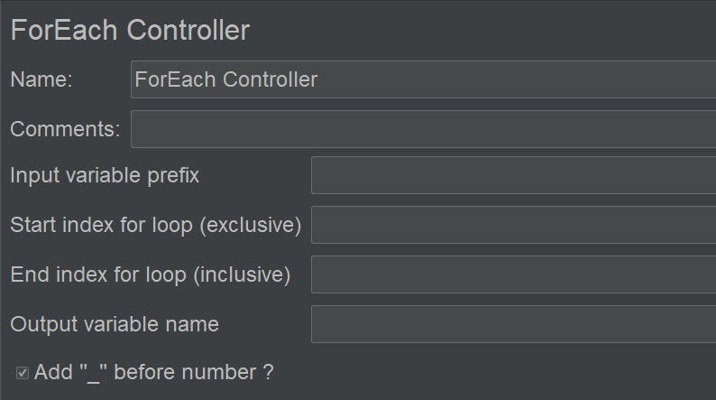

Input variable prefix：输入变量前缀。可以是用户自定义变量里面的多个变量如id_1, id_2, id_3（这里就填写`id`）：

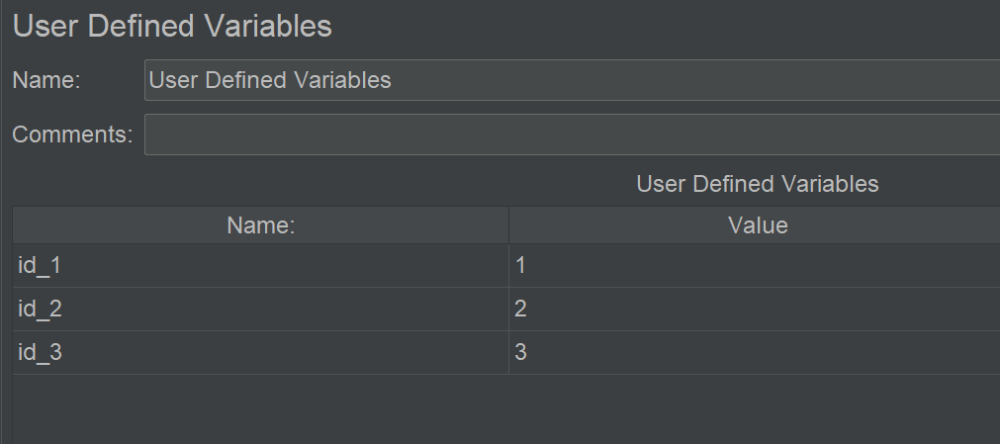

也可以是正则表达式提取器匹配到的多个值（这里就填写`varName`）：

Start index for loop (exclusive)：循环变量下标起点（不包括自己）。

End index for loop (inclusive)：循环变量下标终点（包括自己）。

Output variable name：输出变量名，比如returnVar，通过`${returnVar}`引用。

Add `"_"` before number：变量前缀后是否加`“_”`作为分隔符。

示例：

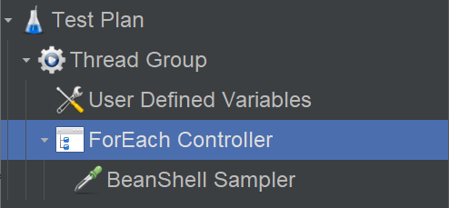

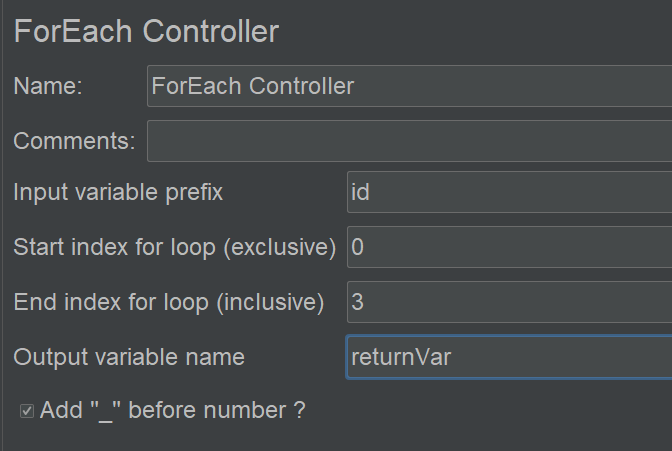

## Include Controller

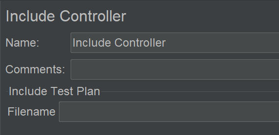

类似于程序中的函数，可以把其他`.jmx`文件包含进来。

被导入的测试计划有特殊要求：**不能有线程组，只能包含简单控制器及控制器下的元件**。

比如一个查询订单的业务操作用Sampler来模拟，然后放到简单控制器中作为一个执行单元，别的地方也要用到时，就可以不重写直接引用过来。

## Interleave Controller

其节点下的取样器会交替执行。

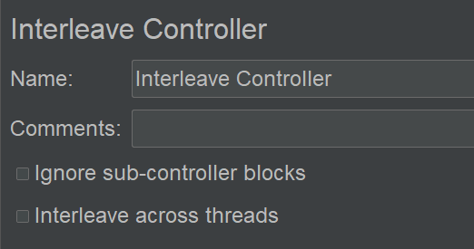

比如：

1个线程迭代3次，执行顺序是1 3, 2 3, 1 3。

Ignore sub-controller blocks：不执行子控制器，只执行当前这个交替控制器。比如：

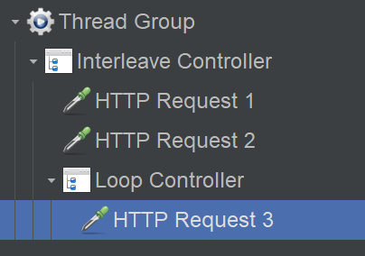

1个线程迭代4次，执行顺序是1, 2, 3, 1，Loop Controller失效。**注意，1 2 3是交替执行的，每次迭代只执行其中一个。**（如果不勾选，Loop设置为2，那么执行顺序是：1, 2, 3 3, 1）

嵌套的例子：

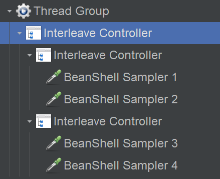

1个线程迭代5次，执行顺序是：1, 3, 2, 4, 1。

Interleave across threads：跨线程交替运行。比如：

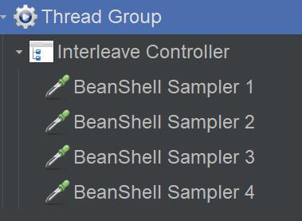

3个线程2次迭代，不勾选的执行顺序：1 2, 1 2, 1 2；勾选的执行顺序：1 2, 2 3, 3 4。

## Once Only Controller

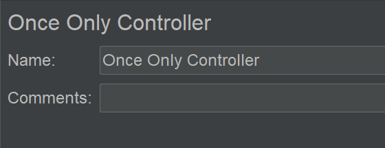

其子元件只运行一次。比如只登录一次，只读取一次CSV，只连一次数据库。

**注意，子节点放个CSV Data Set Config，可以让每个线程只读一次，然后使用同一条数据进行反复请求。**

> 多个线程是一行一行取值的，不会重复。

比如：

2个线程3次迭代，那么：

- 线程a只读一次，取到尾号1845这条数据，然后用这条数据迭代请求3次。
- 线程b只读一次，取到尾号0740这条数据，然后用这条数据迭代请求3次。

## Random Controller

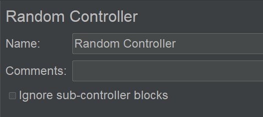

节点下的元件随机运行，运行顺序不定。

Ignore sub-controller blocks：不执行子控制器，只执行当前这个交替控制器。

## Random Order Controller

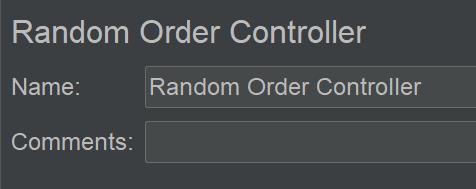

节点下的元件随机执行，且每个元件只执行一次。

## Recording Controller

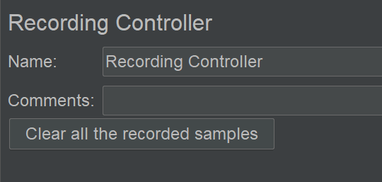

没用。

## Runtime Controller

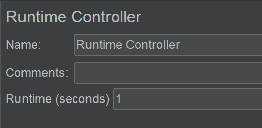

用来控制其子元件的执行时长。

Runtime单位为秒，默认为1，去掉1或者设置为0，它的子元件不执行。

## Simple Controller

简单控制器很简单，就是用来给Sampler分组的。它指定了一个执行单元，不会改变元件的执行顺序。

示例：

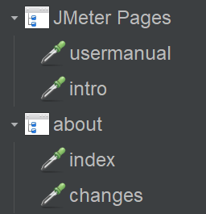

## Throughput Controller

控制子元件的执行次数（不能控制吞吐量，想控制吞吐量可以使用Constant Throughput Timer）。

Percent Executions：按执行次数的百分比来计算控制的执行次数，此时Throughput取值是0~100。

Total Executions：按Throughput的值来指定执行次数。

Per User：只对Total Executions生效，勾选后每个线程单独计算，不勾选则所有线程加起来计算。比如2个线程，每个线程迭代10次，Throughput值为6,，勾选Per User则分别计算分别执行6次共12次；不勾选Per User则加起来计算，共执行6次。

## Module Controller

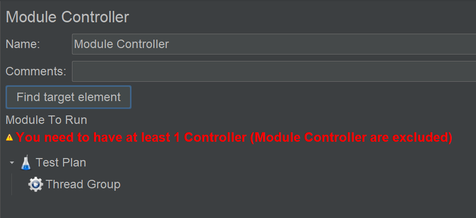

在当前测试计划中引入新的测试片段，测试片段由控制器、取样器及辅助元件构成，能够完成负载的模拟。

示例：

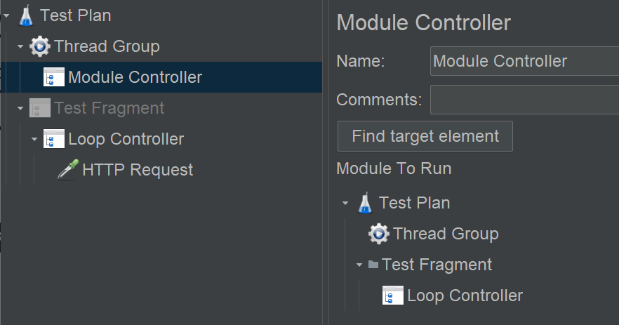

把测试片段里面的Loop Controller引了进来。

Module To Run：下拉列表，选择引入哪一个脚本片段（既包括测试片段也包括当前测试计划的控制器）。

## Switch Controller

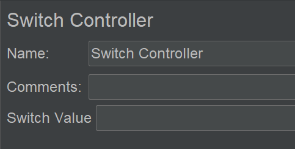

类似于高级语言中的Switch逻辑控制语句。

Switch Value：可以为数字，匹配**取样器编号**（子节点中取样器编号从0开始），不指定或指定编号超出了子节点数，则运行第0个取样器；也可以为字符，匹配**取样器名称**，匹配不上就会默认查找名称为default的取样器，如果没有则不运行。

## 小结

本文对JMeter所有控制器进行了介绍，从这些控制器能感受到JMeter之所以这么流行，是因为它实在太成熟了，这里面的技术需要多少沉淀才能做得出来呀。有时间一定得看看JMeter的源码深度学习下。

> 参考资料：
>
> 《全栈性能测试修炼宝典JMeter实战》