# 【JMeter】JMeter定时器设置延迟与同步

JMeter定时器一般用来设置延迟与同步。它的作用域和优先级如下：

- 定时器的优先级高于Sampler。
- 在同一作用域（比如控制器下）有多个定时器存在，每个定时器都会执行。
- 在某一Sampler节点下的定时器，只对这个Sampler有效。

JMeter一共有9种定时器：

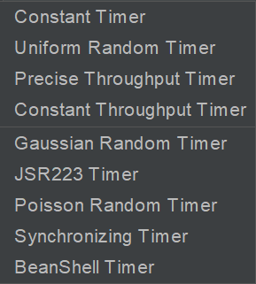

## Constant Timer

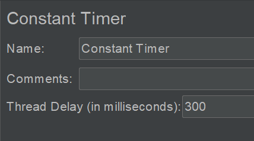

固定值，多用来模拟思考时间。

## Uniform Random Timer

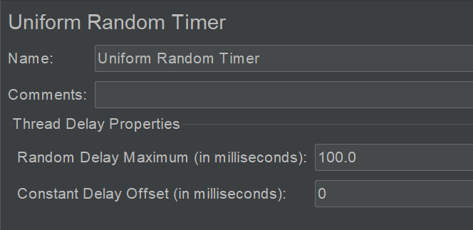

随机时间，分布会更均匀。

Random Delay Maximum：随机延迟时间。

Constant Delay Offset：固定延迟时间。

示例：

会让线程延迟在2.0到2.1秒之间。

## Precise Throughput Timer

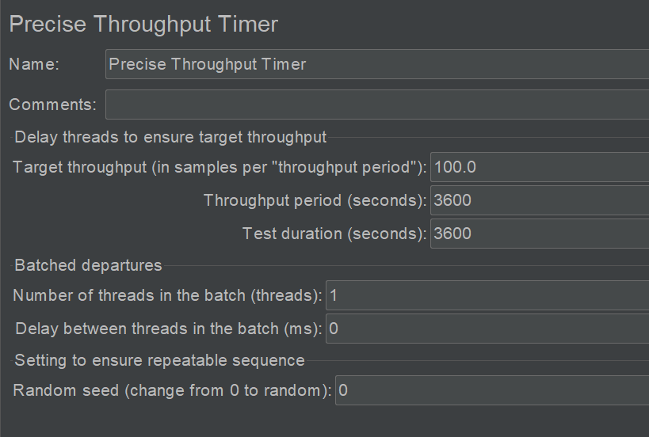

用的比较少，比Constant Throughput Timer更复杂更高级的用来控制吞吐量的一个定时器。

## Constant Throughput Timer

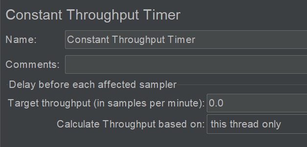

控制吞吐量，尽量保持Sampler产生的吞吐量（RPS）在一个固定的范围内。

Target throughput：目标吞吐量。JMeter会根据吞吐量、并发线程数来计算迭代的时间间隔，如果吞吐量大过设定值，就增加；反之减少。

Calculate Throughput based on：

this thread only：仅针对当前线程，每个线程互不干扰，分开计算需要延迟多少时间。

all active threads：把所有线程的吞吐量合在一起作为因子计算。

all active threads in current thread group：针对当前线程组中的所有线程。

all active threads (shared)：在所有线程中，随便获取一个线程上次运行的实际来进行计算，结果随机不一定准确，只能努力控制吞吐量在某一个范围。

all active threads in current thread group (shared)：在上面意思一样，范围是当前线程组。

## Gaussian Random Timer

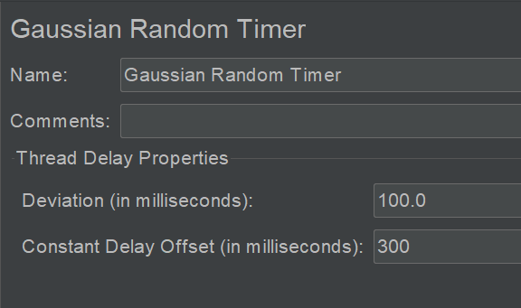

生成一个呈高斯分布的时间间隔，可以用来离散请求。

Deviation：一个浮动范围的偏差值。

Constant Delay Offset：固定延迟时间。

## JSR223 Timer

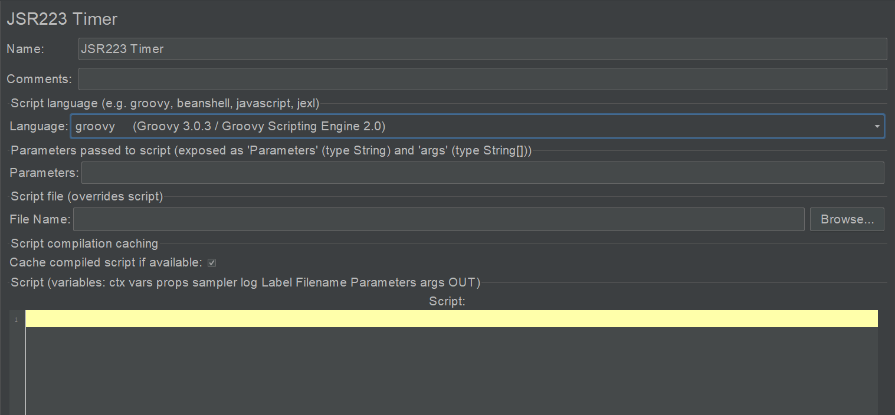

跟BeanShell类似，可以运行JavaScript等其他语言。

> JDK集成了JS的运行引擎，可以运行JavaScript脚本，JSR223是一个标准，为脚本引擎提供了统一的接口、统一的访问模式。

## Poisson Random Timer

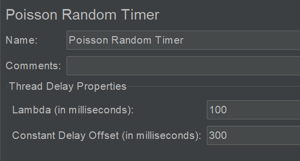

随机时间，呈泊松分布。

Lambda：泊松分布的期望和方差。

Constant Delay Offset：固定延迟时间。

## Synchronizing Timer

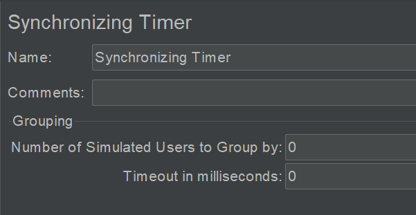

同步定时器，用来模拟多用户并发同一时刻发起请求。

Number of Simulated Users to Group by：等待x个用户（线程）集合后开始释放（发起请求）。

> 默认为0，等同于设置为线程租中的线程数量。

Timeout in milliseconds：等待时长，如果等待这么长时间，还没有达到上个选项设置的数量，那么不再等待，立即释放已到达的线程。

> 默认为0，等待线程数达到上个选项设置的数量才释放。

## BeanShell Timer

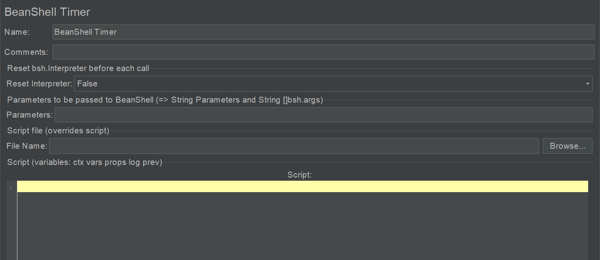

Reset Interpreter：是否每次迭代重置解释器，默认False。官方建议在长时间运行的脚本中才设置为True。

Parameters：入参，可以是单个变量，也可以是数组。

File Name：从脚本文件中读取BeanShell脚本。

Script：

ctx：通过JmeterContent实例获取运行时信息，如`log.error(ctx.getThreadNum().toString());`。

vars：访问或设置变量，如`vars.get("name")`，`vars.put("name", "dongfanger")`。

props：访问JMeter属性（`%JMETER_HOME%/bin/jmeter.properties`），如`props.get("log_level.jmeter")`，`props.put("log_level.jmeter", "ERROR")`。

log：在代码中调用log类来写日志，如`log.error("loadtest");`。

prev：可以访问前面Sampler的结果。

示例：

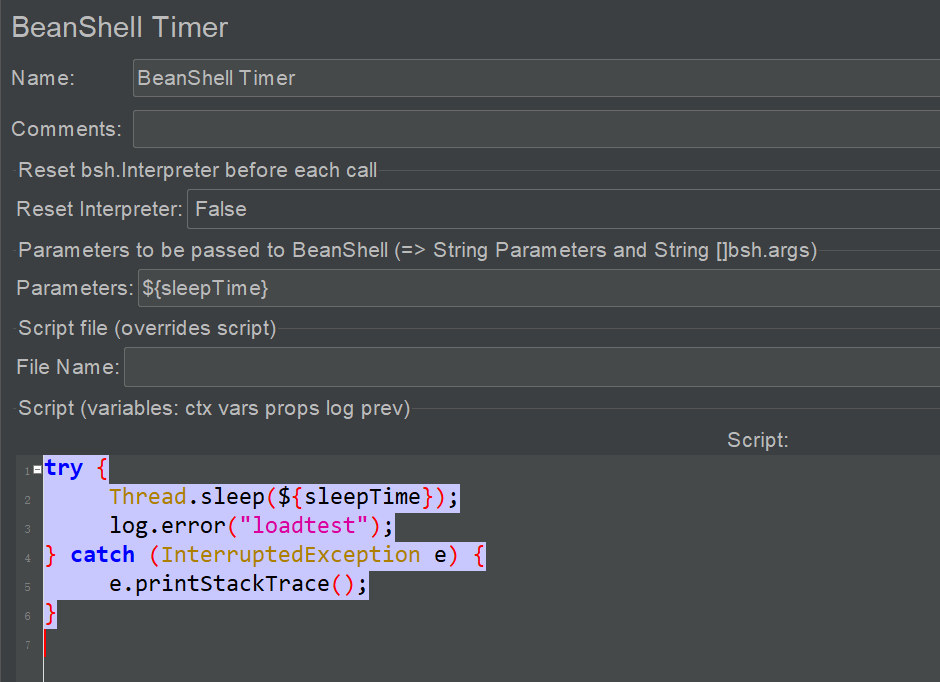

## 小结

本文首先介绍了JMeter定时器的作用域和优先级，然后分别介绍了各式各样的定时器，既能设置延迟，也能同步集合，可以固定可以随机，配置与编程并存，五花八门。

> 参考资料：
>
> 《全栈性能测试修炼宝典JMeter实战》
>
> https://blog.csdn.net/hwhua1986/article/details/78214923