# 【JMeter】JMeter响应断言够用了


JMeter断言用来对服务器的响应数据进行验证，其中的响应断言基本能完成大多数的验证工作，但是JMeter还是提供了适用于多个不同场景的断言元件，一共16个，如下图所示：

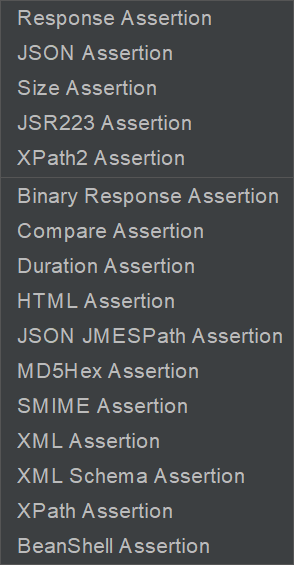

## Response Assertion

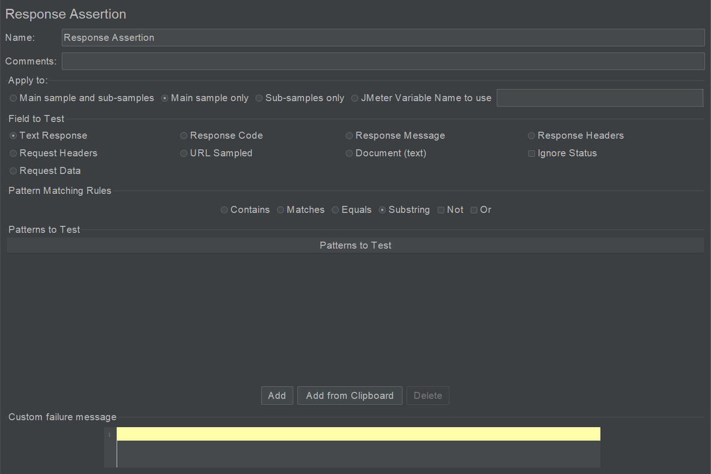

最最最常用的断言，足够满足工作需要。

Apply to：断言应用范围。

> 子取样器可能是JMeter手动设置的，可能是重定向，可能是嵌入资源（images、iframe等）。

Field to Test：哪部分响应域参与断言。

Ignore Status：多个响应断言，如果当前断言失败了，勾选此选项可以忽略此响应结果，继续下一个断言。

Patterns to Test：

- Contains：实际响应**包括**预期匹配内容，支持正则表达式。
- Matchs：实际响应**完全匹配**预期匹配内容，大小写不敏感，支持正则表达式。
- Equals：实际响应**完全等于**预期匹配内容，大小写**敏感**，只支持字符串，**不支持**正则表达式。
- Substring：实际响应**包括**预期匹配内容，大小写**敏感**，只支持字符串，**不支持**正则表达式。

Not：对测试模式进行否定。

Or：将多个测试模式以逻辑“或”组合起来。

Add：添加需要匹配的字符串或者正则表达式。

Custom failure message：自定义失败信息。

**多模式断言**，Add可以添加多个断言模式，假设有模式p1，p2，p3：

- 默认And：p1 and p2 and p3
- 只选Not：(not p1) and (not p2) and (not p3)
- 只选Or：p1 or p2 or p3
- 同时选Not和Or：(not p1) or (not p2) or (not p3)

## JSON Assertion

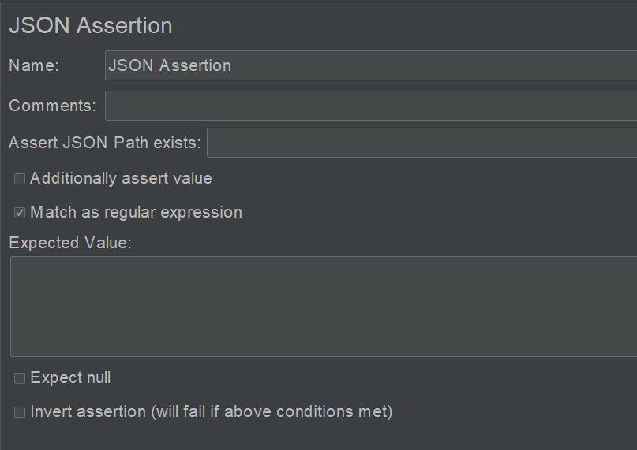

JSONPath是一个JSON查询语言，可以用来快速查找节点，语法参考：

https://github.com/alibaba/fastjson/wiki/JSONPath

Assert JSON Path exists：JSONPath表达式。

Additionally assert value：普通匹配。

Match as regular expression：正则匹配。

Expected Value：预期值。

Expect null：预期为null。

Invert assertion（will fail if above conditions met）：反转断言，如果上面的条件满足就断言失败。

## Size Assertion

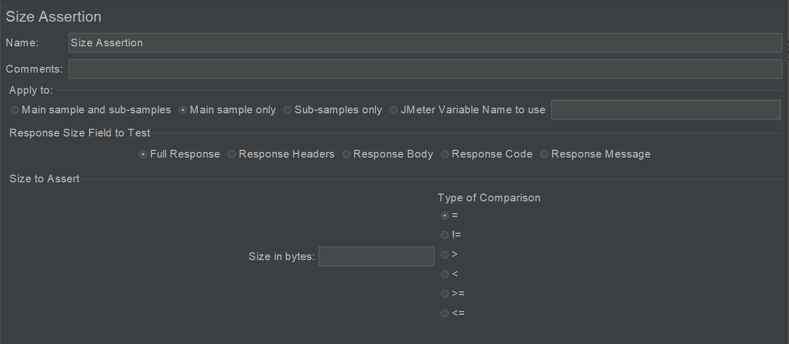

验证响应数据Size大小。

Apply to：断言应用范围。

Response Size Field to Test：哪部分响应域参与断言。

Size to Assert：断言时Size的阀值设置。

## JSR223 Assertion

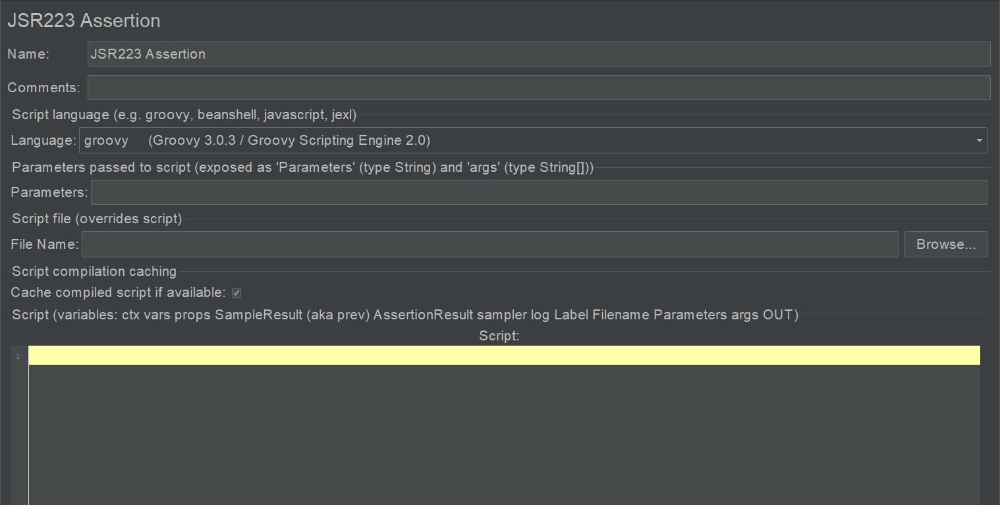

支持其他脚本语言如JavaScript。

## XPath2 Assertion

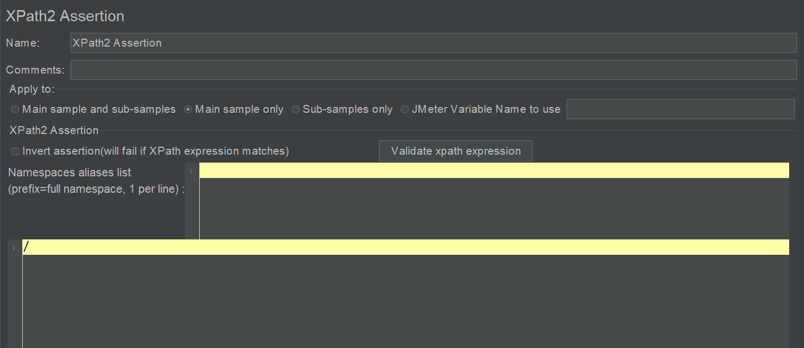

2.0版本的XPath断言，可以验证WebServices协议接口响应的XML格式数据。

## Binary Response Assertion

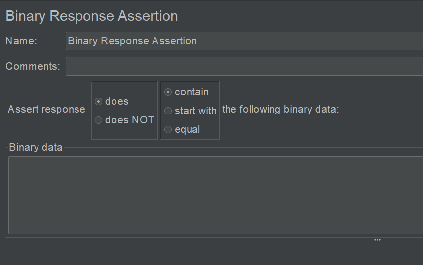

验证二进制响应数据。

## Compare Assertion

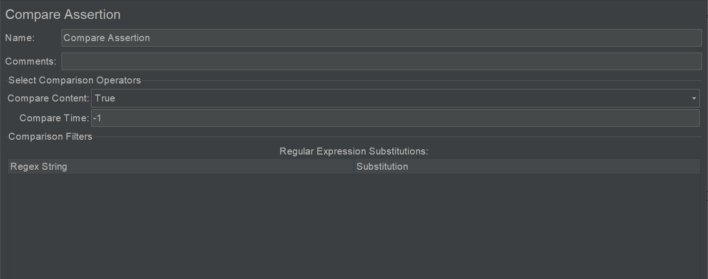

因为会消耗较多资源，一般不建议使用，仅仅用来调试。

Compare Assertion进行设置，需要配合Comparision Assertion Visualizer进行断言结果显示。

## Duration Assertion

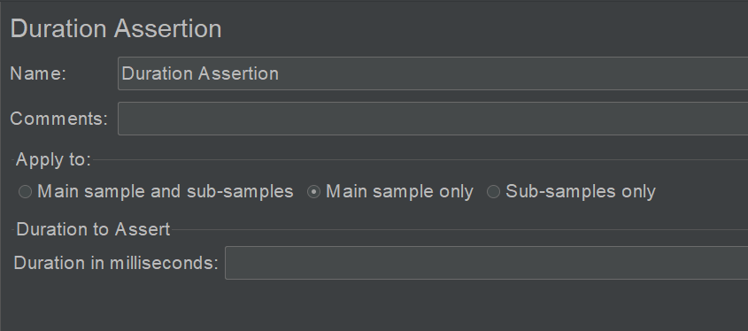

验证Sampler运行测试消耗的时间，比如断言持续10s，如果实际耗时30秒，就会断言失败。

## HTML Assertion

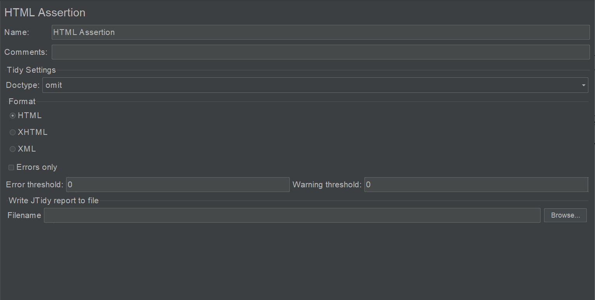

用的比较少。

JTidy是HTML Tidy的Java实现版本，提供了HTML的语法检查器，可以用来解析HTML代码，可以用来清除格式不好和不对的HTML，类似于一个处理HTML文件的DOM解析器。

## JSON JMESPath Assertion

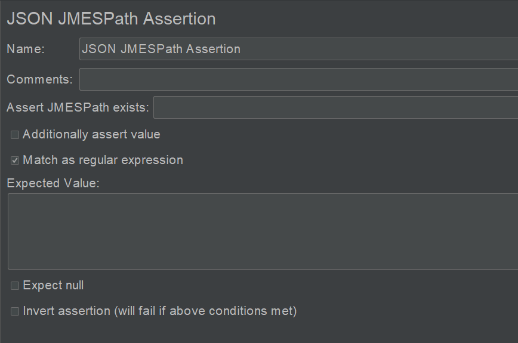

跟JSONPath一样，是另外一个JSON查询语言，语法参考：

https://jmespath.org/

## MD5Hex Assertion


对返回的MD5结果进行断言。

MD5Hex：直接填入MD5值。

## SMIME Assertion

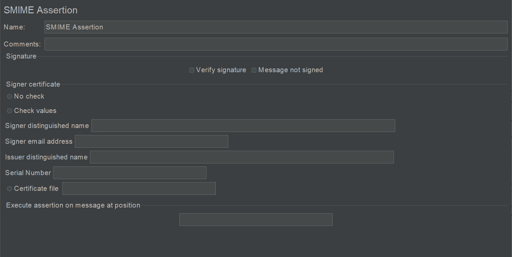

不常用。

对加密和签名的邮件进行断言。

## XML Assertion

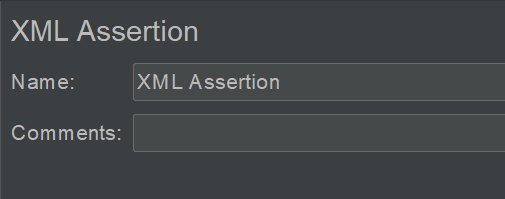

不常用。

验证响应数据是正确的XML格式。

## XML Schema Assertion

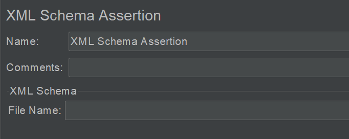

不常用。

XML Schema的作用是定义一份XML文档的合法模板。

## XPath Assertion

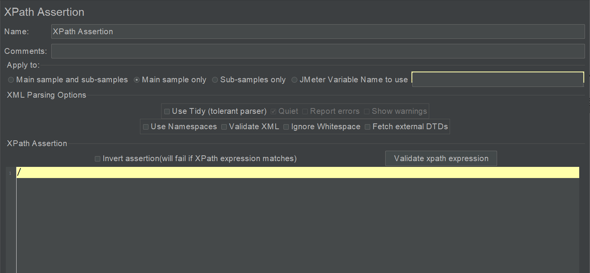

可以验证WebServices协议接口响应的XML格式数据。

## BeanShell Assertion

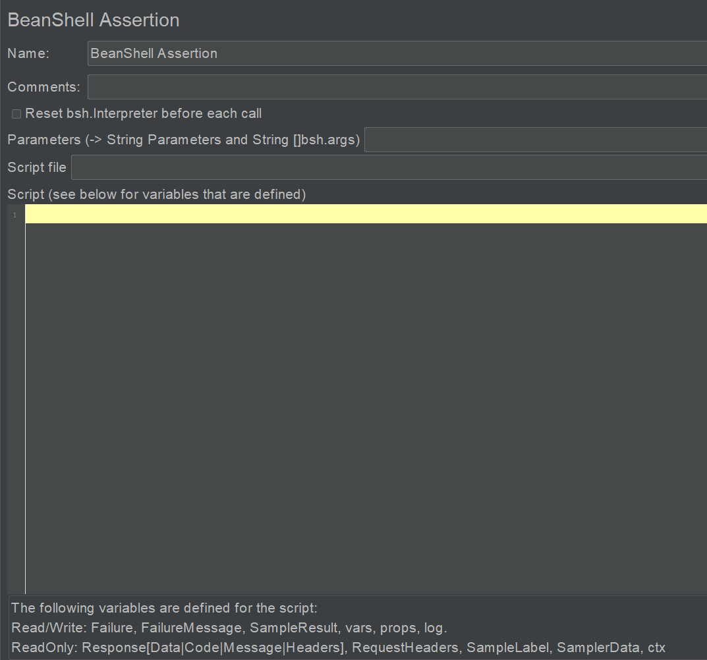

BeanShell作为脚本语言能够方便地调用Java类，在断言元件中，可以访问JMeter的诸多属性，具体有：

- log，写日志。
- SampleResult，获取响应数据、响应码等。
- Response，获取响应数据。
- Failure，设置断言成功与否，Boolean类型。
- FailureMessage，设置失败信息。
- ResponseData，响应数据。
- ResponseCode，响应码。
- ResponseMessage，响应信息。
- ResponseHeaders，响应头信息。
- RequestHeaders，请求头信息。
- SampleLabel，取样器Label信息。
- SamplerData，发送给服务器的数据。
- Ctx（JMeterContext），JMeter上下文信息，获取线程数、线程号等信息。
- Vars（JMeterVariables），获取JMeter中定义的变量，或者设置变量。
- Props（JMeterProperties），获取JMeter中的属性，或者设置属性。

示例：

```java
SampleResult.getRequestHeaders()
SampleResult.setSuccessful(false)
SampleResult.getResponseDataAsString()
SampleResult.getResponseCode()
SampleResult.getResponseMessage()
```

## 小结

本文对JMeter所有断言元件进行了介绍，其中的响应断言已经足够使用了，对于RESTful接口来说，JSON格式响应数据可以使用JSON Assertion和JSON JMESPath Assertion，其他元件则用的比较少。另外BeanShell Assertion在编写基于JMeter的测试平台时可能会用到。

> 参考资料：
>
> 《全栈性能测试修炼宝典JMeter实战》
>
> https://zhuanlan.zhihu.com/p/72917999