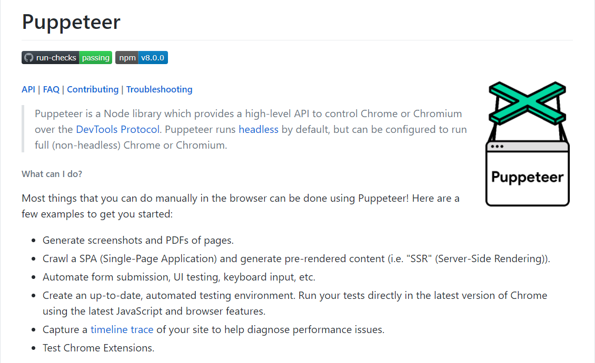
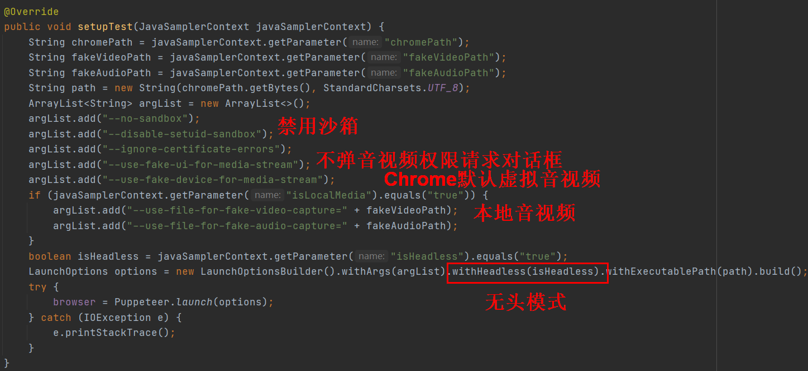
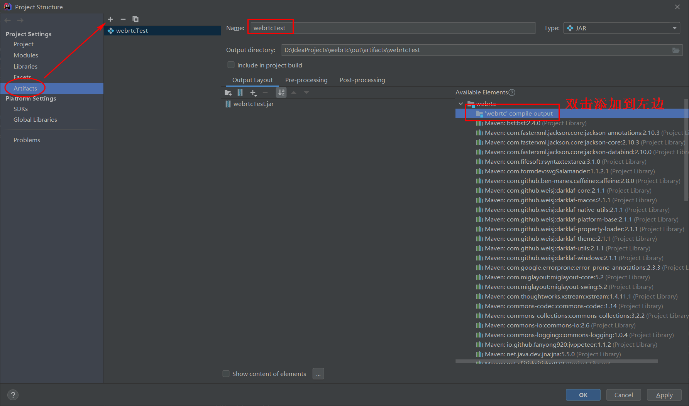
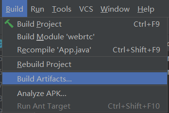
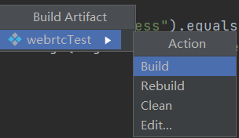
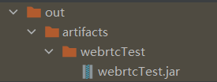
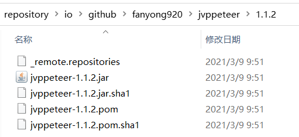
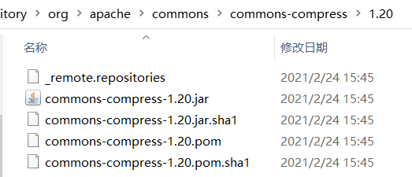
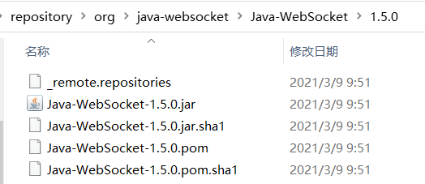
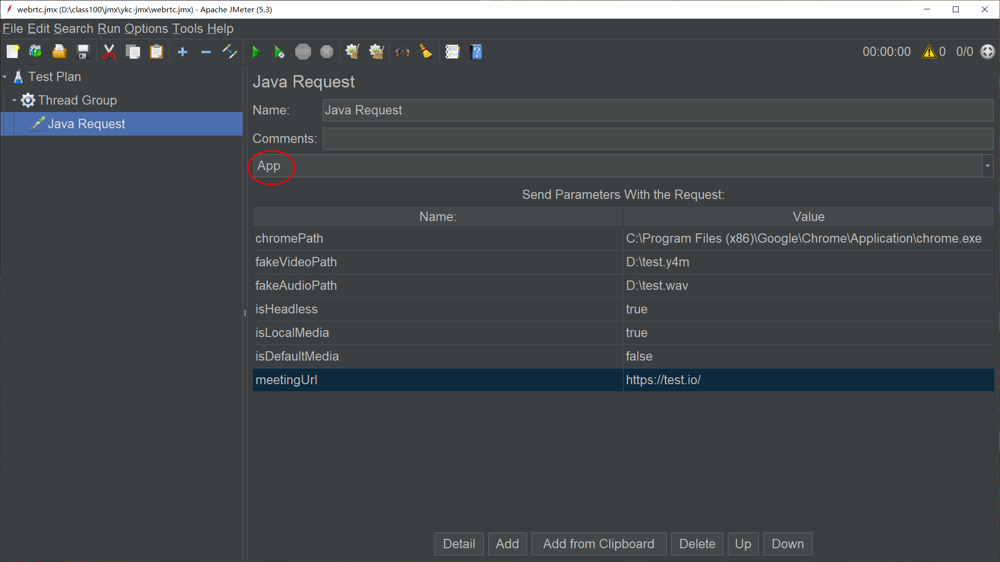

# 【JMeter】JMeter扩展Java请求


本文将通过WebRTC本地音视频流压测脚本，来说明JMeter如何扩展Java请求。

## WebRTC

WebRTC是Web Real-Time Communication缩写，指网页即时通讯，是一个支持Web浏览器进行实时语音或视频对话的API，实现了基于网页的视频会议，比如声网的Agora Web SDK就是基于WebRTC实现音视频通信的。与HTTP不同，WebRTC应用的主要压力是码流，JMeter没有找到提供WebRTC Sampler的第三方jar包，只能自己尝试写一个。

正常情况是打开浏览器，打开摄像头和麦克风输入音视频流进行请求传输，测试模拟采用无头浏览器，读取本地文件作为音视频输入。

> 无头浏览器是指没有界面的浏览器，通过调用浏览器API来模拟操作，比如Chrome在启动时添加`--headless`，就可以进入无头模式。

WebRTC是使用JavaScript编写的，在前端领域生态相对来说丰富一些，有现成可用的Node库Puppeteer来支持无头浏览器：



为了让JMeter能并发调用，需要编写Java代码调用Puppeteer，听着有点想象力，实际上已经有封装好的开源库了：jvppeteer。

## 写Java代码

在`pom.xml`中添加依赖：

```xml
<dependency>
    <groupId>io.github.fanyong920</groupId>
    <artifactId>jvppeteer</artifactId>
    <version>1.1.2</version>
</dependency>
<dependency>
    <groupId>org.apache.jmeter</groupId>
    <artifactId>ApacheJMeter_core</artifactId>
    <version>5.3</version>
</dependency>
<dependency>
    <groupId>org.apache.jmeter</groupId>
    <artifactId>ApacheJMeter_java</artifactId>
    <version>5.3</version>
</dependency>
```

`jvppeteer`是Java封装Puppeteer包，`ApacheJMeter_core`和`ApacheJMeter_java`用来扩展JMeter。

新建`\src\main\java\App.java`：

```java
import com.ruiyun.jvppeteer.core.Puppeteer;
import com.ruiyun.jvppeteer.core.browser.Browser;
import com.ruiyun.jvppeteer.core.page.Page;
import com.ruiyun.jvppeteer.options.LaunchOptions;
import com.ruiyun.jvppeteer.options.LaunchOptionsBuilder;
import org.apache.jmeter.config.Arguments;
import org.apache.jmeter.protocol.java.sampler.JavaSamplerClient;
import org.apache.jmeter.protocol.java.sampler.JavaSamplerContext;
import org.apache.jmeter.samplers.SampleResult;

import java.io.IOException;
import java.nio.charset.StandardCharsets;
import java.util.ArrayList;

public class App implements JavaSamplerClient {
    Browser browser;

    public Arguments getDefaultParameters() {
        Arguments params = new Arguments();
        params.addArgument("chromePath", "C:\\Program Files (x86)\\Google\\Chrome\\Application\\chrome.exe");
        params.addArgument("fakeVideoPath", "D:\\test.y4m");
        params.addArgument("fakeAudioPath", "D:\\test.wav");
        params.addArgument("isHeadless", "true");
        params.addArgument("isLocalMedia", "true");
        params.addArgument("isDefaultMedia", "false");
        params.addArgument("meetingUrl", "https://test.io");
        return params;
    }

    @Override
    public void setupTest(JavaSamplerContext javaSamplerContext) {
        String chromePath = javaSamplerContext.getParameter("chromePath");
        String fakeVideoPath = javaSamplerContext.getParameter("fakeVideoPath");
        String fakeAudioPath = javaSamplerContext.getParameter("fakeAudioPath");
        String path = new String(chromePath.getBytes(), StandardCharsets.UTF_8);
        ArrayList<String> argList = new ArrayList<>();
        argList.add("--no-sandbox");
        argList.add("--disable-setuid-sandbox");
        argList.add("--ignore-certificate-errors");
        argList.add("--use-fake-ui-for-media-stream");
        argList.add("--use-fake-device-for-media-stream");
        if (javaSamplerContext.getParameter("isLocalMedia").equals("true")) {
            argList.add("--use-file-for-fake-video-capture=" + fakeVideoPath);
            argList.add("--use-file-for-fake-audio-capture=" + fakeAudioPath);
        }
        boolean isHeadless = javaSamplerContext.getParameter("isHeadless").equals("true");
        LaunchOptions options = new LaunchOptionsBuilder().withArgs(argList).withHeadless(isHeadless).withExecutablePath(path).build();
        try {
            browser = Puppeteer.launch(options);
        } catch (IOException e) {
            e.printStackTrace();
        }
    }

    @Override
    public SampleResult runTest(JavaSamplerContext javaSamplerContext) {
        try {
            Page page = browser.newPage();
            page.goTo(javaSamplerContext.getParameter("meetingUrl"));
        } catch (Exception e) {
            e.printStackTrace();
        }
        return null;
    }

    @Override
    public void teardownTest(JavaSamplerContext javaSamplerContext) {
        browser.close();
    }
}
```

`App`类继承了`JavaSamplerClient`类。`getDefaultParameters()`定义了JMeter界面参数。`setupTest()`是测试初始化，创建无头浏览器。`runTest()`是测试执行，访问会议URL进行推流。`teardownTest()`是测试清理，关闭无头浏览器。`setupTest()`和`teardownTest()`在运行时每个线程只会执行一次。

无头浏览器核心参数配置如下：



## 打Jar包

Java代码写好后，需要打成jar包提供给JMeter调用。打包过程如下：

点击右上角Project Structure：


打开Artifacts，点击+号，填写名字，在右边区域双击编译后输出文件目录到左边：



点击OK确认后，从菜单栏找到Build Artifacts点击：



Build就可以了：



## JMeter使用

首先需要把jar包复制到`lib\ext`目录下，`webrtcTest.jar`位置如下：



除了`webrtcTest.jar`，还依赖3个jar包，在`Settings\Build\Build Tools\Maven`找到`Local repository`本地仓库目录后打开，`jvppeteer-1.1.2.jar`存放位置如下：



`commons-compress-1.20.jar`存放位置如下：



`Java-WebSocket-1.5.0.jar`存放位置如下：



然后打开JMeter，添加线程组，添加Java请求，选择刚才创建的类，初始参数也加载出来了：



默认音视频流是这样：


本地音视频流是这样：


脚本弄好了就可以开始对WebRTC应用进行压测了。

## 小结

本文介绍了如何使用Java对Puppeteer封装的jvppeteer，实现对WebRTC进行本地音视频流的压测脚本，打包成jar包后，可以在JMeter中进行扩展，通过Java请求Sampler来调用。Headless Chrome对`.y4m`格式视频和`.wav`格式音频支持较好，建议用这两种格式做测试。

> 参考资料：
>
> https://www.cnblogs.com/chenkx6/p/13639629.html
>
> https://baike.baidu.com/item/WebRTC/5522744?fr=aladdin
>
> https://github.com/puppeteer/puppeteer
>
> https://github.com/fanyong920/jvppeteer
>
> .y4m视频下载 https://media.xiph.org/video/derf/

