# 【nGrinder】你的下一个压测工具可以是nGrinder


## nGrinder小众而实用

nGrinder在GitHub的star有1.6k，相比于JMeter6.4k来说，要少很多。在测试资料中，关于压测工具也是以JMeter居多，几乎没有专门针对nGrinder的学习资料。nGrinder既然这么小众，那为什么还要学它呢？因为听说咱们**公司的压测平台，底层就是用的nGrinder**，对于企业级应用来说，nGrinder还是很实用的，正如它的介绍：“Enterprise level performance testing solution based on The Grinder”。

nGrinder有以下特点：

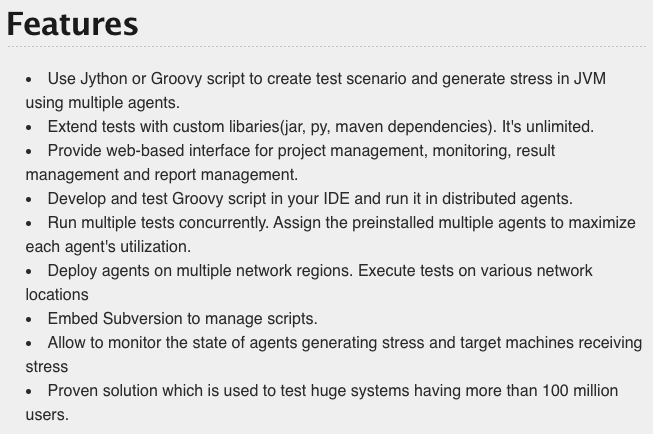

我们编写压测脚本用到的就是第一个特点提到的Groovy脚本，跟Java语法类似，可以无成本切换。

## 设计理念

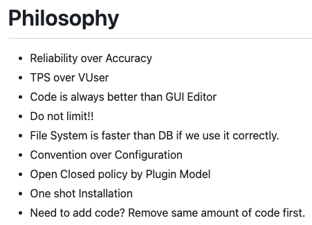

## nGrinder架构

nGrinder系统架构如下：

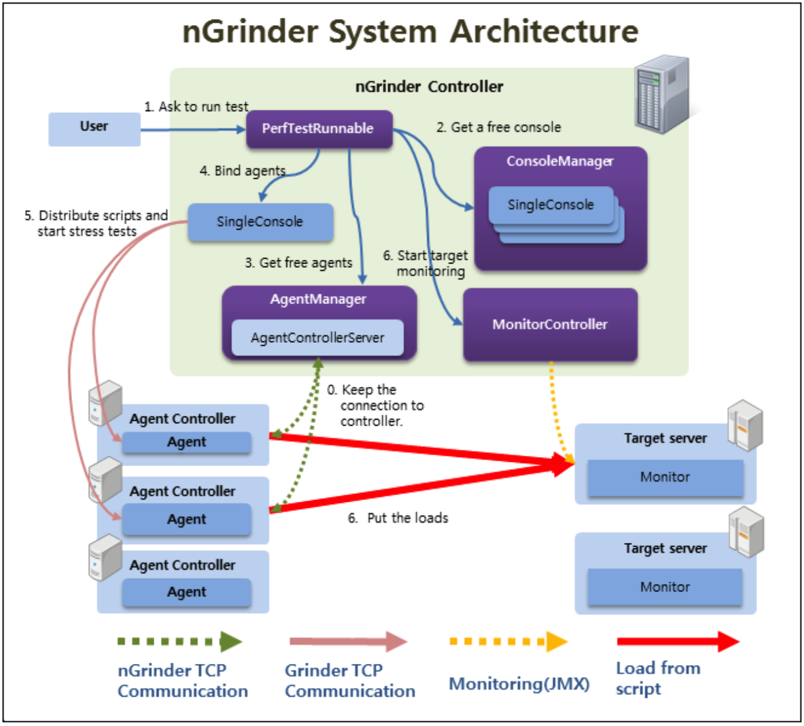

nGrinder的底层是Grinder，基于Grinder的console和agent，nGrinder封装成了controller和agent：

- controller 提供了Web页面创建测试脚本和配置运行策略，这是nGrinder比较突出的特色了。

- agent 虚拟用户生成器，创建压测负载。

当用户创建test后，会先创建一个console，AgentControllerServer会根据console分配相应的agent，AgentControllerServer管理着agent pool，负责agent的创建和释放。然后console将test脚本和资源多个已分配的agent，并控制整个test flow直到测试结束。测试结束后，agent会回收至AgentControllerServer以便其他test使用，console也会回收至ConsoleManager。

nGrinder和Ginder最大的不同之处在于，nGrinder在controller中保留了多个console实例和agent。每个console都是跟其他console隔离的，能并发运行。

不像其他压测工具在测试时，会保留agent以确保用户执行test时agent是可用的，也就是“预占”agent。nGrinder只有在真正测试执行时，动态分配agent，这个方案是nGrinder最独特的架构设计。它保证了多个压测任务能并发执行，并发上限只取决于空闲的agent数量。

nGrinder3.1版本以前是单机架构的，如下图所示：

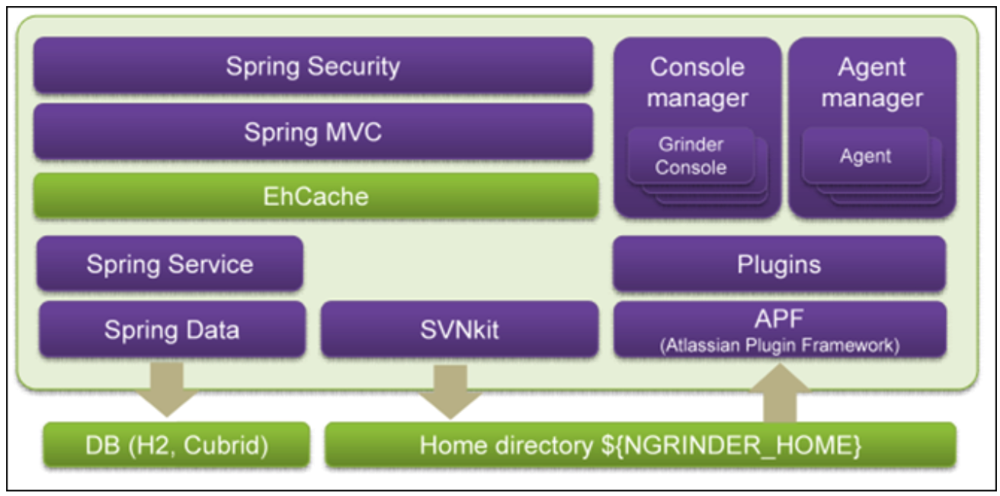

1、nGrinder使用SVNkit，即svn server，来管理脚本文件。svn仓库存放在`${NGRINDER_HOME}`目录。

2、nGrinder使用EhCache缓存，提升DB和SVN查询性能。

3、nGrinder使用Spring Security保证安全，并使用Atlassian支持扩展。

nGrinder3.1版本之后，支持集群：

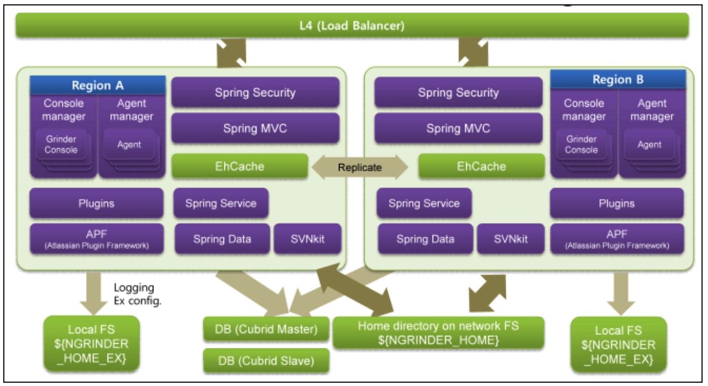

1、集群中所有console共享同样的DB和文件系统，并指向NFS共享的同一个`${NGRINDER_HOME}`。

2、每个controller有它自己的`${NGRINDER_EX_HOME}`，存放特殊配置和日志。

3、所有controller相互复制EhCache，让某些数据在集群中都是可见的。

## nGrinder技术栈

**Client层**

Bootstrap、Bootstrap-slider、Jquery、Jquery Validate、Datatables、Select2、JqPlot、CodeMirror。

**Controller层**

FreeMarker、Spring Security、Spring MVC、GSon、SVNKit Dav。

**Service层**

The Grinder、Atlassian Plugin Framework、Spring、EhCache。

**Data层**

Spring Data、H2、Cubrid、Liquibase、SVNKit。

## 快速入门

### 安装

在GitHub Release下载war包：

https://github.com/naver/ngrinder/releases

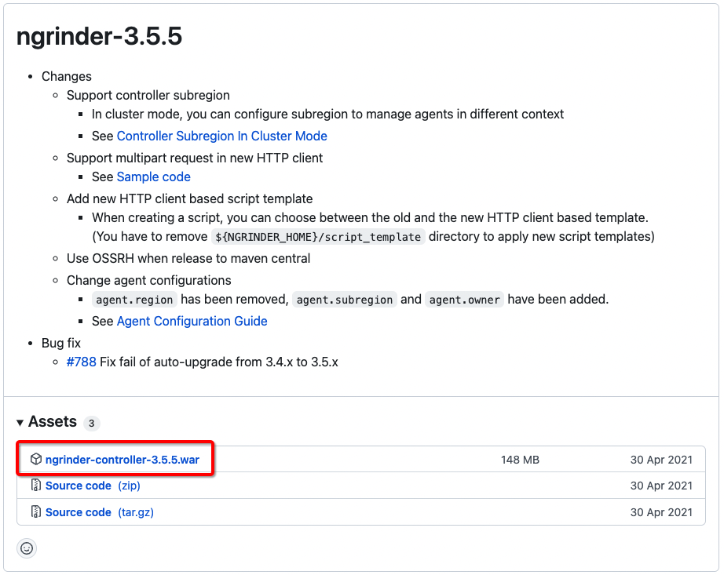

执行命令：

```shell
java -jar ngrinder-controller-{version}.war
```

访问`http://localhost:8080/`即可。

但是由于nGrinder需要占用大量内存，最好加上额外参数：

```shell
java -XX:MaxPermSize=200m -jar  ngrinder-controller-3.4.war
```

默认是8080端口，可以指定端口：

```shell
java -XX:MaxPermSize=200m -jar  ngrinder-controller-3.4.war --port 80
```

更多安装说明请参考：

https://github.com/naver/ngrinder/wiki/Installation-Guide

### 登录

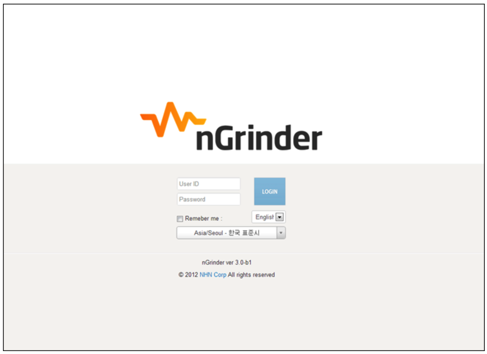

默认用户名/密码为admin/admin。

### 开始

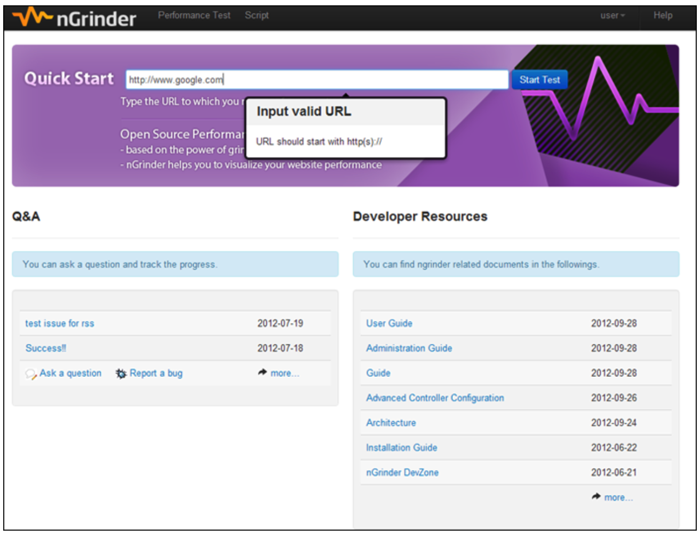

只需要输入url，就能自动生成压测脚本。

然后配置压测策略：

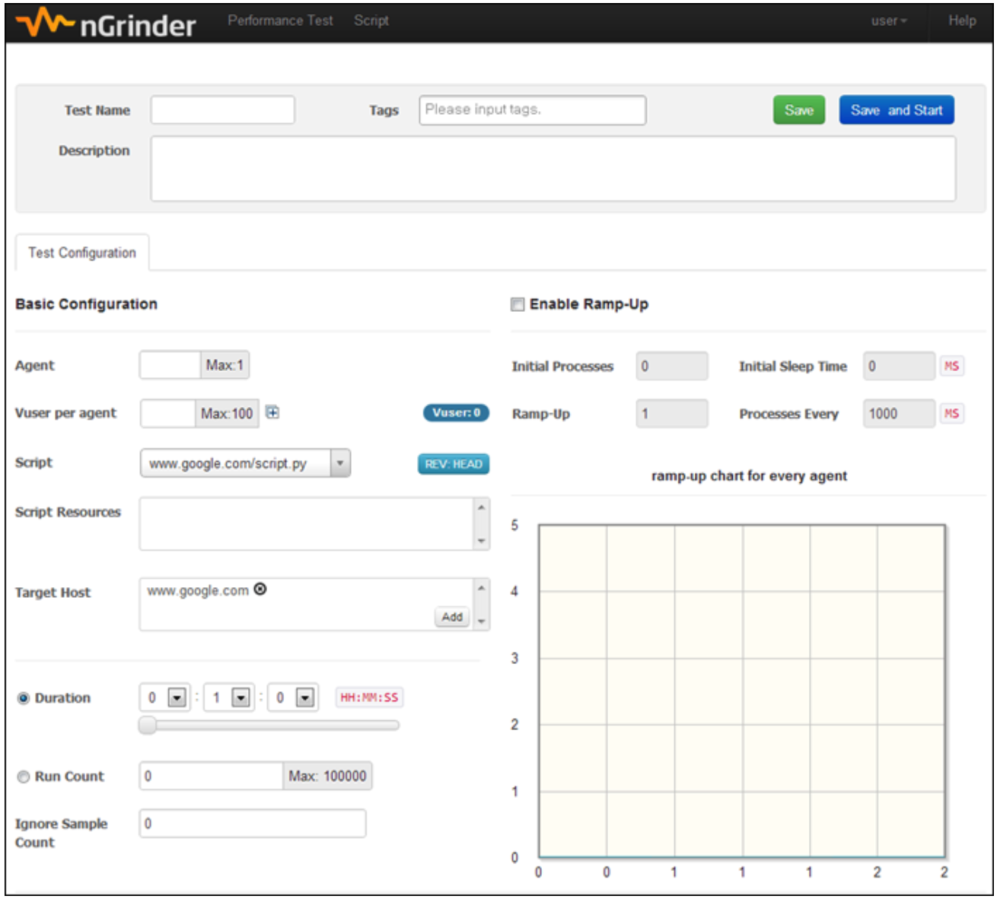

Agent：需要多少个agent，也就是需要多少台机器。nGrinder默认一台机器一个agent。

Vuser per agent：每个agent创建多少个Vuser。Vuser相当于线程。

Duration：持续压多少时间后停止。

Run Count：运行多少次后停止。

点击`REV:HEAD`后，能切换到脚本视图：

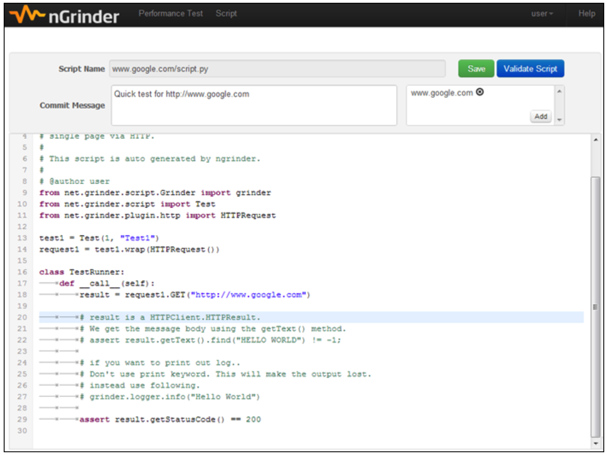

填写好策略后，保存，设置“马上运行”还是“定时运行”：

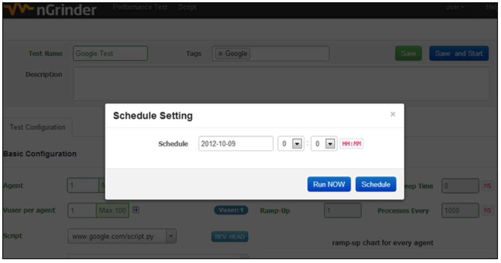

确认后在列表能看到压测任务：

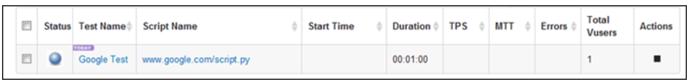

将鼠标悬浮在Status上能看到运行状态的明细：

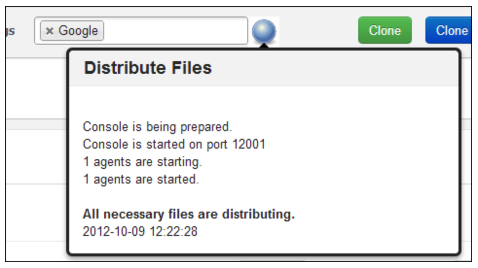

运行开始后会有一段启动时间，因为每个test都需要从console分发测试脚本和资源到agent上：

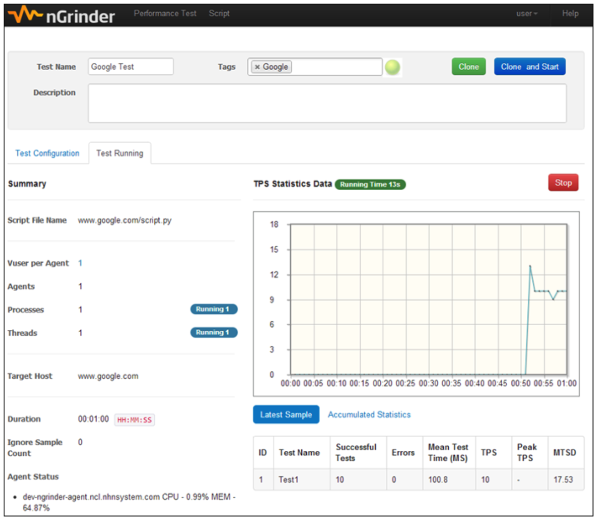

运行结束后，能看到TPS走势图：

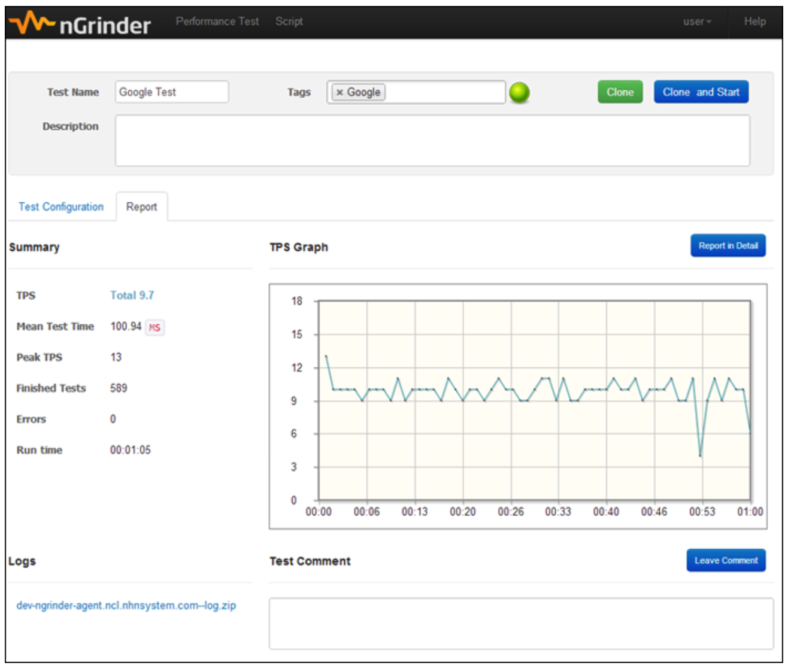

点击`Report in Detail`按钮，能查看明细报告：

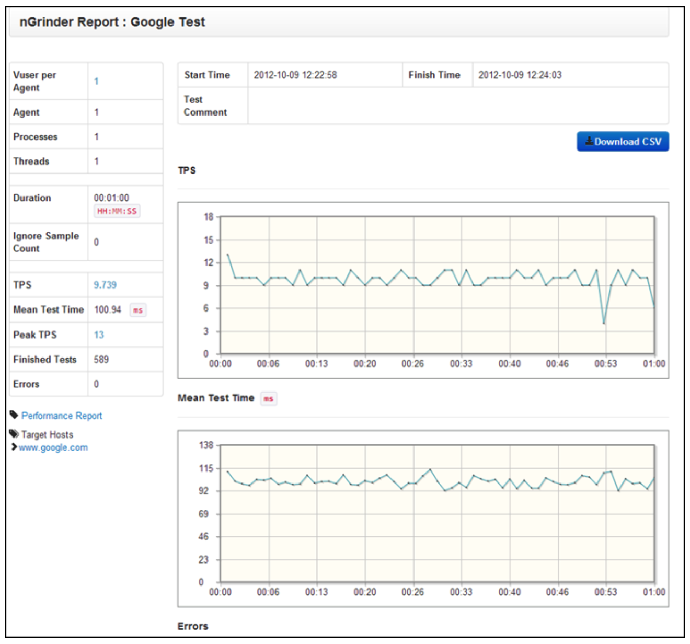

包括TPS、Mean Test Time、Errors。如果在agent上安装了monitor，点击左下角的`Perfomance Report`能看到更详细的压测报告。

更多关于nGrinder的内容请查阅官方手册和Wiki：

https://github.com/naver/ngrinder/wiki/User-Guide

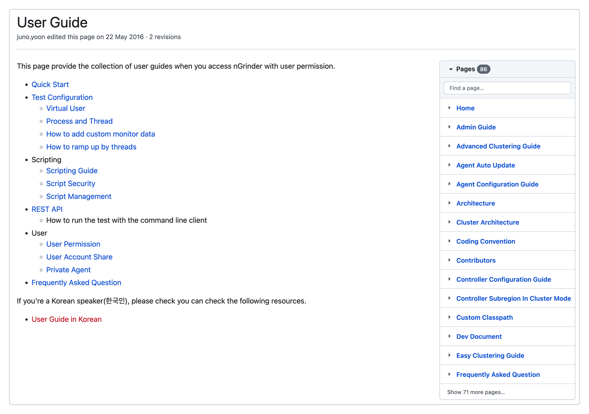

nGrinder有三大优势，一是Web界面化操作；二是多压测任务并行；三是天然支持集群发压。值得大家学习使用。

> 参考资料：
> 
> nGrinder官网 https://naver.github.io/ngrinder/
> 
> nGrinder架构 https://github.com/naver/ngrinder/wiki/Architecture
> 
> nGrinder安装 https://github.com/naver/ngrinder/wiki/Installation-Guide
> 
> nGrinder入门 https://github.com/naver/ngrinder/wiki/Quick-Start
> 
> nGrinder手册 https://github.com/naver/ngrinder/wiki/User-Guide