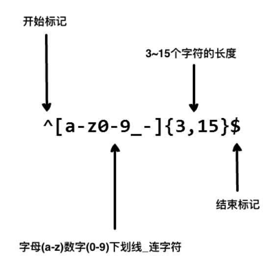
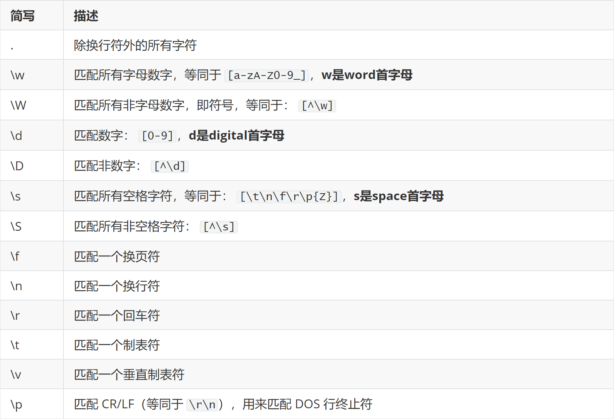
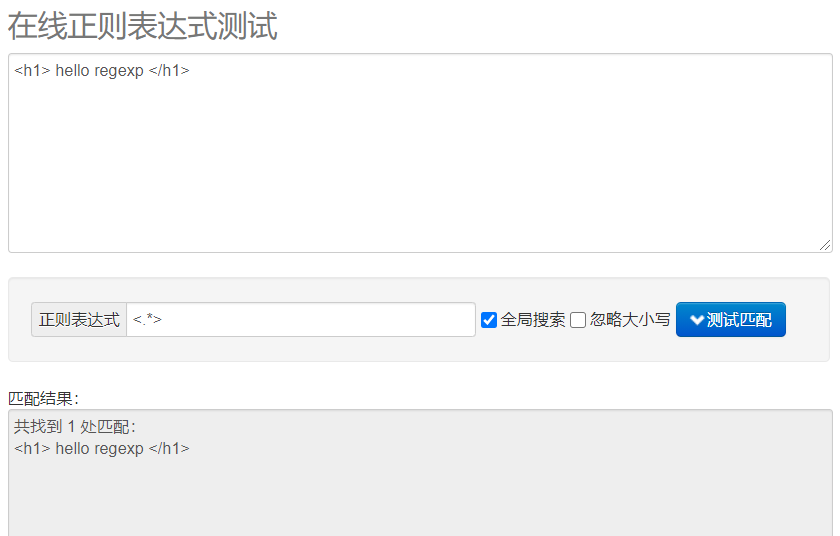
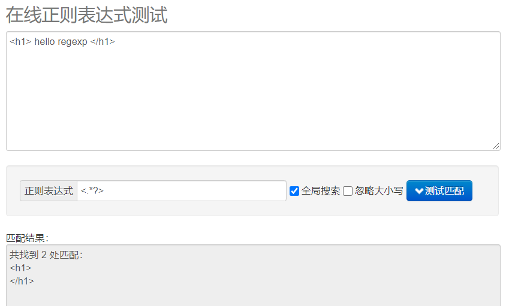

# 5分钟轻松学正则表达式


## 正则表达式是什么？

正则表达式，是一个表达式，用少量的简单字符，来表示复杂的长字符串。

实际工作用到很多，比如日志搜索、查找替换、JMeter 响应数据提取等。

先看一个例子，用户名包含字符、数字、下划线和连字符，并限制字符的个数：



这个表达式可以接受 `john_doe`、`jo-hn_doe`、`john12_as`，但是无法匹配到 `Jo`，因为它包含了大写的字母而且太短了。

## 字符匹配

正则表达式之所以强大，是因为通过一些特殊字符，能让它匹配到更多字符串。

### 表达式`.`

匹配任意单个字符除了换行符。

例：`.ar `=> The <font color=red>car</font> <font color=red>par</font>ked in the <font color=red>gar</font>age.

### 表达式`[]`

字符集。匹配方括号内的任意字符。并且字符是无先后顺序的。

例：`[Tt]he` => <font color=red>The</font> car parked in <font color=red>the</font> garage.

方括号的句号就表示句号。

例：`ar[.]` => A garage is a good place to park a c<font color=red>ar.</font>

### 表达式`[^]`

否定的字符集。匹配除了方括号里的任意字符。

例：`[^c]ar` => The <font color=gray>car</font> <font color=red>par</font>ked in the <font color=red>gar</font>age.

### 表达式`*`

匹配 >= 0 个重复的在 \* 号之前的字符。

例：`a*` => b<font color=red>a</font>b<font color=red>aa</font>123.

例：`[a-z]*` => T<font color=red>he car parked in the garage</font> #21.

`*` 字符和 `.` 字符搭配可以匹配所有的字符 `.*`。

### 表达式`+`

匹配 >= 1个重复的 + 号前的字符。

例：`c.+t` => The fat <font color=red>cat sat on the mat</font>.

### 表达式`?`

标记 ? 之前的字符为可选，即出现 0 或 1 次。

例：`[T]?he` => <font color=red>The</font> car is parked in t<font color=red>he</font> garage.

### 表达式`{n,m}`

匹配 num 个大括号之前的字符或字符集 (n <= num <= m)。

例：`[0-9]{2,3}` => The number was 9.<font color=red>999</font>7 but we rounded it off to <font color=red>10</font>.0.

可以省略第二个参数，表示至少。

例：`[0-9]{2,}` => The number was 9.<font color=red>9997</font> but we rounded it off to <font color=red>10</font>.0.

逗号也省略掉则表示重复固定的次数。

例：`[0-9]{3}` => The number was 9.<font color=red>999</font>7 but we rounded it off to 10.0.

### 表达式`(xyz)`

字符集，匹配与 xyz 完全相等的字符串，括号内的被视为一个整体。

JMeter 中，通过小括号来提取字符串中的子字符串。

例：`"token":"(.*?)","expired_at"` => "token":"<font color=red>123</font>","expired_at"

### 表达式`|`

或运算符，匹配符号前或后的字符。

例：`"(T|t)he|car"` => <font color=red>The car</font> is parked in <font color=red>the</font> garage.

### 表达式`^`

字符串开头。

例：`"^(T|t)he"` => <font color=red>The</font> car is parked in <font color=gray>the</font> garage.

### 表达式`$`

字符串结尾。

例：`"(at\.)$"` => The fat c<font color=gray>at.</font> s<font color=gray>at.</font> on the m<font color=red>at.</font>

### 转义

对于正则表达式的这些特殊字符：

```
{ } [ ] ( ) / \ + * . $ ^ | ?
```

如果需要匹配，那么需要使用反斜杠 `\` 进行转义。

例：`"(f|c|m)at\.?"` => The <font color=red>fat cat</font> sat on the <font color=red>mat.</font>

## 简写字符集



## 贪婪匹配与非贪婪匹配

正则表达式默认是贪婪匹配，也就是会尽可能多的匹配字符串。可以使用 `?` 将贪婪匹配模式转化为非贪婪匹配模式。

例：

默认贪婪：



使用 `?` 转为非贪婪：



## 忽略大小写

不同编程语言写法不同，比如 Python 可以通过 `re.compile('pattern', re.I)` 来忽略大小写。

## 在线测试

https://tool.oschina.net/regex/

## 小结

本文首先通过一个例子介绍了正则表达式是什么样子的，接着对字符匹配的特殊字符进行了讲解和示例说明，然后给出了简写字符集。正则表达式默认是贪婪模式，可以使用 `?` 来转为非贪婪。也可以添加参数，让正则表达式忽略大小写等。最后给出了在线测试正则表达式地址，方便调试看结果。本文内容已经足够在工作中使用，更多高级用法可以通过参考资料进一步阅读。

参考资料：

https://en.wikipedia.org/wiki/Regular_expression

https://docs.python.org/3/library/re.html

https://github.com/ziishaned/learn-regex

https://www.cnblogs.com/huxi/archive/2010/07/04/1771073.html