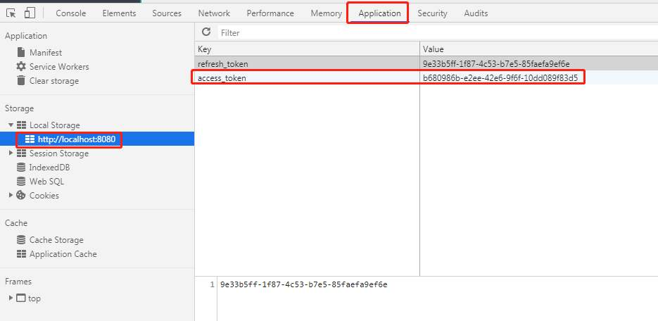

# 一文搞懂Cookie,Session,Token,JWT


HTTP协议是无状态的，无状态意味着，服务器无法给不同的客户端响应不同的信息。这样一些交互业务就无法支撑了。Cookie应运而生。

## Cookie

通过F12开发者工具，先瞅瞅Cookie的颜值


从图中可以看到Cookie包括这些内容：Name，Value，Domain，Path，Expires / Max-Age，Size，HttpOnly，Secure，SameSite，Priority。

Cookie的传递会经历这4步

1. Client发送HTTP请求给Server
2. Server响应，并附带Set-Cookie的头部信息
3. Client保存Cookie，之后请求Server会附带Cookie的头部信息
4. Server从Cookie知道Client是谁了，返回相应的响应


Cookie的英文翻译是甜品，使用Cookie可以自动填写用户名、记住密码等，是给用户的一点甜头。

Server拿到Cookie后，通过什么信息才能判断是哪个Client呢？服务器的SessionID。

## Session

如果把用户名、密码等重要隐私都存到客户端的Cookie中，还是有泄密风险。为了更安全，把机密信息保存到服务器上，这就是Session。Session是服务器上维护的客户档案，可以理解为服务器端数据库中有一张user表，里面存放了客户端的用户信息。SessionID就是这张表的主键ID。

Cookie中保存SessionID


Session信息存到服务器，必然占用内存。用户多了以后，开销必然增大。为了提高效率，需要做分布式，做负载均衡。因为认证的信息保存在内存中，用户访问哪台服务器，下次还得访问相同这台服务器才能拿到授权信息，这就限制了负载均衡的能力。而且SeesionID存在Cookie，还是有暴露的风险，比如CSRF（Cross-Site Request Forgery，跨站请求伪造）。

如何解决这些问题呢？基于Token令牌鉴权。

## Token

首先，Token不需要再存储用户信息，节约了内存。其次，由于不存储信息，客户端访问不同的服务器也能进行鉴权，增强了扩展能力。然后，Token可以采用不同的加密方式进行签名，提高了安全性。

Token就是一段字符串



Token传递的过程跟Cookie类似，只是传递对象变成了Token。用户使用用户名、密码请求服务器后，服务器就生成Token，在响应中返给客户端，客户端再次请求时附带上Token，服务器就用这个Token进行认证鉴权。

Token虽然很好的解决了Session的问题，但仍然不够完美。服务器在认证Token的时候，仍然需要去数据库查询认证信息做校验。为了不查库，直接认证，JWT出现了。

## JWT

JWT的英文全称是JSON Web Token。JWT把所有信息都存在自己身上了，包括用户名密码、加密信息等，且以JSON对象存储的。

JWT长相是`xxxxx.yyyyy.zzzzz`，极具艺术感。包括三部分内容

- Header

  包括token类型和加密算法（HMAC SHA256 RSA）。

  ```json
  {
    "alg": "HS256",
    "typ": "JWT"
  }
  ```

- Payload

  传输内容。

  ```json
  {
    "sub": "1234567890",
    "name": "John Doe",
    "admin": true
  }
  ```

- Signature

  签名，把header和payload用base64编码后"."拼接，加盐secret（服务器私钥）。

  ```
  HMACSHA256(
    base64UrlEncode(header) + "." +
    base64UrlEncode(payload),
    secret)
  ```

再画个妆，漂亮


可以到https://jwt.io/#debugger-io这个网址卸妆哦


给Token穿个外套

```
Authorization: Bearer <token>
```

这就是我们在请求Header里面看到的内容格式了。

## 简要回顾

本文简单介绍了Cookie、Session、Token、JWT的概念，以及为什么需要这些技术。至于更深入的原理和代码使用，就请读者自行研究了哦。至少这篇文章能让你搞懂，看到不会觉得陌生了。哈哈哈。

> *参考资料*
>
> https://jwt.io/introduction/
>
> jwt-handbook-v0_14_1