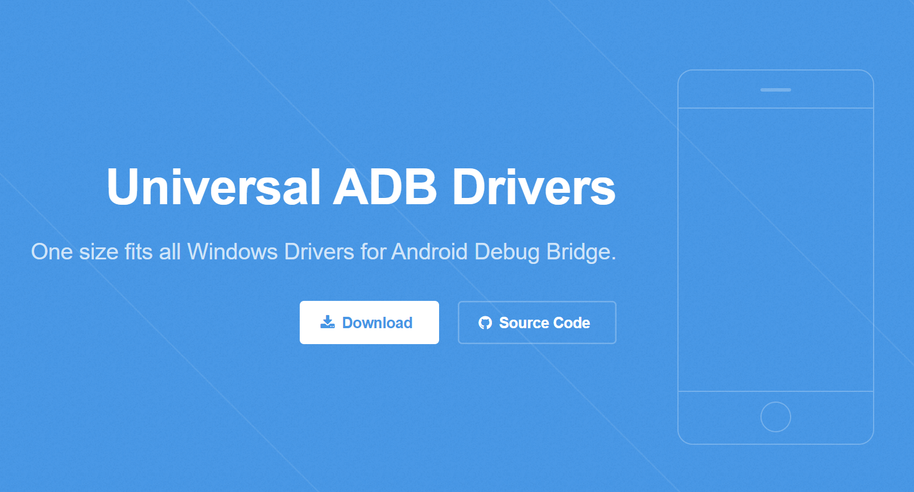
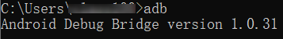
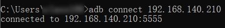
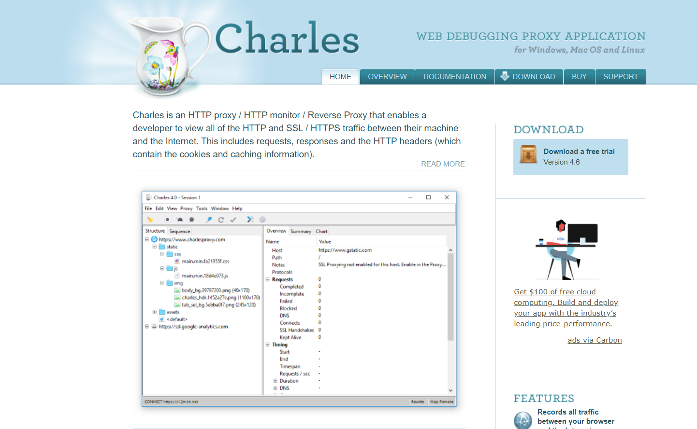
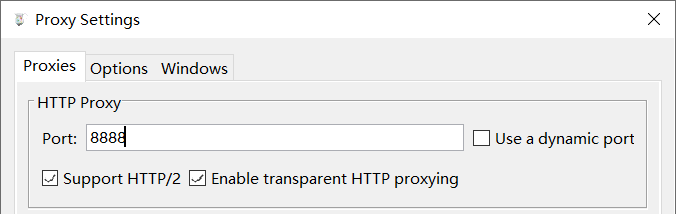
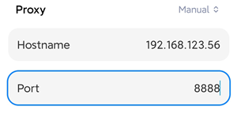
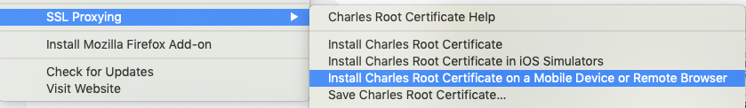
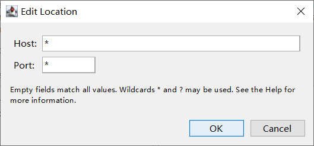
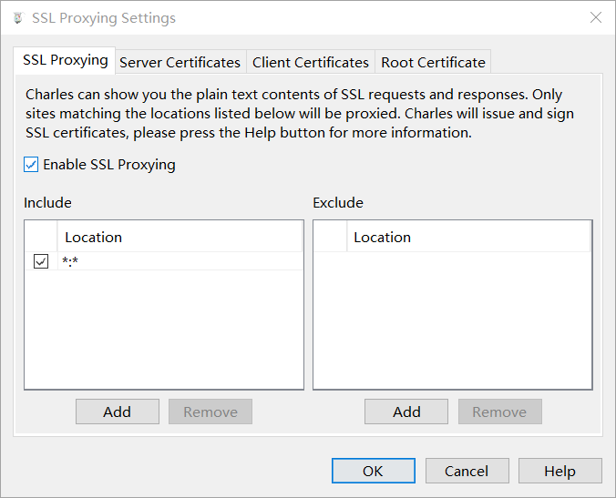

Android测试三件套：传文件、抓包、看日志
=======================================

|image1|

在对安卓进行测试时，我们需要把 apk
传到安卓机上，对请求抓包，同时监控应用日志。本文就来讲讲具体操作。

安卓机是指基于安卓的机器 ，如手机、POS 机、电视盒子等。

传文件
------

我们拒绝用 U 盘传文件。直接用 WIFI 传。别问，问就是想装逼。哈哈哈。

① 先把装逼神器 adb 下载下来，打开以下网址：

https://adb.clockworkmod.com/

|image2|

下载后得到 UniversalAdbDriverSetup.msi 文件，只有 16.2
M，相比有些人让安装 Android Studio，轻巧了太多。

② 安装之后打开 cmd，输入 ``adb``\ ：

|image3|

出现如图所示就算安装成功了。

③ 接着继续装逼，把安卓机掏出来，打开设置 \| 系统 \|
关于手机，对着“版本号”一顿猛戳，戳到开发者模式为止，启用它（不同安卓机可能方式不同）。

④ 装，接着装。在 WIFI 设置中，找到已经和电脑处于同一网络的
WIFI，查看高级选项，获取 IP 地址。

⑤ 在电脑的 cmd 中，输入以下命令使用 adb 连接安卓机：

.. code:: shell

   adb connect 192.168.x.x

出现如图所示就算连接成功了：

|image4|

⑥ 好，一切就绪，开始骚操作，电脑 → 手机：

.. code:: shell

   adb push D:\test.apk  /storage/emulated/0/

电脑 ← 手机：

.. code:: shell

   adb pull /storage/emulated/0/test.apk D:\

抓包
----

抓包用到的工具是 Charles。下载地址：

https://www.charlesproxy.com/

|image5|

下载后直接安装即可。建议找下破解，不然用着会有点卡。

抓包很简单，只需要两步。第一步在电脑端启动代理。第二步在安卓机上手动设置代理。

第一步在电脑端启动代理。Charles 中打开 Proxy \| Proxy Settings
启用代理，默认端口 8888：

|image6|

第二步在安卓机上手动设置代理。打开安卓机 WIFI
设置，编辑网络（不同手机可能方式不同），添加手动代理，填写\ **电脑 IP 和
Charles 代理端口**\ ：

|image7|

保存后 Charles 会提示有连接请求：

|image8|

允许即可。

看日志
------

电脑端 cmd 一行命令搞定：

.. code:: shell

   adb logcat

不过这样打出来的日志会比较多。可以做下过滤。

Windows：

.. code:: shell

   adb logcat | find "some"

Linux：

.. code:: shell

   adb locat | grep "some"

抓不到包的问题
--------------

有可能会抓不到包。不同机器原因各有不同。这里我不能给出完美的解决办法。只能分享下我的经验。如果无法解决，还是找下百度。

一种可能就是 HTTPS 证书问题，在 Help \| SSL Proxying 有对应功能：

|image9|

有些时候电脑端安装完证书就可以了，有些时候还需要在安卓机上下载证书：

http://charlesproxy.com/getssl

有一次我访问这个链接无响应，重启 Charles 又可以了下载了。

还有一种可能是没有添加白名单，Proxy \| SSL Proxying setttings：

|image10|

|image11|

简要回顾
--------

本文介绍了安卓机测试环境的准备，用到了 adb、Charles
软件，进行传文件、抓包、看日志。操作还是比较简单，不过实际过程中，可能会由于机器不同导致遇到奇奇怪怪的问题。通过百度，一般是能够解决的。最后温馨提示，如果第二天安卓机提示无法连接网络，那么看看是不是电脑的
Charles 关掉了。

.. |image1| image:: ../wanggang.png

