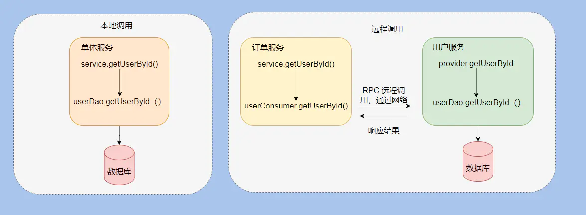

# 中台RPC接口自动化怎么做


## RPC接口

我所在的部门是技术中台，主要负责toB业务，上游是业务条线，包括PC、APP、小程序等终端，这些端的后台是HTTP接口层，而在HTTP接口层之下，就是技术中台的RPC接口层。

HTTP是一种超文本传输协议，基于TCP/IP来传输文本、图片、音频、视频等数据。数据包的传输能力不是HTTP提供的，而是TCP/IP干的。**HTTP的本质是客户端和服务端约定好的一种通信格式，是一种全世界认可的通用范本。**

RPC是一种远程调用，也就是进程间通信，既可以用HTTP协议，也可以用自定义协议。**RPC的好处是没有HTTP那么多约束，简化了写法，可以根据公司自定义规范，内部统一即可。** 所以在公司内部特别流行，比如阿里的Dubbo接口就是一种RPC接口，我们公司用的JSF接口，自研的服务框架，简称杰夫。

> 谈谈京东的服务框架 https://juejin.cn/post/6948351920088186888

举个例子，本地调用，是调用的本地方法：

```java
 public User getUserById(Long id) {
       return userDao.getUserById(id); // 这叫本地调用
    }
```

而RPC远程调用，调用的是另外一个服务的方法：

```java
 public User getUserById(Long id) {
       return userConsumer.getUserById(id); // 这是远程调用，逻辑是用户小组的服务实现的。
    }
```

本地调用和远程调用的比较如下图所示：



左边的本地调用，只在应用内部调用。右边的远程调用，会跨应用在应用之间调用。

## RPC和HTTP用法区别

HTTP接口在调用时，输入URL，Method，Headers，Body等等等就可以发送请求了。

RPC接口的调用大同小异，输入：

**JSF地址**：方法引用路径，比如`com.dongfanger.api.service.ShopProvider`。

**方法名**：方法名称，比如`queryShopList`。

**别名**：既可以是分组别名，也可以直连IP地址。

**方法入参**：JSON串。

等等等，就可以发起请求了。

从用法能看出来，**RPC和HTTP接口的结构体是差不多的，但是RPC不需要Method和Headers**，精简了许多。

## 接口自动化

首先需要考虑的是**目录结构设计**，HTTP可以模块菜单创建用例目录，比如：

一级目录：管理端

二级目录：发票管理

三级目录：发票查询

而RPC是无页面的，一般存在很多业务线，所以可以按照功能域和业务线来组织目录，比如：

一级目录：发票

二级目录：提交申请

三级目录：分销

其次就得考虑**技术实现**了，公司基建比较完善，无论是HTTP还是JSF接口，都能在接口测试平台上编写自动化用例。虽然是Web平台写用例，但是得益于测试平台的优秀设计和使用体验，用起来很方便，效率也很高。交互方式跟JMeter大同小异，只是在细节上做了很多打磨。

然后就是**参数构造**了，建议是用流量回放的方式来做，省去手工编写参数的崩溃感。流量用例创建好以后，需要做一些参数化处理和接口关联。这样才能够把多个接口串起来。

对于**测试数据**，通过预设变量来统一管理，自动化用例也尽可能设计成闭环，增加，修改，查询，删除，用例跑完后产生的数据也跟着清理掉。

最后就是**断言了**。没有断言的自动化用例，不叫做自动化用例。断言一定要加上，否则定时任务跑出结果后，无法判断到底有没有问题。而断言内容不能只是简单的code200，需要加上业务校验。

中台RPC接口自动化最难处理的是接口依赖问题，链路特别长，依赖特别多。我一般通过Mock来解决这个问题，公司的测试平台也提供了这个功能。

需要注意的是，核心用例定时运行监控起来，而一次性用例要及时维护或清理，防止变成僵尸用例。

最后，我准备基于Vue+FastAPI开发一套新的pytest脚本管理平台，集成流量录制创建用例和Mock等功能，并借鉴公司测试平台的设计，感兴趣的同学可以添加微信**cekaigang**加群讨论哟。

> 参考资料：
> 
> HTTP 的本质？HTTP 和 RPC 的区别？ https://www.jianshu.com/p/fe5ccfc5d7bd
> 
> 谈谈京东的服务框架 https://juejin.cn/post/6948351920088186888
