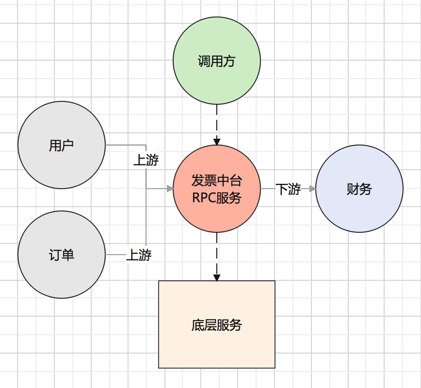
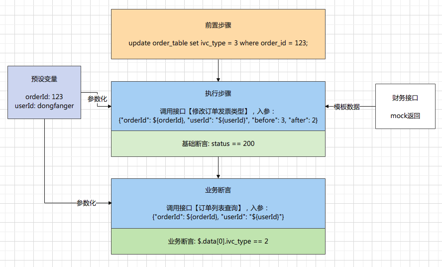
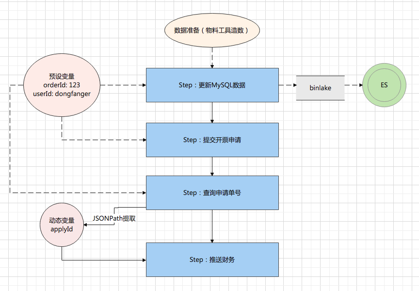
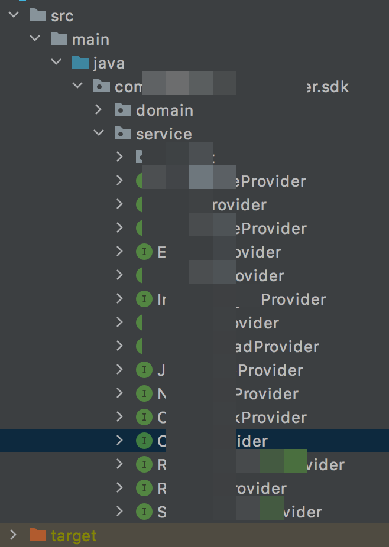
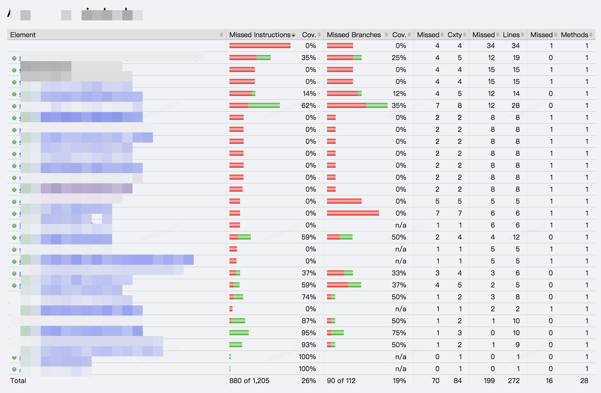
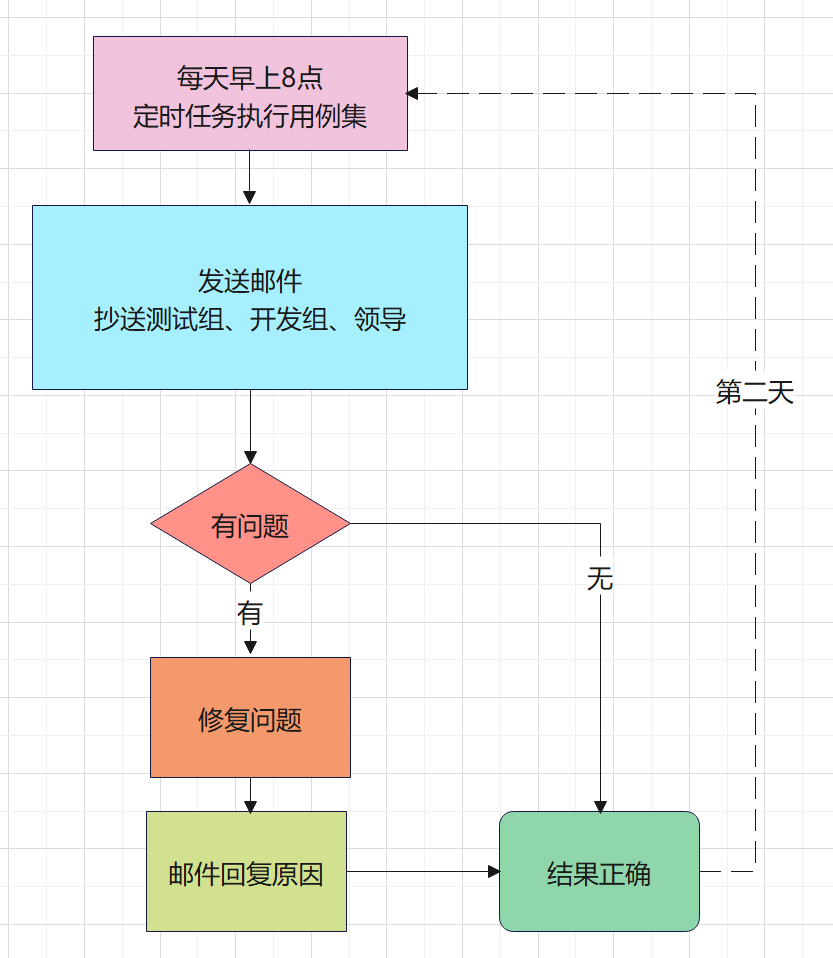

理想中的接口自动化项目
======================

|image1|

如何评价接口自动化项目
----------------------

我理想中的接口自动化项目，是有一套脚本，能够100%覆盖核心业务场景，能够回归线上频繁出现的问题，能够支持手工无法验证的场景，能够抛出偶现问题，能够包含容易遗漏的边界场景、异常场景，每天都能定时运行，出具报告，给予反馈。

用实际的\ **指标量化**\ 下：

-  功能测试自动化率 = 自动化测试用例数/总测试用例数

-  自动化发现bug占比 = 自动化发现的bug/总bug数

-  自动化发现bug有效性 = 自动化发现的有效bug/自动化提交的bug总数

-  自动化执行成功率 = 自动化执行成功的次数/自动化执行总次数

-  周活跃自动化用例占比 =
   (∑每周执行过的自动化测试用例)/(∑周维度自动化测试用例)

-  应用维度自动化代码覆盖率 = 自动化用例覆盖代码行数/应用维度代码总行数

现状是什么(Situation)
---------------------

我负责的业务是发票中台，数据流简化后如下图所示：

|image2|

发票中台对调用方提供RPC服务，底层有读写MySQL、同步ES、消息队列、异步任务等服务，上游是用户和订单，需要账号、增票资质、订单等物料；下游是财务，推送申请单给财务开具发票等。

发票的接口自动化在多年前是写了的，用Java+TestNG+RPC本地化了一套框架来实现，因为人员离职和业务变更，这套自动化到我手上的时候，已经不能用了，本地化的接口自动化项目也无法做数据度量，只有接口测试平台写的自动化用例才会被统计到。

任务是什么(Task)
----------------

我给自己定的绩效是在Q2完成95条自动化用例，按照一个标准化的自动化项目来实现发票的接口自动化，结合测试环境、测试物料、流水线、精准分析，打造一个个人的稳定的沉淀物，无论是晋升还是求职，都能拿来讲点故事。

行动是什么(Action)
------------------

**编写自动化用例的方式**
~~~~~~~~~~~~~~~~~~~~~~~~

1、最理想的方式，是能够录制线上流量直接转换为自动化用例，修修改改即可。虽然我们有流量录制回放平台，但是它跟接口自动化平台并没有打通，很可惜不能采取这种方式。

2、参考线上流量日志，抓取接口、入参，人工转化为自动化用例。

3、参考接口的代码设计，比如controller/provider/sdk都定义了应用接口，能知道哪些覆盖到了，哪些还需要补充。

4、根据入参模板自行构造参数。参数个数太多的话造起来很麻烦。

我主要采用第2种和第3种方式结合来编写自动化用例。

**典型自动化用例**
~~~~~~~~~~~~~~~~~~

|image3|

前置步骤：初始化数据，将订单发票类型更新为3。

预设变量：提供参数化数据。

执行步骤：调用修改订单发票类型接口，将发票类型3改为2，入参引用预设变量。

财务接口：依赖测试物料无法满足，通过Mock来返回模板数据，让接口继续往下走。

基础断言：接口响应状态码200。

业务断言：调用订单列表查询接口，用JSONPath提取响应中的发票类型，断言已经改成了2。

场景用例
~~~~~~~~

|image4|

数据准备：通过物料工具造订单数据，写入MySQL数据库中。

更新MySQL数据：更新订单的部分字段数据，触发binlake，将数据同步至ES，因为提交开票申请是读取的ES数据；从预设变量获取orderId。

提交开票申请：从ES读取订单数据，提交开票申请；从预设变量获取orderId和userId。

查询申请单号：根据订单号查询申请单号；从预设变量获取orderId和userId。用JSONPath提取申请单号，存入动态变量中。

推送财务：把申请单号推送给财务；从动态变量获取applyId。

覆盖更多代码
~~~~~~~~~~~~

①看代码：

|image5|

在Java工程里面的Controller/Provider找到所有接口，分析可以用来做自动化的接口，设计自动化用例进行覆盖。

②代码覆盖率：

|image6|

借助于jacoco，在执行自动化用例后，把代码覆盖率跑出来，分析没覆盖的代码，补充更多\ **正常/异常/边界**\ 的自动化用例。也就是精准测试。

自动化巡检
~~~~~~~~~~

|image7|

每天早上8点，定时任务执行用例集；发送邮件，抄送测试组、开发组、领导，让测试、开发和领导都知道自动化建设情况；如果出现问题，一定要在当天解决，并邮件回复问题原因；确保当天的自动化用例结果都是正确的；第二天接着继续巡检。

流水线
~~~~~~

在持续集成中，引入自动化用例环节，把自动化用例跑通作为提测卡点，不通过可以驳回。

产出是什么(Result)
------------------

定性来看：

**结合测试环境、测试物料、自动化、流水线、精准测试，完成了一个能对环境和业务进行稳定性巡检，能对研发提测进行质量门禁，能对应用进行代码覆盖率分析的接口自动化项目。**

定量来看：

-  功能测试自动化率 = 自动化测试用例数/总测试用例数 **95/100=95%**
-  自动化发现bug占比 = 自动化发现的bug/总bug数 **2/53=3.7%**
-  自动化发现bug有效性 = 自动化发现的有效bug/自动化提交的bug总数
   **2/2=100%**
-  自动化执行成功率 = 自动化执行成功的次数/自动化执行总次数
   **5396/5621=96%**
-  周活跃自动化用例占比 =
   (∑每周执行过的自动化测试用例)/(∑周维度自动化测试用例) **77%**
-  应用维度自动化代码覆盖率 = 自动化用例覆盖代码行数/应用维度代码总行数
   **39%**

这个Q主要完成了核心流程和重要接口的自动化用例，还需要持续补充场景用例和异常/边界的自动化用例。

**你理想中的接口自动化项目是什么样的呢？**

.. |image1| image:: ../wanggang.png

