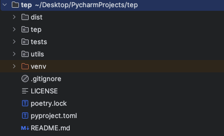
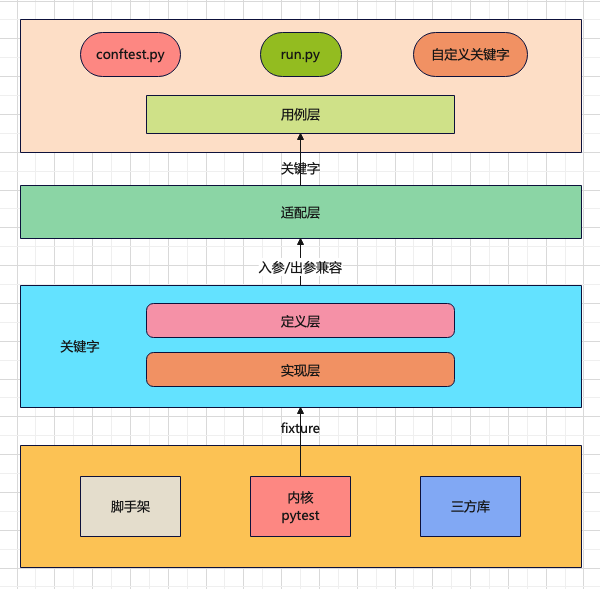
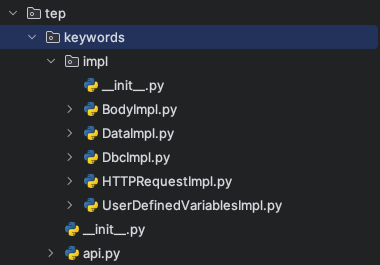
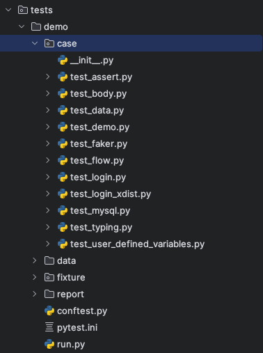
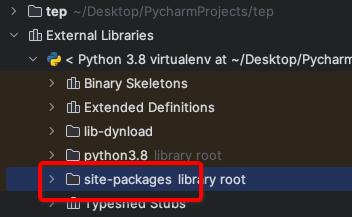
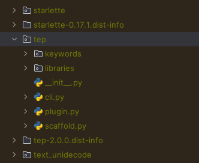

# 【开源框架】框架V2.0.0开发指南


**温馨提示：开发指南，根据V2.0.0编写，不随版本更新维护，仅供入门参考。最新实现请结合教程和源码阅读，教程会在版本发布后维护。**

## 环境准备

1. 安装Python，3.8以上版本
2. 安装poetry包管理工具，`pip install poetry`
3. 克隆代码，`git clone ``https://github.com/dongfanger/tep`

准备就绪，撸起袖子干！

## 目录结构



- dist `poetry build`生成目标文件，用于发布pypi
- tep 核心代码
- tests 测试代码
- utils 工具包
- venv 虚拟环境
- .gitignore 忽略上传git
- LICENSE 证书
- poetry.lock 版本锁定
- pyproject.toml 配置信息
- README.md 说明文件

## poetry命令

初始化：`poetry init`

添加包：`poetry add pytest`

移除包：`poetry remove pytest`

安装包：`poetry install --only main`

构建包：`poetry build`

发布包：`poetry publish`

poetry管理包信息可以在`pyproject.toml`文件中查看：

```TOML
[tool.poetry.dependencies]
python = "^3.8"
faker = "^4.1.1"
urllib3 = "^2.0.7"
requests = "^2.22.0"
pyyaml = "^5.4.1"
pytest-assume = "^2.4.2"
loguru = "^0.4.1"
fastapi = "^0.72.0"
uvicorn = "^0.17.0"
pydantic = "^1.9.0"
pytest = "^7.1.1"
pytest-xdist = "^3.1.0"
filelock = "^3.8.2"
jsonpath = "^0.82"
pymysql = "^1.1.0"
pytest-html = "^4.0.2"
allure-pytest = "^2.13.2"
allure-python-commons = "^2.13.2"
```

指定国内镜像：

```TOML
[[tool.poetry.source]]
name = "tsinghua"
priority = "default"
url = "https://pypi.tuna.tsinghua.edu.cn/simple"
```

注册命令行：

```TOML
[tool.poetry.scripts]
tep = "tep.cli:main"
```

添加插件以调用pytest hook：

```TOML
[tool.poetry.plugins."pytest11"]
"tep" = "tep.plugin:Plugin"
```

## 框架设计



框架内核是pytest，为框架提供了用例识别、组织运行、IDE集成等基础能力，以及pytest框架稳定性和强劲扩展能力。同时集成了requests等三方库，支持接口测试等。并实现了项目脚手架。

关键字驱动是通过pytest fixture特性来实现的，主要借助它实现：①测试前后置处理，②无需import就能使用，③PyCharm语法提示。这是fixture函数相比于普通函数的优势。关键字分为定义层和实现层，定义层是关键字契约，实现层负责具体逻辑实现。

适配层做了向下兼容，通过参数转换确保用例层使用的关键字，不会受迭代升级变化影响，使用者无感知，所有变化都有框架内部处理和兼容。

在项目内通过conftest.py跟框架进行连接，比如路径查找，插件加载等，同时定义run.py执行入口。也可以在项目中自定义关键字。

## 命令行实现

通过poetry注册在pyproject.toml

```
[tool.poetry.scripts]
tep = "tep.cli:main"
```

`tep/cli.py`的main函数与之对接。

```Python
#!/usr/bin/python
## encoding=utf-8

import argparse
import sys

from tep import __description__, __version__
from tep.scaffold import scaffold


def main():
    parser = argparse.ArgumentParser(description=__description__)
    parser.add_argument("-v", "--version", dest="version", action="store_true", help="show version")
    parser.add_argument("-s", "--startproject", metavar='project_name', type=str, help="Create a new project with template structure")
    parser.add_argument("-venv", dest="create_venv", action="store_true", help="Create virtual environment in the project, and install tep")

    if len(sys.argv) == 1:
        # tep
        parser.print_help()
        sys.exit(0)
    elif len(sys.argv) == 2:
        if sys.argv[1] in ["-v", "--version"]:
            print(f"Current Version: V{__version__}")
            print(r"""
 ____o__ __o____   o__ __o__/_   o__ __o
  /   \   /   \   <|    v       <|     v\
       \o/        < >           / \     <\
        |          |            \o/     o/
       < >         o__/_         |__  _<|/
        |          |             |
        o         <o>           <o>
       <|          |             |
       / \        / \  _\o__/_  / \
""")
        elif sys.argv[1] in ["-h", "--help"]:
            parser.print_help()
        elif sys.argv[1] in ["-s", "--startproject"]:
            parser.print_help()
        sys.exit(0)

    args = parser.parse_args()

    if sys.argv[1] in ["-s", "--startproject"]:
        scaffold(args)
```

通过argparse库实现命名行参数。判断是`-s`时，调用`scaffold(args)`创建脚手架。

## 脚手架实现

```
tep/scaffold.py
```

创建文件夹和创建文件：

```Python
def create_folder(path):
    os.makedirs(path)
    msg = f"Created folder: {path}"
    print(msg)

def create_file(path, file_content=""):
    with open(path, "w", encoding="utf-8") as f:
        f.write(file_content)
    msg = f"Created file:   {path}"
    print(msg)
```

根据文件内容，通过字符串填充。

识别到`-venv`参数时创建虚拟环境：

```Python
if Config.CREATE_ENV:
    # Create Python virtual Environment
    os.chdir(project_name)
    print("\nCreating virtual environment")
    os.system("python -m venv .venv")
    print("Created virtual environment: .venv")

    # Install tep in the Python virtual Environment
    print("Installing tep")
    if platform.system().lower() == 'windows':
        os.chdir(".venv")
        os.chdir("Scripts")
        os.system("pip install tep")
    elif platform.system().lower() == 'linux':
        os.chdir(".venv")
        os.chdir("bin")
        os.system("pip install tep")
```

## 关键字实现

`tep/keywords`目录下，定义在`api.py`，实现在`impl`里面：



api是关键字契约，以HTTPRequestKeyword为例：

```Python
@pytest.fixture(scope="session")
def HTTPRequestKeyword():
    def _function(*args, **kwargs) -> Result:
        method, url, kwargs = Args.parse(["method", "url"], args, kwargs)
        return HTTPRequestImpl(method, url, **kwargs)

    return _function
```

关键字是一个fixture函数，在函数内部定义了另外一个函数，然后把内部函数的函数名return了，当调用这个fixture函数时，使用使用的是fixture的return，也就是内部函数名，就相当于是在调内部函数了。这是pytest fixture的特性，不用管为什么，就这么用就对了。

api也是适配层，在内部函数中，对参数做了转换，用到了Args类：

```Python
class Args:
    @classmethod
    def parse(cls, fields: list, args: tuple, kwargs: dict) -> tuple:
        # Parse fixed args
        results = []
        for i, field in enumerate(fields):
            if i < len(args):
                results.append(args[i])
            else:
                value = kwargs.get(field, None)
                if value:
                    results.append(value)
                    # Args comes from kwargs, pop the key
                    kwargs.pop(field)
        results.append(kwargs)
        return tuple(results)
```

根据fields，从args和kwargs中解析出入参，然后传入关键字实现，比如这里解析了method和url两个入参，传入HTTPRequestImpl函数。

同时内部函数返回类型都是Result对象：

```Python
class Result:
    # Http request, response
    response: TepResponse = None
    # Any data
    data: Any = None
    # Connect database, connection
    conn = None
    # Connect database, cursor
    cursor = None
```

所有关键字的返回类型都封装在这里，基本类型就传入data，特殊类型就显式定义，比如接口请求响应就定义为`response: TepResponse`。确保后续如果关键字要新增返回值，也不会影响老代码。

关键字实现在impl包里面，有的关键字实现复杂，有的关键字实现简单。

复杂的：HTTPRequestImpl、BodyImpl

简单的：UserDefinedVariablesImpl、DataImpl、DbcImpl

```Python
def UserDefinedVariablesImpl(*args, **kwargs) -> Result:
    file_path = os.path.join(Config().DATA_DIR, "UserDefinedVariables.yaml")
    result = Result()
    result.data = File(file_path).load()
    return result
```

篇幅有限，关键字实现细节请阅读源码。所有关键字都在`tests/demo/case`编写了测试代码：



## 参数化实现

先看测试代码，`tests/demo/case/test_body.py`：

```Python
import json

from loguru import logger


def test(BodyKeyword):
    body = r"""{"id":1,"param":"[{\"page\": 1, \"pinList\":[\"cekaigang\"]}]","ext1":{"a":1,"b":1},"ext2":[1,1,1],"ext3":{"name":"pytest"}}"""
    ro = BodyKeyword(body, {"$.id": 9, "$.param[0].page": 9, "$.param[0].pinList[0]": "dongfanger", "$.ext1.a": 9, "$.ext2[0]": 9, "$.ext2[2]": 9, "$.ext3.name": "tep"})
    body = ro.data
    logger.info(json.dumps(body, ensure_ascii=False))
```

将JSON字符串按照JSONPath匹配后修改值。

JMeter是直接在字符串中通过`${}`这种语法来做的，在写Python代码时这样做会有点复杂，难以处理。比如，可以用format或者f-string来做，如果`%s`和`{}`跟JSON内容不冲突是可以的，冲突了就参数化失败了。所以这里采用JSONPath来实现。

`tep/keywords/impl/BodyImpl.py`，比较复杂，实现思路：

- JSONPath转换为字典中括号取值
- 递归遍历JSON，如果识别到是str类型，那么尝试转换为JSON继续遍历
- 遍历到最后一层时，将值进行替换

```Python
#!/usr/bin/python
## encoding=utf-8

import json
import re
from typing import Any

from tep.libraries.Result import Result


def BodyImpl(json_str: str, expr: dict) -> Result:
    json_obj = json.loads(json_str)
    for json_path, value in expr.items():
        _assign(json_obj, json_path, value)
    result = Result()
    result.data = json_obj
    return result


def _jsonpath_to_dict_expr(jsonpath: str) -> str:
    """
    Input: $.store.book[0].title
    Output: '["store"]["book"][0]["title"]'
    """
    tokens = re.findall(r'\.(\w+)|\[(\d+)\]', jsonpath)
    expr = ''
    for token in tokens:
        if token[0]:
            expr += '["{}"]'.format(token[0])
        else:
            expr += '[{}]'.format(token[1])
    return expr


def _parse_dict_expr(expr: str) -> list:
    """
    Input: '["store"]["book"][0]["title"]'
    Output: ['store', 'book', 0, 'title']
    """
    tokens = re.findall(r'\["(.*?)"\]|\[(\d+)\]', expr)
    result = [int(index) if index.isdigit() else name for name, index in tokens]
    return result


def _nested_modify(json_obj: [dict, list], keys: list, value: Any, current_level: int = 0):
    if current_level == len(keys) - 1:
        json_obj[keys[current_level]] = value
    else:
        current_key = keys[current_level]
        # Nested string json {"id": 1, "param": "{\"page\": 1}"}
        if isinstance(json_obj[current_key], str):
            # str to json
            current_value = json.loads(json_obj[current_key])
            if isinstance(current_value, dict) or isinstance(current_value, list):
                nested_string_json_obj = current_value
                _nested_modify(nested_string_json_obj, keys[current_level + 1:], value)
                # json to str
                json_obj[current_key] = json.dumps(nested_string_json_obj, ensure_ascii=False)
        else:
            _nested_modify(json_obj[current_key], keys, value, current_level + 1)


def _assign(json_obj: [dict, list], json_path: str, value: Any):
    dict_expr = _jsonpath_to_dict_expr(json_path)
    keys = _parse_dict_expr(dict_expr)
    _nested_modify(json_obj, keys, value)
```

## 执行入口

```Python
from tep.libraries.Run import Run

if __name__ == '__main__':
    settings = {
        "path": ["test_demo.py"],  # Path to run, relative path to case
        "report": False,  # Output test report or not
        "report_type": "pytest-html"  # "pytest-html" "allure"
    }
    Run(settings)
```

通过Run类实现：

```Python
class Run:
    def __init__(self, *args, **kwargs):
        os.system(Cmd(*args).pytest())
```

也就是`os.system`执行命令。命令由Cmd类拼装：

```Python
class Cmd:
    template = "pytest -s {where_to_run} {tep_report}"

    def __init__(self, *args, **kwargs):
        settings = args[0]
        self.RUN_PATH = [os.path.join(Config().CASE_DIR, path) for path in settings["path"]]
        self.RUN_REPORT = settings["report"]
        self.RUN_REPORT_TYPE = settings["report_type"]

    def pytest(self) -> str:
        cmd = self.template.format(
            where_to_run=" ".join(self.RUN_PATH),
            tep_report=self.tep_report()
        )
        return cmd

    def tep_report(self) -> str:
        if self.RUN_REPORT:
            if self.RUN_REPORT_TYPE == "pytest-html":
                return f"--html={Config().HTML_REPORT_PATH}.html --self-contained-html"
            elif self.RUN_REPORT_TYPE == "allure":
                return "--tep-reports"
        return ""
```

根据settings解析出运行配置，拼装到pytest命令行。

## 路径查找

做框架必须要解决的一个问题是，怎么在框架查找到项目路径。因为通过pip install安装后，框架代码是放在site-packages里面的：





跟项目本地目录没在一块，框架要查找case、data、report目录就要先知道项目根目录。

tep框架是基于pytest的，pytest会先加载conftest.py，所以在这个文件将项目根目录告诉框架。

```Python
from tep.plugin import tep_plugins

pytest_plugins = tep_plugins()
```

`tep_plugins()`在`tep/plugin.py`中实现：

```Python
def tep_plugins():
    """
    Must be placed at the top, execute first to initialize base dir
    """
    caller = inspect.stack()[1]
    Config.BASE_DIR = os.path.abspath(os.path.dirname(caller.filename))
    plugins = _keyword_path() + _fixture_path()  # +[other plugins]
    return plugins
```

通过inpect反查调用者，从而获取到conftest.py的路径，再查到项目根目录。再将路径存入Config类：

```Python
class Config:
    # Class variable initialize first
    BASE_DIR = ""

    # Constant
    CREATE_ENV = False
    # The temporary directory of the allure source file, which is a pile of JSON files,
    # will be deleted when generating HTML reports
    ALLURE_SOURCE_PATH = ".allure.source.temp"

    def __init__(self):
        # Instance variable initialize after class variable assigned
        self.CASE_DIR = os.path.join(self.BASE_DIR, "case")
        self.DATA_DIR = os.path.join(self.BASE_DIR, "data")
        self.REPORT_DIR = os.path.join(self.BASE_DIR, "report")

        current_time = time.strftime("%Y-%m-%d-%H-%M-%S", time.localtime(time.time()))
        self.HTML_REPORT_PATH = os.path.join(self.REPORT_DIR, "report-" + current_time)
```

Config类包含了tep框架本身的配置信息。

需要特别注意类变量和实例变量的区别，这里将BASE_DIR定义为类变量，也就是一开始就初始化。而将CASE_DIR、DATA_DIR、REPORT_DIR定义为实例变量，一开始不初始化，等到类变量初始化以后，在实例化对象时赋值。也是就说，`Config.BASE_DIR`类变量赋值，`Config().CASE_DIR`实例为对象后取值。否则可能出现这样的问题：假如将CASE_DIR也定义为类变量，在某个地方先于tep_plugins()时调用了Config.CASE_DIR，那么此时BASE_DIR是空的，就拿不到项目路径。毕竟Python的import也会执行代码，然后是从上往下执行，保不齐哪里会出问题。

为了代码健壮，一是按照类变量和实例变量分别定义，二是将`tep_plugins()`定义放在文件最上面。

## fixture识别

同样是在tep_plugins()中加载的，返回import路径列表传入conftest.py中的`pytest_plugins`，这是pytest语法，能加载到fixture。

import路径列表：

```Python
def _keyword_path() -> list:
    return ["tep.keywords.api"]


def _fixture_path():
    _fixture_dir = os.path.join(Config.BASE_DIR, "fixture")
    paths = []
    # 项目下的fixtures
    for root, _, files in os.walk(_fixture_dir):
        for file in files:
            if file.startswith("fixture_") and file.endswith(".py"):
                full_path = os.path.join(root, file)
                import_path = full_path.replace(_fixture_dir, "").replace("\\", ".")
                import_path = import_path.replace("/", ".").replace(".py", "")
                paths.append("fixture" + import_path)
    return paths
```

一个是tep自身路径`tep.keywords.api`模块，一个是项目路径`fixture`下以`fixture_`开头模块。

## Allure报告

在pyproject.toml中配置：

```
[tool.poetry.plugins."pytest11"]
"tep" = "tep.plugin:Plugin"
```

Plugin中就能写pytest hook：

```Python
class Plugin:
    @staticmethod
    def pytest_addoption(parser):
        """
        Allure test report, command line parameters
        """
        parser.addoption(
            "--tep-reports",
            action="store_const",
            const=True,
            help="Create tep allure HTML reports."
        )

    @staticmethod
    def pytest_configure(config):
        """
        Reference: https://github.com/allure-framework/allure-python/blob/master/allure-pytest/src/plugin.py
        In order to generate an allure source file for generating HTML reports
        """
        if _tep_reports(config):
            if os.path.exists(Config.ALLURE_SOURCE_PATH):
                shutil.rmtree(Config.ALLURE_SOURCE_PATH)
            test_listener = AllureListener(config)
            config.pluginmanager.register(test_listener)
            allure_commons.plugin_manager.register(test_listener)
            config.add_cleanup(cleanup_factory(test_listener))

            clean = config.option.clean_alluredir
            file_logger = AllureFileLogger(Config.ALLURE_SOURCE_PATH, clean)  # allure_source
            allure_commons.plugin_manager.register(file_logger)
            config.add_cleanup(cleanup_factory(file_logger))

    @staticmethod
    def pytest_sessionfinish(session):
        """
        Generate an allure report after the test run ends
        """
        reports_path = os.path.join(Config.BASE_DIR, "reports")
        if _tep_reports(session.config):
            if _is_master(session.config):  # Generate reports only at the master node
                # Historical data from the latest report, filling in the allure trend chart
                if os.path.exists(reports_path):
                    his_reports = os.listdir(reports_path)
                    if his_reports:
                        latest_report_history = os.path.join(reports_path, his_reports[-1], "history")
                        shutil.copytree(latest_report_history, os.path.join(Config.ALLURE_SOURCE_PATH, "history"))

                os.system(f"allure generate {Config.ALLURE_SOURCE_PATH} -o {Config().HTML_REPORT_PATH}  --clean")
                shutil.rmtree(Config.ALLURE_SOURCE_PATH)
```

pytest_addoption添加了`--tep-reports`参数。

pytest_configure生成allure源文件。

pytest_sessionfinish在测试结束后将源文件转成HTML报告。

额外做了2个增强：一是根据历史报告填充趋势图，二是在pytest-xdist分布式执行时只生成一份报告。

## 内部库

其他内部库一览。

TepResponse，封装了requests.Response，添加了jsonpath方法

```Python
#!/usr/bin/python
## encoding=utf-8

import jsonpath
from requests import Response


class TepResponse(Response):
    """
    Inherit on requests.Response, adding additional methods
    """

    def __init__(self, response):
        super().__init__()
        for k, v in response.__dict__.items():
            self.__dict__[k] = v

    def jsonpath(self, expr: str):
        """
        Force the first value here for simple values
        If complex values are taken, it is recommended to use jsonpath native directly
        """
        return jsonpath.jsonpath(self.json(), expr)[0]
```

File，读取YAML/JSON文件：

```Python
#!/usr/bin/python
## encoding=utf-8

import json
import os

import yaml


class File:
    def __init__(self, path: str):
        self.path = path

    def load(self) -> [dict, list]:
        file_type = self._file_type()
        if file_type in [".yml", ".yaml", ".YML", "YAML"]:
            return self._yaml_load()
        if file_type in [".json", ".JSON"]:
            return self._json_load()

    def _file_type(self) -> str:
        return os.path.splitext(self.path)[-1]

    def _yaml_load(self) -> [dict, list]:
        with open(self.path, encoding="utf8") as f:
            return yaml.load(f.read(), Loader=yaml.FullLoader)

    def _json_load(self) -> [dict, list]:
        with open(self.path, encoding="utf8") as f:
            return json.load(f)
```

DB，执行数据库sql

```Python
from loguru import logger


class DB:
    @classmethod
    def pymysql_execute(cls, conn, cursor, sql):
        try:
            cursor.execute(sql)
            conn.commit()
        except Exception as e:
            logger.error(f"Database execute error: {e}")
            conn.rollback()
```

数据库连接是在自定义关键字mysql_execute中实现的：

```
tests/demo/fixture/fixture_mysql.py
import pytest

from tep.libraries.DB import DB
from tep.libraries.Result import Result


@pytest.fixture(scope="session")
def mysql_execute(DbcKeyword):
    ro = DbcKeyword(host="127.0.0.1", port=3306, user="root", password="12345678", database="sys")
    conn = ro.conn

    def _function(sql: str) -> Result:
        cursor = conn.cursor()
        DB.pymysql_execute(conn, cursor, sql)
        ro = Result()
        ro.cursor = cursor
        return ro

    yield _function
    conn.close()  # After test, close connection
```

这里就利用了fixture的前后置特性，yield前是测试前置操作，yield后是测试后置操作。测试前连接数据库，测试后关闭数据库连接。`scope="session"`可以配置是整个会话期间都只连接一次，还是按其他维度进行连接和关闭。

## Mock服务

```
tests/scripts/mock.py
```

使用FastAPI实现了简单后端服务，Mock从登录到下单接口：

```Python
import uvicorn
from fastapi import FastAPI, Request

app = FastAPI()


@app.post("/login")
async def login(req: Request):
    body = await req.json()
    if body["username"] == "dongfanger" and body["password"] == "123456":
        return {"Cookie": "de2e3ffu29"}
    return ""


@app.get("/searchSku")
def search_sku(req: Request):
    if req.headers.get("Cookie") == "de2e3ffu29" and req.query_params.get("skuName") == "book":
        return {"skuId": "222", "price": "2.3"}
    return ""


@app.post("/addCart")
async def add_cart(req: Request):
    body = await req.json()
    if req.headers.get("Cookie") == "de2e3ffu29" and body["skuId"] == "222":
        return {"skuId": "222", "price": "2.3", "skuNum": 3, "totalPrice": "6.9"}
    return ""


@app.post("/order")
async def order(req: Request):
    body = await req.json()
    if req.headers.get("Cookie") == "de2e3ffu29" and body["skuId"] == "222":
        return {"orderId": "333"}
    return ""


@app.post("/pay")
async def pay(req: Request):
    body = await req.json()
    if req.headers.get("Cookie") == "de2e3ffu29" and body["orderId"] == "333":
        return {"success": "true"}
    return ""


if __name__ == '__main__':
    uvicorn.run("mock:app", host="127.0.0.1", port=5000)
```

## 工具包

Pairwise.py，根据多个条件生成两两组合过滤后的结果集，适用于查询条件组合验证。

```Python
import copy
import itertools
from sys import stdout

from loguru import logger


def parewise(option: list) -> list:
    """
    Automatically generate composite use cases
    """
    cp = []  # Cartesian product
    s = []  # Split in pairs
    for x in eval('itertools.product' + str(tuple(option))):
        cp.append(x)
        s.append([i for i in itertools.combinations(x, 2)])
    logger.info('Cartesian product:%s' % len(cp))
    del_row = []
    print_progress_bar(0)
    s2 = copy.deepcopy(s)
    for i in range(len(s)):  # Match each line of use cases
        if (i % 100) == 0 or i == len(s) - 1:
            print_progress_bar(int(100 * i / (len(s) - 1)))
        t = 0
        # Judge whether the pairwise splitting of each line of use cases appears in other lines
        for j in range(len(s[i])):
            flag = False
            for i2 in [x for x in range(len(s2)) if s2[x] != s[i]]:  # Find the same column
                if s[i][j] == s2[i2][j]:
                    t = t + 1
                    flag = True
                    break
            # The same column was not found, so there's no need to search for the remaining columns
            if not flag:
                break
        if t == len(s[i]):
            del_row.append(i)
            s2.remove(s[i])
    res = [cp[i] for i in range(len(cp)) if i not in del_row]
    logger.info('After filtering:%s' % len(res))
    return res


def print_progress_bar(i):
    c = int(i / 10)
    progress = '\r %2d%% [%s%s]'
    a = '■' * c
    b = '□' * (10 - c)
    msg = progress % (i, a, b)
    stdout.write(msg)
    stdout.flush()


if __name__ == '__main__':
    pl = [['M', 'O', 'P'], ['W', 'L', 'I'], ['C', 'E']]
    res = parewise(pl)
    print()
    for x in res:
        print(x)
```

SimplifyJSON.py，简化JSON为一行，因为tep是把JSON放文件里面的，为了看起来清爽，代码规范是尽量放一行，JSON可以使用此工具压缩。

```Python
import json


def simplify_json(json_str: str) -> str:
    data = json.loads(json_str)
    return json.dumps(data, separators=(',', ':'))


if __name__ == '__main__':
    json_str = r"""
{
       "orderId": 1,
       "payAmount": "0.2"
}
"""
    print(simplify_json(json_str))
```

压缩后如果JSON还特别长，可以格式化代码，PyCharm会根据宽度设置自动换行。如果觉得压缩了不好看，想查看JSON展开效果，使用json.cn网站更快。关于压缩JSON这点，也算是在代码阅读性和JSON阅读性之间做的妥协，可以视情况调整。

## 本地调试

`tests/demo`就是一个示例项目，项目脚手架生成的项目是子集。该示例项目包含了所有关键字测试代码，工具测试代码，和其他测试场景代码。项目脚手架只包含最基础的结构文件。

可以在示例项目中调试框架代码，它能正确识别到tep内各模块代码。

如果想调试pip install安装后的效果，可以执行`tests/scripts/install.py`脚本：

```Python
#!/usr/bin/python
## encoding=utf-8

import os
import shutil
import subprocess

from tep import __version__

if __name__ == '__main__':
    tep_path = os.path.dirname(os.path.dirname(os.path.dirname(os.path.abspath(__file__))))

    os.chdir(tep_path)
    dist_path = os.path.join(tep_path, "dist")
    if os.path.exists(dist_path):
        shutil.rmtree(dist_path)
    os.system("poetry install --only main")
    os.system("poetry build")

    proc = subprocess.Popen(["pip", "uninstall", "tep"], stdin=subprocess.PIPE)
    proc.communicate(input="y".encode())
    os.chdir(r"/Users/wanggang888/Desktop/PycharmProjects/tep/venv/lib/python3.8/site-packages")
    for dir_name in os.listdir():
        if dir_name.startswith("tep"):
            shutil.rmtree(dir_name)

    os.chdir(dist_path)
    os.system(f"pip install tep-{__version__}-py3-none-any.whl")
```

它会自动执行poetry命令安装和构建，然后pip install安装dist目录下的包到Python环境中。接着就能调试cli、脚手架、路径查找等功能。