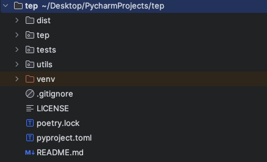
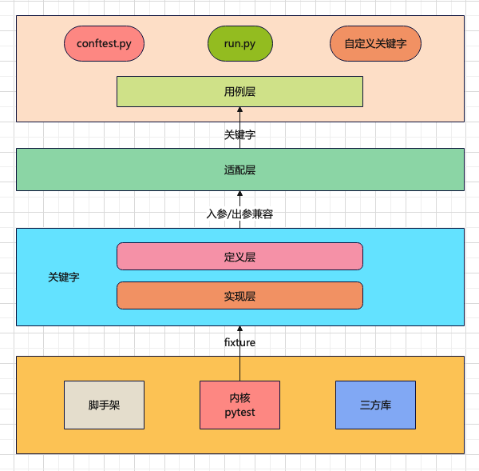
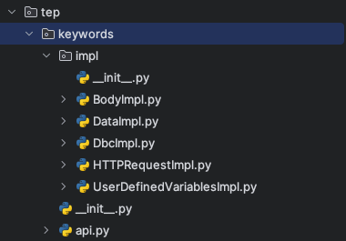
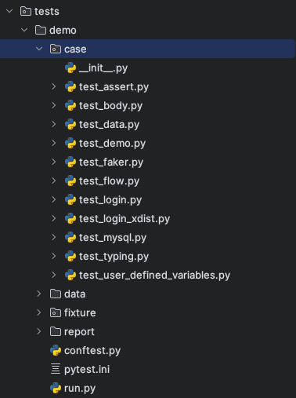
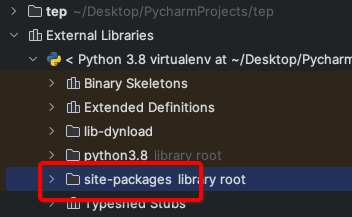
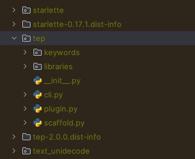

【开源框架】框架V2.0.0开发指南
==============================

|image1|

**温馨提示：开发指南，根据V2.0.0编写，不随版本更新维护，仅供入门参考。最新实现请结合教程和源码阅读，教程会在版本发布后维护。**

环境准备
--------

1. 安装Python，3.8以上版本
2. 安装poetry包管理工具，\ ``pip install poetry``
3. 克隆代码，\ :literal:`git clone ``https://github.com/dongfanger/tep`

准备就绪，撸起袖子干！

目录结构
--------

|image2|

-  dist ``poetry build``\ 生成目标文件，用于发布pypi
-  tep 核心代码
-  tests 测试代码
-  utils 工具包
-  venv 虚拟环境
-  .gitignore 忽略上传git
-  LICENSE 证书
-  poetry.lock 版本锁定
-  pyproject.toml 配置信息
-  README.md 说明文件

poetry命令
----------

初始化：\ ``poetry init``

添加包：\ ``poetry add pytest``

移除包：\ ``poetry remove pytest``

安装包：\ ``poetry install --only main``

构建包：\ ``poetry build``

发布包：\ ``poetry publish``

poetry管理包信息可以在\ ``pyproject.toml``\ 文件中查看：

.. code:: toml

   [tool.poetry.dependencies]
   python = "^3.8"
   faker = "^4.1.1"
   urllib3 = "^2.0.7"
   requests = "^2.22.0"
   pyyaml = "^5.4.1"
   pytest-assume = "^2.4.2"
   loguru = "^0.4.1"
   fastapi = "^0.72.0"
   uvicorn = "^0.17.0"
   pydantic = "^1.9.0"
   pytest = "^7.1.1"
   pytest-xdist = "^3.1.0"
   filelock = "^3.8.2"
   jsonpath = "^0.82"
   pymysql = "^1.1.0"
   pytest-html = "^4.0.2"
   allure-pytest = "^2.13.2"
   allure-python-commons = "^2.13.2"

指定国内镜像：

.. code:: toml

   [[tool.poetry.source]]
   name = "tsinghua"
   priority = "default"
   url = "https://pypi.tuna.tsinghua.edu.cn/simple"

注册命令行：

.. code:: toml

   [tool.poetry.scripts]
   tep = "tep.cli:main"

添加插件以调用pytest hook：

.. code:: toml

   [tool.poetry.plugins."pytest11"]
   "tep" = "tep.plugin:Plugin"

框架设计
--------

|image3|

框架内核是pytest，为框架提供了用例识别、组织运行、IDE集成等基础能力，以及pytest框架稳定性和强劲扩展能力。同时集成了requests等三方库，支持接口测试等。并实现了项目脚手架。

关键字驱动是通过pytest
fixture特性来实现的，主要借助它实现：①测试前后置处理，②无需import就能使用，③PyCharm语法提示。这是fixture函数相比于普通函数的优势。关键字分为定义层和实现层，定义层是关键字契约，实现层负责具体逻辑实现。

适配层做了向下兼容，通过参数转换确保用例层使用的关键字，不会受迭代升级变化影响，使用者无感知，所有变化都有框架内部处理和兼容。

在项目内通过conftest.py跟框架进行连接，比如路径查找，插件加载等，同时定义run.py执行入口。也可以在项目中自定义关键字。

命令行实现
----------

通过poetry注册在pyproject.toml

::

   [tool.poetry.scripts]
   tep = "tep.cli:main"

``tep/cli.py``\ 的main函数与之对接。

.. code:: python

   #!/usr/bin/python
   ## encoding=utf-8

   import argparse
   import sys

   from tep import __description__, __version__
   from tep.scaffold import scaffold

   def main():
       parser = argparse.ArgumentParser(description=__description__)
       parser.add_argument("-v", "--version", dest="version", action="store_true", help="show version")
       parser.add_argument("-s", "--startproject", metavar='project_name', type=str, help="Create a new project with template structure")
       parser.add_argument("-venv", dest="create_venv", action="store_true", help="Create virtual environment in the project, and install tep")

       if len(sys.argv) == 1:
           # tep
           parser.print_help()
           sys.exit(0)
       elif len(sys.argv) == 2:
           if sys.argv[1] in ["-v", "--version"]:
               print(f"Current Version: V{__version__}")
               print(r"""
    ____o__ __o____   o__ __o__/_   o__ __o
     /   \   /   \   <|    v       <|     v\
          \o/        < >           / \     <\
           |          |            \o/     o/
          < >         o__/_         |__  _<|/
           |          |             |
           o         <o>           <o>
          <|          |             |
          / \        / \  _\o__/_  / \
   """)
           elif sys.argv[1] in ["-h", "--help"]:
               parser.print_help()
           elif sys.argv[1] in ["-s", "--startproject"]:
               parser.print_help()
           sys.exit(0)

       args = parser.parse_args()

       if sys.argv[1] in ["-s", "--startproject"]:
           scaffold(args)

通过argparse库实现命名行参数。判断是\ ``-s``\ 时，调用\ ``scaffold(args)``\ 创建脚手架。

脚手架实现
----------

::

   tep/scaffold.py

创建文件夹和创建文件：

.. code:: python

   def create_folder(path):
       os.makedirs(path)
       msg = f"Created folder: {path}"
       print(msg)

   def create_file(path, file_content=""):
       with open(path, "w", encoding="utf-8") as f:
           f.write(file_content)
       msg = f"Created file:   {path}"
       print(msg)

根据文件内容，通过字符串填充。

识别到\ ``-venv``\ 参数时创建虚拟环境：

.. code:: python

   if Config.CREATE_ENV:
       # Create Python virtual Environment
       os.chdir(project_name)
       print("\nCreating virtual environment")
       os.system("python -m venv .venv")
       print("Created virtual environment: .venv")

       # Install tep in the Python virtual Environment
       print("Installing tep")
       if platform.system().lower() == 'windows':
           os.chdir(".venv")
           os.chdir("Scripts")
           os.system("pip install tep")
       elif platform.system().lower() == 'linux':
           os.chdir(".venv")
           os.chdir("bin")
           os.system("pip install tep")

关键字实现
----------

``tep/keywords``\ 目录下，定义在\ ``api.py``\ ，实现在\ ``impl``\ 里面：

|image4|

api是关键字契约，以HTTPRequestKeyword为例：

.. code:: python

   @pytest.fixture(scope="session")
   def HTTPRequestKeyword():
       def _function(*args, **kwargs) -> Result:
           method, url, kwargs = Args.parse(["method", "url"], args, kwargs)
           return HTTPRequestImpl(method, url, **kwargs)

       return _function

关键字是一个fixture函数，在函数内部定义了另外一个函数，然后把内部函数的函数名return了，当调用这个fixture函数时，使用使用的是fixture的return，也就是内部函数名，就相当于是在调内部函数了。这是pytest
fixture的特性，不用管为什么，就这么用就对了。

api也是适配层，在内部函数中，对参数做了转换，用到了Args类：

.. code:: python

   class Args:
       @classmethod
       def parse(cls, fields: list, args: tuple, kwargs: dict) -> tuple:
           # Parse fixed args
           results = []
           for i, field in enumerate(fields):
               if i < len(args):
                   results.append(args[i])
               else:
                   value = kwargs.get(field, None)
                   if value:
                       results.append(value)
                       # Args comes from kwargs, pop the key
                       kwargs.pop(field)
           results.append(kwargs)
           return tuple(results)

根据fields，从args和kwargs中解析出入参，然后传入关键字实现，比如这里解析了method和url两个入参，传入HTTPRequestImpl函数。

同时内部函数返回类型都是Result对象：

.. code:: python

   class Result:
       # Http request, response
       response: TepResponse = None
       # Any data
       data: Any = None
       # Connect database, connection
       conn = None
       # Connect database, cursor
       cursor = None

所有关键字的返回类型都封装在这里，基本类型就传入data，特殊类型就显式定义，比如接口请求响应就定义为\ ``response: TepResponse``\ 。确保后续如果关键字要新增返回值，也不会影响老代码。

关键字实现在impl包里面，有的关键字实现复杂，有的关键字实现简单。

复杂的：HTTPRequestImpl、BodyImpl

简单的：UserDefinedVariablesImpl、DataImpl、DbcImpl

.. code:: python

   def UserDefinedVariablesImpl(*args, **kwargs) -> Result:
       file_path = os.path.join(Config().DATA_DIR, "UserDefinedVariables.yaml")
       result = Result()
       result.data = File(file_path).load()
       return result

篇幅有限，关键字实现细节请阅读源码。所有关键字都在\ ``tests/demo/case``\ 编写了测试代码：

|image5|

参数化实现
----------

先看测试代码，\ ``tests/demo/case/test_body.py``\ ：

.. code:: python

   import json

   from loguru import logger

   def test(BodyKeyword):
       body = r"""{"id":1,"param":"[{\"page\": 1, \"pinList\":[\"cekaigang\"]}]","ext1":{"a":1,"b":1},"ext2":[1,1,1],"ext3":{"name":"pytest"}}"""
       ro = BodyKeyword(body, {"$.id": 9, "$.param[0].page": 9, "$.param[0].pinList[0]": "dongfanger", "$.ext1.a": 9, "$.ext2[0]": 9, "$.ext2[2]": 9, "$.ext3.name": "tep"})
       body = ro.data
       logger.info(json.dumps(body, ensure_ascii=False))

将JSON字符串按照JSONPath匹配后修改值。

JMeter是直接在字符串中通过\ ``${}``\ 这种语法来做的，在写Python代码时这样做会有点复杂，难以处理。比如，可以用format或者f-string来做，如果\ ``%s``\ 和\ ``{}``\ 跟JSON内容不冲突是可以的，冲突了就参数化失败了。所以这里采用JSONPath来实现。

``tep/keywords/impl/BodyImpl.py``\ ，比较复杂，实现思路：

-  JSONPath转换为字典中括号取值
-  递归遍历JSON，如果识别到是str类型，那么尝试转换为JSON继续遍历
-  遍历到最后一层时，将值进行替换

.. code:: python

   #!/usr/bin/python
   ## encoding=utf-8

   import json
   import re
   from typing import Any

   from tep.libraries.Result import Result

   def BodyImpl(json_str: str, expr: dict) -> Result:
       json_obj = json.loads(json_str)
       for json_path, value in expr.items():
           _assign(json_obj, json_path, value)
       result = Result()
       result.data = json_obj
       return result

   def _jsonpath_to_dict_expr(jsonpath: str) -> str:
       """
       Input: $.store.book[0].title
       Output: '["store"]["book"][0]["title"]'
       """
       tokens = re.findall(r'\.(\w+)|\[(\d+)\]', jsonpath)
       expr = ''
       for token in tokens:
           if token[0]:
               expr += '["{}"]'.format(token[0])
           else:
               expr += '[{}]'.format(token[1])
       return expr

   def _parse_dict_expr(expr: str) -> list:
       """
       Input: '["store"]["book"][0]["title"]'
       Output: ['store', 'book', 0, 'title']
       """
       tokens = re.findall(r'\["(.*?)"\]|\[(\d+)\]', expr)
       result = [int(index) if index.isdigit() else name for name, index in tokens]
       return result

   def _nested_modify(json_obj: [dict, list], keys: list, value: Any, current_level: int = 0):
       if current_level == len(keys) - 1:
           json_obj[keys[current_level]] = value
       else:
           current_key = keys[current_level]
           # Nested string json {"id": 1, "param": "{\"page\": 1}"}
           if isinstance(json_obj[current_key], str):
               # str to json
               current_value = json.loads(json_obj[current_key])
               if isinstance(current_value, dict) or isinstance(current_value, list):
                   nested_string_json_obj = current_value
                   _nested_modify(nested_string_json_obj, keys[current_level + 1:], value)
                   # json to str
                   json_obj[current_key] = json.dumps(nested_string_json_obj, ensure_ascii=False)
           else:
               _nested_modify(json_obj[current_key], keys, value, current_level + 1)

   def _assign(json_obj: [dict, list], json_path: str, value: Any):
       dict_expr = _jsonpath_to_dict_expr(json_path)
       keys = _parse_dict_expr(dict_expr)
       _nested_modify(json_obj, keys, value)

执行入口
--------

.. code:: python

   from tep.libraries.Run import Run

   if __name__ == '__main__':
       settings = {
           "path": ["test_demo.py"],  # Path to run, relative path to case
           "report": False,  # Output test report or not
           "report_type": "pytest-html"  # "pytest-html" "allure"
       }
       Run(settings)

通过Run类实现：

.. code:: python

   class Run:
       def __init__(self, *args, **kwargs):
           os.system(Cmd(*args).pytest())

也就是\ ``os.system``\ 执行命令。命令由Cmd类拼装：

.. code:: python

   class Cmd:
       template = "pytest -s {where_to_run} {tep_report}"

       def __init__(self, *args, **kwargs):
           settings = args[0]
           self.RUN_PATH = [os.path.join(Config().CASE_DIR, path) for path in settings["path"]]
           self.RUN_REPORT = settings["report"]
           self.RUN_REPORT_TYPE = settings["report_type"]

       def pytest(self) -> str:
           cmd = self.template.format(
               where_to_run=" ".join(self.RUN_PATH),
               tep_report=self.tep_report()
           )
           return cmd

       def tep_report(self) -> str:
           if self.RUN_REPORT:
               if self.RUN_REPORT_TYPE == "pytest-html":
                   return f"--html={Config().HTML_REPORT_PATH}.html --self-contained-html"
               elif self.RUN_REPORT_TYPE == "allure":
                   return "--tep-reports"
           return ""

根据settings解析出运行配置，拼装到pytest命令行。

路径查找
--------

做框架必须要解决的一个问题是，怎么在框架查找到项目路径。因为通过pip
install安装后，框架代码是放在site-packages里面的：

|image6|

|image7|

跟项目本地目录没在一块，框架要查找case、data、report目录就要先知道项目根目录。

tep框架是基于pytest的，pytest会先加载conftest.py，所以在这个文件将项目根目录告诉框架。

.. code:: python

   from tep.plugin import tep_plugins

   pytest_plugins = tep_plugins()

``tep_plugins()``\ 在\ ``tep/plugin.py``\ 中实现：

.. code:: python

   def tep_plugins():
       """
       Must be placed at the top, execute first to initialize base dir
       """
       caller = inspect.stack()[1]
       Config.BASE_DIR = os.path.abspath(os.path.dirname(caller.filename))
       plugins = _keyword_path() + _fixture_path()  # +[other plugins]
       return plugins

通过inpect反查调用者，从而获取到conftest.py的路径，再查到项目根目录。再将路径存入Config类：

.. code:: python

   class Config:
       # Class variable initialize first
       BASE_DIR = ""

       # Constant
       CREATE_ENV = False
       # The temporary directory of the allure source file, which is a pile of JSON files,
       # will be deleted when generating HTML reports
       ALLURE_SOURCE_PATH = ".allure.source.temp"

       def __init__(self):
           # Instance variable initialize after class variable assigned
           self.CASE_DIR = os.path.join(self.BASE_DIR, "case")
           self.DATA_DIR = os.path.join(self.BASE_DIR, "data")
           self.REPORT_DIR = os.path.join(self.BASE_DIR, "report")

           current_time = time.strftime("%Y-%m-%d-%H-%M-%S", time.localtime(time.time()))
           self.HTML_REPORT_PATH = os.path.join(self.REPORT_DIR, "report-" + current_time)

Config类包含了tep框架本身的配置信息。

需要特别注意类变量和实例变量的区别，这里将BASE_DIR定义为类变量，也就是一开始就初始化。而将CASE_DIR、DATA_DIR、REPORT_DIR定义为实例变量，一开始不初始化，等到类变量初始化以后，在实例化对象时赋值。也是就说，\ ``Config.BASE_DIR``\ 类变量赋值，\ ``Config().CASE_DIR``\ 实例为对象后取值。否则可能出现这样的问题：假如将CASE_DIR也定义为类变量，在某个地方先于tep_plugins()时调用了Config.CASE_DIR，那么此时BASE_DIR是空的，就拿不到项目路径。毕竟Python的import也会执行代码，然后是从上往下执行，保不齐哪里会出问题。

为了代码健壮，一是按照类变量和实例变量分别定义，二是将\ ``tep_plugins()``\ 定义放在文件最上面。

fixture识别
-----------

同样是在tep_plugins()中加载的，返回import路径列表传入conftest.py中的\ ``pytest_plugins``\ ，这是pytest语法，能加载到fixture。

import路径列表：

.. code:: python

   def _keyword_path() -> list:
       return ["tep.keywords.api"]

   def _fixture_path():
       _fixture_dir = os.path.join(Config.BASE_DIR, "fixture")
       paths = []
       # 项目下的fixtures
       for root, _, files in os.walk(_fixture_dir):
           for file in files:
               if file.startswith("fixture_") and file.endswith(".py"):
                   full_path = os.path.join(root, file)
                   import_path = full_path.replace(_fixture_dir, "").replace("\\", ".")
                   import_path = import_path.replace("/", ".").replace(".py", "")
                   paths.append("fixture" + import_path)
       return paths

一个是tep自身路径\ ``tep.keywords.api``\ 模块，一个是项目路径\ ``fixture``\ 下以\ ``fixture_``\ 开头模块。

Allure报告
----------

在pyproject.toml中配置：

::

   [tool.poetry.plugins."pytest11"]
   "tep" = "tep.plugin:Plugin"

Plugin中就能写pytest hook：

.. code:: python

   class Plugin:
       @staticmethod
       def pytest_addoption(parser):
           """
           Allure test report, command line parameters
           """
           parser.addoption(
               "--tep-reports",
               action="store_const",
               const=True,
               help="Create tep allure HTML reports."
           )

       @staticmethod
       def pytest_configure(config):
           """
           Reference: https://github.com/allure-framework/allure-python/blob/master/allure-pytest/src/plugin.py
           In order to generate an allure source file for generating HTML reports
           """
           if _tep_reports(config):
               if os.path.exists(Config.ALLURE_SOURCE_PATH):
                   shutil.rmtree(Config.ALLURE_SOURCE_PATH)
               test_listener = AllureListener(config)
               config.pluginmanager.register(test_listener)
               allure_commons.plugin_manager.register(test_listener)
               config.add_cleanup(cleanup_factory(test_listener))

               clean = config.option.clean_alluredir
               file_logger = AllureFileLogger(Config.ALLURE_SOURCE_PATH, clean)  # allure_source
               allure_commons.plugin_manager.register(file_logger)
               config.add_cleanup(cleanup_factory(file_logger))

       @staticmethod
       def pytest_sessionfinish(session):
           """
           Generate an allure report after the test run ends
           """
           reports_path = os.path.join(Config.BASE_DIR, "reports")
           if _tep_reports(session.config):
               if _is_master(session.config):  # Generate reports only at the master node
                   # Historical data from the latest report, filling in the allure trend chart
                   if os.path.exists(reports_path):
                       his_reports = os.listdir(reports_path)
                       if his_reports:
                           latest_report_history = os.path.join(reports_path, his_reports[-1], "history")
                           shutil.copytree(latest_report_history, os.path.join(Config.ALLURE_SOURCE_PATH, "history"))

                   os.system(f"allure generate {Config.ALLURE_SOURCE_PATH} -o {Config().HTML_REPORT_PATH}  --clean")
                   shutil.rmtree(Config.ALLURE_SOURCE_PATH)

pytest_addoption添加了\ ``--tep-reports``\ 参数。

pytest_configure生成allure源文件。

pytest_sessionfinish在测试结束后将源文件转成HTML报告。

额外做了2个增强：一是根据历史报告填充趋势图，二是在pytest-xdist分布式执行时只生成一份报告。

内部库
------

其他内部库一览。

TepResponse，封装了requests.Response，添加了jsonpath方法

.. code:: python

   #!/usr/bin/python
   ## encoding=utf-8

   import jsonpath
   from requests import Response

   class TepResponse(Response):
       """
       Inherit on requests.Response, adding additional methods
       """

       def __init__(self, response):
           super().__init__()
           for k, v in response.__dict__.items():
               self.__dict__[k] = v

       def jsonpath(self, expr: str):
           """
           Force the first value here for simple values
           If complex values are taken, it is recommended to use jsonpath native directly
           """
           return jsonpath.jsonpath(self.json(), expr)[0]

File，读取YAML/JSON文件：

.. code:: python

   #!/usr/bin/python
   ## encoding=utf-8

   import json
   import os

   import yaml

   class File:
       def __init__(self, path: str):
           self.path = path

       def load(self) -> [dict, list]:
           file_type = self._file_type()
           if file_type in [".yml", ".yaml", ".YML", "YAML"]:
               return self._yaml_load()
           if file_type in [".json", ".JSON"]:
               return self._json_load()

       def _file_type(self) -> str:
           return os.path.splitext(self.path)[-1]

       def _yaml_load(self) -> [dict, list]:
           with open(self.path, encoding="utf8") as f:
               return yaml.load(f.read(), Loader=yaml.FullLoader)

       def _json_load(self) -> [dict, list]:
           with open(self.path, encoding="utf8") as f:
               return json.load(f)

DB，执行数据库sql

.. code:: python

   from loguru import logger

   class DB:
       @classmethod
       def pymysql_execute(cls, conn, cursor, sql):
           try:
               cursor.execute(sql)
               conn.commit()
           except Exception as e:
               logger.error(f"Database execute error: {e}")
               conn.rollback()

数据库连接是在自定义关键字mysql_execute中实现的：

::

   tests/demo/fixture/fixture_mysql.py
   import pytest

   from tep.libraries.DB import DB
   from tep.libraries.Result import Result

   @pytest.fixture(scope="session")
   def mysql_execute(DbcKeyword):
       ro = DbcKeyword(host="127.0.0.1", port=3306, user="root", password="12345678", database="sys")
       conn = ro.conn

       def _function(sql: str) -> Result:
           cursor = conn.cursor()
           DB.pymysql_execute(conn, cursor, sql)
           ro = Result()
           ro.cursor = cursor
           return ro

       yield _function
       conn.close()  # After test, close connection

这里就利用了fixture的前后置特性，yield前是测试前置操作，yield后是测试后置操作。测试前连接数据库，测试后关闭数据库连接。\ ``scope="session"``\ 可以配置是整个会话期间都只连接一次，还是按其他维度进行连接和关闭。

Mock服务
--------

::

   tests/scripts/mock.py

使用FastAPI实现了简单后端服务，Mock从登录到下单接口：

.. code:: python

   import uvicorn
   from fastapi import FastAPI, Request

   app = FastAPI()

   @app.post("/login")
   async def login(req: Request):
       body = await req.json()
       if body["username"] == "dongfanger" and body["password"] == "123456":
           return {"Cookie": "de2e3ffu29"}
       return ""

   @app.get("/searchSku")
   def search_sku(req: Request):
       if req.headers.get("Cookie") == "de2e3ffu29" and req.query_params.get("skuName") == "book":
           return {"skuId": "222", "price": "2.3"}
       return ""

   @app.post("/addCart")
   async def add_cart(req: Request):
       body = await req.json()
       if req.headers.get("Cookie") == "de2e3ffu29" and body["skuId"] == "222":
           return {"skuId": "222", "price": "2.3", "skuNum": 3, "totalPrice": "6.9"}
       return ""

   @app.post("/order")
   async def order(req: Request):
       body = await req.json()
       if req.headers.get("Cookie") == "de2e3ffu29" and body["skuId"] == "222":
           return {"orderId": "333"}
       return ""

   @app.post("/pay")
   async def pay(req: Request):
       body = await req.json()
       if req.headers.get("Cookie") == "de2e3ffu29" and body["orderId"] == "333":
           return {"success": "true"}
       return ""

   if __name__ == '__main__':
       uvicorn.run("mock:app", host="127.0.0.1", port=5000)

工具包
------

Pairwise.py，根据多个条件生成两两组合过滤后的结果集，适用于查询条件组合验证。

.. code:: python

   import copy
   import itertools
   from sys import stdout

   from loguru import logger

   def parewise(option: list) -> list:
       """
       Automatically generate composite use cases
       """
       cp = []  # Cartesian product
       s = []  # Split in pairs
       for x in eval('itertools.product' + str(tuple(option))):
           cp.append(x)
           s.append([i for i in itertools.combinations(x, 2)])
       logger.info('Cartesian product:%s' % len(cp))
       del_row = []
       print_progress_bar(0)
       s2 = copy.deepcopy(s)
       for i in range(len(s)):  # Match each line of use cases
           if (i % 100) == 0 or i == len(s) - 1:
               print_progress_bar(int(100 * i / (len(s) - 1)))
           t = 0
           # Judge whether the pairwise splitting of each line of use cases appears in other lines
           for j in range(len(s[i])):
               flag = False
               for i2 in [x for x in range(len(s2)) if s2[x] != s[i]]:  # Find the same column
                   if s[i][j] == s2[i2][j]:
                       t = t + 1
                       flag = True
                       break
               # The same column was not found, so there's no need to search for the remaining columns
               if not flag:
                   break
           if t == len(s[i]):
               del_row.append(i)
               s2.remove(s[i])
       res = [cp[i] for i in range(len(cp)) if i not in del_row]
       logger.info('After filtering:%s' % len(res))
       return res

   def print_progress_bar(i):
       c = int(i / 10)
       progress = '\r %2d%% [%s%s]'
       a = '■' * c
       b = '□' * (10 - c)
       msg = progress % (i, a, b)
       stdout.write(msg)
       stdout.flush()

   if __name__ == '__main__':
       pl = [['M', 'O', 'P'], ['W', 'L', 'I'], ['C', 'E']]
       res = parewise(pl)
       print()
       for x in res:
           print(x)

SimplifyJSON.py，简化JSON为一行，因为tep是把JSON放文件里面的，为了看起来清爽，代码规范是尽量放一行，JSON可以使用此工具压缩。

.. code:: python

   import json

   def simplify_json(json_str: str) -> str:
       data = json.loads(json_str)
       return json.dumps(data, separators=(',', ':'))

   if __name__ == '__main__':
       json_str = r"""
   {
          "orderId": 1,
          "payAmount": "0.2"
   }
   """
       print(simplify_json(json_str))

压缩后如果JSON还特别长，可以格式化代码，PyCharm会根据宽度设置自动换行。如果觉得压缩了不好看，想查看JSON展开效果，使用json.cn网站更快。关于压缩JSON这点，也算是在代码阅读性和JSON阅读性之间做的妥协，可以视情况调整。

本地调试
--------

``tests/demo``\ 就是一个示例项目，项目脚手架生成的项目是子集。该示例项目包含了所有关键字测试代码，工具测试代码，和其他测试场景代码。项目脚手架只包含最基础的结构文件。

可以在示例项目中调试框架代码，它能正确识别到tep内各模块代码。

如果想调试pip
install安装后的效果，可以执行\ ``tests/scripts/install.py``\ 脚本：

.. code:: python

   #!/usr/bin/python
   ## encoding=utf-8

   import os
   import shutil
   import subprocess

   from tep import __version__

   if __name__ == '__main__':
       tep_path = os.path.dirname(os.path.dirname(os.path.dirname(os.path.abspath(__file__))))

       os.chdir(tep_path)
       dist_path = os.path.join(tep_path, "dist")
       if os.path.exists(dist_path):
           shutil.rmtree(dist_path)
       os.system("poetry install --only main")
       os.system("poetry build")

       proc = subprocess.Popen(["pip", "uninstall", "tep"], stdin=subprocess.PIPE)
       proc.communicate(input="y".encode())
       os.chdir(r"/Users/wanggang888/Desktop/PycharmProjects/tep/venv/lib/python3.8/site-packages")
       for dir_name in os.listdir():
           if dir_name.startswith("tep"):
               shutil.rmtree(dir_name)

       os.chdir(dist_path)
       os.system(f"pip install tep-{__version__}-py3-none-any.whl")

它会自动执行poetry命令安装和构建，然后pip
install安装dist目录下的包到Python环境中。接着就能调试cli、脚手架、路径查找等功能。

.. |image1| image:: ../wanggang.png

