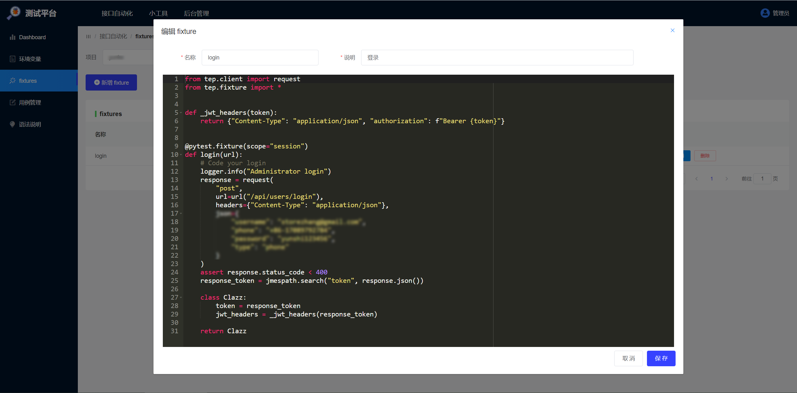
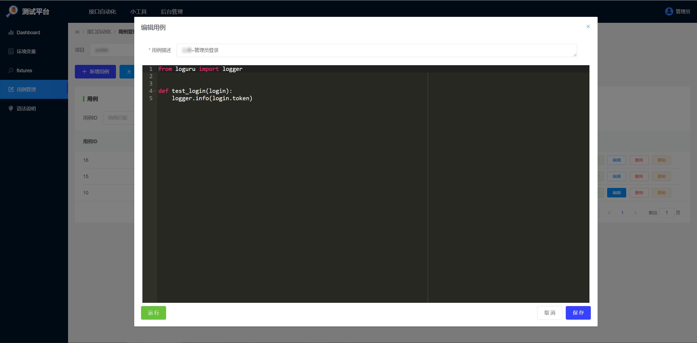
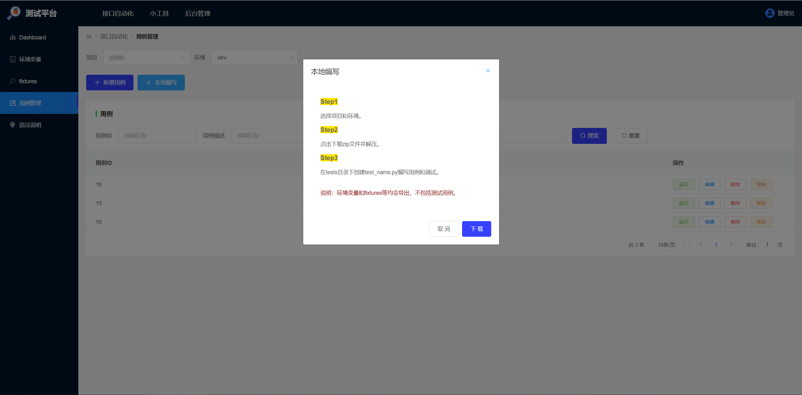
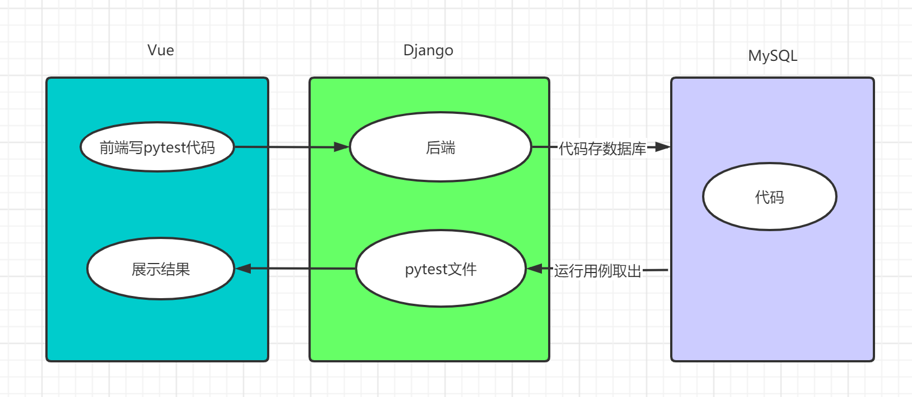
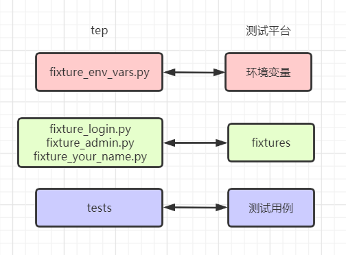
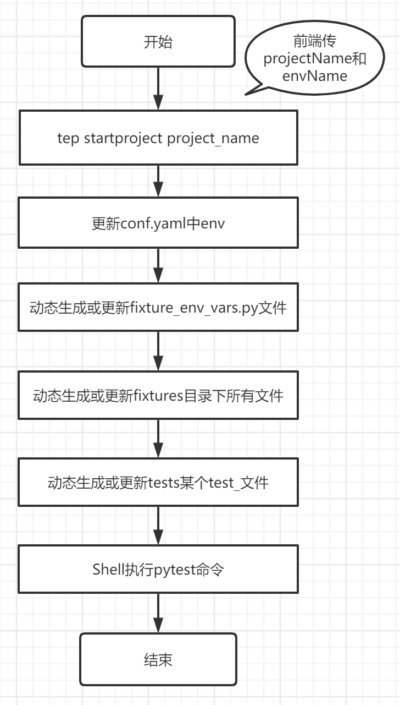

# 【开源平台】pytest内核测试平台落地初体验


测试平台，有人说它鸡肋，有人说它有用，有人说它轮子，众说纷纭，不如从自身出发，考虑是否要做测试平台：

- 第1阶段，用Python+requests写接口自动化。
- 第2阶段，选择unitttest或pytest，更熟悉pytest选了pytest。
- 第3阶段，快速搭建pytest项目脚手架，封装tep测试工具。
- 第4阶段，通过Git管理测试脚本，多分支合并代码。
- 第5阶段，去除本地环境同步麻烦，方便团队共享脚本。

需要有个测试平台。

## 使用篇

### **环境变量**

环境变量是字符串键值对，全局作用域。比如不同环境不同域名：


> 使用：`env_vars.name`。

### **fixtures**

fixtures即pytest的fixture，可以添加自定义函数，供测试用例使用。比如封装登录接口返回token：



> `tep.fixture`提供了`url` fixture，自动拼接环境变量`env_vars.domain + uri`。

### **测试用例**

在前端网页写代码，1条用例对应1个pytest的`test_name.py`文件。比如调用`login` fixture登录：



### **本地编写**

PyCharm写代码体验更好，正确姿势是从平台下载包含环境变量和fixtures等项目结构代码，本地编写用例，调试，跑通后，粘贴到平台上共享和维护：



> 本地和平台环境一致，省去前期搭建，关注`tests`用例。

### 扩展能力

用例是Python代码，理论上所有Python能写出来的，平台都能支持，比如HTTP、WebSocket、Protobuf等协议。

## 原理篇

### pytest内核



1. `vue2-ace-editor`作为前端代码编辑组件。
2. 前端把代码通过HTTP请求传给后端。
3. 后端把代码存入MySQL数据库。
4. 运行用例，从数据库取出代码，生成pytest文件。
5. Shell命令调用`pytest -s test_name.py`，执行测试。
6. 后端把运行结果日志返给前端展示。

之所以要折腾数据库，是因为每次部署后docker容器里面的文件会被清掉，只能动态生成。

### tep脚手架

测试平台功能是从tep项目脚手架中抽取出来的：



- 把`fixture_env_vars.py`做成了`环境变量`功能。
- 把`fixture_login.py`等做成了`fixtures`功能。
- 把`tests`做成了`测试用例`功能。

### 运行用例

整体流程如下：



**tep startproject project_name**

运行用例时，判断项目目录是否存在，如果不存在就调用`tep startproject project_name`创建项目脚手架。

**更新conf.yaml中env**

把前端传的当前运行环境更新到`conf.yaml`文件中：

```yaml
env: qa
```

**动态生成或更新fixture_env_vars.py文件**

根据`环境变量`功能模块的数据，动态生成`fixture_env_vars.py`文件：

```python
#!/usr/bin/python
## encoding=utf-8

from tep.dao import mysql_engine
from tep.fixture import *


@pytest.fixture(scope="session")
def env_vars(config):
    class Clazz(TepVars):
        env = config["env"]

        """Variables define start"""
        # Environment and variables
        mapping = {
            "qa": {
                "domain": "https://qa.com",
            },
            "release": {
                "domain": "https://release.com",
            }
            # Add your environment and variables
        }
        # Define properties for auto display
        domain = mapping[env]["domain"]
        """Variables define end"""

    return Clazz()
```

**动态生成或更新fixtures目录下所有文件**

根据`fixtures`功能模块的数据，动态生成`fixture_login.py`等所有文件：

```python
from tep.client import request
from tep.fixture import *


def _jwt_headers(token):
    return {"Content-Type": "application/json", "authorization": f"Bearer {token}"}


@pytest.fixture(scope="session")
def login(url):
    # Code your login
    logger.info("Administrator login")
    response = request(
        "post",
        url=url("/api/users/login"),
        headers={"Content-Type": "application/json"},
        json={
            "username": "admin",
            "password": "123456",
        }
    )
    assert response.status_code < 400
    response_token = jmespath.search("token", response.json())

    class Clazz:
        token = response_token
        jwt_headers = _jwt_headers(response_token)

    return Clazz

```

> conftest.py会自动查找后`import`，tests用例直接使用。

**动态生成或更新tests某个test_文件**

从数据库拿到用例代码，动态生成`test_`文件。

**Shell执行pytest命令**

从上一步拿到`case_path`，调用`pytest -s case_path`执行测试。

> 计划后续添加suite和marker两种批量执行用例方式。


## 小结

本文介绍了我第一次做的测试平台的使用和原理，技术栈为Vue+Django+Django REST Framework+JWT+MySQL+pytest+Git+BitBucket+Drone+Nginx+Docker+K8S，已在公司落地，还未大规模产出，由于服务端有较多磁盘IO读写，大量使用后不知道性能如何，目前来看问题不大，需要持续观察和优化。测试平台底层是`pytest`，用到了`tep`，那就叫`teprunner`。

> 参考资料：
>
> https://github.com/dongfanger/tep

