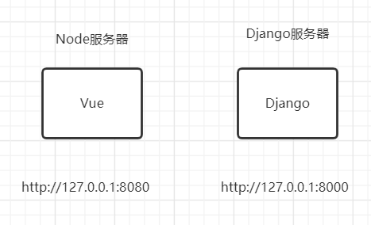
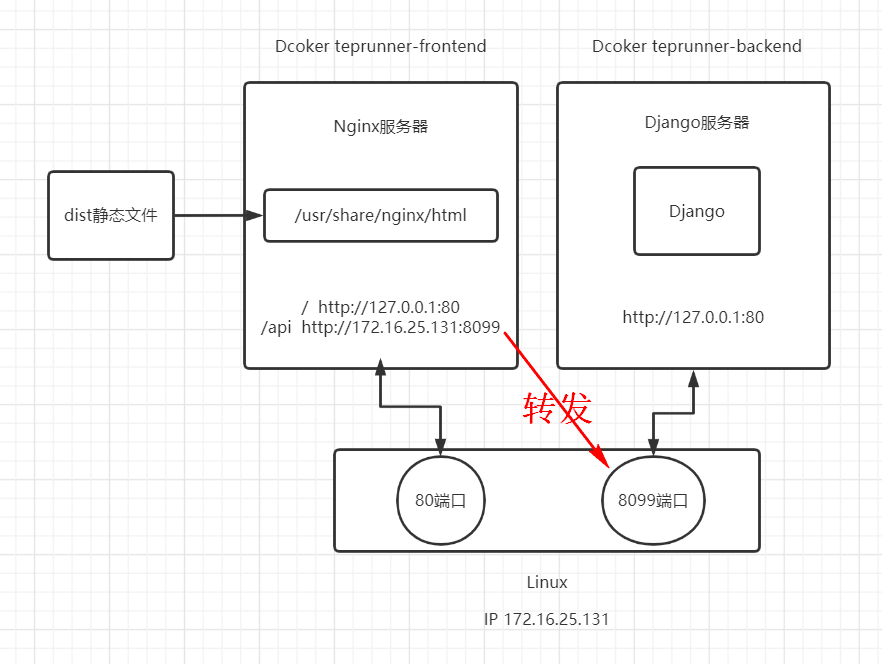
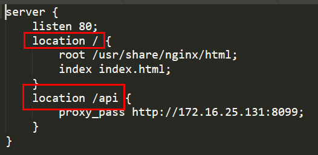
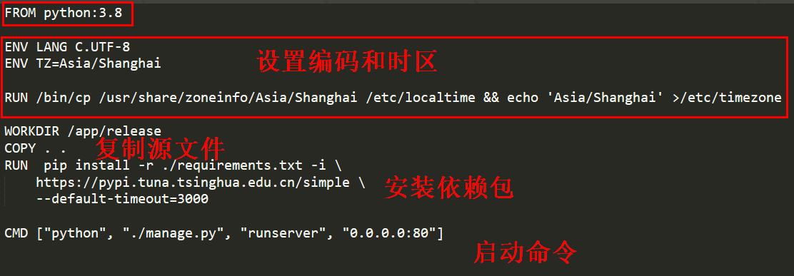
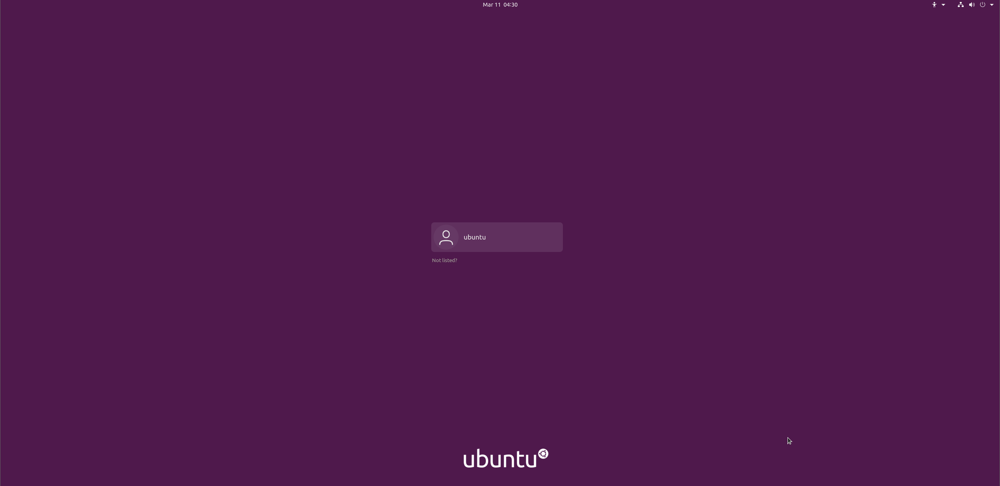
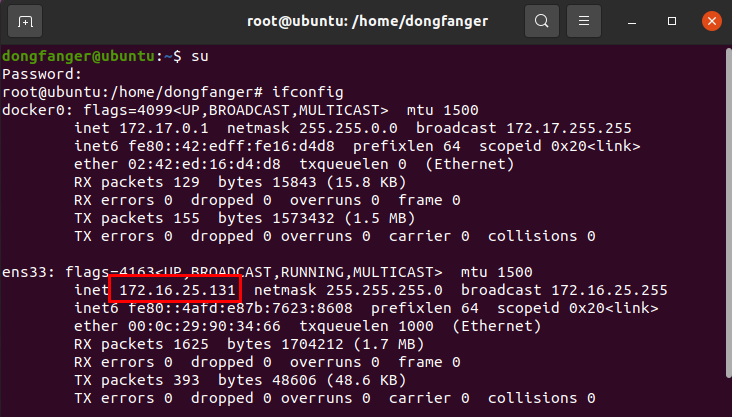
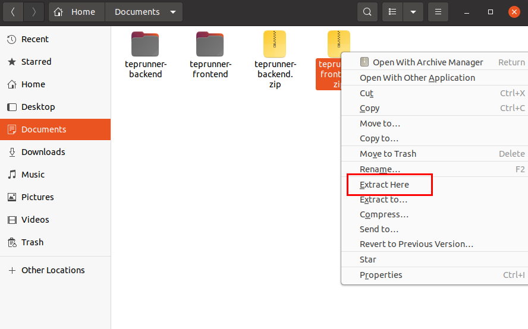
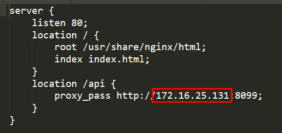
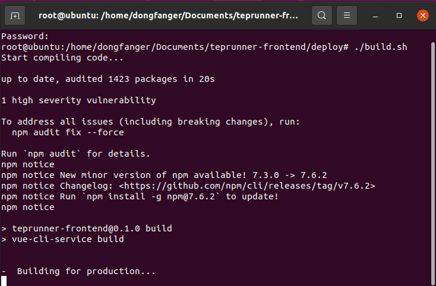
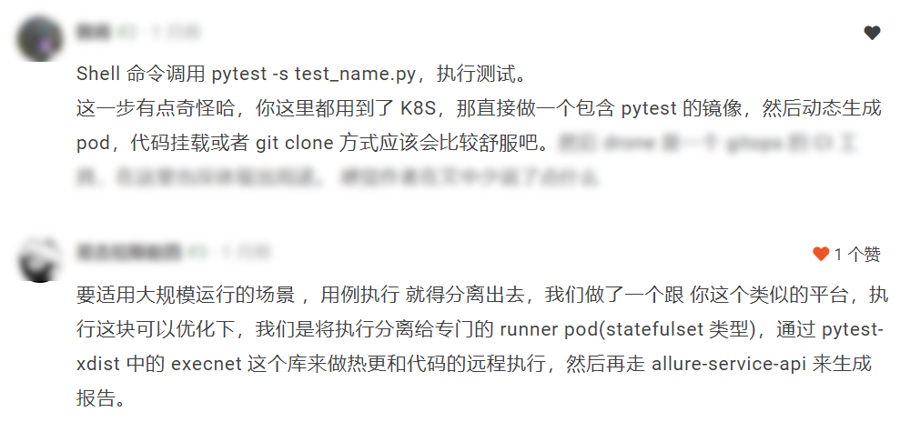

# 【开源平台】teprunner测试平台部署到Linux系统Docker


本文是一篇过渡，在进行用例管理模块开发之前，有必要把入门篇开发完成的代码部署到Linux系统Docker中，把部署流程走一遍，这个过程对后端设计有决定性影响。

## 本地运行

通过在Vue项目执行`npm run serve`和在Django项目执行`python manage.py runserver`，我们把项目在本地跑起来了，示意图如下：



前端在本地启了个Node服务器，后端在本地启了个Django服务器，分别使用`8080`和`8000`端口。浏览器有个同源策略：域名、端口、协议三者一致才能进行访问，否则会由于跨域访问而被浏览器拦截。图中前后端的端口不一致，出现了跨域，前端是无法直接请求后端的。解决办法是在`vue.config.js`中配置`devServer`：


这是Node开的一个代理服务器，当前端请求后端时，会先发向Node代理服务器，Node代理服务器以相同的参数向真正的后端服务器进行请求，再把响应返回给前端。在本项目中，前端请求仍然是发给`http://127.0.0.1:8080`，浏览器不会拦截，Node代理服务器会帮你把请求转发给后端`8000`端口。

## Nginx部署

搞懂了本地运行代理转发，再来看看Nginx部署。Nginx本身是个服务器，就像Node服务器一样，也可以看做Apache Tomcat。Vue项目使用`npm run build`命令把代码构建为`dist`目录静态文件，放到Nginx服务器中加载出来，结合Docker示意图如下：



相比于本地运行，Nginx部署时，前端变化比较大，一：`dist`静态文件拷贝到了`/usr/share/nginx/html`目录中，二：对`/`路径来说，Nginx会监听`80`端口，三：对`/api`路径来说，Nginx会把请求转发到后端服务器端口，这也叫做反向代理。后端没有什么变化，为了和本地运行看着有点区别，把端口稍微改了下，Docker内部使用`80`端口。

这里比较关键的是理解`Docker teprunner-frontend`、`Docker teprunner-backend`、`Linux`三者之间的关系。如果不知道Docker，那么应该听说过虚拟机，Docker从概念上理解就像是虚拟机，这三者可以看做是三台主机。`Linux`的IP是`172.16.25.131`，`80`端口映射到了`Docker teprunner-frontend`的`80`端口，`8099`端口映射到了`Docker teprunner-backend`的`80`端口，如图中下方双向箭头所示。在`Linux`上访问`http://127.0.0.1`，能打开登录页面，但是无法向后端发起请求，因为从`80`端口直接请求`8099`端口，跨域了。解决办法是在`Docker teprunner-frontend`借助Nginx进行反向代理，把请求先发送到Nginx服务器，再转发给`Linux`的`8099`端口。

> 不能在`Docker teprunner-frontend`中把`/api`的代理设置为`http://127.0.0.1:8099`，因为这个Docker容器的`8099`端口并没有启用，启用的是`Linux`这台机器上的`8099`端口，所以需要通过`IP`来指定。

整体思路明确了，接下来就开始动手操作。

## 编写deploy脚本

**前端**

打开`teprunner-frontend`文件夹，新建`deploy/nginx.conf`文件：



`/`路径从`user/share/nginx/html`读文件，入口为`index.html`，`/api`转发到`http://172.16.25.131:8099`。这个文件会拷贝到Docker镜像中。新建`Dockerfile`文件：


`FROM`定义了基础镜像，可以理解为操作系统，前端项目基于`nginx`来构建。`WORKDIR`定义了镜像当前工作目录，意思是在执行后面`COPY`操作时，镜像目录用哪一个。`COPY`分别把`dist`静态文件和`nginx.conf`配置文件拷贝到镜像中，`COPY`指令第一个参数是本机目录，第二个参数是镜像目录。镜像目录通过`WORKDIR`来指定，本机目录通过Docker上下文来指定，新建`build.sh`文件：


`DockerContext`指定了Docker上下文为`teprunner-frontend`根目录。这里的Shell脚本有两个阶段，第1阶段是使用`node`编译：

```
docker run  # 运行镜像 
--rm  # 运行后删除容器
-v $(pwd)/../:/data/src  # $(pwd)指当前工作目录，把根目录挂载到data/src
-v /root/.npm/_logs:/root/.npm/_logs  # 挂载日志文件
-w /data/src/  # 镜像当前工作目录
$BUILDER_IMAGE  # 运行镜像为node:latest，用node编译前端代码
/bin/sh -c "npm install && npm run build"  # /bin/sh是shell可执行程序，调用执行npm命令
```

第2阶段是打包成Docker镜像：

```
docker build  # 构建镜像
-f $Dockerfile  # 指定Dockerfile文件位置
-t $PkgName  # 镜像包名
$DockerContext  # Docker上下文
```

**后端**

后端也是类似的，先新建`deploy/Dockerfile`文件：



后端项目基于`python:3.8`来构建，接着设置了时区，`COPY . .`把Django源文件直接复制到了镜像目录`/app/release`中，`RUN`指令执行`pip install`命令安装依赖包，`CMD`和`RUN`有点区别，`RUN`指令在`docker build`时就执行，`CMD`指令在`docker run`时才执行，预定义启动命令。

> 这里简化了迁移数据库`migrate`等启动命令，服务器数据库和本地用的同一个。

再新建`build.sh`文件：


Python代码不需要编译，打包成Docker镜像就可以了。

## 部署到Ubuntu系统Docker

Linux系统是内核版本，它有很多发行版本，比如CentOS、Ubuntu，本文采用了Ubuntu，只有一个原因，它长的好看。

> 大学室友曾经冲动地把Windows系统换成了Ubuntu，还天天跟我们炫耀有多酷炫有多牛逼，过了两三天发现Office不好用，也玩不了游戏，就又换回来了。哈哈，Ubuntu平时玩玩就好了，除非是做Linux内核开发。

下载软件：

- VMware 破解版
- Ubuntu Desktop 20.04

安装过程此处不再另加赘述。打开虚拟机的Ubuntu：



打开Terminal，输入`su`，输入密码，切换到`root`：


> 发现缺少权限就`su`一下。

安装`curl`：

```shell
apt-get install curl
```

安装`docker`：

```shell
curl -fsSL https://get.docker.com | bash -s docker --mirror Aliyun
```

使用`ifconfig`查询虚拟机IP：



不要选择`.git`和`node_modules`文件夹，把`teprunner-frontend`打成压缩包。不要选择`.git`和`__pycache__`文件夹，把`teprunner-backend`打成压缩包。复制前后端压缩包到虚拟机Documents解压：



Ubuntu Desktop的好处是提供了图像化操作界面，适合我这种小白用户。使用命令行编辑工具`vi`或者图形编辑工具`gedit`编辑`teprunner-frontend/deploy/nginx.conf`文件中`/api`转发地址为你的虚拟机实际IP地址：



打开两个Terminal，分别`cd`到`teprunner-frontend/deploy`和`teprunner-backend/deploy`，执行`./build.sh`命令。

> 如果执行提示`^M`之类报错，那是因为在Windows编辑后复制到Linux格式不一致，使用`apt-get install dos2unix`命令安装工具后进行格式转化，比如`dos2unix build.sh`、`dos2unix Dockerfile`。

前端构建截图：



第一次因为要下载node依赖包和拉取nginx镜像，会比较慢，第二次就快很多了。

后端构建截图：


第一次因为要拉取python镜像，会比较慢，第二次就快多了。

都构建完成后，输入`docker images`命令就能看到打包好的Docker镜像了：


启动前端镜像：

```shell
docker run -p 80:80 teprunner-frontend
```

启动后端镜像：

```shell
docker run -p 8099:80 teprunner-backend
```

> 镜像启动后就变成了Docker容器，可以理解为一台虚拟主机。`-p`参数用于映射Ubuntu端口和Docker端口。可以添加`-d`参数让容器在后台运行。`docker ps -a`查看容器，`docker kill CONTAINER`或`docker stop CONTAINER`退出容器。

最后可以在虚拟机中访问`http:127.0.0.1`进行登录了，本地机器想要访问的话，需要把`127.0.0.1`改为你的虚拟机实际IP，比如`http://172.16.25.131`。

## 小结

本文先介绍了本地运行和Nginx部署的示意图，涉及到跨域访问和反向代理。接着编写deploy脚本，编译代码，构建镜像。最后部署到Ubuntu系统的Docker中运行起来。在使用过程中，也感受到了Docker这一划时代技术的魅力，如果没有Docker，我们需要在Ubuntu上面安装nginx、node、python等软件，有了Docker，我们只需要安装Docker，其他都基于Docker镜像构建就可以了。teprunner测试平台的用例采用的是代码形式，这就涉及到了代码存放位置的问题，为了让pytest能调用执行，肯定是存放到文件里面的。本文实践给了个重要提醒，如果后端把代码直接写入磁盘文件，每次打包镜像部署后，就会把已保存的用例代码抹掉。解决这个问题的第一个办法是用K8S，第二个办法是把代码存数据库。学习版采用了第二个办法存数据库，执行时动态从数据库拿代码生成文件。第一个办法思路借鉴：



最后，简单聊下Docker和K8S，Docker是Docker公司的，K8S是Google的，Docker是家小公司搞的，在创建之初，并没有考虑到“容器编排”这个功能，2014年 Google推出Kubernetes用于解决大规模场景下Docker容器编排的问题，2016年Kubernetes发布CRI统一接口，虽然Docker也在2016年发布了Docker Swarm，带来了Docker在多主机多容器的编排解决方案，但是已经无法阻挡K8S取得这场容器编排战争的胜利。

> 参考资料：
>
> https://www.cnblogs.com/riwang/p/11883332.html
>
> https://zhuanlan.zhihu.com/p/334787180
>
> https://testerhome.com/topics/27860