# 【开源平台】teprunner测试平台用例前置模块开发


## 本文开发内容

现在正式进入测试相关功能开发。teprunner测试平台底层是pytest，中间层是tep，还没了解的朋友可以先看看tep的文章，整个平台的设计思路和后面用例的执行都会基于这个工具。tep的测试用例是放在.py文件里面的，全局变量或者说环境变量是引用的env_vars，公共函数和复用接口是引用的fixtures，在做成平台后，需要把这两个部分独立为两个功能模块。多个项目的接口自动化数据需要隔离开来，要有个项目管理功能。本文将开发四个用例前置模块：

- 后台管理--项目管理
- 接口自动化--语法说明
- 接口自动化--环境变量
- 接口自动化--fixtures

> 语法说明给出了环境变量、fixtures、用例示例（单个接口、多个接口--增删改查）、请求方法（get、post、put、delete）的使用方法。

## 编写后端代码

先创建名为teprunner的app：

```shell
django-admin startapp teprunner
```

在settings的INSTALLED_APPS中添加配置让app生效：

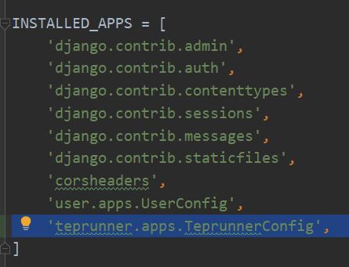

并在urls.py添加路由：


编辑user/fixtures/user.json，添加一个接口自动化的菜单：

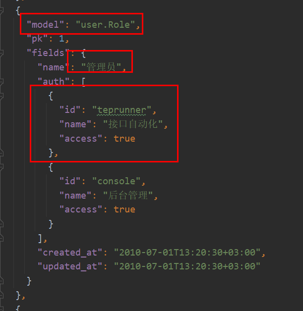

截图只截了管理员，测试和开发角色，也需要添加上。access均为true，这三个角色都可以访问。添加后把数据同步到数据库：

```shell
python manage.py loaddata user
```

编辑teprunner/models.py，新增模型：

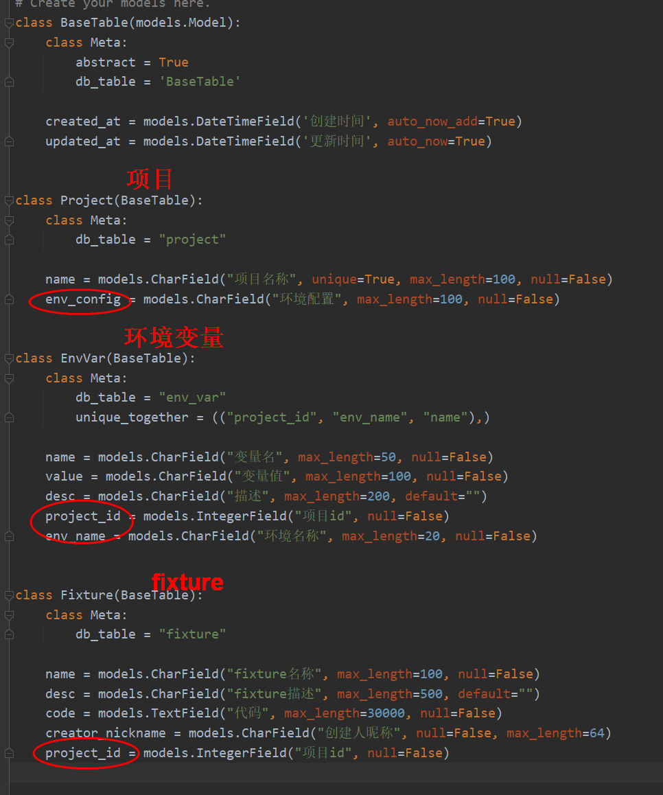

包括了项目、环境变量和fixture三张表。Project.env_config用于给项目配置多个环境。不同项目不同环境的环境变量不一样，在EnvVar中添加了project_id和env_name，并按("project_id", "env_name", "name")作为唯一键，不允许重复。不同项目的fixtures不同，不关心环境，在Fixture中只添加了project_id。

> Fixture.code用于存放代码，字段类型为models.TextField，容纳更多字符。

models编写好后，迁移到数据库：

```shell
python manage.py makemigrations
python manage.py migrate
```

新建teprunner/serializers.py文件，新增序列化器：

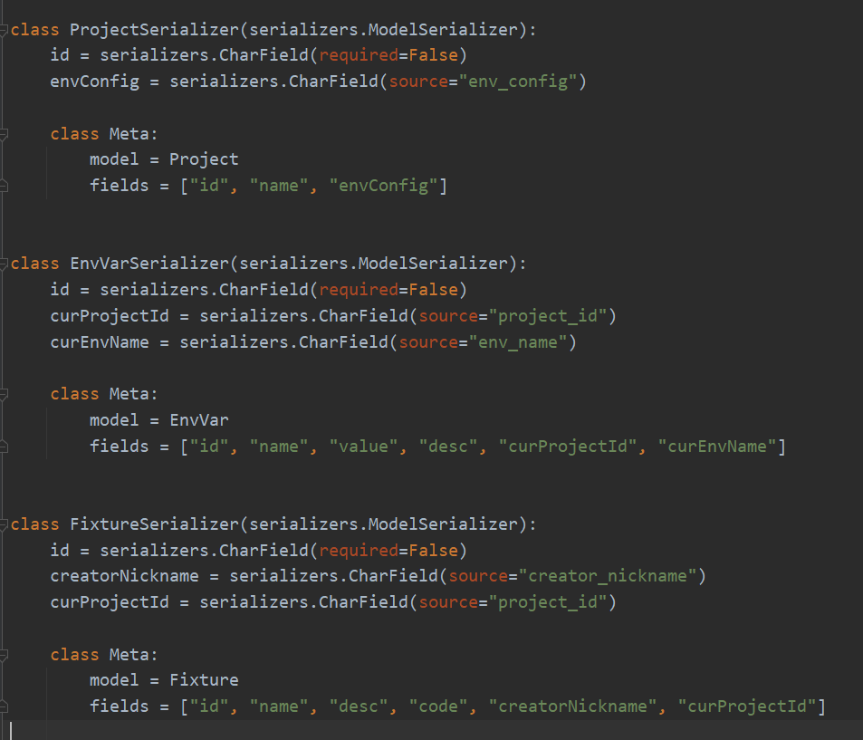

数据库字段的命名是用的下划线，接口返回前端和前端传参是用的驼峰，所以这里通过source这种方式给env_config、project_id、env_name、creator_nickname进行了序列化器的重命名。为了前端更方便处理，使用serializers.CharField把int转化为了str，由于请求时id非必须，增加参数required=False。

teprunner会有很多视图，写在一个文件里面有点臃肿，这里创建views文件夹，新增views/project.py项目视图：

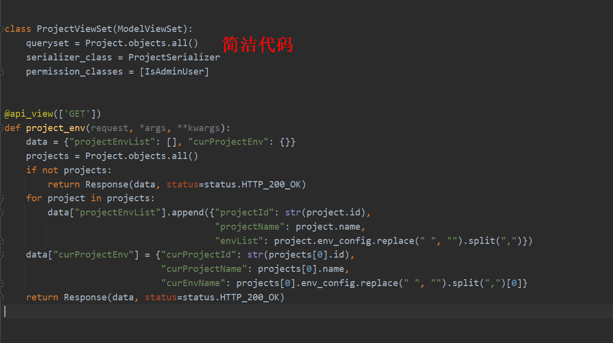

Django REST framework的ModelViewSet视图类能节省很多代码，只需要三行就把项目增删改查接口做了。project_env是函数视图，请求方法为GET，它的作用是返回项目环境列表，当前项目和当前环境，默认为第一个项目和第一个环境。

> 前端需要切换不同项目和不同环境，下拉框数据来源于这个接口。

新建views/envvar.py新增环境变量视图：


环境变量跟项目和环境是强关联的，需要根据项目环境进行过滤，所以重写了list方法，从前端请求拿到curProjectId和curEnvName，通过EnvVar.objects.filter进行过滤。`from django.db.models import Q`支持多种过滤条件，这在后面的代码中还能看到，比如模糊匹配。

新建views/fixture.py新增fixture视图：

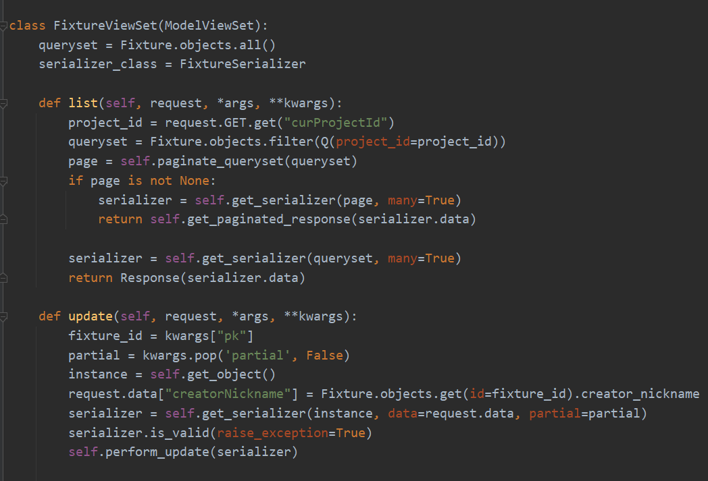

fixture跟项目是强关联的，需要根据项目进行过滤，所以重写了list方法，从前端请求拿到curProjectId，通过Fixture.objects.filter进行过滤。Fixture有个creatorNickname字段，新增fixture时使用的是当前登录用户的昵称，修改fixture时需要用已保存的创建者，重写update方法来实现这个处理。

最后，新建teprunner/urls.py文件，把视图添加到路由中：

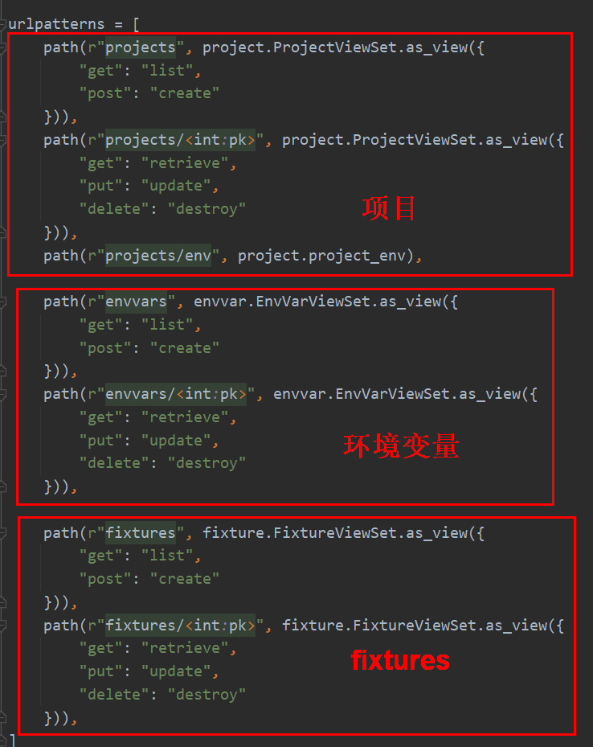

## 编写前端代码

编辑package.json，添加依赖：


fixtures是代码形式的，这是测试平台第一次使用代码编辑组件。添加依赖后记得执行`npm install`进行安装。

编辑router/index.js：

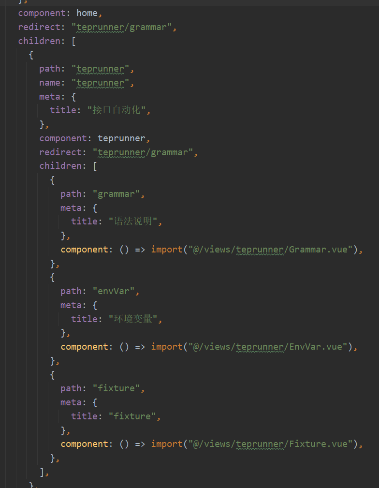

添加接口自动化的路由，并把home重定向改为语法说明路由。children表示子路由。path是路由地址。meta.title用于显示菜单名。

编辑views/console/index.vue：

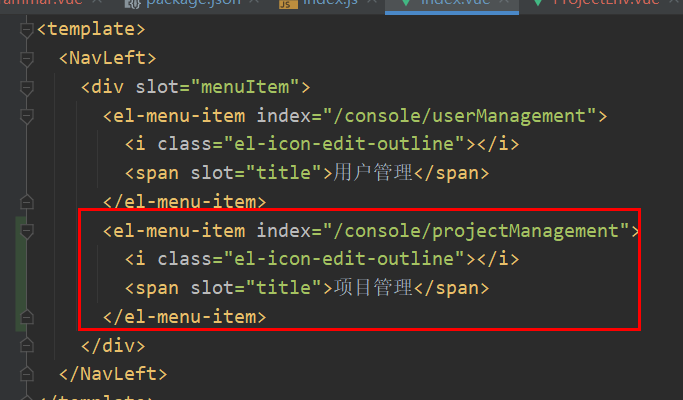

添加项目管理菜单。新建ProjectManagement.vue和AddProject.vue，添加项目管理增删改查代码，跟用户管理类似，不再另加赘述。值得注意的是环境配置`placeholder="请输入环境英文名（多个环境英文逗号分隔）"`，因为tep.env_vars.mapping会用到环境名作为key，所以只能用英文名！

编辑components/WrapComponent.vue，添加一个插槽：


用于切换项目和环境。新建components/ProjectEnv.vue文件：


定义了两个下拉框：项目和环境。v-if判断是否需要显示。@change在切换下拉选项时调用对应方法。@click.native指在点击打开时获取数据。然后用v-for遍历列表展示下拉选项。环境和项目数据是从localStorage中读取的：

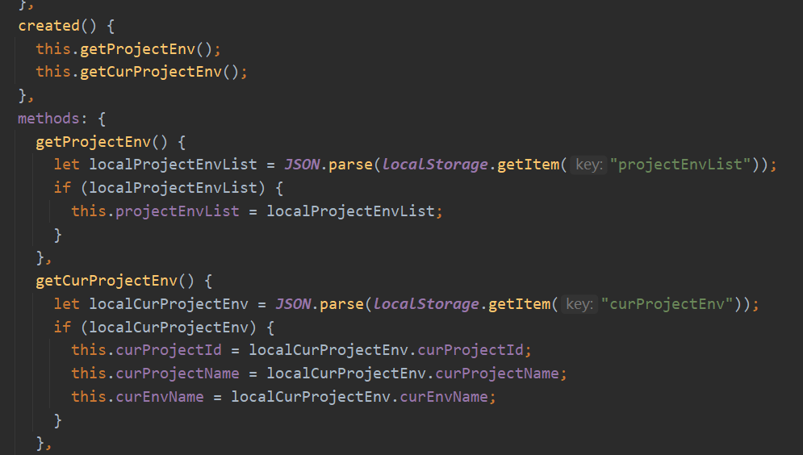

可以打开F12切换到Application，点击左侧Storage/Local Storage检查是否有数据：

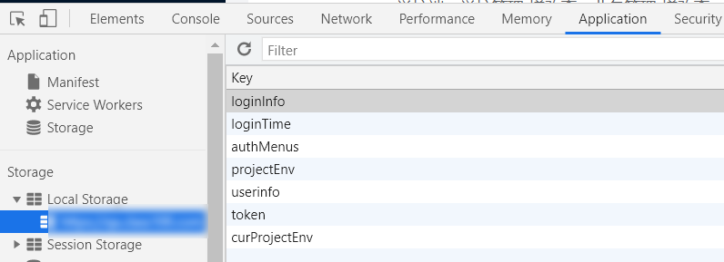

数据写入的地方稍后会讲到，先接着讲ProjectEnv.vue文件：

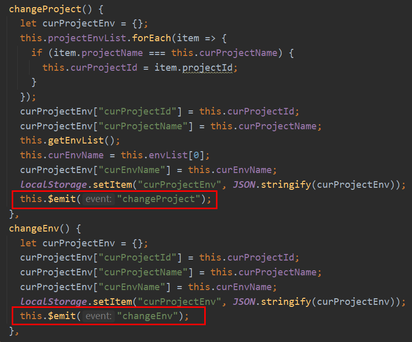

切换项目会更新环境列表和当前环境数据，这样就把这两个下拉框关联了起来。切换环境会更新当前环境数据。图中框起来的`this.$emit`是个重要知识点。ProjectEnv.vue是个子组件，它是要嵌套到其他组件去的，比如EnvVar.vue，它们是父子组件的关系。有这么个需求，切换项目时，执行一次查询操作，把查询结果更新一下。切换项目的代码是ProjectEnv.vue子组件提供的，执行查询操作的代码是EnvVar.vue父组件提供的，子组件就是通过`this.$emit`把这个消息通知给父组件的。

新建views/teprunner/index.vue文件，添加接口自动化菜单：

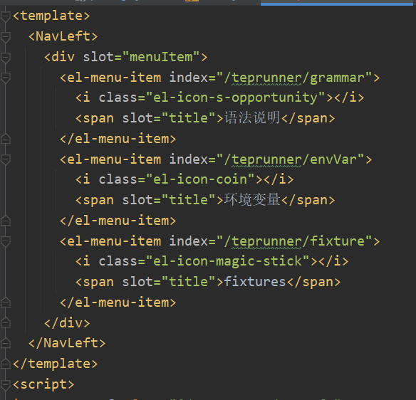

刚才说的项目环境数据的写入就是在这里进行的：


每次加载时，如果localStorage没有projectEnvList的话，就请求`/teprunner/projects/env`去拿。

新建Grammar.vue，语法说明是个硬编码的静态文件，纯展示，无交互。接着新建EnvVar.vue和AddEnvVar.vue，编写环境变量的增删改查，新建Fixture.vue和AddFixture.vue，编写fixtures的增删改查，比较类似，不再另加赘述。通过fixtures模块的代码，看看ProjectEnv.vue是如何用的：


:showEnv与ProjectEnv.vue子组件的属性对应，用来控制是否显示环境，Fxiture不需要显示。@changeProject与ProjectEnv.vue的this.$emit对应，接收子组件消息，执行查询列表操作：


AddFixture.vue用到了代码编辑器：

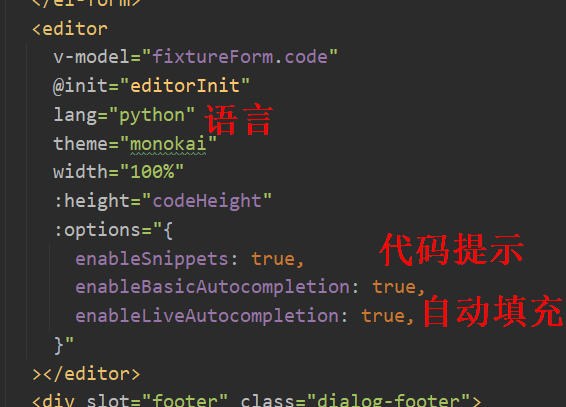

@init指定了初始化方法：

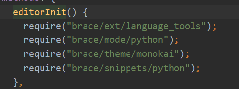

离代码完美显示还差最后一步：代码高亮。在assets/js添加`highlight.js`，并在main.js中导入：


## 小结

经过本文的开发，如何添加菜单，前后端如何完成基本的增删改查开发已经进行了很充分的展示。遇到不会写的代码，也都能从已公开源码中找到参考。行动起来吧！边学边练，动手试试把用例管理的增删改查写出来，等我把下一篇写出来后，比较比较，可能会有更深刻的印象。CRUD会了，定制化开发还会远么。

> 参考资料：
>
> 前端源码 https://github.com/dongfanger/teprunner-frontend
>
> 后端源码 https://github.com/dongfanger/teprunner-backend

