# 【开源平台】teprunner测试平台开发用例管理不只有增删改查


## 本文开发内容

用例管理是对用例进行增删改查，按照前面文章的思路，把它做出来应该不难，如果你已经自己写好了，那么可以和本文提交的代码比较下看看。除了增删改查，用例管理还需要提供运行用例的入口，在操作列添加一个运行按钮，单条用例运行，并弹窗展示运行结果。用例列表需要能看到每条用例执行情况，添加表格列用于展示，其中“运行结果”列要有超链接，点击查看上次运行结果。为了避免修改别人用例出错，还需要有个复制用例功能。除了在线编辑，平台应支持下载项目环境到本地，无缝切换到PyCharm，让新用户快速上手。综上所述，本文开发内容如下：

- 用例增删改查。
- 运行按钮，点击后弹出“运行用例结果”。
- 添加表格展示列，其中“运行结果”用颜色区分不同结果状态：passed，failed，error，点击超链接后弹出“查看用例结果”。
- 复制按钮，点击后生成一条复制的新用例。
- 新增/编辑页面，添加运行按钮。
- 运行/查看页面，添加编辑按钮。
- 下载环境到本地。

工作量主要在前端，后端先做一部分。

## 编写后端代码

编辑teprunner/urls.py，添加路由：

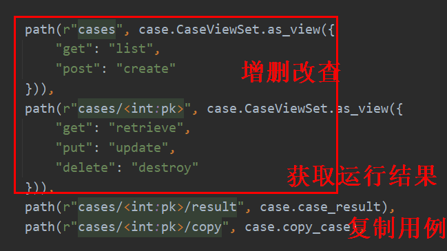

除了增删改查，还添加了2个接口，一个用于获取用例运行的结果，一个用于复制测试用例。

编辑teprunner/models.py，添加模型：

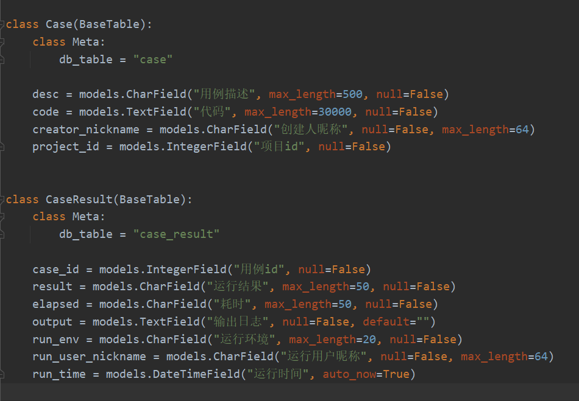

第一个Model是Case，没有定义name字段，实际上用例ID和用例描述已经够用了，name不知道填什么，有点多余。第二个Model是CaseResult，会记录运行结果，这个运行结果是从pytest执行日志最后一行的Summary截取出来的，比如1 passed，1 failed，耗时也是从Summary截取出来的。output存放代码运行后打到控制台的输出日志。最后三个字段记录运行环境、运行人和运行时间，运行时间取的数据库记录被添加/更新的时间。添加好以后迁移到数据库中：

```shell
python manage.py makemigrations
python manage.py migrate
```

编辑teprunner/serializers.py，添加序列化器，第一个序列化器是CaseSerializer：


只关联了Case模型的字段。

第二个序列化器是CaseListSerializer：

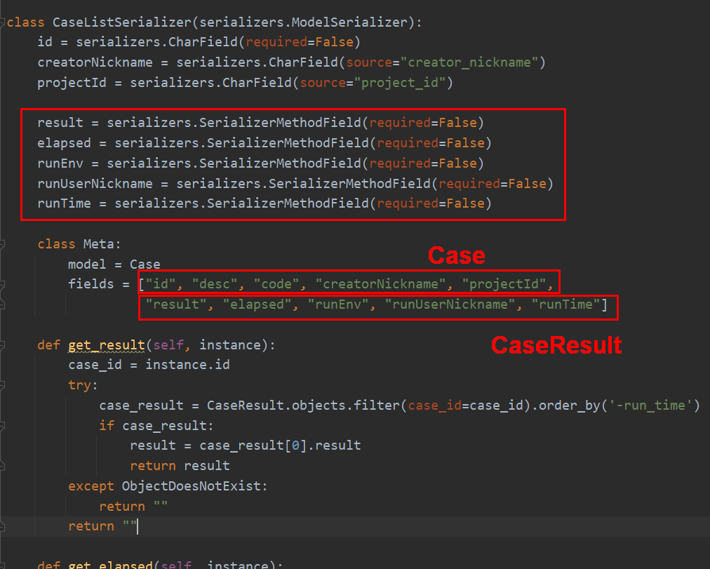

它主要用来返回用例列表的数据，除了用例本身，还需要用例结果。serializers.SerializerMethodField用于自定义序列化字段，定义好字段后，在下面添加`get_前缀+字段名`的方法，这是Django的规则，然后在方法内部添加取值代码，比如get_result()，instance是指Meta.model定义的模型，这里就等同于Case，通过instance.id获取到Case.id并赋值给case_id变量，从CaseResult的对象中过滤case_id匹配的用例结果，按运行时间倒序，取最新1条结果的result字段的值。其他字段的处理是类似的，runTime这里做了下日期格式化：


第三个序列化器是CaseResultSerializer：

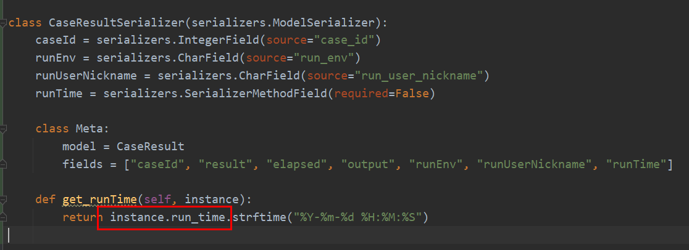

只关联了CaseResult模型的字段，runTime同样做了日期格式化。从这里也能更清晰的看到，instance就是指的自己！

新建teprunner/views/case.py文件，添加视图，先把简单的两个视图做了，第一个视图是case_result：


这里是个知识点，采用@api_view注解的函数视图，如果想用序列化器，那么采用这种方式。

第二个视图是copy_case：

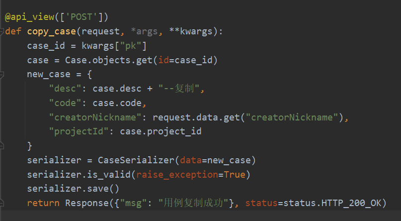

根据case_id查找到现有Case对象，在case.desc后面添加`--复制`后缀，其他字段数据复用，保存，就完成复制用例了。

第三个视图是CaseViewSet：

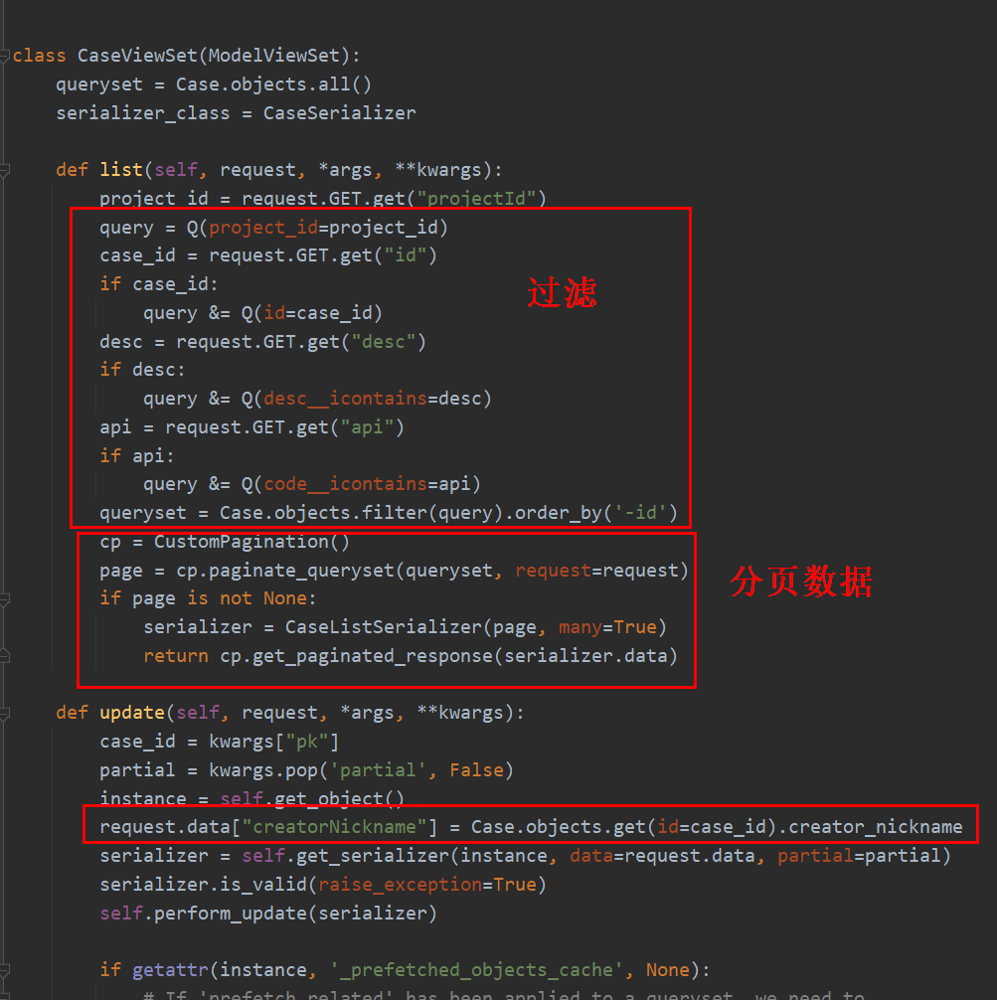

继承了ModelViewSet，重写了list列表查询，因为如果不重写，默认返回的结果是serializer_class = CaseSerializer序列化器的内容。我们需要的是CaseListSerializer这个序列化器的内容。这里也是一个知识点！如果想在类视图中，使用serializer_class以外的序列化器加分页，采用这种方式。

重写的list方法首先添加了project_id、case_id、desc、api四个过滤条件，与前端的当前项目、用例ID搜索框、用例描述搜索框、API路径搜索框一一对应。`__icontains`表示包含，相当于模糊匹配，`i`忽略大小写。接着用到了自定义分页的类，按照统一的分页格式，返回序列化器的数据。

最后，重写了update方法，用现有的创建人进行更新。

## 编写前端代码

编辑router/index.js，添加路由：

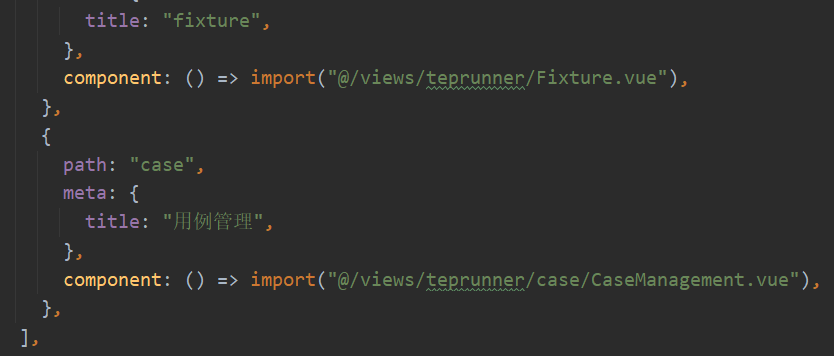

编辑views/teprunner/index.vue，添加菜单项：

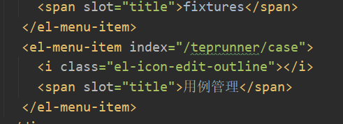

新建views/teprunner/case/CaseManagement.vue文件，增删改查基础代码不再另加赘述，挑选新代码：


在运行结果列，添加了超链接，点击后打开用例结果弹窗，这个弹窗查看和运行用例都会用到，用第一个参数type做区分：


getResultColor方法返回颜色样式：


由于用例结果弹窗和用例列表表格都会有这个字段，于是把resultColor方法提取到了utils/commonMethods.js文件中：

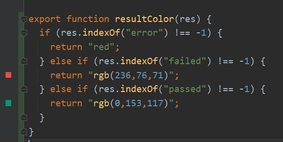

CaseManagement.vue是一个父组件，它有3个子组件，如下图所示：

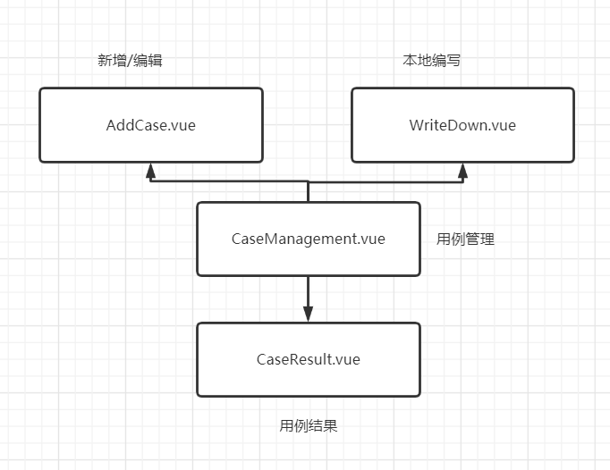

通过import后，添加标签代码引入：

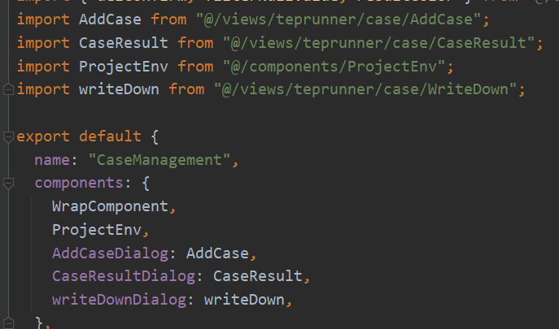

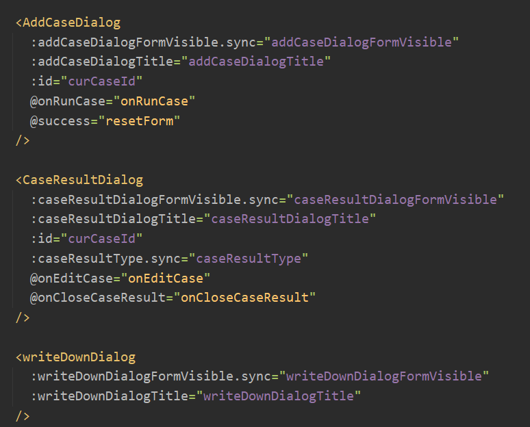

是否显示弹窗通过DialogFormVisible的true/false来控制，DialogTitle指定弹窗标题。`:`开头是父组件向子组件传值， `@`开头是接受子组件发过来的emit事件通知，从而调用父组件中方法。这样就把这几个组件绑定在一起了！

> 从这里开始，这几个组件之间的关系会稍微有点绕，读不懂的话多结合源码看看！

有个小细节，运行按钮打开的弹框在关闭后，需要刷新用例列表更新数据，表格超链接打开的弹框关闭后不需要刷新：


代码的意思是在打开弹窗时给this.afterCloseRefreshList赋值为true/false，在关闭弹窗时判断要不要刷新列表。

接下来对这三个弹窗逐一进行开发。新建views/teprunner/case/AddCase.vue文件，增改代码不再赘述，添加1个运行按钮：


点击后调用：


首先校验必填项，校验通过后，发起请求：

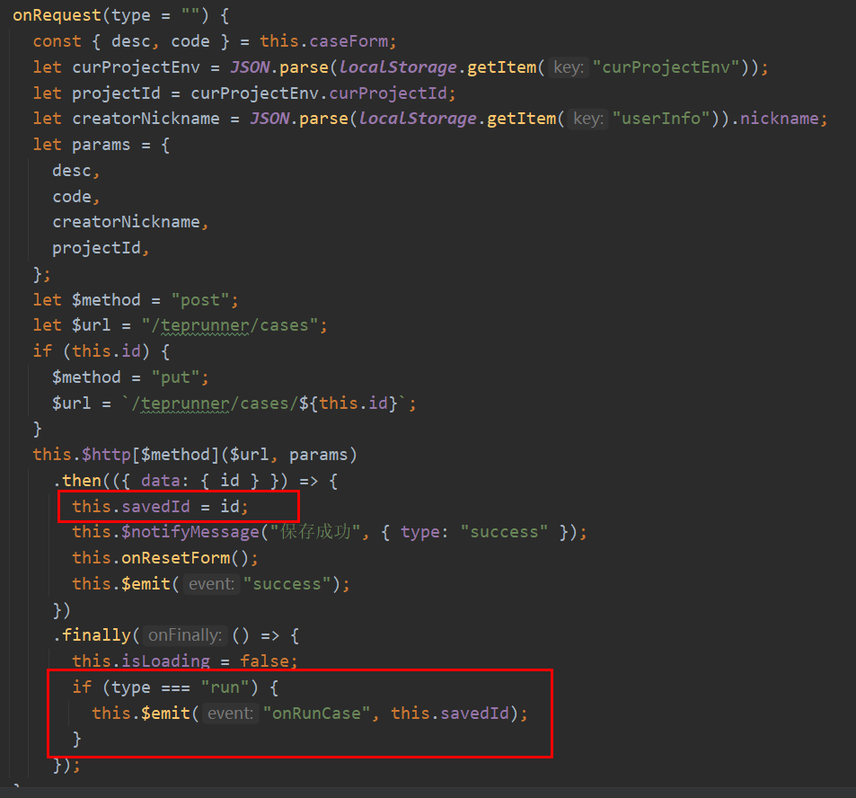

增加了一个type参数，因为选择保存或者运行，是两种类型，只有点击运行按钮，才用emit注册运行事件。新增用例的时候，没有用例ID，就不能直接运行用例，为了解决这个问题，把保存后接口响应中的ID，作为运行用例ID。

新建views/teprunner/case/CaseResult.vue文件：


把代码编辑区设置为只读和自动换行。添加编辑按钮：


点击后调用：


关闭弹窗，注册编辑事件。

这里把刚才结合到一起说一下，“运行/查看用例结果”弹框和“新增/编辑用例”弹框可以通过运行/编辑按钮相互切换，它们是通过注册事件，发送到父组件CaseManagement.vue，再分别通知下去来实现的：

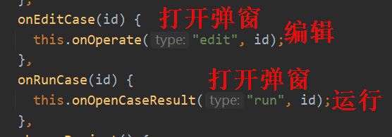

打开结果弹窗后，调用接口查询用例描述和创建人：

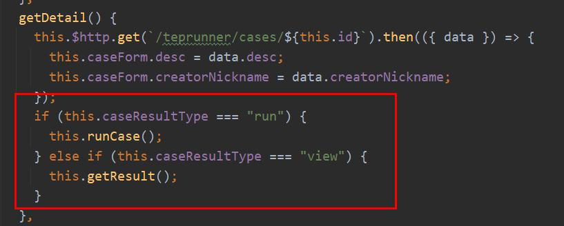

根据类型执行runCase或getResult：

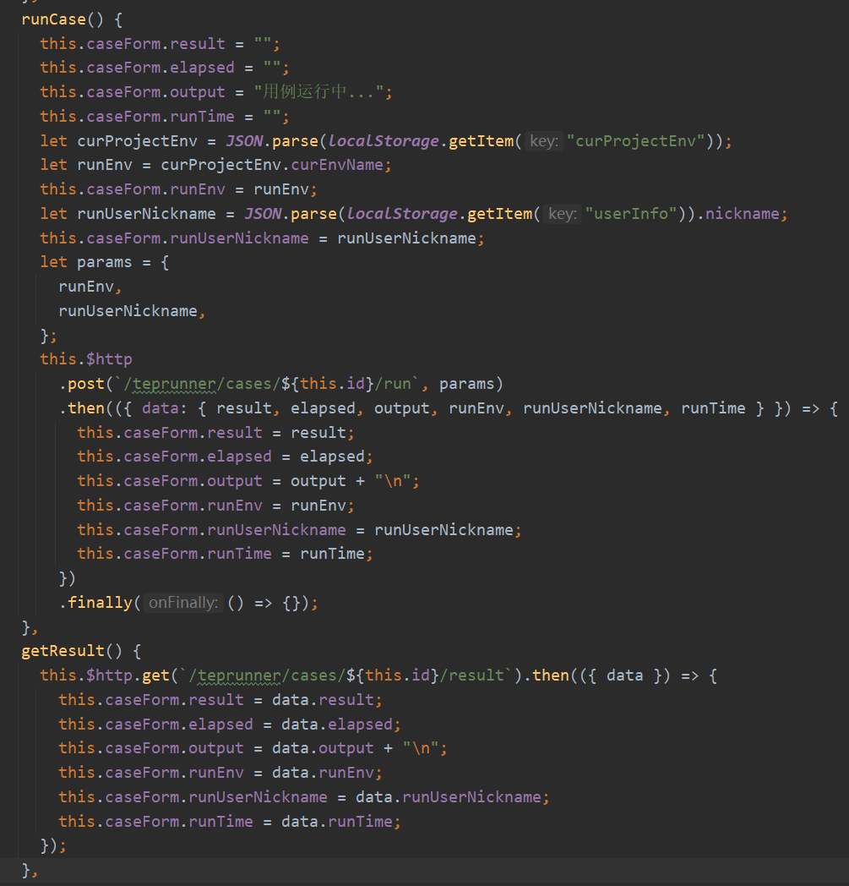

最后，新建views/teprunner/case/WriteDown.vue文件，大同小异，新代码是：

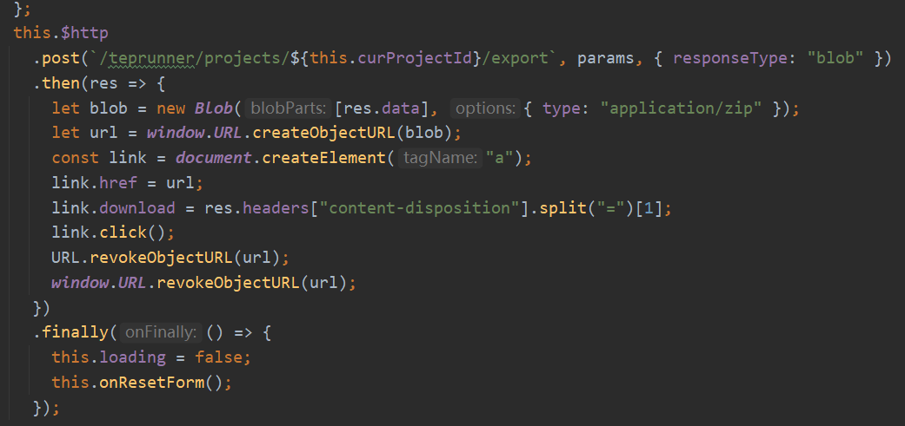

从百度搜来的，把后端返回的二进制文件字节流组装成压缩包，打开系统弹窗，下载文件。

## 小插曲

这一版比第一版代码优化了不少，尤其是几个组件之间如何传值这里，简化了很多，比如把执行用例从CaseManagement.vue转移到CaseResult.vue中来调用。在折腾过程中，也基本掌握了组件传值的写法，总结如下：

①父组件传值给子组件：子组件props接收，父组件标签绑定data传值，比如：

```
## 父组件
<CaseResultDialog :runEnv.sync="runEnv" />

data() {
  return {
    runEnv: "",
  };
},
    
## 子组件
props: {
  runEnv: {
    type: String,
    default: "",
  },
},
```

②子组件通知父组件：子组件this.$emit注册事件，父组件标签@调用，比如：

```
## 父组件
<CaseResultDialog 
  @closeCaseResultDialog="closeCaseResultDialog"
/>

closeCaseResultDialog() {
  console.log("close");
},
    
## 子组件
close() {
    this.$emit("closeCaseResultDialog");
},
```

③子组件修改父组件传值：先把子组件props赋值给子组件data，再watch子组件data，比如：

```
## 父组件
<CaseResultDialog :runEnv.sync="runEnv" />

data() {
  return {
    runEnv: "",
  };
},

## 子组件
props: {
  runEnv: {
    type: String,
    default: "",
  },
},
    
data() {
  return {
    runEnv: this.runEnv,
  };
},
    
watch: {
  runEnv(val) {
    this.caseForm.runEnv = val;
  },
},
```

> 第一版有很多第三种方式的代码，因为要把CaseManagement的执行结果传到CaseResult中去，在关闭弹窗时又需要清空，这些数据是从CaseManagement传过来的，直接改Vue会报错：禁止子组件直接修改父组件数据，防止数据错乱。比较麻烦，重写这一版优化了很多。

## 小结

本文的后端开发除了增删改查，还给出了Django REST framework函数视图如何引用序列化器，类视图重写方法如何引用非serializer_class绑定序列化器加分页。前端开发稍微有点复杂，尤其是父子组件如何传值，可能结合代码看看会更便于理解。从开篇写到这里，用户管理、项目管理、环境变量、fixtures、用例增删改查、运行用例、结果展示、下载环境，以tep为中间层的测试平台壳子已经做好了，万事已具备，只等pytest注入灵魂。

