# 【开源平台】teprunner测试平台Django引入pytest完整源码


## 本文开发内容

pytest登场！本文将在Django中引入pytest，原理是先执行tep startproject命令创建pytest项目文件，然后从数据库中拉取代码写入文件，最后调用pytest命令运行用例。为了提高运行效率，用例运行是并行的，采用了多线程和多进程，两个都有，这在最后有个单独小结进行比较完整的说明。因为用例运行是异步的，所以前端并不知道什么时候执行完才能拿到运行结果，可以发多个HTTP请求轮询，但这种方式并不优雅，本文将采用WebSocket来实现用例结果查询。具体内容为：

- `cases/<int:pk>/run`运行用例接口
- `ws/teprunner/cases/<int:case_id>/result/`用例结果查询接口
- `projects/<int:pk>/export`下载项目环境接口
- 前端添加WebSocket请求

知识点涉及有点多：tep、pytest、同步、异步、多线程、多进程、回调函数、WebSocket、长连接、全双工、ASGI、WSGI、打ZIP包、文件字节流传输。

## 编写后端代码

编辑requirements.txt，添加tep和channels：

```
tep==0.6.9
channels==3.0.3
```

tep是用来创建pytest项目的，channels是用来实现WebSocket的。

编辑teprunner/urls.py文件，添加HTTP路由：


首先实现run接口，新建teprunner/views/run.py文件：

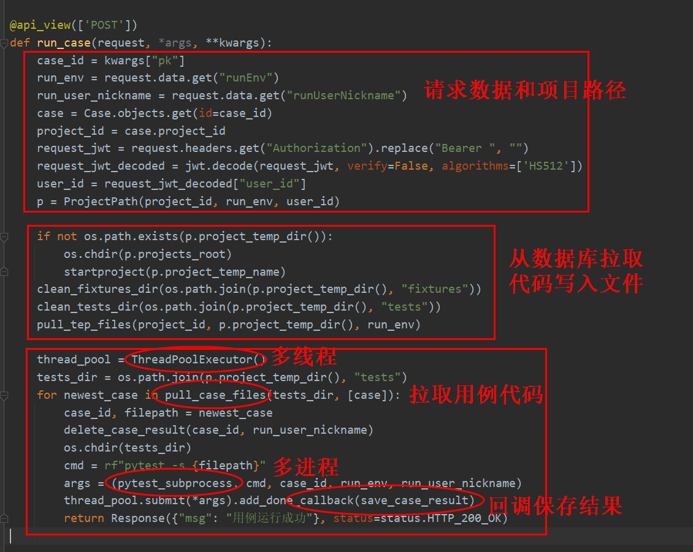

这是运行用例的主体流程：

1. 第一步从请求中获取用例id、运行环境、运行人，这里演示了获取user数据的两种方式：接口传参和从token中解析。然后根据project_id，run_env，user_id定义了pytest项目的路径。
2. 第二步使用tep startproject创建项目文件，清空fixtures和tests目录，目的有两个：一是清掉tep默认fixtures和示例cases，防止对平台产生干扰；二是保证每次运行目录都是干净的，就不用单独去处理前端手动删掉fixture/case后，文件残留的问题。然后从数据库中拉取环境变量、fixtures等数据更新文件。
3. 起多个线程，分别执行用例，执行前先拉取用例代码写入文件，这里是单条用例运行，之所以要用for循环，是因为用例迟早是要批量执行，在设计时就考虑到，避免后面走弯路。然后删掉数据库运行结果，通过subprocess起子进程调用pytest命令，最后在线程的回调函数中根据pytest_result保存用例结果到数据库中。

> 注意！run_case接口不会直接返回结果，前端是用WebSocket来查询结果的。

图中很多函数和类是我封装的，一个一个拆解来看：

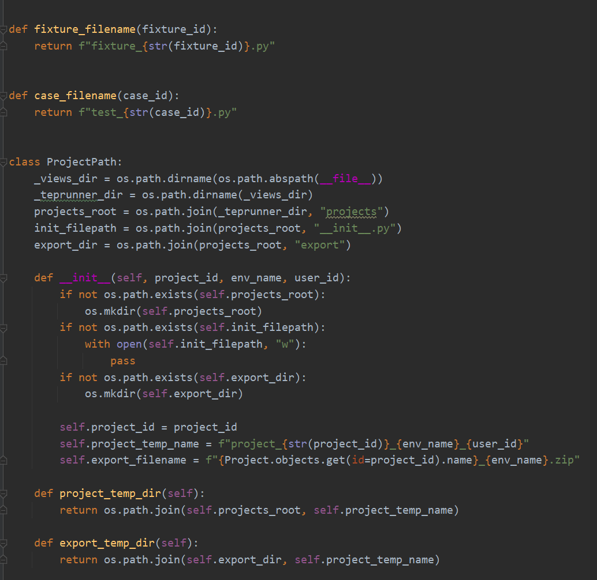

这里定义了Django中存放pytest项目的目录文件，project_temp_name是按照project_id、env_name、user_id来划分的，目的是让运行目录尽量隔离开来，不要相互影响，借鉴了Docker容器的思想，可以把这个目录视为用例运行容器。继续：


tep startproject命令创建pytest项目，pytest文件有特定组织方式，比如conftest.py文件等，tep提供了脚手架一条命令创建项目结构。继续：


fixture_env_vars.py里面存放了tep的环境变量，Django这里每次都从数据库的env_var表中获取数据，动态更新到文件里面。setdefault是个骚操作，这行代码等价于：

```python
if env_name in mapping.keys():
    mapping[env_name][name] = value
else:
    mapping[env_name] = {name: value}
```

继续：

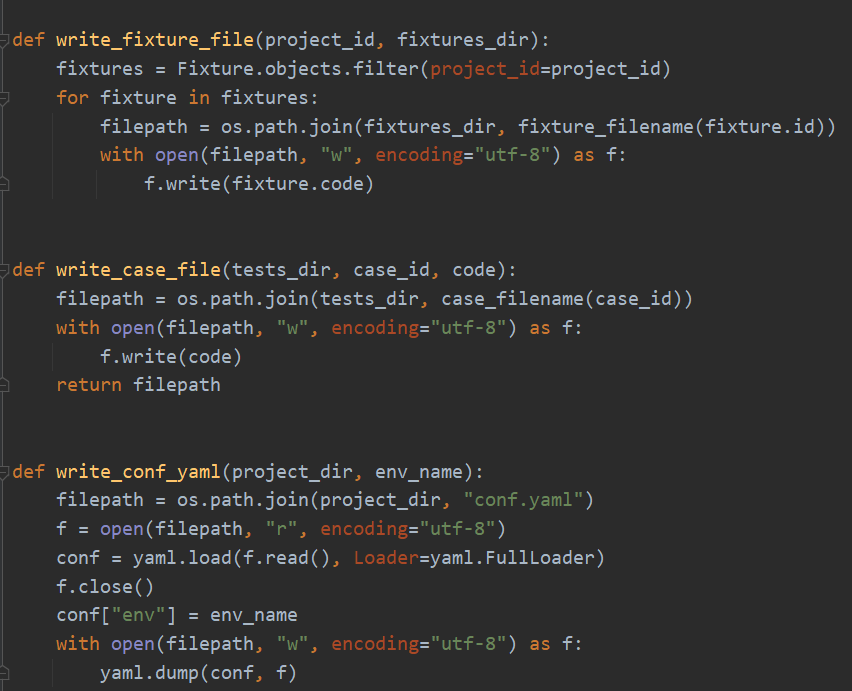

分别从数据库中获取代码写入fixture文件和case文件，把前端传参的运行环境写入conf文件。继续：

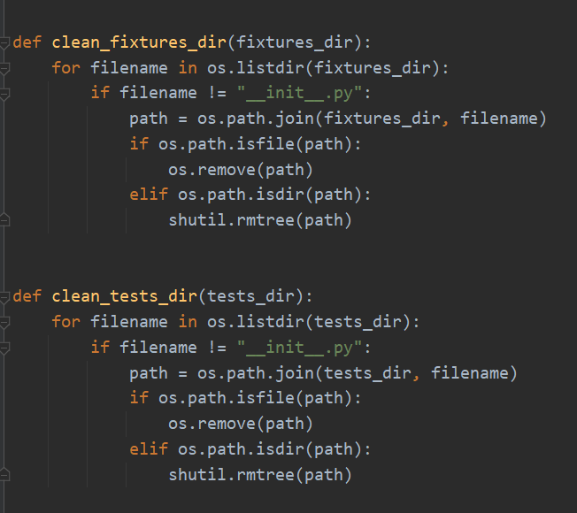

清空fixtures目录，清空tests目录。继续：

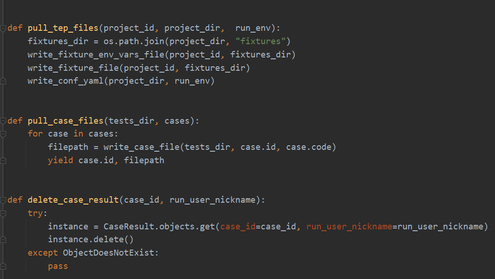

pull_tep_files是写环境变量，写fixture文件，写conf文件三步的集合，复用代码。pull_case_files通过yield定义为了生成器，它和list的区别是不会一次把所有数据产生到内存中，而是每次用的时候产生一次，节约内存开销。delete_case_result用于运行用例前删除case_result表里面已经存在的这条用例的数据。case_result按照用例id和运行人存的多条，每个运行人都有一条属于自己的运行数据，避免数据相互干扰，返给前端的是运行时间最新的那一条！

继续：

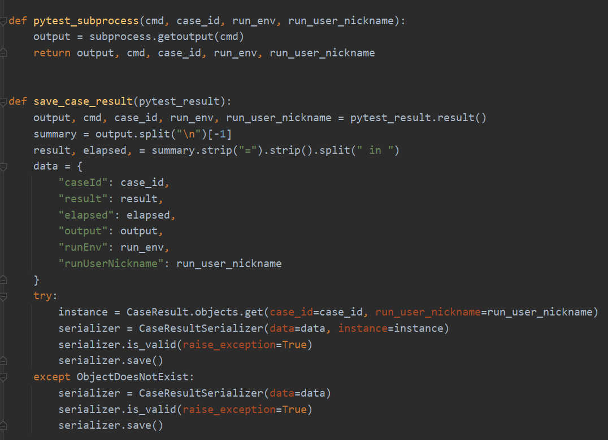

subprocess.getoutput()可以执行shell命令并返回执行结果，这里就拿到了pytest控制台日志，这个函数是在线程池中异步执行的，主线程不能一直等待它执行，所以需要有个回调函数，等它自己执行完了去调用这个回调函数。save_case_result就是个回调函数，它的入参pytest_result等于pytest_subprocess函数返回的元组，拆包后就能拿到outout、cmd、case_id、run_env、run_user_nickname，从中解析出result和elapsed后，就可以存库了，无则新增，有则更新。

run接口做好了，再接口做下载环境接口，编辑teprunner/views/project.py：


打包的代码是从网上找的，把source_dir打包成zip_filename文件。继续：

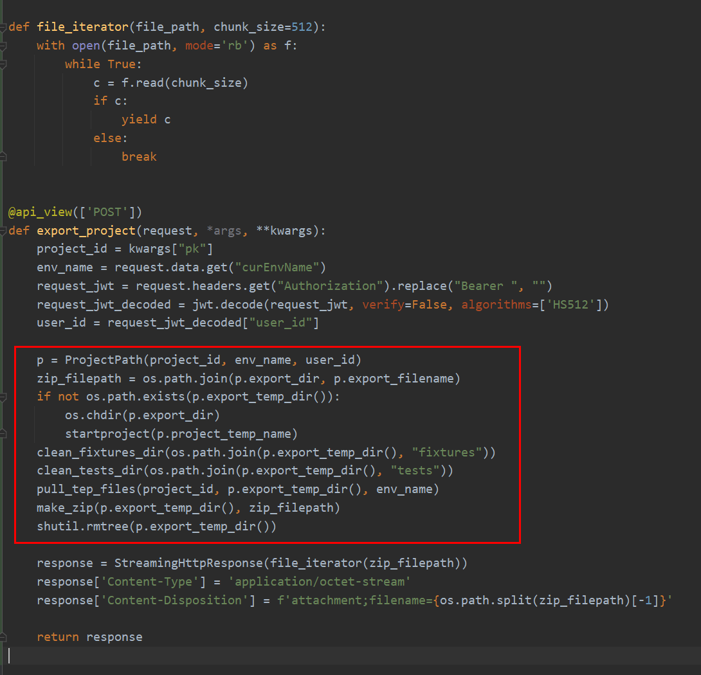

file_iterator函数也是网上找的，把二进制文件读取为字节流，传输给前端，需要使用StreamingHttpResponse对象并添加`Content-Type`和`Content-Disposition`。红框的代码跟run接口类似，区别在于目录换成了export_temp_dir()，且不包含测试用例，生成zip文件后会把导出临时目录删掉，防止冲突。

两个HTTP接口做完了，开始实现WebSocket。WSGI一种网关接口，是Python为了解决Web服务器端与客户端之间的通信问题而产生的，不支持WebSocket；ASGI是WSGI的扩展，意思是异步网关接口，支持WebSocket。编辑teprunnerbackend/urls.py文件：


添加了WebSocket路由。编辑teprunnerbackend/asgi.py文件：

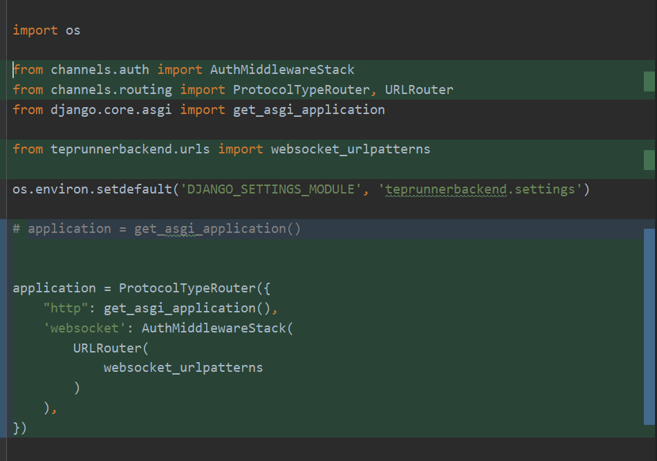

添加websocket的URLRouter，http保持默认。编辑teprunnerbackend/settings.py文件：

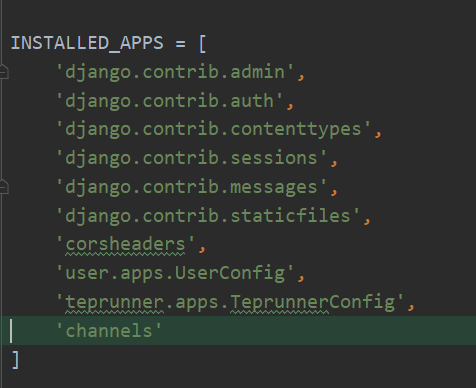

INSTALLED_APPS中添加channels，继续：


添加ASGI应用配置和CHANNEL配置。CHANNEL_LAYERS是一种通信系统，允许多个Consumer实例之间互相通信，以及与外部Django程序实现互通。学习版这里使用的InMemory。

> 生产中不建议使用InMemory，可能会有性能问题，而是应该使用Redis：
>
> ```python
> CHANNEL_LAYERS = {
>     "default": {
>         "BACKEND": "channels_redis.core.RedisChannelLayer",
>         "CONFIG": {
>             "hosts": [("127.0.0.1", 6379)],
>         },
>     },
> }
> ```

最后，编辑teprunner/views/case.py文件：

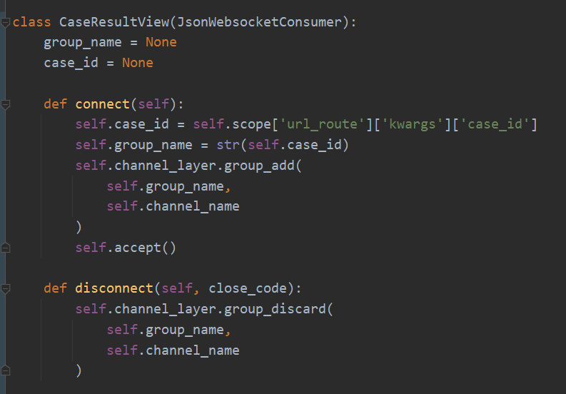

CaseResultView是继承了JsonWebsocketConsumer，可以接受和发送JSON的WebSocket消费者。这里只是简单使用了channels来实现用例结果查询，connect()在建立连接时，从url中拿到case_id，作为房间名，在channel_layer中创建了房间。disconnect()在断开连接时，把房间从channel_layer中移除。继续：

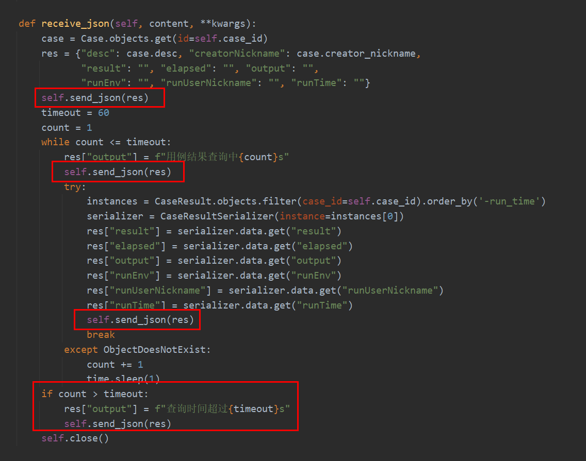

receive_json是在后端收到前端消息时调用的。WebSocket是长连接，在建立连接后，不会断开，可以继续传递消息；WebSocket是全双工，不只是客户端向服务器发消息，服务器也能向客户端发消息。这里服务端会给客户端发4次消息：

- 第1次，返回用例描述和用例创建人。
- 第2次，准确说会有多次，当查询数据库没有结果时，会返回计时，前端效果是计时从1s递增。
- 第3次，如果查询数据库有结果，返回用例结果。
- 第4次，60s后还没有结果，返回超时信息。

其中CaseResult是用`order_by('-run_time')`取的最新一条。最后的self.close()不是必须的，这里加上是因为频繁建立和关闭连接时，如果只是前端发起close()，后端可能会关闭不及时导致channels报错，后端也加上close()能一定程度上避免报错。

## 编写前端代码

新建`.env`文件：


添加HTTP和WebSocket后端地址，里面以键值对的形式写出环境变量，键名需要以VUE_APP_ 开头。vue-cli打包时会自动寻找这些环境变量，注入到编辑上下文环境中。编辑vue.config.js文件：


把target替换成`.env`里面的环境变量。

编辑views/teprunner/case/CaseResult.vue文件：

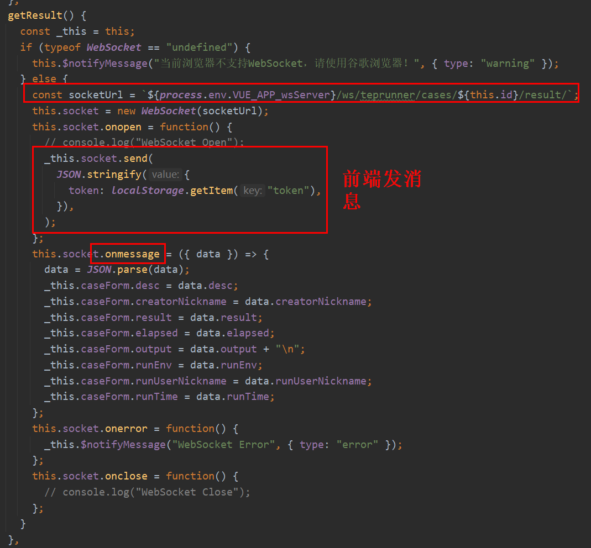

socketUrl用到了`.env`中的环境变量。通过new WebSocket创建socket对象，使用send()发送消息，传了token。onmessage接收后端发过来的消息。

每次打开弹窗建立WebSocket连接，每次关闭弹窗断开WebSocket连接：

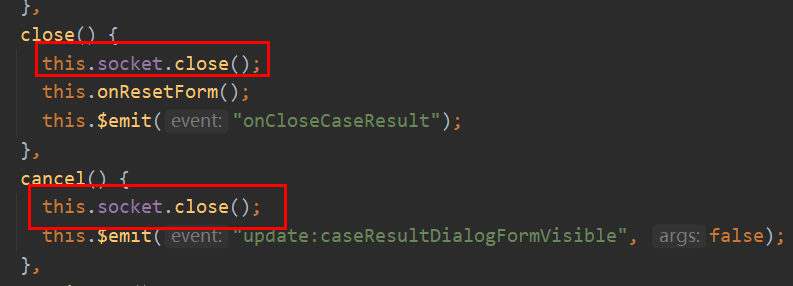

前后端是在以用例id作为房间名的房间中，相互传递消息的。多个浏览器的数据不会互串，因为Django Server默认是多线程！

## 多线程和多进程

每次浏览器发起请求到Django Server，Django都会新起一个线程来处理，这是异步的，意味着多个浏览器连续发多个请求，每个请求的上下文都是独立的，也不会阻塞等待。

> 如果Server不是用的Django Server而是用的Nginx，需要结合WSGI才能实现多线程。

在WebSocket通信时，每个房间都是单个线程自己创建的，数据不会互串，具体原理还没有研究，这个结论我是测试过的：修改后端代码返回随机值，多个浏览器打开同一个Case的结果，后打开的Case结果并不会影响已经打开的Case结果。

同理，多个浏览器同时运行用例，默认它们就是并行不是串行的，不会存在等待执行的情况，从前面代码可以知道，pytest命令是用subprocess子进程方式调用的，为了看到效果，我找了一个比较慢的Case，用多个浏览器运行了一下：


赤裸裸的多进程！pytest多进程靠谱么？靠谱，因为pytest-xdist就只支持多进程，以下是截取的官方Github的Issue：


threads是线程，processes是进程，pytest-xdist没有使用线程。

> 如果想要多台机器分布式运行用例，就要用pytest-xdist。

批量运行用例的情况略有不同，当批量运行用例时，前端只会有一个浏览器发起一次请求，让后端拿多个Case来运行，Django只会分配一个线程来处理这个请求！如果我们在这个View里面只是for循环去运行用例，那么这些用例一定是串行的：虽然是用的subprocess，但是启用subprocess的只有这一个线程，必须前一个执行完，才启动下一个。这就是为什么要再定义线程池的原因：

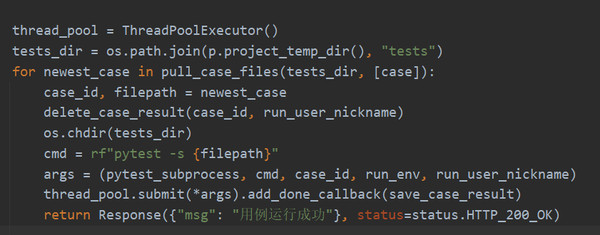

本文还没有开发批量运行用例的模块，但后端已经实现了这个扩展，只需要再生成一个CaseList就能跑批量了。

## 小结

本文把pytest引入到了测试平台中，已经可以跑Case了。文章涉及到的知识点有点繁杂，对我来说这一版也做了不少优化，反复实践和测试，参考资料加了很多。完整源码请到GitHub上获取，按照README命令就能直接把前后项目跑起来看效果。做到这里，teprunner测试平台已经不是个花架子了，而是有着pytest内核引擎驱动的真测试平台。它一定不是你做测试平台的终点，但也许能成为做测试平台的起点，也许能成为撬动地球的支点。

> 参考资料：
>
> 前端源码 https://github.com/dongfanger/teprunner-frontend
>
> 后端源码 https://github.com/dongfanger/teprunner-backend
>
> https://github.com/pytest-dev/pytest-xdist/issues/409
>
> https://blog.csdn.net/weixin_42329277/article/details/80741589
>
> https://www.cnblogs.com/xiao987334176/p/14361893.html
>
> https://juejin.cn/post/6844904195758243848
>
> https://segmentfault.com/q/1010000022975655
>
> https://channels.readthedocs.io/en/stable/topics/channel_layers.html
>
> https://segmentfault.com/a/1190000018096988
>
> https://www.jianshu.com/p/65807220b44a

