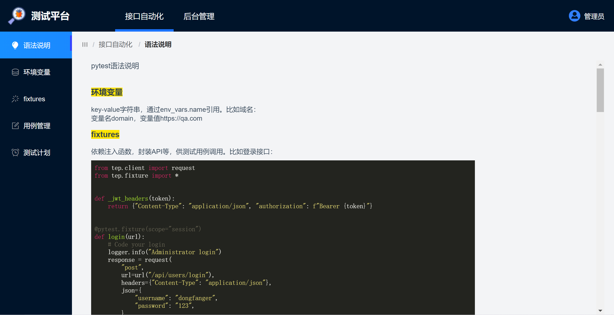
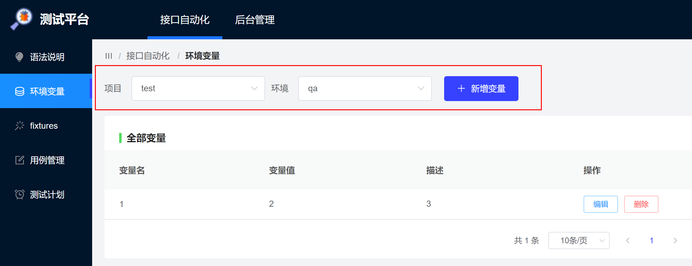
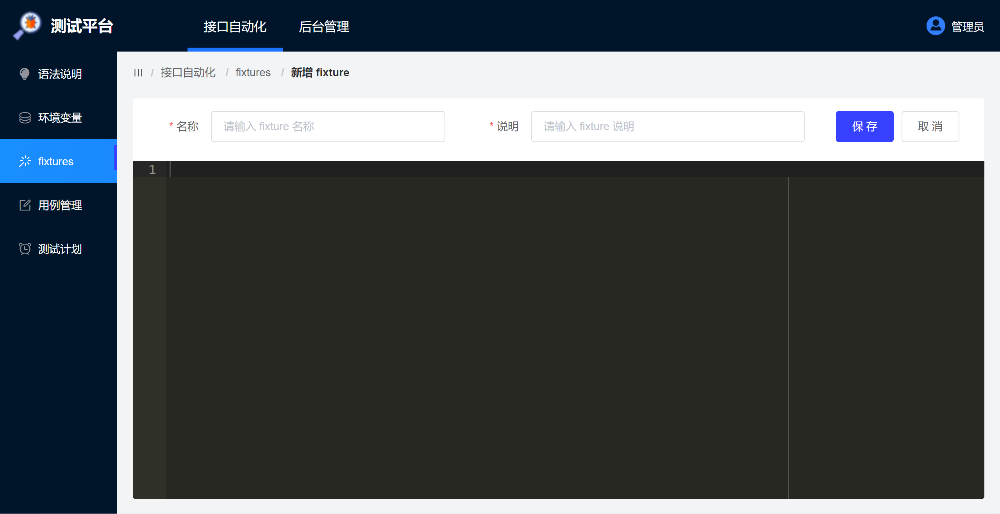
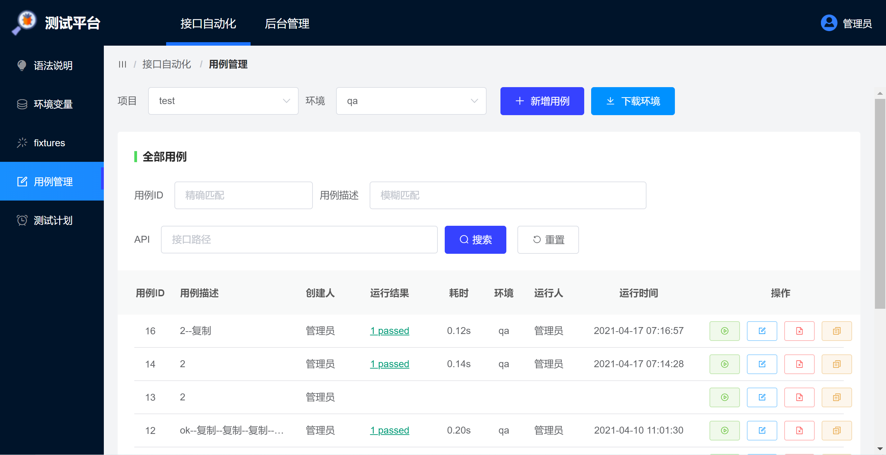
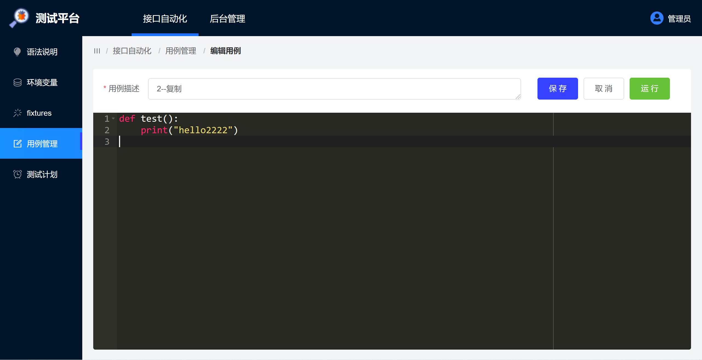
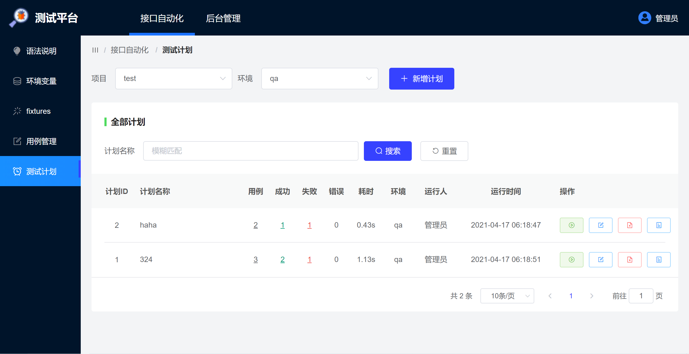
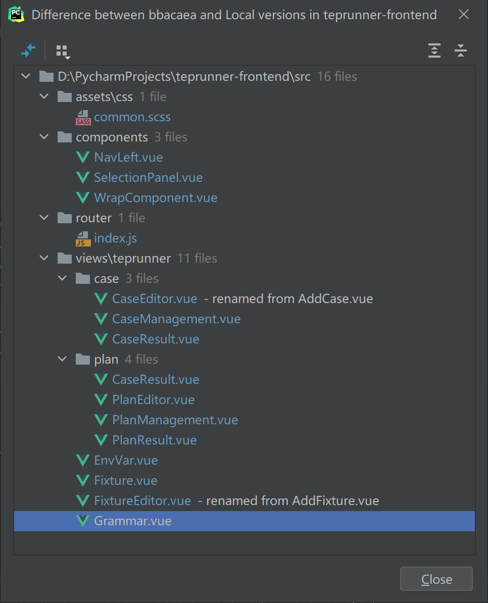

# 【开源平台】teprunner测试平台用例编写等体验响应式升级

## 本文开发内容

在免费开源的测试平台中，teprunner的UI界面应该算得上第一梯度了，BUT，美中不足，在不同分辨率显示器（比如13.3寸小屏笔记本）下布局大的弹出窗口，表现不尽如人意。而这又是核心功能代码编辑的界面，比如用例编写、fixture编写，很有必要优化升级。除此之外还有滚动条的问题：竖向双滚动条和横向滚动条，也对体验造成影响。本文将对这些内容进行改造，具体如下：

- 编写用例页面，从弹窗改为子页面。
- 编写fixture页面，从弹窗改为子页面。
- 代码编辑区域高度自适应。
- 缩小左侧菜单，移动项目环境和新增按钮同一行，**扩大编辑区面积。**
- 消除所有双向滚动条。
- 消除所有横向滚动条。
- **语法说明添加环境变量和fixtures示例代码。**
- 其他细节优化。

响应式是指同一套前端代码在不同浏览器（PC端、移动端等）都能适配，**Element UI已经是响应式设计了，本文的响应式体现在代码编辑区行高根据window.innerHeight自动计算设定。**

## 升级效果展示

左侧菜单栏变窄；添加环境变量和fixtures示例代码。

项目环境和新增按钮同一行显示，扩大有效内容可视面积。

fixtures的新增和编辑从弹窗改为子路由页面，代码编辑区高度自适应，纵向滚动条只出现一个。

消除横向滚动条；缩小了用例描述列以外其他列宽；替换操作按钮文字为图标。

用例的新增和编辑从弹窗改为子路由页面，代码编辑区高度自适应，纵向滚动条只出现一个。

用例运行结果的新增和编辑从弹窗改为子路由页面，代码编辑区高度自适应，纵向滚动条只出现一个。

测试计划的新增，编辑，运行结果也做了相同调整。

**整体而言，有效信息的可视面积和可操作面积都尽可能扩大了！**

## 关键技术点

前端代码修改文件如下：

比较繁琐，**没有新知识**，这里就不一一讲解了，而是选择用到的关键技术点来进行**知识回顾**：

- template添加`<router-view></router-view>`
- 主页面div添加`v-if="$route.name === 'name'"`
- 在router/index.js中添加children子路由
- 跳转页面前，存localStorage
- 新页面create()时，取localStorage
- `this.$router.push`跳转路由
- div同行显示用`float: left`，紧跟的div换行用`clear: both`
- window.innerHeight获取屏幕高度

## 小结

本文完成了对teprunner测试平台前端UI界面的体验升级，**已经适配13.3寸到27寸显示器**，如果还在担心不好用的话，那么现在可以好好试试了。定时任务从目前优化效果来看，已经趋于稳定，不久就会和大家见面。

> 参考资料：
>
> Element UI图标按钮样式 https://www.jianshu.com/p/a81cd965943c